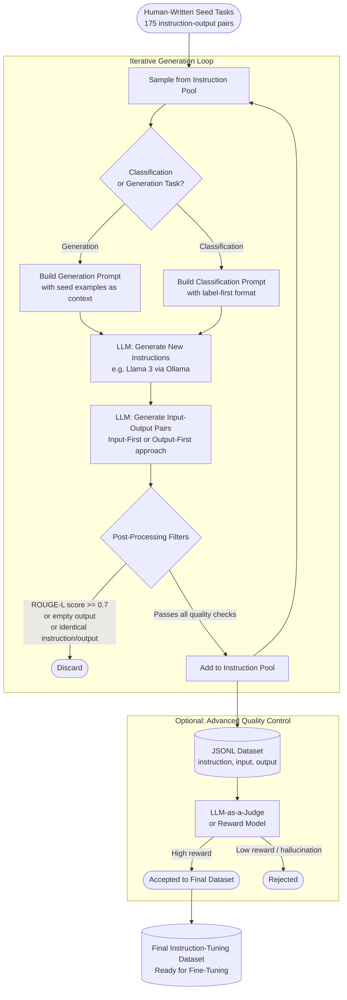

# Datasets

A reference and hands-on workspace for preparing, cleaning, and generating datasets used in the training and fine-tuning of **Large Language Models (LLMs)** and **Machine Learning (ML)** models. The project includes Python scripts that implement the **Self-Instruct** technique for synthetic instruction-tuning dataset creation using a local Ollama model.

---

## Table of Contents

1. [Project Structure](#project-structure)
2. [Background: LLMs and Machine Learning Datasets](#background-llms-and-machine-learning-datasets)
   - [Large Language Models](#large-language-models)
   - [Machine Learning Models](#machine-learning-models)
3. [Data Preparation: Cleaning and Transforming Datasets](#data-preparation-cleaning-and-transforming-datasets)
   - [Required Actions Before Pre-Training (LLMs)](#required-actions-before-pre-training-llms)
   - [Required Actions Before Fine-Tuning (LLMs)](#required-actions-before-fine-tuning-llms)
   - [Required Actions Before Training (Machine Learning)](#required-actions-before-training-machine-learning)
   - [Tools and Libraries Reference](#tools-and-libraries-reference)
4. [Dataset Formats](#dataset-formats)
   - [Instruction-Tuning Format](#instruction-tuning-format)
   - [Preference-Tuning Format](#preference-tuning-format)
5. [Synthetic Data: Self-Instruct Technique](#synthetic-data-self-instruct-technique)
   - [How Do We Generate Instructions Without Writing Them by Hand?](#how-do-we-generate-instructions-without-writing-them-by-hand)
   - [Self-Instruct Pipeline Diagram](#self-instruct-pipeline-diagram)
   - [Workflow Steps](#workflow-steps)
   - [Data Labeling Approaches](#data-labeling-approaches)
6. [Dataset Quality Evaluation](#dataset-quality-evaluation)
   - [Evaluation Metrics](#evaluation-metrics)
   - [Near-Duplicate Detection](#near-duplicate-detection)
   - [LLM-Based Quality Scoring](#llm-based-quality-scoring)
   - [Statistical Validation with TFDV](#statistical-validation-with-tfdv)
   - [Label Error Detection with Cleanlab](#label-error-detection-with-cleanlab)
   - [LLM-as-a-Judge](#llm-as-a-judge)
   - [Discriminative Testing](#discriminative-testing)
   - [Dataset Quality Tooling Overview](#dataset-quality-tooling-overview)
7. [Synthetic Data Generation Using LLMs](#synthetic-data-generation-using-llms)
   - [What is Synthetic Data Generation Using LLMs?](#what-is-synthetic-data-generation-using-llms)
   - [Generation Methods](#generation-methods)
   - [Five-Step Pipeline](#five-step-pipeline)
   - [Filtering Synthetic Data](#filtering-synthetic-data)
   - [Query Evolution](#query-evolution)
   - [Styling and Customisation](#styling-and-customisation)
8. [Environment Setup](#environment-setup)
   - [Prerequisites](#prerequisites)
   - [Linux System Setup](#linux-system-setup)
   - [Docker Setup](#docker-setup)
   - [Python Virtual Environment](#python-virtual-environment)
   - [Ollama and Open-Source LLMs](#ollama-and-open-source-llms)
9. [Running the Scripts](#running-the-scripts)
10. [References](#references)

---

## Project Structure

```
◈ datasets/
▸ scripts/
  ▪ seed_tasks.py                  Human-written seed task definitions
  ▪ self_instruct_generator.py     Full Self-Instruct pipeline with Ollama
  ▪ dataset_cleaner.py             Text cleaning, deduplication, quality filtering
▸ output/                          Generated JSONL datasets (git-ignored)
▸ .venv/                           Python virtual environment (git-ignored)
▪ requirements.txt                 Pinned Python dependencies
▪ .gitignore                       Excludes venv, binaries, and cached files
▪ README.md                        This file
```

---

## Background: LLMs and Machine Learning Datasets

### Large Language Models

Large Language Models are neural networks trained on massive text corpora to acquire broad linguistic and reasoning capabilities. There are two principal training phases, each with distinct dataset requirements.

**Pre-training** builds fundamental language understanding. It requires enormous, diverse, and deduplicated text corpora. Pre-training datasets commonly reach hundreds of billions to trillions of tokens sourced from the web, books, academic papers, and code repositories. Datasets such as [The Pile](https://pile.eleuther.ai/), [C4](https://huggingface.co/datasets/c4), and [RedPajama](https://huggingface.co/datasets/togethercomputer/RedPajama-Data-1T) represent the scale required. The [Essential Web v1.0](https://huggingface.co/datasets/HuggingFaceFW/fineweb) project goes further, providing SQL-style domain filters for targeted pre-training on fields such as mathematics or medicine.

**Instruction fine-tuning** adapts a pre-trained model to follow natural language instructions. It requires a smaller, high-quality, structured dataset of instruction-input-output triplets. Stanford's Alpaca model demonstrated that 52,000 such examples generated via the Self-Instruct method from a single pre-trained LLaMA base could yield instruction-following capabilities comparable to much larger commercial models.

**Preference fine-tuning** (RLHF / DPO) further aligns the model with human values by training on datasets of prompts paired with a chosen (preferred) and a rejected response. This technique, described in [Improving your LLMs with RLHF on Amazon SageMaker](https://aws.amazon.com/blogs/machine-learning/improving-your-llms-with-rlhf-on-amazon-sagemaker/), is how base models learn to be safe, helpful, and harmless.

### Machine Learning Models

Classical and deep Machine Learning models require structured, well-labelled tabular, image, or time-series datasets. The guiding principle is that **data quality directly determines model performance**. Key dataset concerns differ from LLMs in scale: while LLM pre-training can consume petabytes, a well-crafted ML dataset of thousands to millions of labelled examples is often sufficient for supervised tasks such as classification, regression, or object detection.

Feature engineering, class balance, and train/validation/test split discipline are critical. Exploration tools such as Pandas and NumPy support initial analysis, while large-scale frameworks such as Apache Spark and Dask handle datasets that exceed local memory.

---

## Data Preparation: Cleaning and Transforming Datasets

### Required Actions Before Pre-Training (LLMs)

Pre-training corpora are assembled from heterogeneous, noisy sources. The following actions are required before data can be fed into the training loop.

**1. Extraction and Normalisation**

Text arrives in many formats. Each requires dedicated tooling:

- **HTML** — Use `trafilatura` to extract main body text and strip markup, inline CSS, and JavaScript. Translate structured elements (tables, lists, code blocks) to Markdown format.
- **PDF** — Use `pdfplumber`, `pypdf`, or `pdfminer`. Prefer digitally authored PDFs; scanned documents require an OCR service such as Amazon Textract.
- **Office Documents** — Use `python-docx`, `python-pptx`, and `openpyxl` for DOCX, PPTX, and XLSX files respectively.
- **JSON / JSONL** — Parse with the standard library `json` module; validate schema with `pydantic`.

After extraction, normalise all character encodings to **UTF-8** and strip non-textual elements (byte-order marks, control characters, and private-use Unicode codepoints).

**2. Language Identification and Filtering**

Apply a language detector (e.g., `langdetect` or `fasttext`) to retain only the target language(s). Reject documents that do not meet minimum word count thresholds or have an abnormally low ratio of alphabetic characters.

**3. Quality Filtering**

Apply heuristic and model-based quality filters:

- Remove documents with excessive repetitive sentences or n-grams.
- Apply perplexity-based filters: documents that a small reference language model assigns very low or very high perplexity are likely low quality.
- Use a lightweight text classifier such as the [FineWeb-Edu classifier](https://huggingface.co/HuggingFaceFW/fineweb-edu-classifier) to score educational value.
- Apply PII (Personally Identifiable Information) detection and redaction.
- Apply toxic content filters.

**4. Deduplication**

Deduplication is critical. Duplicate content inflates training time and biases the model toward repeated text. Two complementary approaches are standard:

- **Exact deduplication** — Compute SHA-256 or the first 64 bits of SHA-1 for each paragraph and discard those with matching hashes. Effective for verbatim copies.
- **Near-duplicate detection (MinHash + LSH)** — Break text into overlapping k-shingles, compute MinHash signatures across multiple hash functions, and use Locality-Sensitive Hashing (LSH) to bucket similar documents without O(n²) comparisons. Estimate Jaccard similarity from the signatures. The `datasketch` library provides a production-ready implementation.

The CCNet pipeline, used in Llama 3 pre-training, applies paragraph-level, sentence-level, and document-level deduplication in combination.

**5. Tokenisation Validation**

Before training begins, validate that the cleaned data can be tokenised by the target tokeniser (e.g., `tiktoken` or HuggingFace `tokenizers`) without truncation anomalies or excessive unknown-token rates.

**6. Shuffling and Sharding**

Shuffle the dataset at the document level to prevent the model from learning spurious sequential patterns. Shard into fixed-size files (e.g., 1–5 GB per shard) to enable parallel distributed loading during training.

### Required Actions Before Fine-Tuning (LLMs)

Fine-tuning requires a smaller but structurally precise dataset. The following actions ensure the dataset is suitable.

**1. Domain Relevance Audit**

Review the dataset to confirm that examples closely match the target task and domain. Remove off-topic, ambiguous, or contradictory examples. Domain experts should validate a sample of the data.

**2. Format Standardisation**

Convert all examples to the required instruction-tuning schema. For instruction fine-tuning, each record must contain `instruction`, `input` (may be empty), and `output`. For preference tuning, each record must contain `prompt`, `chosen`, and `rejected`.

**3. Deduplication (Instruction-Level)**

Apply ROUGE-L similarity filtering across instruction strings. Discard any new instruction whose ROUGE-L F1 against any existing instruction exceeds a threshold (typically 0.7). This threshold preserves dataset diversity, which is a core objective of the Self-Instruct method.

**4. Quality and Completeness Checks**

- Discard examples where `instruction` and `output` are identical.
- Discard examples with an empty `output` field.
- Check for incomplete or truncated generations.
- Reject outputs that exhibit hallucination patterns, refusals (`"I cannot..."`, `"As an AI..."`), or toxic content.

**5. Train / Validation / Test Split**

Divide the dataset into training (~80%), validation (~10%), and test (~10%) splits. Ensure that the same instruction does not appear in multiple splits (instruction-level stratification).

**6. Tokenisation and Sequence Length Check**

Verify that output sequences fit within the model's context window. Truncate or discard entries that exceed the maximum token limit.

### Required Actions Before Training (Machine Learning)

For classical and deep ML models, the following steps apply.

**1. Exploratory Data Analysis (EDA)**

Use Pandas and Matplotlib/Seaborn to profile the dataset: distributions, missing value rates, class balance, correlation matrices, and outlier detection.

**2. Handling Missing Values**

Choose an appropriate imputation strategy: mean/median imputation for numerical features, mode or a sentinel value for categorical features, or model-based imputation for complex dependencies. Drop columns or rows where the missing-value rate exceeds a practical threshold (e.g., > 40%).

**3. Outlier Removal**

Apply Z-score or IQR-based filters (SciPy provides `scipy.stats.zscore`). For signal data, use median filtering (`scipy.signal.medfilt`).

**4. Feature Encoding and Normalisation**

- Encode categorical features with one-hot encoding or target encoding (`scikit-learn`'s `OrdinalEncoder`, `OneHotEncoder`).
- Normalise numerical features using `StandardScaler` or `MinMaxScaler`.
- Apply log transforms to highly skewed numerical distributions.

**5. Feature Selection**

Use `scikit-learn`'s selection modules:
- **Filter methods** — `SelectKBest` (chi-squared, mutual information), `VarianceThreshold`.
- **Wrapper methods** — `RFE` (Recursive Feature Elimination).
- **Embedded methods** — `SelectFromModel` with L1-regularised models (Lasso).

**6. Class Imbalance Handling**

Apply oversampling (`SMOTE` from `imbalanced-learn`), undersampling, or class-weighted loss functions to prevent the model from being biased toward the majority class.

**7. Train / Validation / Test Split**

Use stratified splitting (`train_test_split` with `stratify=`) to preserve class proportions across all splits.

**8. Pipeline Construction**

Encapsulate all preprocessing steps into a `scikit-learn` `Pipeline` object so that transformations learned on the training set are correctly applied to validation and test sets without data leakage.

### Tools and Libraries Reference

| Environment | Tool / Library | Key Strength |
|-------------|---------------|--------------|
| Local | **Pandas & NumPy** | Programmatic manipulation, numerical array operations |
| Local | **Polars** | High-performance multi-threaded dataframes (Rust backend); much faster than Pandas for large-scale transforms |
| Local | **Dask** | Scales Pandas-like operations across multiple CPU cores using lazy evaluation |
| Local | **Vaex** | Out-of-core dataframes for billions of rows with minimal memory usage |
| Local | **spaCy / NLTK** | Tokenisation, lemmatisation, stopword removal, named entity recognition |
| Local | **scikit-learn** | Feature selection, imputation, encoding, model-based filtering |
| Local | **SciPy** | Statistical outlier detection (Z-scores), signal filtering |
| Local | **Regex (`re`)** | Low-level cleaning: strip HTML tags, URLs, noisy symbols |
| Local | **OpenRefine** | GUI-based text clustering and deduplication for messy data |
| Cloud | **HuggingFace Datasets** | Streaming NLP datasets; standard format for LLM datasets |
| Cloud | **Apache Spark (PySpark)** | Distributed data transformation at enterprise scale |
| Cloud | **Ray Data** | Distributed loading and preprocessing of petabyte-scale pre-training corpora |
| Cloud | **AWS Glue** | Serverless Spark jobs that crawl S3 and run cleaning scripts |
| Cloud | **Talend Data Fabric** | Integrated ETL and ML-driven data cleansing across hybrid environments |
| Deduplication | **datasketch** | MinHash and LSH signatures for near-duplicate detection |
| Deduplication | **DuckDB / Polars** | High-speed SQL-like filtering on large Parquet files |
| Code Parsing | **tree-sitter** | Extract function-comment pairs from source code at scale |
| Vision | **OpenCV** | Image resizing, transformation, and filtering before neural network ingestion |
| Training | **PyTorch DataLoader** | Final transformation to input-target tensor pairs for the training loop |

---

## Dataset Formats

### Instruction-Tuning Format

The instruction-tuning paradigm structures data as three columns that the model learns to map. This format is used by models such as Stanford Alpaca and Meta Llama instruction-tuned variants.

| Field | Description | Example |
|-------|-------------|---------|
| `instruction` | The directive the model must execute | "Summarise the following paragraph in one sentence." |
| `input` | Supporting context (empty for self-contained tasks) | "Machine learning is a subset of..." |
| `output` | The expected ideal response | "Machine learning enables systems to learn from data automatically." |

In JSONL format:
```json
{
  "instruction": "Summarise the following paragraph in one sentence.",
  "input": "Machine learning is a subset of artificial intelligence...",
  "output": "Machine learning enables systems to learn from data automatically."
}
```

### Preference-Tuning Format

Preference tuning (used in RLHF and Direct Preference Optimisation) requires triplets of a prompt, a preferred response, and a rejected response.

| Field | Description |
|-------|-------------|
| `prompt` | The user input or system prompt |
| `chosen` | The preferred (higher quality) response |
| `rejected` | The less preferred response |

```json
{
  "prompt": "What is compound interest?",
  "chosen": "Compound interest is interest calculated on both the principal and accumulated interest from previous periods, allowing investments to grow exponentially over time.",
  "rejected": "Compound interest is when you earn interest."
}
```

---

## Synthetic Data: Self-Instruct Technique

### How Do We Generate Instructions Without Writing Them by Hand?

The **Self-Instruct** technique answers this question directly. Instead of relying on manual annotation for every example in a training dataset, Self-Instruct bootstraps from a small set of human-written "seed" tasks to grow a large, diverse instruction dataset automatically.

The core insight, introduced in the paper [SELF-INSTRUCT: Aligning Language Models with Self-Generated Instructions](https://arxiv.org/abs/2212.10560) (Wang et al., 2022), is that a capable LLM can act as its own teacher. When shown a handful of existing instructions as context, the model reliably generates new instructions that are both syntactically valid and semantically coherent.

The process works as follows:

1. A human writes a small number of high-quality instruction-output pairs (the "seed tasks"). The original paper uses 175 such tasks; even fewer are needed for domain-specific applications.
2. A prompt is constructed that presents a sample of these seed tasks to the LLM and asks it to generate new, diverse task instructions.
3. Each new instruction is passed back through the model to generate the corresponding ideal output.
4. Automated filters remove low-quality, empty, or near-duplicate instructions using ROUGE-L similarity scoring.
5. Instructions that pass filtering are added to the seed pool, enabling increasingly complex tasks to be generated in subsequent iterations.

This iterative, self-expanding loop allows a dataset to grow from 175 seed examples to tens of thousands of high-quality instruction-output pairs without requiring a human to write each one. Stanford's Alpaca model (described at [https://crfm.stanford.edu/2023/03/13/alpaca.html](https://crfm.stanford.edu/2023/03/13/alpaca.html)) used this exact approach to generate 52,000 training examples at a cost of less than $500. This was sufficient to enable a 7B-parameter model to match the instruction-following behaviour of text-davinci-003.

The method is now widely used with local models via Ollama, eliminating API costs entirely and enabling domain-specific dataset generation on private infrastructure.

### Self-Instruct Pipeline Diagram



### Workflow Steps

**Step 1 — Instruction Generation**

A local model (Llama 3 via Ollama is recommended) is prompted with a sample of existing instructions from the seed pool. The prompt follows this structure:

```
Come up with a series of tasks:
1. Write a Python script to sort a list.
2. Explain gravity to a five-year-old.
3. Classify the sentiment of the following review.
...
9.
```

The model completes the sequence with new instructions. Non-classification and classification tasks use distinct prompt formats to ensure diversity of task types.

**Step 2 — Input/Output Generation**

For each newly generated instruction, the model determines whether additional input context is needed and then generates the corresponding ideal response.

- **Input-First approach** (non-classification tasks): The model is first asked to generate plausible input values, which are then used to generate the output.
- **Output-First approach** (classification tasks): The model is first given a class label and asked to generate an input that corresponds to that label.

**Step 3 — Filtering**

Automated filters remove low-quality and redundant entries. Filter rules include:

- ROUGE-L F1 similarity >= 0.7 against any existing instruction in the pool (too similar, discard).
- Output field is empty.
- Instruction and output are identical.
- Output contains refusal patterns (`"I cannot"`, `"As an AI"`).
- Instruction is fewer than 10 characters.
- Incomplete generations or obvious formatting issues.

**Step 4 — Pool Update**

Instructions that pass all filters are appended to the instruction pool. The expanded pool is used in the next generation iteration, enabling the model to produce increasingly complex and varied tasks over successive rounds.

For more advanced pipelines, a **Reward Model** or an **LLM-as-a-judge** setup can be added after Step 3 to score the quality of each instruction-output pair before saving to the dataset.

### Data Labeling Approaches

**Human Labelers** — The gold standard for high-accuracy annotation. Domain experts manually annotate examples. Effective for small, high-stakes datasets but expensive and time-consuming at scale.

**LLM-Assisted Labeling** — A secondary LLM (or the same model with N-shot prompting) generates labels automatically. A human-in-the-loop (HITL) step reviews a sample to validate quality. This approach scales well but requires careful acceptance-threshold calibration.

**RLHF-Based Labeling** — Inspired by the Reinforcement Learning from Human Feedback process:
1. A human labeler annotates a sample of unlabelled examples.
2. The labelled data is used to fine-tune an LLM.
3. The fine-tuned LLM generates multiple outputs for additional unlabelled examples.
4. A human ranks the outputs from best to worst.
5. A Reward Model is trained on the ranked outputs.
6. The Reward Model scores generations from a PPO policy, and the reward signal updates the policy.

Details are available at [Improving your LLMs with RLHF on Amazon SageMaker](https://aws.amazon.com/blogs/machine-learning/improving-your-llms-with-rlhf-on-amazon-sagemaker/).

---

## Dataset Quality Evaluation

Generating or assembling a dataset is only the first step. Before committing data to a training loop, systematic quality evaluation must confirm that the dataset is clean, diverse, representative, and correctly labelled. This section covers the principal tools and techniques for evaluating datasets intended for both LLM pre-training and classical ML training.

### Evaluation Metrics

The following metrics serve as quantitative signals during dataset quality assessment.

**Jaccard Similarity** measures the overlap between two sets of tokens or n-grams. It is defined as the size of the intersection divided by the size of the union of the two sets. In dataset evaluation, a high Jaccard similarity between two documents signals near-duplication and triggers removal of one copy.

**Perplexity** is the exponentiated average cross-entropy that a reference language model assigns to a text sequence. Documents assigned very low perplexity are likely machine-generated boilerplate; documents assigned very high perplexity are likely garbled or off-domain. Both extremes are candidates for removal from a pre-training corpus.

**Pass Rate** is the fraction of generated instruction-output pairs that pass all post-processing quality filters. A low pass rate during Self-Instruct generation indicates that the seed pool or generation prompt needs adjustment.

**ROUGE-L F1** measures the longest common subsequence between two text sequences. It is used in Self-Instruct filtering to detect near-duplicate instructions. Pairs with ROUGE-L F1 above a threshold (typically 0.7) are considered too similar and one copy is discarded.

### Near-Duplicate Detection

For large pre-training corpora, exact SHA-256 hashing removes verbatim duplicates. Near-duplicate detection at scale requires MinHash and Locality-Sensitive Hashing (LSH) from the `datasketch` library.

The approach works as follows:

1. Each document is decomposed into overlapping character 5-grams (shingles).
2. A MinHash signature is computed by applying multiple hash functions to the shingle set.
3. Signatures are grouped into LSH bands. Two documents sharing at least one full LSH band are candidates for comparison.
4. The Jaccard similarity is estimated from the MinHash signatures without comparing every document pair directly.

Documents whose estimated Jaccard similarity exceeds 0.8 are considered near-duplicates; all but one copy are removed. The `dataset_cleaner.py` script in this project implements this pipeline.

```python
from datasketch import MinHash, MinHashLSH

lsh = MinHashLSH(threshold=0.8, num_perm=128)
for doc_id, text in enumerate(documents):
    m = MinHash(num_perm=128)
    for shingle in {text[i:i+5] for i in range(len(text) - 4)}:
        m.update(shingle.encode("utf-8"))
    lsh.insert(f"doc_{doc_id}", m)
```

### LLM-Based Quality Scoring

[QuRating](https://arxiv.org/abs/2402.09739) (Wettig et al., 2024) introduces a principled method for scoring pre-training documents on four axes using an LLM as evaluator:

- **Educational value** -- Does the text explain concepts clearly?
- **Required expertise** -- Does the text presuppose domain knowledge?
- **Writing style** -- Is the text well-structured and coherent?
- **Facts and trivia** -- Does the text contain concrete, verifiable facts?

The LLM is prompted to compare pairs of documents on each axis. Scores are aggregated into a scalar quality rating that is used to filter or weight examples during training.

For smaller corpora, the [FineWeb-Edu classifier](https://huggingface.co/HuggingFaceFW/fineweb-edu-classifier) provides a fast single-pass educational quality score without requiring pairwise comparisons.

### Statistical Validation with TFDV

[TensorFlow Data Validation (TFDV)](https://www.tensorflow.org/tfx/guide/tfdv) provides automated statistical profiling, schema inference, and anomaly detection. It is primarily used for tabular ML datasets but applies equally to feature distributions extracted from NLP datasets.

TFDV generates a schema from training data that captures feature value distributions and ranges, missing value rates, and expected cardinality for categorical features.

When validation data is compared against the training schema, TFDV detects:

- **Distribution skew** -- The validation feature distribution differs significantly from training.
- **Dataset drift** -- The serving distribution shifts over time, indicating that the dataset is no longer representative.
- **Schema anomalies** -- New categories appear, or expected features are missing.

```python
import tensorflow_data_validation as tfdv

train_stats = tfdv.generate_statistics_from_csv(data_location="train.csv")
schema = tfdv.infer_schema(statistics=train_stats)

val_stats = tfdv.generate_statistics_from_csv(data_location="val.csv")
anomalies = tfdv.validate_statistics(statistics=val_stats, schema=schema)
tfdv.display_anomalies(anomalies)
```

TFDV can be embedded into Apache Beam or Apache Spark pipelines for large-scale data validation before every training run.

### Label Error Detection with Cleanlab

[Cleanlab](https://github.com/cleanlab/cleanlab) detects label errors in supervised datasets using a technique called Confident Learning. The method estimates the joint distribution of true labels and noisy observed labels from any trained classifier's out-of-sample predicted probabilities.

Cleanlab identifies:

- **Mislabelled examples** -- examples where the predicted class probability strongly favours a different class than the provided label.
- **Ambiguous examples** -- examples where no class probability is dominant.
- **Outliers** -- examples whose feature representation is far from all class clusters.

```python
from cleanlab.classification import CleanLearning
from sklearn.linear_model import LogisticRegression

cl = CleanLearning(clf=LogisticRegression())
cl.fit(X_train, y_train)
label_issues = cl.get_label_issues()
```

Cleanlab supports image, text, and tabular datasets and integrates with PyTorch, TensorFlow, and scikit-learn classifiers.

### LLM-as-a-Judge

LLM-as-a-Judge uses a capable language model to score the quality of generated text outputs without requiring human annotation for every example. This technique is applicable both to evaluating the dataset itself and to post-training evaluation of model responses.

A judge prompt specifies evaluation criteria such as accuracy, relevance, completeness, and clarity. The judge assigns a numerical score and a brief justification. By comparing judge scores across batches of generated data, low-quality generations can be filtered before they enter the training corpus.

Common judge configurations:

- **Absolute scoring** -- The judge assigns a score from 1 to 10 on a single response.
- **Pairwise comparison** -- The judge is given two responses and asked which is better.
- **Reference-guided scoring** -- The judge compares the response against a reference answer.

Tools such as [Arize Phoenix](https://phoenix.arize.com/) and [Galileo](https://www.rungalileo.io/) provide hosted LLM evaluation environments with judge prompts and scoring dashboards for monitoring dataset and model quality.

### Discriminative Testing

Discriminative testing trains a binary classifier to distinguish between real (human-written) and synthetic (LLM-generated) data. If the classifier achieves high accuracy, the synthetic data has a detectable distributional shift from the real data, indicating it may not generalise well to real-world conditions.

A gradient-boosted tree classifier (XGBoost or LightGBM) on TF-IDF features is a practical baseline:

```python
from sklearn.feature_extraction.text import TfidfVectorizer
from sklearn.ensemble import GradientBoostingClassifier
from sklearn.metrics import classification_report

vectorizer = TfidfVectorizer(max_features=10000, ngram_range=(1, 2))
X = vectorizer.fit_transform(all_texts)
clf = GradientBoostingClassifier()
clf.fit(X_train, y_train)
print(classification_report(y_test, clf.predict(X_test)))
```

A classifier that cannot distinguish real from synthetic data (accuracy near 50%) is a positive signal that the synthetic data faithfully mirrors the real distribution.

### Dataset Quality Tooling Overview

| Tool | Use Case | Notes |
|------|----------|-------|
| **datasketch** | Near-duplicate detection via MinHash and LSH | Production-ready; used in LLM pre-training pipelines |
| **TFDV** | Statistical profiling and schema validation | Integrates with TFX; supports Beam and Spark |
| **Cleanlab** | Label error detection in supervised datasets | Confident Learning algorithm; supports multiple frameworks |
| **Label Studio** | Human-in-the-loop annotation and review | Open-source; supports text, image, and audio labeling |
| **Arize Phoenix** | LLM-as-a-judge scoring and observability | Open-source; supports RAG and agent evaluation |
| **Galileo** | Dataset and model quality monitoring | Hosted platform for NLP data quality at scale |
| **DeepEval** | LLM evaluation metrics and synthetic test dataset generation | Open-source; supports RAG and instruction-tuning evaluation |
| **rouge_score** | ROUGE-L similarity for instruction deduplication | Lightweight; used in the Self-Instruct pipeline |

---

## Synthetic Data Generation Using LLMs

### What is Synthetic Data Generation Using LLMs?

Synthetic data generation using LLMs involves using a language model to create artificial datasets for training, fine-tuning, or evaluating other language models. This approach is faster than assembling public datasets and significantly cheaper than human annotation, while producing data with high diversity and controlled characteristics.

The Self-Instruct technique (described in the previous section) is one instance of this broader paradigm. A more general framework, applicable to RAG evaluation, function-calling datasets, and multi-agent workflow testing, extends the idea to any knowledge base or domain.

There are two principal generation strategies:

- **Self-improvement** -- The model generates data iteratively from its own output without external dependencies. Self-Instruct and SPIN are examples. The approach is limited by the capabilities of the generating model and may amplify its own biases.
- **Distillation** -- A stronger teacher model generates high-quality synthetic data used to evaluate or fine-tune a weaker student model. This approach is limited only by the quality of the best available model.

### Generation Methods

**Creating Test Variations**

A simple method is to start with real examples and generate paraphrased or structurally varied versions. The same question can be rephrased in many ways, ensuring the model is tested on diverse phrasings rather than a single formulation.

**Generating New Inputs from Prompts**

An LLM is prompted with a description of a use case or domain and asked to generate plausible user queries. The prompt can specify complexity levels, persona types, or adversarial characteristics to produce a diverse test set efficiently.

**Generating Input-Output Pairs from a Knowledge Base**

This method is particularly suited to RAG evaluation. The process reverses the standard retrieval operation: instead of finding a context given a query, a query is generated given a predefined context. The steps are:

1. A knowledge base (PDFs, text files, or structured documents) is divided into chunks using a token splitter.
2. For each chunk, an LLM is prompted to generate a plausible user query that the chunk would answer.
3. The LLM is then prompted to generate the expected answer from the same chunk.
4. The resulting triplet of query, context, and expected answer forms a ground-truth evaluation example.

This ensures that every synthetic example is directly grounded in the knowledge base, preventing hallucinated or unsupported answers in the test set.

### Five-Step Pipeline

The following pipeline covers the complete process for generating a synthetic evaluation dataset from a document collection.

**Step 1 -- Document Chunking**

Divide each document into manageable chunks using a token-based splitter. Typical hyperparameters are a chunk size of 1024 tokens and zero overlap.

```python
from langchain_community.document_loaders import PyPDFLoader
from langchain_text_splitters import TokenTextSplitter

text_splitter = TokenTextSplitter(chunk_size=1024, chunk_overlap=0)
loader = PyPDFLoader("knowledge_base.pdf")
chunks = loader.load_and_split(text_splitter)
```

**Step 2 -- Context Generation**

Select a reference chunk randomly and retrieve semantically similar chunks using cosine similarity over embedding vectors. The combined set forms the context for one synthetic example.

```python
import numpy as np

similarity_threshold = 0.8
similar_indices = [
    i for i, emb in enumerate(embeddings)
    if np.dot(ref_emb, emb) / (np.linalg.norm(ref_emb) * np.linalg.norm(emb)) >= similarity_threshold
]
context = [content[reference_index]] + [content[i] for i in similar_indices]
```

**Step 3 -- Query Generation**

Prompt the LLM to generate a user query that can be answered using the assembled context. Each query must be answerable from the context alone, ensuring that the synthetic data remains grounded.

**Step 4 -- Query Evolution**

Evolve each initial query using prompt templates that increase complexity or diversity. Three evolution types from Evol-Instruct (Microsoft, 2023) are commonly applied:

- **In-depth evolving** -- Expand the query to require reasoning across multiple context elements.
- **In-breadth evolving** -- Generate a new, diverse query on a related but distinct topic.
- **Elimination evolving** -- Remove queries that are trivially answerable or semantically redundant.

Query evolution is what differentiates synthetic datasets from simple paraphrase augmentation: it systematically increases coverage and complexity without manual effort.

**Step 5 -- Expected Output Generation**

For evaluation datasets, generate a reference answer for each evolved query using the same context. The expected output serves as the ground truth against which the LLM under evaluation is compared.

```python
output_prompt = f"""Generate a factually accurate answer to the following question \
based only on the provided context.

Context: {context}
Question: {evolved_query}
Answer:
"""
expected_output = llm.invoke(output_prompt)
```

### Filtering Synthetic Data

Before applying query evolution, two filtering stages remove low-quality material.

**Context Filtering**

Low-quality chunks (containing excessive whitespace, garbled structure, or irrelevant content) are identified using an LLM-as-a-judge approach. The judge evaluates each chunk on dimensions such as clarity, depth, structure, relevance, and conciseness. Chunks below a quality threshold are discarded before any query is generated from them.

After removing low-quality chunks, a similarity check ensures that the remaining chunks are sufficiently related to form coherent multi-chunk contexts.

**Input Filtering**

After generating synthetic inputs from the filtered contexts, a second filtering stage evaluates each input on the following criteria:

- **Self-containment** -- The input can be understood without additional external references.
- **Clarity** -- The input communicates its intent without ambiguity.
- **Consistency** -- The input is factually and thematically aligned with its source context.
- **Relevance** -- The input directly addresses the intended task or topic.
- **Completeness** -- The input includes all details required for a complete response.

Only inputs that pass both filtering stages proceed to query evolution.

### Query Evolution

Query evolution, first introduced in Microsoft's Evol-Instruct (2023), iteratively enhances an existing set of queries to generate more complex and diverse ones through prompt engineering. The original authors produced 250,000 instructions from just 175 human-created queries using this method.

An initial query such as "What is 1+1?" can be evolved through in-depth evolution into "In what situation does 1+1 not equal 2?" The more complex form requires reasoning beyond simple recall, making it a more demanding and informative test case.

Each query or instruction can be evolved multiple times, applying different templates in sequence. The resulting dataset achieves a level of nuance and diversity that simple human annotation rarely reaches at the same scale and cost.

### Styling and Customisation

Synthetic queries can be styled to match the format required by a specific application. For example:

- SQL generation tasks require outputs formatted as valid SQL statements.
- LLM evaluation tasks may require structured JSON outputs with keys such as `score` and `reason`.
- Instruction-tuning datasets may require outputs within a specific length range.

Styling is applied at three points: during initial query generation, after each evolution step, and after final output generation. Revisiting the style after evolution is important because evolved queries can diverge from the original format during the transformation process.

---

## Environment Setup

### Prerequisites

Ensure the following are available on your Linux system before proceeding:

- Python 3.10 or later
- `pip` and `python3-venv`
- `git`
- Docker (optional, for containerised workflows)
- Ollama (for local LLM inference)

### Linux System Setup

Update the system and install Python tooling:

```bash
sudo apt update && sudo apt upgrade -y
sudo apt install -y python3 python3-pip python3-venv python3-dev git curl build-essential
```

Verify installed versions:

```bash
python3 --version
pip3 --version
git --version
```

### Docker Setup

Docker allows you to run Ollama and other services in isolated containers.

**Install Docker Engine:**

```bash
# Remove old versions if present
sudo apt remove -y docker docker-engine docker.io containerd runc

# Install prerequisites
sudo apt install -y ca-certificates curl gnupg lsb-release

# Add Docker's official GPG key and repository
sudo install -m 0755 -d /etc/apt/keyrings
curl -fsSL https://download.docker.com/linux/ubuntu/gpg | sudo gpg --dearmor -o /etc/apt/keyrings/docker.gpg
echo "deb [arch=$(dpkg --print-architecture) signed-by=/etc/apt/keyrings/docker.gpg] \
  https://download.docker.com/linux/ubuntu $(lsb_release -cs) stable" | \
  sudo tee /etc/apt/sources.list.d/docker.list > /dev/null

# Install Docker
sudo apt update
sudo apt install -y docker-ce docker-ce-cli containerd.io docker-buildx-plugin docker-compose-plugin

# Add your user to the docker group (re-login required)
sudo usermod -aG docker $USER
```

Verify Docker:

```bash
docker --version
docker run hello-world
```

**Run Ollama in Docker:**

```bash
# CPU-only
docker run -d --name ollama -p 11434:11434 ollama/ollama

# With NVIDIA GPU support
docker run -d --gpus all --name ollama -p 11434:11434 ollama/ollama
```

### Python Virtual Environment

A virtual environment isolates project dependencies from the system Python installation. You must confirm that the virtual environment is active in the terminal before running any script.

**Step 1 — Create the virtual environment:**

```bash
cd /path/to/datasets
python3 -m venv .venv
```

**Step 2 — Activate the virtual environment:**

```bash
source .venv/bin/activate
```

After activation the terminal prompt changes to show `(.venv)`, confirming the environment is active:

```
(.venv) user@host:~/datasets$
```

**Step 3 — Verify activation (important — do this before running any command):**

```bash
# Confirm the active environment path
echo $VIRTUAL_ENV
# Expected output: /path/to/datasets/.venv

python --version
which python
```

**Step 4 — Install dependencies:**

```bash
pip install --upgrade pip
pip install -r requirements.txt
```

**Step 5 — Install Ollama Python client (requires Ollama server to be running):**

```bash
pip install ollama
```

**Step 6 — Deactivate when finished:**

```bash
deactivate
```

**VS Code integration** — VS Code detects the `.venv` automatically when you open the `datasets` folder. Use the command palette (`Ctrl+Shift+P`) and select `Python: Select Interpreter`, then choose `.venv/bin/python` to set it as the workspace interpreter. The integrated terminal will then activate the environment automatically on launch.

### Ollama and Open-Source LLMs

Ollama provides a unified interface for running open-source LLMs locally on Linux, macOS, and inside Docker containers.

**Install Ollama directly on Linux:**

```bash
curl -fsSL https://ollama.com/install.sh | sh
```

**Start the Ollama server (runs on port 11434 by default):**

```bash
ollama serve
```

**Pull a model (run this in a separate terminal):**

```bash
# Llama 3 8B — recommended for Self-Instruct generation on consumer hardware
ollama pull llama3

# Llama 3 70B — higher quality, requires > 40 GB RAM or GPU VRAM
ollama pull llama3:70b

# Mistral 7B — lightweight and fast alternative
ollama pull mistral
```

**Verify the model is available:**

```bash
ollama list
```

**Test generation from the command line:**

```bash
ollama run llama3 "Generate 3 diverse task instructions for a language model."
```

**Verify Ollama is accessible from Python (virtual environment must be active):**

```bash
source .venv/bin/activate
python -c "import ollama; r = ollama.generate(model='llama3', prompt='Say hello.'); print(r['response'])"
```

---

## Running the Scripts

All commands below assume the virtual environment is active. Confirm with `echo $VIRTUAL_ENV` before proceeding.

**Activate the virtual environment:**

```bash
cd /path/to/datasets
source .venv/bin/activate
# Confirm: prompt shows (.venv) and $VIRTUAL_ENV is set
```

**View seed tasks:**

```bash
python scripts/seed_tasks.py
```

**Generate a synthetic instruction-tuning dataset (requires Ollama running):**

```bash
# Generate 20 instructions using llama3, output to output/dataset.jsonl
python scripts/self_instruct_generator.py --model llama3 --num-instructions 20 --output output/dataset.jsonl

# Generate 50 instructions with the mistral model
python scripts/self_instruct_generator.py --model mistral --num-instructions 50 --output output/mistral_dataset.jsonl
```

**Clean and deduplicate an existing dataset:**

```bash
python scripts/dataset_cleaner.py \
  --input output/dataset.jsonl \
  --output output/dataset_clean.jsonl \
  --fields instruction input output
```

**Inspect the output dataset:**

```bash
# Show first 5 entries
head -5 output/dataset_clean.jsonl | python -m json.tool

# Count total entries
wc -l output/dataset_clean.jsonl
```

---

## References

| Resource | Description |
|----------|-------------|
| [SELF-INSTRUCT paper (arXiv:2212.10560)](https://arxiv.org/abs/2212.10560) | Original paper introducing the Self-Instruct method |
| [Self-Instruct GitHub repository](https://github.com/yizhongw/self-instruct) | Official implementation of Self-Instruct |
| [Synthetic dataset generation: Self-Instruct (HuggingFace)](https://huggingface.co/blog/davanstrien/self-instruct) | Practical walkthrough of the technique with code examples |
| [Alpaca: A Strong, Replicable Instruction-Following Model (Stanford)](https://crfm.stanford.edu/2023/03/13/alpaca.html) | Application of Self-Instruct to produce the Alpaca 52K dataset |
| [An introduction to preparing your own dataset for LLM training (AWS)](https://aws.amazon.com/blogs/machine-learning/an-introduction-to-preparing-your-own-dataset-for-llm-training/) | End-to-end guide covering extraction, deduplication, and dataset formats |
| [Fine-tuning LLMs and AI models (Google Cloud)](https://cloud.google.com/use-cases/fine-tuning-ai-models) | Overview of fine-tuning types, best practices, and common challenges |
| [Fine-tuning guide (Meta Llama)](https://www.llama.com/docs/how-to-guides/fine-tuning/) | Official Meta guidance on fine-tuning Llama models |
| [Improving your LLMs with RLHF on Amazon SageMaker (AWS)](https://aws.amazon.com/blogs/machine-learning/improving-your-llms-with-rlhf-on-amazon-sagemaker/) | RLHF-based data labeling and preference fine-tuning pipeline |
| [The Definitive Guide to Synthetic Data Generation Using LLMs (Confident AI)](https://www.confident-ai.com/blog/the-definitive-guide-to-synthetic-data-generation-using-llms) | Knowledge-base-driven synthetic data generation, data evolution, and LLM-based filtering |
| [How to create LLM test datasets with synthetic data (Evidently AI)](https://www.evidentlyai.com/llm-guide/llm-test-dataset-synthetic-data) | Building evaluation datasets covering happy path, edge case, and adversarial test scenarios |
| [Unlocking the Power of Synthetic Data for Fine-Tuning and Evaluation (Microsoft Azure AI)](https://techcommunity.microsoft.com/blog/azure-ai-foundry-blog/unlocking-the-power-of-synthetic-data-for-fine-tuning-and-evaluation/4370181) | Azure AI Evaluator Simulator for function-calling and multi-agent synthetic data generation |
