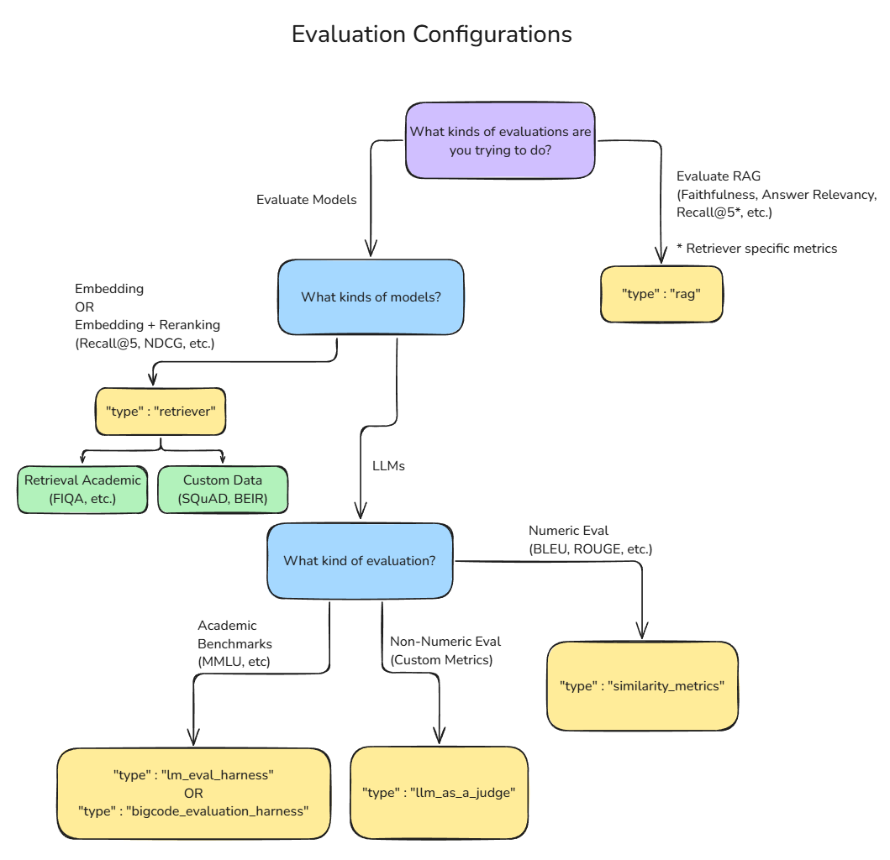

# Fine-Tuning Large Language Models

A tutorial and collection of scripts for fine-tuning open-source Large Language Models (LLMs) using Unsloth, Hugging Face PEFT, and related frameworks, across local (Linux/GPU/Docker) and cloud (Microsoft Azure) environments.

---

## Table of Contents

1. [Introduction: What is Fine-Tuning?](#1-introduction-what-is-fine-tuning)
2. [Pre-training vs. Fine-Tuning](#2-pre-training-vs-fine-tuning)
3. [Fine-Tuning vs. Prompt Engineering](#3-fine-tuning-vs-prompt-engineering)
4. [Fine-Tuning Frameworks Overview](#4-fine-tuning-frameworks-overview)
   - [Unsloth](#unsloth)
   - [Axolotl](#axolotl)
   - [LLaMA-Factory](#llama-factory)
   - [Hugging Face PEFT](#hugging-face-peft)
   - [DeepSpeed](#deepspeed)
5. [Key Concepts](#5-key-concepts)
   - [Context Window](#context-window)
   - [Temperature](#temperature)
   - [LoRA and QLoRA](#lora-and-qlora)
   - [Rank-Stabilized LoRA (rsLoRA)](#rank-stabilized-lora-rslora)
   - [Gradient Checkpointing](#gradient-checkpointing)
   - [Flash Attention](#flash-attention)
   - [Supervised Fine-Tuning (SFT)](#supervised-fine-tuning-sft)
   - [Full Fine-Tuning vs. PEFT](#full-fine-tuning-vs-peft)
6. [Unsloth Deep Dive](#6-unsloth-deep-dive)
   - [What is Unsloth?](#what-is-unsloth)
   - [Algorithms and Techniques](#algorithms-and-techniques)
   - [Context Length](#context-length)
   - [Memory-Efficient RL (GRPO)](#memory-efficient-rl-grpo)
7. [Repository Structure](#7-repository-structure)
8. [Finding Models for Fine-Tuning](#8-finding-models-for-fine-tuning)
   - [Hugging Face Hub](#hugging-face-hub)
   - [Unsloth Model Collection](#unsloth-model-collection)
   - [Finding 4-bit Pre-Quantized Models](#finding-4-bit-pre-quantized-models)
   - [Accepting Gated Model Licenses](#accepting-gated-model-licenses)
   - [Choosing Model Size vs. VRAM](#choosing-model-size-vs-vram)
9. [Virtual Environment Setup](#9-virtual-environment-setup)
10. [Installing Dependencies](#10-installing-dependencies)
11. [Local Deployment: Linux with GPU](#11-local-deployment-linux-with-gpu)
12. [Local Deployment: Docker with GPU](#12-local-deployment-docker-with-gpu)
13. [Cloud Deployment: Microsoft Azure](#13-cloud-deployment-microsoft-azure)
14. [Running the Fine-Tuning Scripts](#14-running-the-fine-tuning-scripts)
15. [Evaluation: Metrics and Tools](#15-evaluation-metrics-and-tools)
16. [References](#16-references)

---

## 1. Introduction: What is Fine-Tuning?

Fine-tuning is the process of continuing the training of a pre-trained Large Language Model on a new, task-specific dataset. The goal is to adapt the model's behavior to a narrower domain or instruction style while preserving the broad knowledge it already learned during pre-training.

Related terms used when fine-tuning models such as Llama:

- **Domain Adaptation**: Adapting a general model to a specific field, such as medicine, law, or finance.
- **Transfer Learning**: Reusing the representations learned by a pre-trained model as the starting point for a new task.
- **Supervised Fine-Tuning (SFT)**: The most common fine-tuning approach, where the model is trained on labeled input-output pairs.
- **Parameter-Efficient Fine-Tuning (PEFT)**: A family of methods (e.g., LoRA) that train only a small subset of added parameters, leaving the original model weights frozen.

---

## 2. Pre-training vs. Fine-Tuning

| Aspect | Pre-training | Fine-Tuning |
|---|---|---|
| Goal | Learn general language representations from massive data | Adapt the model to a specific task or domain |
| Data | Billions to trillions of tokens from diverse sources | Thousands to millions of task-specific examples |
| Compute | Extremely high (thousands of GPU-hours or TPU-days) | Moderate to low (hours to days on a single GPU) |
| Weight updates | All parameters trained from random initialization | All parameters (full SFT) or a small subset (PEFT) |
| Who performs it | Model providers (Meta, Mistral, Google, etc.) | Practitioners, companies, researchers |

Fine-tuning is "further training" or "additional training." It is not training from scratch. The model already knows how language works; fine-tuning teaches it new behavior within that existing understanding.

---

## 3. Fine-Tuning vs. Prompt Engineering

| Aspect | Prompt Engineering | Fine-Tuning |
|---|---|---|
| Weight updates | No (weights are frozen) | Yes (weights are updated) |
| Cost | Zero additional compute at training time | Requires GPU time and memory |
| Persistent behavior | Only within the context window of one session | Encoded into the model weights |
| Flexibility | Easy to change; just edit the prompt | Requires retraining to change |
| Best for | Quick adaptation, few-shot examples, RAG | Consistent behavior, proprietary data, efficiency |

Prompt engineering places examples inside the input (in-context learning). Fine-tuning changes the model itself by updating its weights to learn new patterns permanently.

When to choose fine-tuning over prompt engineering:

- The desired behavior is complex and cannot be reliably captured with a few examples.
- Latency or cost constraints make long prompts impractical.
- The training data is proprietary and should not appear in prompts.
- Consistent and reproducible output style or format is required.

See also: [To fine-tune or not to fine-tune](https://ai.meta.com/blog/when-to-fine-tune-llms-vs-other-techniques/)

---

## 4. Fine-Tuning Frameworks Overview

### Unsloth

**Repository**: https://github.com/unslothai/unsloth

Unsloth is specifically designed for high speed and low memory usage. It enables fine-tuning on a single local GPU or free cloud services such as Google Colab and Kaggle. It is reported to be up to 2x faster than standard Hugging Face training, with up to 80% less VRAM usage.

Supports: Llama, Mistral, Gemma, Qwen, Phi, and others.

### Axolotl

**Repository**: https://github.com/axolotl-ai-cloud/axolotl

A configuration-driven framework that uses YAML files to manage fine-tuning, making it easier to reproduce results without writing custom code. It supports local Linux/WSL setups and is frequently used in cloud-based Jupyter environments.

### LLaMA-Factory

**Repository**: https://github.com/hiyouga/LlamaFactory

Provides scripts including a CLI and a Web UI for fine-tuning over 100 different LLMs. It integrates with Unsloth for accelerated training and supports various alignment techniques including DPO (Direct Preference Optimization).

### Hugging Face PEFT

**Repository**: https://github.com/huggingface/peft

A foundational library for Parameter-Efficient Fine-Tuning. It integrates seamlessly with the Hugging Face Transformers ecosystem and is standard for both local and cloud deployments, including Amazon SageMaker.

Supported methods: LoRA, QLoRA, Prefix Tuning, Prompt Tuning, P-Tuning.

### DeepSpeed

**Repository**: https://github.com/deepspeedai/DeepSpeed

Developed by Microsoft. Essential for distributed training across multiple GPUs or machines. Built for large-scale enterprise workloads and can be used on-premise or in the cloud.

---

## 5. Key Concepts

### Context Window

The context window (also called context length or sequence length) is the maximum number of tokens the model can read and write in a single forward pass. Tokens within this window can attend to each other; information outside is not accessible.

- A larger context window allows longer documents, longer conversation histories, and more in-context examples.
- Increasing context length increases GPU memory requirements quadratically (standard attention) or linearly (Flash Attention).
- Unsloth extends the context window significantly: up to 500K+ tokens on H100 GPUs and ~56K+ tokens on RTX 4090s using specialized 4-bit QLoRA algorithms.
- When fine-tuning, `max_seq_length` sets the context window for the training run.

### Temperature

Temperature is a scalar value applied to the logits (raw output scores) before the softmax function during text generation. It controls the randomness of the model's output distribution.

$$P(x_i) = \frac{\exp(z_i / T)}{\sum_j \exp(z_j / T)}$$

Where $T$ is the temperature, $z_i$ are the logits, and $P(x_i)$ is the probability of token $i$.

| Temperature | Effect | Typical Use Case |
|---|---|---|
| $T \to 0$ | Nearly deterministic, always picks the highest-probability token | Code generation, factual Q&A |
| $T = 0.3 - 0.5$ | Low randomness, focused and consistent | Structured data extraction |
| $T = 0.7$ | Balanced creativity and coherence | General chatbots, instruction following |
| $T = 1.0$ | Output distribution equals the raw model probabilities | Creative writing |
| $T > 1.0$ | Increases randomness; can become incoherent | Brainstorming, diversity sampling |

Temperature only affects inference (generation). It is not a training hyperparameter.

Related parameters: `top_p` (nucleus sampling) and `top_k` (top-k sampling) further constrain the sampling distribution.

### LoRA and QLoRA

**LoRA (Low-Rank Adaptation)** freezes the original model weights and injects small, trainable low-rank matrices into the attention layers. Instead of updating a weight matrix $W \in \mathbb{R}^{d \times k}$, it trains two small matrices:

$$W' = W + \frac{\alpha}{r} \cdot B A$$

Where $A \in \mathbb{R}^{r \times k}$ and $B \in \mathbb{R}^{d \times r}$ are the LoRA matrices, $r$ is the rank, and $\alpha$ is the scaling factor.

Key parameters:
- `r` (rank): Controls the capacity. Typical values: 8, 16, 32. Lower rank = fewer trainable parameters = faster training = lower capacity.
- `lora_alpha`: Scaling factor, usually set equal to `r`.
- `lora_dropout`: Dropout rate inside LoRA layers for regularization.
- `target_modules`: Which weight matrices to apply LoRA to (e.g., `q_proj`, `v_proj`).

**QLoRA (Quantized LoRA)** combines LoRA with 4-bit quantization of the frozen base model weights. The base model is stored in 4-bit NF4 format, reducing VRAM usage by approximately 4x. The LoRA adapters are trained in full precision.

### Rank-Stabilized LoRA (rsLoRA)

Standard LoRA scales the adapter output by $\frac{\alpha}{r}$. At higher ranks, this scaling causes instability. rsLoRA modifies the scaling to $\frac{\alpha}{\sqrt{r}}$, which stabilizes gradients and allows effective training at higher ranks.

Enable with `use_rslora=True` in Unsloth.

### Gradient Checkpointing

During standard backpropagation, all intermediate activations are stored in GPU memory to compute gradients. Gradient checkpointing reduces memory usage by recomputing activations during the backward pass instead of storing them, at the cost of extra computation time (~30% slower).

Unsloth implements a custom, optimized gradient checkpointing method that achieves memory savings without the full speed penalty. Set with `use_gradient_checkpointing="unsloth"`.

### Flash Attention

Flash Attention is a memory-efficient attention algorithm that avoids materializing the full attention matrix in GPU memory. It tiles the computation to work within fast SRAM, dramatically reducing memory usage and improving speed for long sequences.

- Flash Attention v2 provides further improvements in parallelism for modern GPUs.
- Flash Attention v3 targets Hopper-architecture GPUs (H100).

Unsloth implements custom Flash Attention kernels. Install with:

```bash
pip install flash-attn --no-build-isolation
```

### Supervised Fine-Tuning (SFT)

SFT is the process of fine-tuning a pre-trained language model on labeled input-output pairs using standard cross-entropy loss. The model learns to produce the expected output given the input.

```
Input:  "Translate to French: Hello, world."
Output: "Bonjour, monde."
```

SFT is the standard first step in instruction tuning and RLHF pipelines.

### Full Fine-Tuning vs. PEFT

| Aspect | Full Fine-Tuning (SFT) | PEFT (e.g., LoRA) |
|---|---|---|
| Trainable parameters | All (100%) | Typically less than 1% |
| VRAM requirement | Very high | Low (combined with QLoRA) |
| Performance ceiling | Maximum | Near-maximum for many tasks |
| Adapter file size | Full model size | A few MB to a few hundred MB |
| Risk of catastrophic forgetting | Higher | Lower |
| Deployment | Load the full model | Load base model + small adapter |

---

## 6. Unsloth Deep Dive

### What is Unsloth?

Unsloth is an open-source framework that simplifies and accelerates LLM fine-tuning and reinforcement learning (RL) post-training. It accelerates fine-tuning of open-source LLMs (Llama, Mistral, Gemma, Qwen) by utilizing 4-bit QLoRA, optimized by custom-built CUDA/Triton kernels and Flash Attention.

Reported results:
- 2x to 5x faster training compared to standard Hugging Face + bitsandbytes.
- 70% to 80% less VRAM usage.
- No loss in accuracy or model quality.

### Algorithms and Techniques

**LoRA and QLoRA**
Trains small low-rank adapter matrices rather than the whole model. Combined with 4-bit quantization (NF4) of the base model to fit large models onto consumer GPUs.

**Rank-Stabilized LoRA (rsLoRA)**
Adjusts the LoRA scaling factor to $\frac{1}{\sqrt{r}}$ instead of $\frac{1}{r}$ to improve stability and performance at higher ranks.

**Custom CUDA and Triton Kernels**
Manual low-level optimization of Triton kernels for backpropagation, feed-forward networks (including RMSNorm, SwiGLU, and rotary embeddings), and attention mechanisms. These kernels bypass the PyTorch autograd graph to eliminate unnecessary memory allocations and reduce computation time.

**Flash Attention (v2 and v3)**
Implements specialized Flash Attention mechanisms for faster and memory-efficient attention computation, critical for long-context fine-tuning.

**Optimized Gradient Checkpointing**
A custom implementation that recomputes only the necessary activations during the backward pass, achieving significant VRAM savings with minimal speed cost.

**Supervised Fine-Tuning (SFT)**
Supports standard SFT instruction tuning workflows through integration with the TRL `SFTTrainer`.

**Memory-Efficient RL (GRPO)**
Supports reinforcement learning from human feedback patterns using GRPO (Group Relative Policy Optimization) with long reasoning chains at low memory cost.

### Context Length

Unsloth uses specialized QLoRA algorithms and custom attention implementations to extend context lengths far beyond what standard Hugging Face + Flash Attention achieves:

| Hardware | Unsloth Context Length | Standard HF + FA2 |
|---|---|---|
| H100 GPU | 500K+ tokens | ~70K tokens |
| RTX 4090 | ~56K tokens | ~16K tokens |
| RTX 3090 | ~28K tokens | ~8K tokens |

This is achieved through Unsloth Gradient Checkpointing combined with 4-bit quantization and the custom attention kernels.

References:
- [Unsloth Gradient Checkpointing: 4x Longer Context Windows](https://unsloth.ai/blog/long-context)
- [500K Context Length Fine-Tuning](https://unsloth.ai/docs/blog/500k-context-length-fine-tuning)

### Memory-Efficient RL (GRPO)

Unsloth supports training LLMs using reinforcement learning to generate long reasoning chains (chain-of-thought) at significantly lower memory cost than standard implementations.

Reference: [Memory Efficient RL](https://unsloth.ai/docs/get-started/reinforcement-learning-rl-guide/memory-efficient-rl)

---

## 7. Repository Structure

```
fine-tuning/
├── .gitignore                  # Excludes venv, model weights, caches
├── README.md                   # This file
├── evaluation.png              # Evaluation flow diagram (NVIDIA)
└── scripts/
    ├── requirements.txt        # Python dependencies
    ├── unsloth_finetune.py     # Unsloth QLoRA fine-tuning script
    └── peft_finetune.py        # Hugging Face PEFT/LoRA fine-tuning script
```

---

## 8. Finding Models for Fine-Tuning

Before running any fine-tuning script, you need to select a base model. The two primary sources for open-source LLMs are Hugging Face Hub and Unsloth's curated model collection.

### Hugging Face Hub

Hugging Face Hub (https://huggingface.co/models) is the central registry for open-source LLMs. It hosts tens of thousands of models from providers including Meta, Mistral AI, Google, Alibaba, and Microsoft.

**Browsing and filtering models:**

1. Go to https://huggingface.co/models
2. Use the left-hand filters:
   - **Task**: Select `Text Generation` to narrow to causal language models.
   - **Library**: Select `Transformers` to ensure compatibility with the Hugging Face ecosystem.
   - **Language**: Filter by language if your dataset is not in English.
3. Use the search bar to search by model family name, for example: `Llama`, `Mistral`, `Gemma`, `Qwen`, `Phi`.
4. Sort by `Most Downloads` or `Trending` to find widely used and community-validated checkpoints.

**Commonly used open-source base models for fine-tuning:**

| Model Family | Provider | Recommended Starting Points |
|---|---|---|
| Llama 3.1 / 3.2 | Meta | `meta-llama/Llama-3.1-8B-Instruct`, `meta-llama/Llama-3.2-3B-Instruct` |
| Mistral | Mistral AI | `mistralai/Mistral-7B-Instruct-v0.3` |
| Gemma 2 | Google | `google/gemma-2-9b-it` |
| Qwen 2.5 | Alibaba | `Qwen/Qwen2.5-7B-Instruct` |
| Phi-3.5 | Microsoft | `microsoft/Phi-3.5-mini-instruct` |

**Direct model page URL pattern:**

```
https://huggingface.co/<organization>/<model-name>
```

For example: https://huggingface.co/meta-llama/Llama-3.1-8B-Instruct

### Unsloth Model Collection

Unsloth provides pre-quantized versions of popular models, already converted to 4-bit NF4 format and tested for compatibility with Unsloth's training pipeline. Using these avoids the quantization step and reduces download size.

**Browse the Unsloth collection:**

https://huggingface.co/unsloth

Model names follow a consistent pattern:

```
unsloth/<ModelFamily>-<size>-<variant>-bnb-4bit
```

Examples:

| Unsloth Model ID | Base Model | VRAM (approx.) |
|---|---|---|
| `unsloth/Meta-Llama-3.1-8B-Instruct-bnb-4bit` | Llama 3.1 8B Instruct | ~6 GB |
| `unsloth/Meta-Llama-3.1-70B-Instruct-bnb-4bit` | Llama 3.1 70B Instruct | ~40 GB |
| `unsloth/Llama-3.2-3B-Instruct-bnb-4bit` | Llama 3.2 3B Instruct | ~3 GB |
| `unsloth/mistral-7b-instruct-v0.3-bnb-4bit` | Mistral 7B Instruct v0.3 | ~5 GB |
| `unsloth/gemma-2-9b-it-bnb-4bit` | Gemma 2 9B Instruct | ~7 GB |
| `unsloth/Qwen2.5-7B-Instruct-bnb-4bit` | Qwen 2.5 7B Instruct | ~5 GB |
| `unsloth/Phi-3.5-mini-instruct-bnb-4bit` | Phi-3.5 Mini Instruct | ~3 GB |

To use one of these in the fine-tuning script, set the `MODEL_NAME` variable:

```python
MODEL_NAME = "unsloth/Meta-Llama-3.1-8B-Instruct-bnb-4bit"
```

### Finding 4-bit Pre-Quantized Models

When searching Hugging Face Hub for 4-bit models compatible with Unsloth or bitsandbytes:

1. Search for the model name followed by `bnb-4bit`, for example: `Llama-3.1-8B bnb-4bit`.
2. Filter by the `unsloth` organization to find Unsloth-tested quantized checkpoints directly: https://huggingface.co/unsloth
3. Look for models with `GGUF` in the name if you intend to run inference with llama.cpp or Ollama instead of training.
4. On any model page, check the **Files and versions** tab to confirm the presence of `.safetensors` files and a `config.json` that specifies `quantization_config` with `load_in_4bit: true`.

**Filtering by tag on Hugging Face Hub:**

```
https://huggingface.co/models?search=bnb-4bit&pipeline_tag=text-generation
```

### Accepting Gated Model Licenses

Some high-quality models such as Llama (Meta) and Gemma (Google) are gated: you must request access and accept the license agreement before downloading them.

**Step 1: Create a Hugging Face account**

Go to https://huggingface.co/join and register.

**Step 2: Accept the model license on the model page**

- Llama 3.x: https://huggingface.co/meta-llama/Llama-3.1-8B-Instruct
  Click the **Agree and access repository** button and fill in the required form. Access is typically granted automatically within a few minutes.
- Gemma 2: https://huggingface.co/google/gemma-2-9b-it
  Click **Acknowledge license** and agree to Google's terms.

Note: Accepting the license on the base model page also grants access to derivative checkpoints under the same organization (e.g., all `meta-llama/` models after accepting one Llama license).

**Step 3: Create a Hugging Face access token**

1. Go to https://huggingface.co/settings/tokens
2. Click **New token**, select **Read** scope, and copy the token.

**Step 4: Authenticate locally**

```bash
# Activate virtual environment first
source venv/bin/activate

pip install huggingface_hub
huggingface-cli login
# Paste your token when prompted
```

Alternatively, set the token as an environment variable to avoid interactive prompts:

```bash
export HUGGING_FACE_HUB_TOKEN="hf_your_token_here"
```

Once authenticated, the Hugging Face `transformers` and `datasets` libraries will use the token automatically when downloading gated models.

**Verifying access:**

```bash
python -c "
from huggingface_hub import whoami
print(whoami()['name'])
"
```

### Choosing Model Size vs. VRAM

The available GPU VRAM is the primary constraint when selecting a model for fine-tuning with QLoRA.

| Model Size | Full Precision (FP16) VRAM | 4-bit QLoRA VRAM (approx.) | Minimum GPU |
|---|---|---|---|
| 1B - 3B | ~6 GB | ~2-3 GB | RTX 3060 (12 GB) |
| 7B - 8B | ~16 GB | ~5-6 GB | RTX 3080 (10 GB) / T4 |
| 13B - 14B | ~28 GB | ~10-12 GB | RTX 3090 (24 GB) |
| 30B - 34B | ~60 GB | ~20-22 GB | A100 40 GB |
| 70B | ~140 GB | ~40-45 GB | A100 80 GB / H100 |

General guidance:
- For free cloud tiers (Google Colab free, Kaggle): use 7B or 8B models with 4-bit QLoRA.
- For a single consumer GPU (RTX 3090, RTX 4090): 7B to 14B models with 4-bit QLoRA.
- For Azure `Standard_NC6s_v3` (V100 16 GB): 7B models with 4-bit QLoRA.
- For Azure `Standard_ND96asr_v4` (8x A100 40 GB): 70B models with QLoRA or full fine-tuning of smaller models.

---

## 9. Virtual Environment Setup

All Python scripts must be run inside a virtual environment. Always activate the virtual environment before installing packages or executing scripts.

### Create and Activate

```bash
# Create a virtual environment named 'venv'
python3 -m venv venv

# Activate on Linux / macOS
source venv/bin/activate

# Activate on Windows (PowerShell)
# .\venv\Scripts\Activate.ps1

# Confirm the environment is active (should show the venv path)
which python
```

### Deactivate When Done

```bash
deactivate
```

The `venv/` folder is excluded from Git tracking via `.gitignore`.

---

## 10. Installing Dependencies

Always activate the virtual environment before installing.

### Step 1: Activate virtual environment

```bash
source venv/bin/activate
```

### Step 2: Upgrade pip

```bash
pip install --upgrade pip
```

### Step 3: Install PyTorch with CUDA

Install PyTorch matching your CUDA version. Check your CUDA version with `nvcc --version` or `nvidia-smi`.

```bash
# For CUDA 12.1
pip install torch torchvision torchaudio --index-url https://download.pytorch.org/whl/cu121

# For CUDA 12.4
pip install torch torchvision torchaudio --index-url https://download.pytorch.org/whl/cu124

# Verify GPU is available
python -c "import torch; print(torch.cuda.is_available(), torch.cuda.get_device_name(0))"
```

### Step 4: Install Unsloth

Unsloth must be installed separately before other dependencies. Use the command matching your environment:

```bash
# For CUDA 12.1 (stable release)
pip install "unsloth[cu121-torch240] @ git+https://github.com/unslothai/unsloth.git"

# For CUDA 12.4 (stable release)
pip install "unsloth[cu124-torch240] @ git+https://github.com/unslothai/unsloth.git"

# Verify Unsloth installation
python -c "import unsloth; print('Unsloth OK')"
```

For the latest install command, refer to the [official Unsloth documentation](https://github.com/unslothai/unsloth).

### Step 5: Install remaining dependencies

```bash
pip install -r scripts/requirements.txt
```

### Step 6: (Optional) Install Flash Attention

Flash Attention requires compilation and a compatible CUDA environment.

```bash
pip install flash-attn --no-build-isolation
```

### Step 7: Hugging Face authentication

Most base models (e.g., Llama, Gemma) require accepting the model license on Hugging Face and authenticating locally.

```bash
pip install huggingface_hub
huggingface-cli login
# Paste your Hugging Face token when prompted
```

---

## 11. Local Deployment: Linux with GPU

This section covers setting up a local Linux machine with an NVIDIA GPU for fine-tuning.

### Prerequisites

- Linux (Ubuntu 20.04 or 22.04 recommended)
- NVIDIA GPU with at least 8 GB VRAM (16 GB+ recommended for comfortable training)
- NVIDIA driver version 520 or later
- CUDA Toolkit 12.1 or later

### Step 1: Verify GPU and CUDA

```bash
nvidia-smi
nvcc --version
```

### Step 2: Install system dependencies

```bash
sudo apt update && sudo apt install -y \
    python3 python3-pip python3-venv \
    git curl wget build-essential
```

### Step 3: Clone this repository

```bash
git clone <repository-url>
cd fine-tuning
```

### Step 4: Create and activate virtual environment

```bash
python3 -m venv venv
source venv/bin/activate
```

### Step 5: Install PyTorch and dependencies

Follow [Section 9: Installing Dependencies](#9-installing-dependencies).

### Step 6: Run a fine-tuning script

```bash
# Activate virtual environment first
source venv/bin/activate

# Run Unsloth fine-tuning
python scripts/unsloth_finetune.py

# Or run PEFT fine-tuning
python scripts/peft_finetune.py
```

### Step 7: Monitor GPU utilization

```bash
# In a separate terminal
watch -n 1 nvidia-smi
```

---

## 12. Local Deployment: Docker with GPU

Docker containers provide a reproducible, isolated environment. NVIDIA Container Toolkit is required to pass the GPU into the container.

### Step 1: Install Docker and NVIDIA Container Toolkit

```bash
# Install Docker
curl -fsSL https://get.docker.com | sh
sudo usermod -aG docker $USER
newgrp docker

# Install NVIDIA Container Toolkit
curl -fsSL https://nvidia.github.io/libnvidia-container/gpgkey | \
    sudo gpg --dearmor -o /usr/share/keyrings/nvidia-container-toolkit-keyring.gpg

curl -s -L https://nvidia.github.io/libnvidia-container/stable/deb/nvidia-container-toolkit.list | \
    sed 's#deb https://#deb [signed-by=/usr/share/keyrings/nvidia-container-toolkit-keyring.gpg] https://#g' | \
    sudo tee /etc/apt/sources.list.d/nvidia-container-toolkit.list

sudo apt-get update && sudo apt-get install -y nvidia-container-toolkit
sudo nvidia-ctk runtime configure --runtime=docker
sudo systemctl restart docker

# Verify GPU access inside Docker
docker run --rm --gpus all nvidia/cuda:12.1.0-base-ubuntu22.04 nvidia-smi
```

### Step 2: Create a Dockerfile

Create a `Dockerfile` in the repository root:

```dockerfile
FROM nvidia/cuda:12.1.0-cudnn8-devel-ubuntu22.04

ENV DEBIAN_FRONTEND=noninteractive
ENV PYTHONUNBUFFERED=1

RUN apt-get update && apt-get install -y \
    python3 python3-pip python3-venv git curl && \
    rm -rf /var/lib/apt/lists/*

WORKDIR /workspace

COPY scripts/requirements.txt ./requirements.txt

# Install PyTorch and Unsloth
RUN pip3 install --upgrade pip && \
    pip3 install torch torchvision torchaudio --index-url https://download.pytorch.org/whl/cu121 && \
    pip3 install "unsloth[cu121-torch240] @ git+https://github.com/unslothai/unsloth.git" && \
    pip3 install -r requirements.txt

COPY scripts/ ./scripts/

CMD ["python3", "scripts/unsloth_finetune.py"]
```

### Step 3: Build and run the container

```bash
# Build the image
docker build -t fine-tuning-unsloth .

# Run with GPU access and mount outputs to host
docker run --gpus all \
    -v $(pwd)/outputs:/workspace/outputs \
    -e HUGGING_FACE_HUB_TOKEN=<your-token> \
    fine-tuning-unsloth
```

---

## 13. Cloud Deployment: Microsoft Azure

Azure provides several services for LLM fine-tuning. The recommended options are:

- **Azure Machine Learning (Azure ML)**: Managed ML platform with GPU cluster support.
- **Azure VM with GPU**: Direct VM access with NVIDIA GPUs (NC, ND, NV series).
- **Azure Container Instances (ACI)**: Run Docker containers with GPU on-demand.

### Option A: Azure Virtual Machine with GPU

**Step 1: Create a GPU VM**

```bash
# Install Azure CLI
curl -sL https://aka.ms/InstallAzureCLIDeb | sudo bash

# Log in
az login

# Create resource group
az group create --name fine-tuning-rg --location eastus

# Create GPU VM (Standard_NC6s_v3 = 1x V100 16GB)
az vm create \
    --resource-group fine-tuning-rg \
    --name fine-tuning-vm \
    --image Ubuntu2204 \
    --size Standard_NC6s_v3 \
    --admin-username azureuser \
    --generate-ssh-keys

# Open SSH port
az vm open-port --port 22 --resource-group fine-tuning-rg --name fine-tuning-vm

# Get public IP
az vm show -d -g fine-tuning-rg -n fine-tuning-vm --query publicIps -o tsv
```

**Step 2: Connect and configure the VM**

```bash
# Connect via SSH
ssh azureuser@<public-ip>

# Install NVIDIA driver and CUDA (Ubuntu 22.04)
sudo apt update
sudo apt install -y ubuntu-drivers-common
sudo ubuntu-drivers autoinstall
sudo reboot
```

**Step 3: Clone repository and set up environment**

After reconnecting via SSH:

```bash
git clone <repository-url>
cd fine-tuning

python3 -m venv venv
source venv/bin/activate

# Follow Section 9: Installing Dependencies
pip install --upgrade pip
pip install torch torchvision torchaudio --index-url https://download.pytorch.org/whl/cu121
pip install "unsloth[cu121-torch240] @ git+https://github.com/unslothai/unsloth.git"
pip install -r scripts/requirements.txt

huggingface-cli login
```

**Step 4: Run fine-tuning**

```bash
source venv/bin/activate
python scripts/unsloth_finetune.py
```

**Step 5: Stop the VM when done**

```bash
az vm deallocate --resource-group fine-tuning-rg --name fine-tuning-vm
```

### Option B: Azure Machine Learning

Azure ML provides managed compute clusters, experiment tracking, and model registry.

**Step 1: Install Azure ML SDK and CLI**

```bash
source venv/bin/activate
pip install azure-ai-ml azure-identity
az extension add --name ml
```

**Step 2: Create an Azure ML workspace**

```bash
az ml workspace create \
    --name fine-tuning-ws \
    --resource-group fine-tuning-rg \
    --location eastus
```

**Step 3: Create a compute cluster**

```bash
az ml compute create \
    --name gpu-cluster \
    --type AmlCompute \
    --size Standard_NC6s_v3 \
    --min-instances 0 \
    --max-instances 1 \
    --workspace-name fine-tuning-ws \
    --resource-group fine-tuning-rg
```

**Step 4: Submit a training job**

Create a job YAML file `azure_job.yml`:

```yaml
$schema: https://azuremlschemas.azureedge.net/latest/commandJob.schema.json
command: >
    pip install torch torchvision torchaudio --index-url https://download.pytorch.org/whl/cu121 &&
    pip install "unsloth[cu121-torch240] @ git+https://github.com/unslothai/unsloth.git" &&
    pip install -r scripts/requirements.txt &&
    python scripts/unsloth_finetune.py
compute: azureml:gpu-cluster
environment:
    image: mcr.microsoft.com/azureml/openmpi4.1.0-cuda11.8-cudnn8-ubuntu22.04
inputs:
    hf_token:
        type: string
code: .
```

Submit the job:

```bash
az ml job create --file azure_job.yml \
    --workspace-name fine-tuning-ws \
    --resource-group fine-tuning-rg
```

**Step 5: Monitor and retrieve outputs**

```bash
# List jobs
az ml job list --workspace-name fine-tuning-ws --resource-group fine-tuning-rg

# Stream logs
az ml job stream --name <job-name> \
    --workspace-name fine-tuning-ws \
    --resource-group fine-tuning-rg
```

---

## 14. Running the Fine-Tuning Scripts

Always activate the virtual environment before running any script.

```bash
source venv/bin/activate
```

### Unsloth QLoRA Fine-Tuning

Script: [scripts/unsloth_finetune.py](scripts/unsloth_finetune.py)

```bash
python scripts/unsloth_finetune.py
```

Key configuration at the top of the script:

| Parameter | Default | Description |
|---|---|---|
| `MODEL_NAME` | `unsloth/Meta-Llama-3.1-8B-Instruct-bnb-4bit` | Pre-quantized model from Unsloth's Hub |
| `MAX_SEQ_LENGTH` | `2048` | Context window: maximum tokens per training sample |
| `LOAD_IN_4BIT` | `True` | Enable 4-bit QLoRA to reduce VRAM |
| `LORA_RANK` | `16` | LoRA rank r; higher = more capacity, more VRAM |
| `LORA_ALPHA` | `16` | LoRA scaling factor, typically equal to rank |
| `LEARNING_RATE` | `2e-4` | Step size for the optimizer |
| `BATCH_SIZE` | `2` | Samples per GPU per step |
| `GRAD_ACCUMULATION_STEPS` | `4` | Effective batch size = BATCH_SIZE x GRAD_ACCUMULATION_STEPS |
| `MAX_STEPS` | `60` | Total training steps |
| `TEMPERATURE` | `0.7` | Inference temperature (not used during training) |
| `OUTPUT_DIR` | `outputs/unsloth-llama-lora` | Where to save LoRA adapter weights |

### Hugging Face PEFT Fine-Tuning

Script: [scripts/peft_finetune.py](scripts/peft_finetune.py)

```bash
python scripts/peft_finetune.py
```

This script uses the standard Hugging Face PEFT + TRL stack without Unsloth acceleration. Useful when Unsloth-compatible GPUs are not available or for framework comparison.

### Checking Output

After training, the LoRA adapter weights are saved to `outputs/`. The adapter can be loaded at inference time without the full model size:

```python
from peft import PeftModel
from transformers import AutoModelForCausalLM, AutoTokenizer

base_model = AutoModelForCausalLM.from_pretrained("base-model-id")
model = PeftModel.from_pretrained(base_model, "outputs/peft-lora-adapter")
tokenizer = AutoTokenizer.from_pretrained("outputs/peft-lora-adapter")
```

---

## 15. Evaluation: Metrics and Tools

Evaluating a fine-tuned LLM involves measuring quality, safety, and efficiency using automated metrics, human evaluation, and standardized benchmarks.



*Evaluation configuration flow depending on use case, model, and metrics*
*Source: [NVIDIA Developer Blog](https://developer.nvidia.com/blog/mastering-llm-techniques-evaluation/) — For license and copyright, refer to NVIDIA's content policy.*

### Evaluation Metrics

**Semantic Similarity**

- **BERTScore**: Computes similarity between model output and reference using BERT embeddings. Captures meaning, not just exact word overlap.
- **METEOR**: Measures overlap considering synonyms, stemming, and paraphrases. More robust than ROUGE for fluent text.
- **ROUGE (Recall-Oriented Understudy for Gisting Evaluation)**: Measures n-gram overlap between generated text and reference summaries. Commonly used for summarization tasks.
  - ROUGE-1: Unigram overlap.
  - ROUGE-2: Bigram overlap.
  - ROUGE-L: Longest Common Subsequence.

**Factuality and Reliability**

- **Faithfulness**: Whether the generated output is grounded in the provided context (critical for RAG systems).
- **Toxicity**: Measures the presence of harmful content in model outputs.
- **Helpfulness**: Often assessed via human or LLM-as-judge evaluation.

**Model Performance**

- **Perplexity**: Measures how well the model predicts a held-out test set. Lower perplexity indicates better language modeling. Computed as $\text{PPL} = \exp\left(-\frac{1}{N}\sum_{i=1}^N \log P(x_i)\right)$.
- **Latency**: Time to generate a response (time to first token and total generation time).
- **Throughput**: Tokens generated per second.

**RAG-Specific Metrics**

- **Retrieval Relevance**: Whether retrieved documents are relevant to the query.
- **Answer Faithfulness**: Whether the generated answer is grounded in the retrieved documents.
- **Context Utilization**: How well the model uses the provided context.

### Evaluation Tools and Frameworks

| Tool | Purpose | Link |
|---|---|---|
| **RAGAS** | Specialized evaluation for RAG pipelines | https://docs.ragas.io |
| **DeepEval** | Framework for testing and evaluating LLM applications | https://docs.confident-ai.com |
| **TruLens** | Auditing and feedback for LLM-based applications | https://www.trulens.org |
| **Promptfoo** | Developer tool for testing prompt quality and regressions | https://www.promptfoo.dev |
| **Weights & Biases (W&B)** | Experiment tracking, model outputs, and metric logging | https://wandb.ai |
| **Galileo** | Debugging and monitoring for LLM applications | https://www.rungalileo.io |
| **lm-evaluation-harness** | EleutherAI's standard benchmark evaluation tool | https://github.com/EleutherAI/lm-evaluation-harness |

**Using lm-evaluation-harness for benchmark evaluation:**

```bash
source venv/bin/activate
pip install lm_eval

# Evaluate on MMLU benchmark
lm_eval --model hf \
    --model_args pretrained=outputs/unsloth-llama-lora,dtype=float16 \
    --tasks mmlu \
    --device cuda:0 \
    --batch_size 8
```

**Using Weights & Biases for training tracking:**

```bash
pip install wandb
wandb login
# In the script, set report_to="wandb" in TrainingArguments
```

### Standard Benchmarks

| Benchmark | What it Measures |
|---|---|
| **MMLU** (Massive Multitask Language Understanding) | General knowledge across 57 subjects including STEM, humanities, and social sciences |
| **HELM** (Holistic Evaluation of Language Models) | Evaluation across accuracy, calibration, robustness, fairness, and efficiency |
| **TruthfulQA** | Whether the model generates truthful answers rather than mimicking human falsehoods |
| **GSM8K** | Grade-school math word problems; tests arithmetic reasoning |
| **HumanEval** | Python coding problems; tests code generation accuracy |
| **MT-Bench** | Multi-turn conversation quality assessed by GPT-4 as judge |

References:
- [A list of metrics for evaluating LLM-generated content (Microsoft)](https://learn.microsoft.com/en-us/ai/playbook/technology-guidance/generative-ai/working-with-llms/evaluation/list-of-eval-metrics)
- [Mastering LLM Techniques: Evaluation (NVIDIA)](https://developer.nvidia.com/blog/mastering-llm-techniques-evaluation/)

---

## 16. References

**Unsloth**
- [Unsloth GitHub Repository](https://github.com/unslothai/unsloth)
- [Unsloth Fine-Tuning LLMs Guide](https://unsloth.ai/docs/get-started/fine-tuning-llms-guide)
- [Unsloth Benchmarks](https://unsloth.ai/docs/basics/unsloth-benchmarks)
- [Finetune and Run Llama 3.1 with Unsloth](https://unsloth.ai/blog/llama3-1)
- [Fine-tune Llama 3.1 Ultra-Efficiently with Unsloth (Hugging Face Blog)](https://huggingface.co/blog/mlabonne/sft-llama3)
- [Unsloth Gradient Checkpointing: 4x Longer Context Windows](https://unsloth.ai/blog/long-context)
- [500K Context Length Fine-Tuning](https://unsloth.ai/docs/blog/500k-context-length-fine-tuning)
- [Memory Efficient RL with Unsloth](https://unsloth.ai/docs/get-started/reinforcement-learning-rl-guide/memory-efficient-rl)

**Hugging Face PEFT and TRL**
- [PEFT: Parameter-Efficient Fine-Tuning of Billion-Scale Models](https://huggingface.co/blog/peft)
- [PEFT Documentation](https://huggingface.co/docs/peft)
- [PEFT Methods Overview](https://huggingface.co/blog/samuellimabraz/peft-methods)
- [Transformers PEFT Integration](https://huggingface.co/docs/transformers/peft)
- [Scaling Down to Scale Up: A Guide to PEFT (arXiv)](https://arxiv.org/html/2303.15647v2)
- [Fine-Tuning Gemma Models in Hugging Face](https://huggingface.co/blog/gemma-peft)

**Meta Llama and Fine-Tuning Guidance**
- [Llama Fine-Tuning Guide](https://www.llama.com/docs/how-to-guides/fine-tuning/)
- [Methods for Adapting Large Language Models](https://ai.meta.com/blog/adapting-large-language-models-llms/)
- [To Fine-Tune or Not to Fine-Tune](https://ai.meta.com/blog/when-to-fine-tune-llms-vs-other-techniques/)
- [How to Fine-Tune: Focus on Effective Datasets](https://ai.meta.com/blog/how-to-fine-tune-llms-peft-dataset-curation/)

**Frameworks**
- [Axolotl GitHub Repository](https://github.com/axolotl-ai-cloud/axolotl)
- [LLaMA-Factory GitHub Repository](https://github.com/hiyouga/LlamaFactory)
- [DeepSpeed GitHub Repository](https://github.com/deepspeedai/DeepSpeed)
- [NVIDIA NeMo AutoModel SFT and PEFT Guide](https://docs.nvidia.com/nemo/automodel/latest/guides/llm/finetune.html)

**Evaluation**
- [A List of Metrics for Evaluating LLM-Generated Content (Microsoft)](https://learn.microsoft.com/en-us/ai/playbook/technology-guidance/generative-ai/working-with-llms/evaluation/list-of-eval-metrics)
- [Mastering LLM Techniques: Evaluation (NVIDIA)](https://developer.nvidia.com/blog/mastering-llm-techniques-evaluation/)

**Datasets**
- [A Good LLM Dataset List (mlabonne)](https://github.com/mlabonne/llm-datasets)

**General Fine-Tuning**
- [Fine-Tuning LLMs and AI Models (Google Cloud)](https://cloud.google.com/use-cases/fine-tuning-ai-models)
- [Types of Fine-Tuning (Google Cloud)](https://cloud.google.com/use-cases/fine-tuning-ai-models#types-of-fine-tuning)
