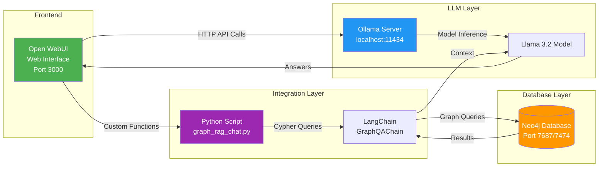
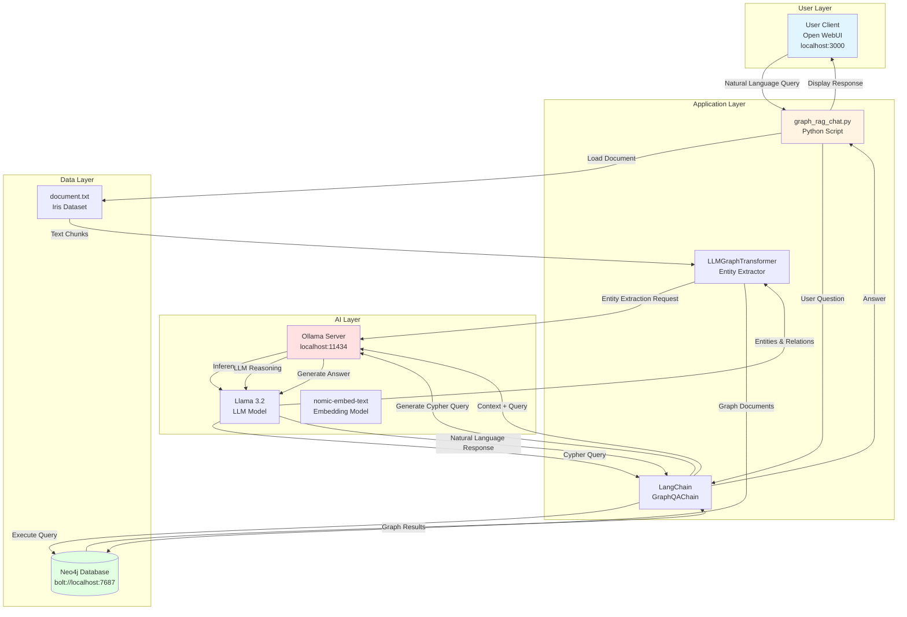
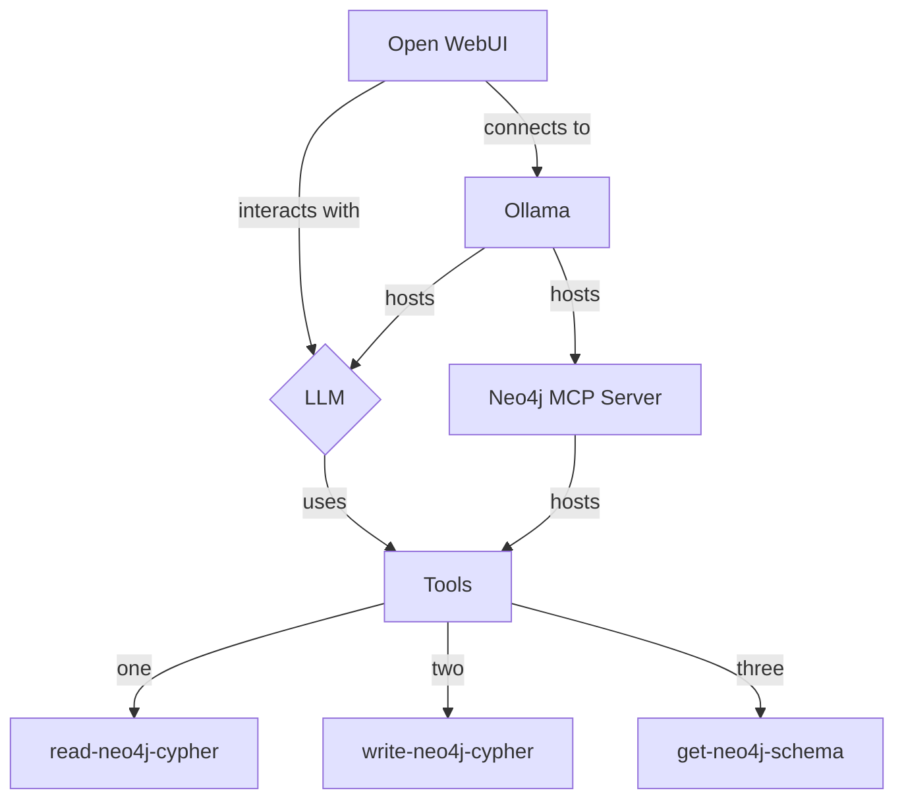
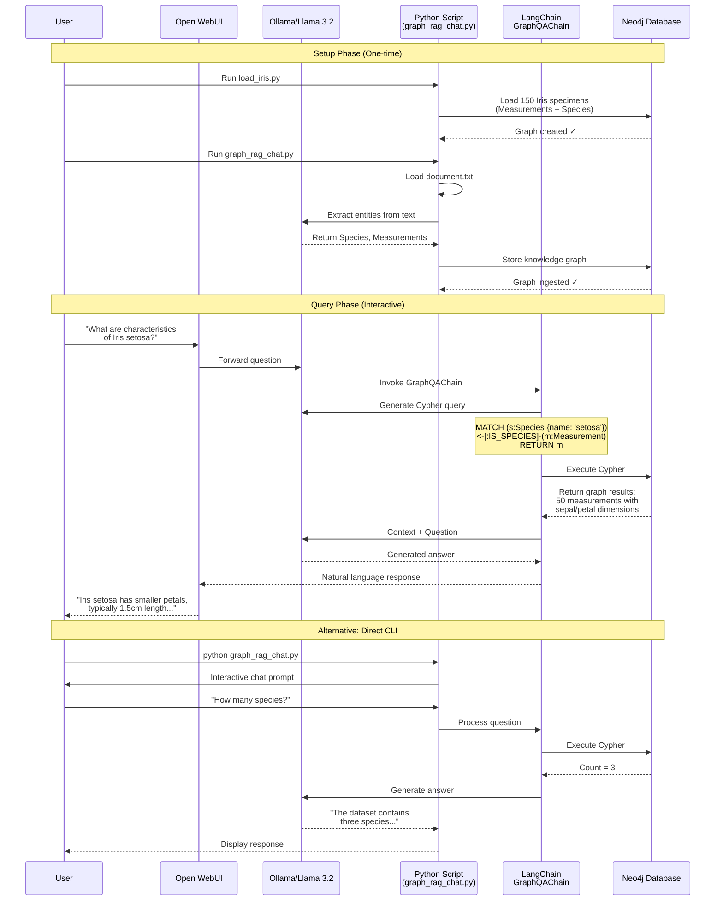

# Graph Retrieval-Augmented Generation (GraphRAG)

This document presents concepts, architectural components, practical use cases and implementation technologies associated with Graph retrieval-augmented generation (GraphRAG). By leveraging knowledge graphs alongside large language models, GraphRAG extends retrieval-augmented generation approaches with structured representations of entities and relationships, facilitating improved contextual retrieval and complex reasoning over interconnected information.

## Table of Contents

- [Introduction](#introduction)
  - [What is GraphRAG?](#what-is-graphrag)
  - [How GraphRAG Works?](#how-graphrag-works)
  - [How GraphRAG improves retrieval?](#how-graphrag-improves-retrieval)
  - [Why RAG misses connected information?](#why-rag-misses-connected-information)
- [Use Cases](#use-cases)
  - [When GraphRAG is useful?](#when-graphrag-is-useful)
  - [Example: Customer Support Assistant](#example-customer-support-assistant)
- [Architectures](#architectures)
  - [GraphRAG Architecture](#graphrag-architecture)
- [Agentic AI and GraphRAG](#agentic-ai-and-graphrag)
  - [Why make GraphRAG agentic?](#why-make-graphrag-agentic)
  - [GraphRAG vs Agentic GraphRAG](#graphrag-vs-agentic-graphrag)
  - [Building an Agentic GraphRAG](#building-an-agentic-graphrag)
  - [Agentic AI Decision Making](#agentic-ai-decision-making)
- [Multi-Hop Reasoning for Iris Dataset](#multi-hop-reasoning-for-iris-dataset)
  - [Multi-Hop vs Single-Hop: Comparison for Iris Dataset](#multi-hop-vs-single-hop)
  - [Quick Start for Multi-Hop Reasoning](#quick-start-for-multi-hop-reasoning)
- [Building Samples](#building-samples)
  - [Prerequisites](#prerequisites)
  - [Setup Virtual Environment](#setup-virtual-environment)
  - [Dataset Generation](#dataset-generation)
  - [RAG (Retrieval-Augmented Generation)](#rag-retrieval-augmented-generation)
  - [GraphRAG](#graphrag)
  - [Agentic AI with RAG](#agentic-ai-with-rag)
  - [Agentic AI with GraphRAG](#agentic-ai-with-graphrag)
- [Project Structure](#project-structure)
- [References](#references)


## Introduction

RAG improves the reliability of GenAI components by ensuring that LLM answers are based only on accurate information from existing knowledge sources.

RAG excels at localized, keyword-adjacent fact-finding, but it fails to see the bigger picture. GraphRAG extends retrieval-augmented generation approaches to overcome this limitation by incorporating structured representations of entities and relationships.

RAG retrieves chunks of text from documents using vector similarity. GraphRAG retrieves entities and relationships from a graph structure, allowing the LLM to reason over connected information rather than isolated text passages.

### What is GraphRAG?

GraphRAG is used for complex datasets where traditional semantic search fails.

### How GraphRAG Works?

Building GraphRAG pipeline involves two major phases:

Knowledge Graph (KG) Construction (using an LLM to extract entities/relationships from text and storing them) and Graph Retrieval & Generation (querying the database using vector math combined with graph steps).

**1. Indexing (Graph Creation)**

- Extraction:

The system scans your raw document data. An LLM acts as an extraction mechanism to identity key entities (e.g., "Specimen_042", "Petal Length") and their relationships (e.g., "Petal Length characterizes Specimen_042").

- Clustering & Summarization:

Frameworks like Microsoft's GraphRAG partition these interconnected nodes into "communities" using algorithms like Leiden. The LLM then pre-writes summaries for these broader groups.

Leiden is a fast and highly efficient mathematical algorithm used to group large, complex networks (knowledge graphs) into neat clusters called "communities".

Large Language Models (LLMs) cannot process a giant knowledge graph all at once. By partitioning the graph into communities using Leiden, Microsoft's GraphRAG can summarize each community individually, allowing the AI to understand the global structure of your data as a whole rather than just pulling disconnected text snippets.

**2. Querying (Retrieval & Generation)**

- Local Search:

For entity-specific queries (e.g., "What measurements characterize Specimen_042?"), the system pinpoints the "Specimen_042" node and pulls all adjacent data connected via its edges.

- Global Search:

For global, macro questions (e.g., "What are the key morphological features distinguishing Iris setosa?"), the retriever bypasses isolated text chunks and searches across the pre-compiled community summaries to form an aggregate answer.

Generation: The structured context is added to the prompt, forcing the LLM to output a grounded, accurate response.

*What are morphological features?*

In the context of the Iris dataset, morphological refers to the *physical form and structure of the flowers*.

For the Iris dataset, the morphological characteristics are the four measured features:

- Sepal length
- Sepal width
- Petal length
- Petal width

These measurements describe the physical appearance of each flower and are used to distinguish among the three Iris species.

Therefore, the sentence:

*Morphological characteristics of Iris virginica*

means:

*The physical characteristics (shape and size measurements) of Iris virginica.*

### How GraphRAG improves retrieval?

GraphRAG solves "Multi-Hop" problems: If a query requires connecting relevant details across document A, B, and C (e.g., "Find all Iris specimens with large petal measurements that belong to the setosa species"), GraphRAG seamlessly steps across edges to chain the facts together.

RAG indexes unstructured documents using dense embeddings. Graph-based retrieval instead constructs an entity network, a structured semantic layer that's especially useful in domains where the relationships among concepts carry the answer.

**RAG vs. GraphRAG**

| Feature | Baseline (Vector) RAG | GraphRAG |
|-------------|---------------|---------------|
| Data format | Flat chunks of text | Interconnected nodes and edges |
| Search approach | Math-based vector similarity | Graph traversal and relationship tracking |
| Query strengths | Specific "fact-lookup" queries | "Multi-hop" reasoning and contextual summaries |
| Explainability | Low (black-box vector math) | High (traceable relationship paths) |

**GraphRAG benefits over RAG**

1. Multi-hop reasoning

Questions such as:

"Which specimens are connected to CharacteristicTypes that define traits of the setosa species?"

require several relationship hops.

Graph traversal naturally supports this. (See [VISUAL_DIAGRAM.md](VISUAL_DIAGRAM.md) for detailed relationship visualization)

2. Better context precision

Instead of retrieving large document chunks, GraphRAG can retrieve only the entities and relationships relevant to the query.

3. Explainability

The system can show:

```
      Customer C
            ← receives
      Product B
            ← produced by
      Factory A

```

### Why RAG misses connected information?

RAG treats every chunk as an isolated object, with no native way to represent how chunks relate to each other. In a typical pipeline, your app converts documents into chunks, embeds each chunk as a high-dimensional vector, and stores those vectors in an index. At query time, the app embeds the user's question, retrieves the closest vectors by distance, and passes those chunks to the LLM as context.

## Use Cases

### When GraphRAG is useful?

GraphRAG is most valuable when information contains many **interconnected** entities and relationships.

| Use Case | Why GraphRAG Helps |
|-------------|---------------|
| Enterprise knowledge management | Connect employees, projects, documents, products, and customers |
| Customer support | Link products, components, error codes, manuals, and troubleshooting procedures |
| Healthcare | Connect diseases, symptoms, treatments, medications, and research papers |
| Financial analysis | Model companies, subsidiaries, executives, markets, and transactions |
| Cybersecurity | Represent hosts, users, vulnerabilities, attacks, and alerts |
| Scientific research | Link authors, publications, methods, datasets, and findings |
| Supply chain management | Track suppliers, parts, warehouses, shipments, and customers |

4. Reduced hallucinations

The model receives structured facts from the graph rather than relying entirely on semantic similarity.

### Example: Customer Support Assistant

Suppose a company manufactures elevators.

**RAG**

The system retrieves:

```
Document A: Motor overheating issue
Document B: Sensor calibration procedure
Document C: Maintenance schedule

```

The LLM must infer relationships from separate chunks.

**GraphRAG**

The **graph** explicitly stores:


```
      Elevator A
      ├── contains → Motor X
      ├── contains → Sensor Y
      └── maintained_by → Procedure Z

      Motor X
      └── causes → Error E102

      Error E102
      └── resolved_by → Cooling Procedure P

```

When a user asks:

"Why does Elevator A show Error E102?"

The retrieval system can traverse:

```
      Elevator A
      → Motor X
      → Error E102
      → Cooling Procedure P

```
The LLM receives the relevant chain of evidence instead of unrelated document chunks.

Given your interests in AI agents, RAG, vector databases, and enterprise deployments, GraphRAG would be particularly useful for:

Technical support chatbots that connect products, components, manuals, and error codes.

## Architectures

For many enterprise AI systems, a common architecture:


```
                Documents
                    │
                    ├─► Vector Database (semantic search)
                    │
                    └─► Knowledge Graph (GraphRAG)
                              │
                              ▼
                             LLM

```

### GraphRAG Architecture


```
                Documents
                     │
                     ▼
          Entity & Relation Extraction
                     │
                     ▼
               Knowledge Graph
                     │
          ┌──────────┴──────────┐
          │                     │
          ▼                     ▼
   Graph Traversal       Vector Search
          │                     │
          └──────────┬──────────┘
                     ▼
               Retrieved Context
                     ▼
                    LLM
                     ▼
                  Response

```
### Selecting the appropriate architecture

Building an Agentic GraphRAG system involves orchestrating a pipeline of specialized agents, each responsible for a specific task, such as query analysis, retrieval, reasoning, planning, and response generation.

The choice of architecture depends on the complexity of the user's query.

Assess your **Query** complexity:

**Information Retrieval**

Are your users asking straightforward questions like, “What are the characteristics of Iris setosa?”

→ Start with RAG (enhanced with basic reranking or hybrid search).

Use a traditional RAG system, optionally enhanced with reranking or hybrid search to improve retrieval accuracy.

**Relationship-Aware Queries**

Are users asking, “How many Iris species are in the dataset?”

→ You need the structural mapping of Graph RAG.

Use GraphRAG, which leverages a knowledge graph to retrieve information based on explicit relationships between entities and supports multi-hop reasoning.

**Complex Multi-Step Analysis**

Are users asking, “What are the main morphological characteristics of Iris virginica?“

→ You should implement Agentic RAG.

Use Agentic RAG, where multiple AI agents collaborate to plan, retrieve, evaluate, reason over multiple information sources, and generate a response.

**Evaluate Latency and Cost constraints:**

If you are building a real-time customer-facing chatbot, the high latency and token costs of RAG can quickly become excessive.

In these scenarios, highly optimized RAG or Graph RAG architectures are preferable.

## Agentic AI and GraphRAG

Agentic AI utilizes Graph retrieval-augmented generation to move beyond simple question-answering by using the structural connections and entities in a knowledge graph to dynamically plan, trigger, and execute complex workflows.

### Why make GraphRAG Agentic?

While GraphRAG is great, it has one flaw: rigidity.

Numerous RAG systems rely solely on opens in **vector search** over text embeddings (numerical vector representations) for information retrieval.

Instead of matching exact keywords, [vector search](https://weaviate.io/blog/vector-search-explained) assesses the conceptual meaning and contextual intent of the query.

Vector search returns similar items based on their semantic meaning rather than exact term matches, by comparison GraphRAG retrieves information based on explicit relationships and structure.

Instead of just matching similar concepts, GraphRAG maps out specific entities and traces exactly how they connect to one another.

GraphRAG extracts "entities" (e.g., people, products, places) from your documents and builds a connected web of data.

Agents, are simply decision-making systems that use LLMs to interact with external data sources.

At its core, an agent is simply an LLM call with a specific context. It takes your input and reasons through what it knows, and it interacts with external tools or databases to retrieve the most relevant answers.

For example, instead of always relying on vector search, an agent might use a graph traversal algorithm like BFS or PageRank to find the most relevant nodes in a knowledge graph.

When a user submits a complex query, an orchestrator agent breaks the query down into smaller tasks. It then decides which tools to use – querying a vector database, calling an external API, checking a CRM, or executing a Python script.

- Flexibility: Agents aren’t tied to one approach—they select the best tool or algorithm for the task.

- Autonomy: Once set up, the system operates independently, requiring minimal human intervention.

- Error handling: Feedback loops allow agents to dynamically retry, diagnose issues, and recover from failures.

GraphRAG systems hard-code pipelines for data retrieval. This is great for simple use cases but limiting for complex, evolving scenarios.

### Agentic AI Decision Making

1. Multi-Hop reasoning for Complex Decisions:

Standard vector search can only match text chunks based on semantic similarity; it cannot string together a sequence of connected facts. GraphRAG allows the agent to traverse relationships (e.g., Specimen → MeasurementGroup → CharacteristicType → Species → Genus). (See [VISUAL_DIAGRAM.md](VISUAL_DIAGRAM.md) for detailed relationship patterns)

The Action: The agent can logically deduce dependencies before taking an action. For instance, when classifying an Iris specimen, the agent traces the graph to verify measurements, cross-reference characteristic types, and confirm species classification based on trait patterns.

2. Precise Tool selection & Parameter passing:

Agents have access to specialized tools (e.g., an email API, a database query tool, or a payment endpoint). Instead of guessing which tool to use, the agent uses the knowledge graph to map entities to system actions.

The integration of GraphRAG transforms an agent's capability into an agentic workflow through several key mechanisms:

1. Question classification

The first agent analyzes the user query and determines its type. For example:

Retrieval questions involve direct lookups, such as “What are the morphological characteristics of Iris setosa?”

Structured questions explore relationships, like “Are petal measurements related to species classification patterns?”

Global queries analyze trends such as “What are the top 10 most important nodes?”

2. Tool selection

Based on the query type, another agent selects the best tool to retrieve the required data. This might include vector search, PageRank, BFS (breadth-first search), DFS (depth-first search), or a database schema query.

3. Execution

The selected tool processes the query, retrieving relevant data or results. Agents can adapt tools to match the query’s specific needs. For example, a PageRank query may return the top 10 nodes for a broad query or a single node for a specific question.

4. Feedback loops

If a tool fails (e.g., due to a misconfigured query or missing data), the agent diagnoses the issue, retries, or switches to an alternative tool.

5. Response

The processed data is returned to the user as a meaningful answer.

### GraphRAG vs Agentic GraphRAG

| Feature | GraphRAG | Agentic GraphRAG |
|-------------|---------------|---------------|
| Retrieval mechanism | Graph traversal (Nodes and Edges) | Autonomous multi-step orchestration |
| Implementation | Requires ontology and data structuring | Requires agent orchestration and tool integration |
| Query complexity  | Relational, multi-hop queries | Open-ended problem solving |
| Vulnerability | Garbage In, Garbage Out | High latency, infinite loops without guardrails |
| Use Cases | Static data structuring, relationship queries, and analytical tasks | Multi-step reasoning, dynamic troubleshooting, and tool-driven workflows |

## Building Samples

A step-by-step guide to setting up a local RAG, Agentic AI, and GraphRAG environment and pipeline using Ollama, Python, LangGraph and Neo4j with the Iris dataset.

### Prerequisites

Before starting, ensure you have the following installed:
- Python 3.8 or higher
- Ollama (for running local LLMs)
- Docker (for Neo4j)
- Git

### Setup Virtual Environment

Create and activate a Python virtual environment to isolate dependencies:

```bash
cd /path/to/graph
python3 -m venv venv
source venv/bin/activate  # On Linux/Mac
# venv\Scripts\activate  # On Windows
```

### Dataset Generation

The Iris dataset is used throughout these examples to demonstrate RAG and GraphRAG capabilities.

#### Generate Synthetic Dataset

Use the generation script to create a text document with semantic descriptions of the Iris dataset:

**Install Dependencies:**

```bash
pip install pandas scikit-learn langchain-text-splitters
```

**Run the Generation Script:**

```bash
python scripts/dataset/generate_dataset_for_vector_database.py
```

This will create `document.txt` in the root directory containing 150 semantic descriptions of Iris specimens with morphological measurements (sepal length, sepal width, petal length, petal width) and species classifications (setosa, versicolor, virginica).

The script transforms raw tabular data into natural language suitable for vector embeddings, converting numerical measurements into descriptive sentences like: "This biological specimen belongs to the genus Iris, specifically classified under the species 'setosa'. Morphological measurements indicate a sepal length of 5.1 cm..."

### RAG (Retrieval-Augmented Generation)

To build a local retrieval-augmented generation (RAG) system, you can use Ollama to run Llama 3.2, ChromaDB as your local vector database, and LangChain to orchestrate the pipeline.

RAG agent relies on two different models: a reasoning or generation model (does the deciding, grading, rewriting and answering) and an embedding model (turns your documents and queries into vectors).

**Install Ollama and Models**

Download and install Ollama for your operating system:

```bash
curl -fsSL https://ollama.com/install.sh | sh
```

Start the Ollama server:

```bash
ollama serve
```

Pull the required models:

```bash
# Reasoning model (the agent)
ollama pull llama3.2

# Embedding model (the retriever)
ollama pull nomic-embed-text
```

**Install Python Dependencies**

```bash
pip install langchain langchain-ollama langchain-community langchain-chroma chromadb
```

**RAG Script (rag_app.py)**

Location: `scripts/rag/rag_app.py`

This script demonstrates a basic RAG pipeline:
1. Loads the Iris dataset document (document.txt)
2. Splits it into chunks
3. Creates embeddings using nomic-embed-text
4. Stores vectors in ChromaDB
5. Retrieves relevant context for queries
6. Generates answers using Llama 3.2

**Run the RAG Script:**

```bash
python scripts/rag/rag_app.py
```

The script will query: “What are the morphological characteristics of Iris setosa?“ and return an answer based on retrieved context from the Iris dataset.

**Streamlit Chat Interface (app.py)**

Location: `scripts/rag/app.py`

For an interactive web interface, use the Streamlit app which provides a chat-like experience.

**Install Streamlit:**

```bash
pip install streamlit
```

**Launch the Streamlit App:**

```bash
streamlit run scripts/rag/app.py
```

Your browser will open to http://localhost:8501 where you can interact with the Iris dataset through a conversational interface.

**Example Questions:**
- “What are the characteristics of Iris setosa?“
- “What is the typical petal length for Iris virginica?“
- “How do the three Iris species differ in their morphological measurements?“

### GraphRAG

To create a local GraphRAG (Graph-based retrieval-augmented generation) pipeline, you will use Ollama to host the Llama 3.2 LLM and an embedding model, LangChain to orchestrate the retrieval, and a graph database like Neo4j or Microsoft's GraphRAG SDK to structure the knowledge graph.

To build a [retrieval agent using LangGraph and Neo4j (GraphRAG)](https://neo4j.com/blog/developer/neo4j-graphrag-workflow-langchain-langgraph/), you construct an agentic system that routes queries between structured Cypher query generation and unstructured vector similarity search, combining the results inside a stateful workflow.

**Architecture**



Steps:

Query analysis and routing:

The user’s request is first analyzed and classified, allowing the system to route it to the appropriate workflow node. Depending on the query, the system may proceed to the next step (research plan generation), prompt the user for clarification, or respond immediately if the request is out of scope.

Research plan generation:

The system constructs a detailed, step-by-step research plan tailored to the complexity of the user’s query. This plan outlines the specific actions required to fulfill the request.

Research graph execution: For each step in the research plan, a dedicated subgraph is invoked. The system generates Cypher queries via LLMs, targeting the Neo4j knowledge graph. Relevant nodes and relationships are retrieved using a hybrid approach that combines semantic search and structured graph queries, ensuring both breadth and precision in the results.

Answer generation: Leveraging the retrieved graph data, the system synthesizes a response using an LLM, integrating information from multiple sources as needed.

To get started, create a project space and python virtual environment to install graphrag.

**Activate virtual environment**

```

source .venv/bin/activate

```

**Install the required dependencies**


```

pip install --upgrade pip

pip install langchain langchain-community langchain-ollama chromadb sentence-transformers ollama


```

**Run Neo4j with APOC Plugins via Docker**

Neo4j needs the APOC (Awesome Procedures on Cypher) plugin enabled so LangChain can map and structure the knowledge graph correctly.


```

docker run \
    -d \
    --name neo4j-graphrag \
    -p 7474:7474 -p 7687:7687 \
    -e NEO4J_AUTH=neo4j/password123 \
    -e NEO4J_PLUGINS='["apoc"]' \
    -e NEO4J_dbms_security_procedures_unrestricted=apoc.* \
    neo4j:5.20.0


```

Open http://localhost:7474 in your browser to inspect your graph. Log in with username neo4j and password password123.

Ensure you have the official Neo4j driver and the experimental LangChain graph components installed inside your virtual environment

```

pip install neo4j langchain-experimental

```

**Install GraphRAG**

Note: If you use Microsoft's GraphRAG package, you will also install it via pip install graphrag

python -m pip install graphrag

**Initialize GraphRAG**

Extract Entities and Build the Knowledge Graph

GraphRAG and LangChain require specific packages to communicate with your local Ollama models.

When prompted, specify the default chat and embedding models you would like to use in your config.

You need to parse your documents into entities (nodes) and their relationships (edges).

You can do this automatically using LangChain's built-in LLMGraphTransformer and a local graph store like Neo4j, which can be easily spun up on your virtual Linux machine using Docker.

**Set up workspace variables**

Create the Retrieval Chain and Chat

**Create Chat Script**

The `graph_rag_chat.py` script implements a complete GraphRAG pipeline that connects your local Ollama LLM (Llama 3.2) with Neo4j graph database to enable intelligent querying of the Iris dataset through natural language.

**What the Script Does:**

Location: `scripts/graphrag/graph_rag_chat.py`

The script performs five key operations:

1. **Database Connection Setup**: Establishes connection to Neo4j graph database (bolt://localhost:7687) and initializes Ollama's Llama 3.2 model as the local LLM.

2. **Document Loading & Chunking**: Loads the `document.txt` file (Iris dataset descriptions) and splits it into manageable 512-token chunks with 24-token overlap for efficient processing by the local LLM.

3. **Knowledge Graph Extraction**: Uses `LLMGraphTransformer` to analyze text chunks and extract structured entities (Species, Measurement, Specimen) and relationships (HAS_MEASUREMENT, BELONGS_TO_SPECIES, SIMILAR_TO) using Llama 3.2's language understanding capabilities.

4. **Graph Ingestion**: Stores the extracted entities and relationships into Neo4j, creating a queryable knowledge graph structure where each iris specimen is represented as interconnected nodes with typed relationships.

5. **Interactive GraphRAG Chat**: Creates a `GraphQAChain` that automatically translates natural language questions into Cypher queries, retrieves relevant graph data from Neo4j, and generates human-readable answers using Llama 3.2.

**Information Flow Diagram:**



**How It Works - Step by Step:**

1. **Load Iris Dataset**: The script reads `document.txt`, which contains semantic descriptions of 150 Iris specimens (generated using `scripts/dataset/generate_dataset_for_vector_database.py`).

2. **Extract Knowledge Graph**: Llama 3.2 analyzes each text chunk to identify:
   - **Entities**: Species (setosa, versicolor, virginica), Measurements (sepal/petal dimensions), Specimens
   - **Relationships**: Which measurements belong to which specimens, which specimens belong to which species, similarity relationships between specimens

3. **Store in Neo4j**: The extracted graph structure is persisted in Neo4j, creating a queryable network of interconnected botanical data.

4. **Interactive Querying**: When you ask a question like "What are the characteristics of Iris setosa?", the chain:
   - Converts your question to a Cypher query
   - Executes the query against Neo4j
   - Retrieves connected nodes and relationships
   - Uses Llama 3.2 to synthesize a natural language answer

**Before Running the Script:**

**Activate Virtual Environment**:
```bash
cd /home/laptop/EXERCISES/AUTONOMOUS/autonomous-artificial-intelligence/graph
source venv/bin/activate  # On Linux/Mac
# venv\Scripts\activate  # On Windows
```

**Load Iris Dataset into Neo4j** (Optional but Recommended):

Before running the chat script, you can pre-populate Neo4j with structured Iris data using the dedicated loader script:

```bash
# Install required dependencies
pip install neo4j scikit-learn pandas

# Run the loader script
python scripts/dataset/load_iris.py
```

The `load_iris.py` script creates a graph structure where:
- Each measurement is a node with sepal/petal dimensions
- Each species is a distinct node (setosa, versicolor, virginica)
- Measurements connect to their species via IS_SPECIES relationships

This structured data complements the semantic descriptions in `document.txt`, enabling both graph traversal and semantic search.

**Execute the Script**

```bash
python scripts/graphrag/graph_rag_chat.py
```

**Example Interaction:**

```
--- GraphRAG Chat initialized. Type 'exit' to quit ---

You: What are the characteristics of Iris setosa?
Thinking...

AI: Iris setosa is characterized by smaller petals compared to other Iris species,
typically with petal lengths around 1.5 cm and petal widths around 0.2 cm.
The sepals are generally 5.0 cm in length and 3.5 cm in width. This species
is easily distinguishable from versicolor and virginica due to its compact
petal dimensions.

You: How many Iris species are in the dataset?
Thinking...

AI: The dataset contains three distinct Iris species: setosa, versicolor,
and virginica.
```

**Connecting Open WebUI with local Ollama and Neo4j**

Setting up Open WebUI with Ollama and Neo4j involves running your LLM locally, connecting Neo4j via an [OpenAPI or MCP Tool Server](https://docs.openwebui.com/features/extensibility/plugin/tools/openapi-servers/open-webui/), and providing a data schema prompt so the LLM can process the Iris dataset relationships.

**Install local Ollama and Open WebUI**

Setting up a local AI environment to analyze the Iris dataset involves connecting local Ollama (Llama 3.2) to Open WebUI, and using a Python integration layer to query your Neo4j database. Open WebUI handles the chat inference, while Python translates natural language to Cypher for Neo4j.

**Set Up local Ollama and Llama 3.2**

Install and Run Ollama: Download and install Ollama for your OS.

Start the Server: Open your terminal and run ollama serve.

Download Llama 3.2: In a separate terminal window, pull the model by executing ollama pull llama3.2.

**Set Up Open WebUI**

Launch via Docker: If you have Docker Desktop installed, launch Open WebUI and link it to your local Ollama port by running:

```

docker run -d -p 3000:8080 --add-host=host.docker.internal:host-gateway -v open-webui:/app/backend/data --name open-webui --restart always ghcr.io/open-webui/open-webui:main

```

Access the Open WebUI: Open your browser and navigate to http://localhost:3000 to create a local admin account.

**Connect Neo4j as a Tool for Open WebUI**

To allow the LLM to write and execute Cypher queries on the Iris dataset, you need to expose your Neo4j database to Open WebUI using an API tool server:

Clone the Tool Server:

In your terminal, clone the official reference Open WebUI tool server or use the Neo4j MCP server if available:

```

git clone https://github.com/open-webui/openapi-servers

cd openapi-servers/servers/database


```

Install & Run:

Install dependencies (pip install -r requirements.txt) and start the server (e.g., uvicorn main:app --host 0.0.0.0 --reload).

Add Tool in WebUI: Go to Settings > Tools in Open WebUI and add your local tool server URL (e.g., http://localhost:8000).

**Map Iris Relationships and Prompt the AI**

Define the Schema: Provide your Llama 3.2 model with context about the Iris dataset (Sepal Length, Petal Width, Species)

**Create System Prompt:**

In Open WebUI, click your profile, go to Models, and set the System Prompt to something like:

```

"Translate natural language questions about the Iris dataset into Neo4j Cypher queries. The graph contains nodes for IrisFlower, Species, and their respective properties."

```

**Query your graph data with natural language:**

Ask Llama 3.2 questions like, "Show me the relationships of Iris flowers that share a Petal Width of 0.2cm."

To create a complete local AI environment for querying the Iris dataset through a web interface, you'll connect Open WebUI (user interface) → Ollama (LLM inference) → Python GraphRAG script → Neo4j (graph database).



Figure: Dockerized GraphRAG system architecture. Open WebUI provides the user interface, Ollama hosts the large language model, and Neo4j stores the knowledge graph. User queries are transformed into graph queries to retrieve interconnected entities and relationships before the LLM generates the final response.

**Step 1: Install and Configure Open WebUI**

**Activate Virtual Environment First:**
```bash
source venv/bin/activate
```

**Install Open WebUI using Docker:**

```bash
docker run -d -p 3000:8080 \
  --add-host=host.docker.internal:host-gateway \
  -v open-webui:/app/backend/data \
  --name open-webui \
  --restart always \
  ghcr.io/open-webui/open-webui:main
```

**Verify Installation:**
- Open browser to http://localhost:3000
- Create an admin account on first launch

**Step 2: Connect Ollama to Open WebUI**

**Configure Ollama Connection:**
1. Navigate to http://localhost:3000
2. Go to **Admin Panel** → **Settings** → **Connections**
3. Under **Ollama API**, add: `http://host.docker.internal:11434`
4. Click **Save** and verify connection shows as "Connected"

**Verify Ollama Models are Available:**
```bash
ollama list
```

You should see:
- `llama3.2` (reasoning model)
- `nomic-embed-text` (embedding model)

If missing, pull them:
```bash
ollama pull llama3.2
ollama pull nomic-embed-text
```

**Step 3: Set Up Neo4j Graph Database**

**Start Neo4j with APOC (required for GraphRAG):**
```bash
docker run -d \
  --name neo4j-graphrag \
  -p 7474:7474 -p 7687:7687 \
  -e NEO4J_AUTH=neo4j/password123 \
  -e NEO4J_PLUGINS='["apoc"]' \
  -e NEO4J_dbms_security_procedures_unrestricted=apoc.* \
  neo4j:5.20.0
```

**Verify Neo4j is Running:**
- Open http://localhost:7474 in browser
- Login with username: `neo4j`, password: `password123`
- Run test query: `MATCH (n) RETURN count(n)`

**Step 4: Load Iris Dataset into Neo4j**

**Activate Virtual Environment:**
```bash
source venv/bin/activate
```

**Install Required Dependencies:**
```bash
pip install neo4j scikit-learn pandas
```

**Run the Iris Dataset Loader:**

Location: `scripts/dataset/load_iris.py`

```bash
python scripts/dataset/load_iris.py
```

**What this script does:**
- Loads the sklearn Iris dataset (150 specimens, 4 measurements, 3 species)
- Creates **Measurement** nodes with sepal/petal dimensions
- Creates **Species** nodes (setosa, versicolor, virginica)
- Establishes **IS_SPECIES** relationships connecting measurements to species

**Verify Data in Neo4j:**

Open http://localhost:7474 and run:
```cypher
MATCH (s:Species)<-[:IS_SPECIES]-(m:Measurement)
RETURN s.name, count(m) as measurement_count
```

You should see:
- setosa: 50 measurements
- versicolor: 50 measurements
- virginica: 50 measurements

**Step 5: Integrate Python GraphRAG with Open WebUI**

**Create Open WebUI Custom Function for GraphRAG:**

1. In Open WebUI, go to **Workspace** → **Functions** → **+ Create Function**
2. Name: `Neo4j Iris GraphRAG`
3. Add the following Python code:

```python
"""
title: Neo4j Iris GraphRAG Query
description: Query Iris dataset in Neo4j using natural language
author: Your Name
version: 1.0
"""

from typing import Callable
import subprocess
import json

class Tools:
    def __init__(self):
        pass
    
    def query_iris_graph(self, query: str, __user__: dict = {}) -> str:
        """
        Query the Iris dataset in Neo4j using GraphRAG.
        
        :param query: Natural language question about Iris dataset
        :return: Answer with graph context
        """
        try:
            # Call the graph_rag_chat.py script programmatically
            result = subprocess.run(
                ["python3", "scripts/graphrag/graph_rag_chat.py", "--query", query],
                capture_output=True,
                text=True,
                timeout=30
            )
            return result.stdout
        except Exception as e:
            return f"Error querying graph: {str(e)}"
```

4. Click **Save** and enable the function

**Alternative: Direct CLI Usage**

Run the GraphRAG chat script directly:
```bash
source venv/bin/activate
python scripts/graphrag/graph_rag_chat.py
```

Then interact via command line, or use Open WebUI's chat interface with Ollama integration.

**Step 6: Query Iris Dataset via Open WebUI**

Open http://localhost:3000 and try these queries:

1. **Species Characteristics:**
   - "What are the morphological characteristics of Iris setosa?"
   - "How do the three Iris species differ in petal dimensions?"

2. **Graph Traversal Queries:**
   - "Which species has the largest average sepal length?"
   - "Show me measurements where petal length exceeds 5 cm"

3. **Relationship Queries:**
   - "How many specimens belong to Iris virginica?"
   - "Find specimens similar to setosa based on petal width"

**Behind the Scenes:**
- Open WebUI sends your question to Ollama (Llama 3.2)
- Python GraphRAG script converts question to Cypher query
- Neo4j executes graph traversal
- Results are contextualized by Llama 3.2
- Natural language answer returned to Open WebUI

**Troubleshooting:**

| Issue | Solution |
|-------|----------|
| Open WebUI can't connect to Ollama | Ensure Ollama is running: `systemctl status ollama` or `ollama serve` |
| Neo4j connection refused | Check Docker container: `docker ps` and verify ports 7474/7687 |
| Empty graph results | Run `load_iris.py` to populate Neo4j with Iris data |
| Python script errors | Activate virtual environment: `source venv/bin/activate` |
| Model not found | Pull models: `ollama pull llama3.2 && ollama pull nomic-embed-text` |

**Query**

Once your knowledge graph and vector representations are established, you can use LangChain to bind them with your Chat and Llama3.2. The model can perform both vector search and graph traversal to answer user queries.

Now let's ask some questions using this [dataset](https://neo4j.com/docs/graph-data-science-client/current/common-datasets/).

Connect Llama 3.2 to Neo4j via Open WebUI Functions.

Open WebUI has a built-in RAG and Functions feature. You can feed your Neo4j schema and pre-written Cypher queries into the WebUI so it can act as a knowledge graph assistant.

Go to Admin Panel > Settings > Connections > WebUI in Open WebUI.

In the chat prompt, you can use the @ prefix to create a system instruction or function that tells Llama 3.2: "If the user asks about relationships in the Iris dataset, provide a Cypher query for Neo4j." You can paste the resulting Cypher queries into Neo4j Bloom or Neo4j Browser to visually inspect the clusters.

**Complete GraphRAG Workflow for Iris Dataset**

Here's the end-to-end workflow showing how all components work together:



**Key Integration Points:**

1. **Data Layer (Neo4j)**
   - Stores both structured measurements (via `load_iris.py`)
   - Stores extracted knowledge graph (via `graph_rag_chat.py`)
   - Provides Cypher query interface

2. **Intelligence Layer (Ollama + Llama 3.2)**
   - Entity extraction from text
   - Natural language to Cypher translation
   - Answer generation with graph context

3. **Integration Layer (LangChain)**
   - `LLMGraphTransformer`: Extracts entities/relationships
   - `GraphQAChain`: Orchestrates query translation and execution
   - `Neo4jGraph`: Manages database connection

4. **Interface Layer (Open WebUI)**
   - Web-based chat interface
   - Connects to Ollama API
   - Supports custom functions for GraphRAG integration

**Complete Setup Checklist:**

```bash
# 1. Always activate virtual environment first
source venv/bin/activate

# 2. Start infrastructure
docker start neo4j-graphrag
docker start open-webui
ollama serve  # or systemctl start ollama

# 3. Verify models are available
ollama list  # Should show llama3.2 and nomic-embed-text

# 4. Load structured Iris data into Neo4j
python scripts/dataset/load_iris.py

# 5. Generate semantic document (if not exists)
python scripts/dataset/generate_dataset_for_vector_database.py

# 6. Run GraphRAG chat (interactive CLI)
python scripts/graphrag/graph_rag_chat.py

# 7. Access Open WebUI (web interface)
# Open browser: http://localhost:3000
```

**Reminders:**

⚠️ **Always Activate Virtual Environment**: Before running any Python scripts or installing dependencies:
```bash
cd /home/laptop/EXERCISES/AUTONOMOUS/autonomous-artificial-intelligence/graph
source venv/bin/activate
```

⚠️ **Check Service Status**:
```bash
# Neo4j
docker ps | grep neo4j

# Open WebUI
docker ps | grep open-webui

# Ollama
curl http://localhost:11434/api/tags
```

⚠️ **Verify Data Loaded**:
```cypher
// In Neo4j Browser (http://localhost:7474)
MATCH (n) RETURN labels(n) as NodeType, count(n) as Count
```

Expected output:
- Species: 3 nodes
- Measurement: 150 nodes (if loaded via load_iris.py)
- Additional graph entities (if processed via graph_rag_chat.py)

### Agentic AI with RAG

Agents can dynamically choose tools, incorporate complex reasoning, and adapt their analysis approach based on the situation at hand. ReAct Agents are an agentic architecture that use “reasoning and acting” via tool calling supported LLMs. Agentic AI with RAG extends the concept of RAG paradigm by integrating retrieval mechanisms with the language understanding and reasoning capabilities of large language models.

To build a [retrieval agent](https://docs.langchain.com/oss/python/langchain/retrieval) using LangGraph involves running a model on Ollama, storing documents in a local vector database, and using an agentic framework like LangGraph to decide whether to search documents or rewrite queries.

Creating a local [RAG agent](https://docs.langchain.com/oss/python/langgraph/agentic-rag) involves setting up Ollama as your LLM and embedding engine, ChromaDB as your vector store, and LangGraph to manage the routing logic.

Implementing a local Agentic RAG system requires setting up your local environment, loading your documents into ChromaDB, and building a State Graph workflow in LangGraph.

You can also use [Langflow's](https://www.langflow.org/templates/use-langflow-to-build-local-rag-pipeline-with-ollama-and-chromadb) drag-and-drop UI to build this without coding.

**Ollama:**

Ensure Ollama is running and download the Llama3.2 and Embedding models.

```

ollama pull llama3.2
ollama pull nomic-embed-text

```

**ChromaDB:**

Run ChromaDB locally in a Docker container with persistent storage:

```

docker run -d -p 8000:8000 -v chroma-data:/chroma/data -e IS_PERSISTENT=TRUE chromadb/chroma

```

**Document Ingestion**

Before the agent can query, your text documents must be embedded and stored.

Install the dependencies:

```

pip install langchain langchain-ollama langchain-chroma langgraph

```

Use this Python script in ./scripts/agentic/rag folder to ingest your documents.

**Agent**

LangGraph allows the agent to decide when to search the local database, when to answer, or how to rewrite the query.

**The agentic RAG loop: retrieve, reason, act**

See the source code in ./scripts/agentic/rag folder.

### Agentic AI with GraphRAG

Implementing a Graph Query Agent involves creating a state machine in LangGraph where the local LLM acts as the reasoning engine to write and execute Cypher queries against a Neo4j database.

LangGraph lets you define custom workflows as [graphs](https://neo4j.com/labs/genai-ecosystem/genai-frameworks/langgraph/)

Smaller local LLMs hosted on Ollama can struggle with native tool-calling features, the most reliable method is to provide the agent with a single, highly constrained Cypher execution tool.

The latest Neo4j Cypher procedures now support Ollama models via configuring the baseURL (and using Ollama’s OpenAI-compatible endpoint).

**Prerequisites:**

Activate Virtual Environment

```

source .venv/bin/activate

```

Ollama: Ensure you have Ollama installed and a capable model (e.g., llama3.1:8b) pulled via ollama

```

pull llama3.1:8b.

```

Neo4j: Have a Neo4j instance running locally or via Neo4j Aura.

Libraries: Install the necessary Python packages:

```

pip install langgraph langchain-ollama langchain-community neo4j-driver

```

Make sure your local Ollama instance has the model pulled:

```

ollama pull llama3.2

```

**Implementation:**

To integrate both Cypher Graph Queries and Vector RAG Search into a single cohesive LangGraph agent, we will build a hybrid agent using local Ollama (Llama 3.2) and Neo4j.

This allows the agent to dynamically choose whether it needs to do a semantic text search (Vector) or a structured relationship search (Cypher) depending on the user's question.

1. Chunk, Embed, and Store document.txt in Neo4j

This script in scripts folder reads your text file, creates vector embeddings using Ollama, and stores them inside Neo4j's native vector index.

2. Define State and Connect to Databases

First, define the agent state (using MessagesState) and set up your Neo4j connection using the Neo4j Python Driver.

3.  Define Tools (Vector & Cypher)

We create two separate tools decorated with @tool. Llama 3.2 will look at their names and descriptions to decide which one to invoke.

Tool calling via langchain-ollama:

Because llm was initialized using ChatOllama(model="llama3.2") from the langchain-ollama package, LangChain automatically passes the JSON schema of your @tool functions to Ollama.

When you run agent_executor.invoke(), Llama 3.2 uses its native tool-calling capabilities to generate a structured request specifying exactly which tool to run and with what query arguments. LangGraph's internal prebuilt edges catch that instruction and execute the code for you.

4. Build the LangGraph Retriever Agent

We will define a retriever tool from Neo4j and wrap it inside a LangGraph agent. Llama 3.2 supports tool calling natively via the langchain-ollama provider.

**Build the hybrid LangGraph Agent**

We combine both tools into a unified ReAct agent execution graph. We pass a state_modifier system prompt to help the smaller 3B Llama model route effectively.

5. Create the Graph Query Tool

Create a function that translates a text query into an exact Cypher string. Bind this to your LLM using LangChain's @tool decorator.

Defining a Retriever Tool from Neo4j

In Step 4 of the integrated code, the following lines explicitly convert your Neo4j vector database index into a tool:

```

# Turns the Neo4j index into a LangChain retriever object
retriever = vector_store.as_retriever(search_kwargs={"k": 3})

# Wraps that retriever object inside a function decorated as a tool
@tool
def search_unstructured_text(query: str) -> str:
    """Useful for answering semantic questions..."""
    docs = retriever.invoke(query)
    return "\n\n".join([doc.page_content for doc in docs])


```

Wrapping it inside a LangGraph Agent

In Step 4, the create_react_agent function takes that tool, packages it with your LLM, and compiles it into a structured LangGraph state machine:

```

tools = [search_unstructured_text, query_graph_relationships]

# This compiles the full LangGraph node-and-edge engine
agent_executor = create_react_agent(llm, tools, state_modifier=system_instructions)


```

6. Build the LangGraph Nodes and Edges

Using the ReAct framework, we define a node for the agent to reason, a node to execute tools, and conditional edges to loop until an answer is found.

7. Run the Agent

Invoke the agent with a specific question.

8. Test and Query

Now we can fire separate question variations at the exact same compiled graph executor to see it dynamically adjust its tooling strategy.

See the source code in ./scripts/agentic/graphrag/vector_search.py file.

See the source code in ./scripts/agentic/graphrag/structured_cypher_query.py file.

**Tips for Local LLMs:**

JSON Mode or Prompting: If your local model hallucinates or misses tool-calling syntax, instruct it to explicitly output responses in JSON format within your system prompt.

Schema Injection: For better Cypher generation accuracy, dynamically inject the Neo4j schema (node labels and relationship types) into your system prompt so the local LLM knows exactly what data structure to query.

See the source code in scripts/agentic/graphrag folder.

### Agentic AI with GraphRAG

Agentic AI with GraphRAG creates intelligent systems that can dynamically choose between vector search and graph traversal based on the query type. This hybrid approach combines the best of both worlds: semantic similarity search for unstructured text and structured relationship queries for graph data.

**Prerequisites**

Ensure you have:
- Ollama running with llama3.2 and nomic-embed-text models
- Neo4j running with APOC plugins (see GraphRAG section)
- Python dependencies installed

**Install Dependencies**

```bash
pip install langgraph langchain-ollama langchain-community neo4j-driver
```

**Step 1: Chunk, Embed, and Store in Neo4j (chunk_embed_and-populate.py)**

Location: `scripts/agentic/graphrag/chunk_embed_and-populate.py`

This script reads the Iris dataset document, creates vector embeddings using Ollama, and stores them inside Neo4j's native vector index.

**Run the script:**

```bash
python scripts/agentic/graphrag/chunk_embed_and-populate.py
```

**Step 2: Define Tools (tools.py)**

Location: `scripts/agentic/graphrag/tools.py`

This module defines two tools:
1. **search_unstructured_text**: For semantic queries about Iris morphological characteristics
2. **query_graph_relationships**: For structured queries about species relationships and node counts

The tools are decorated with `@tool` so Llama 3.2 can intelligently choose which one to invoke.

**Step 3: Build the Hybrid Agent (agents.py)**

Location: `scripts/agentic/graphrag/agents.py`

This script combines both tools into a unified ReAct agent that can:
- Analyze the query type
- Choose the appropriate tool (vector or graph)
- Execute the query
- Return structured results

**Step 4: Test Vector Search (vector_search.py)**

Location: `scripts/agentic/graphrag/vector_search.py`

Test semantic queries:

```bash
python scripts/agentic/graphrag/vector_search.py
```

Example query: "What are the main morphological characteristics of Iris virginica?"

**Step 5: Test Graph Queries (structured_cypher_query.py)**

Location: `scripts/agentic/graphrag/structured_cypher_query.py`

Test structural graph queries:

```bash
python scripts/agentic/graphrag/structured_cypher_query.py
```

Example query: "How many DocumentChunk nodes exist in the database and what species are represented?"

**How It Works**

1. **Query Classification**: The agent analyzes whether the question requires semantic search or graph traversal
2. **Tool Selection**: Based on query type, the agent chooses the appropriate tool
3. **Execution**: The selected tool processes the query against Neo4j
4. **Response**: Results are synthesized into an answer

**Example Use Cases**

- Semantic queries: "Describe the characteristics of Iris setosa"
- Graph queries: "Show all relationships between species and measurements"
- Hybrid queries: "Compare petal lengths across all three Iris species"

GraphRAG application involves generating Cypher query language with the LLM.

## Multi-Hop Reasoning for Iris Dataset

In traditional RAG, finding [multi-hop answers](https://neo4j.com/blog/genai/knowledge-graph-llm-multi-hop-reasoning/) is difficult because the system relies on semantic similarity, which often retrieves isolated text chunks rather than connected facts.

**Iris Dataset Equivalent:** `Specimen → MeasurementGroup → CharacteristicType → Species → Genus`

This multi-hop structure allows your GraphRAG agent to:
- Traverse from individual specimens to taxonomic classification
- Make complex decisions based on interconnected data
- Discover patterns across multiple relationship levels
- Provide rich contextual reasoning

For a detailed visual representation of the multi-hop relationship pattern, see [VISUAL_DIAGRAM.md](VISUAL_DIAGRAM.md).

---

### Files Created for Multi-Hop Reasoning

#### 1. Core Implementation Files

| File | Purpose |
|------|---------|
| `scripts/dataset/load_iris_multihop.py` | Creates the multi-hop graph structure in Neo4j |
| `scripts/agentic/graphrag/tools_multihop.py` | Provides tools for multi-hop graph queries |
| `scripts/agentic/graphrag/agents_multihop.py` | Agent that uses multi-hop reasoning |

---

### Single-Hop vs Multi-Hop

Single-hop and multi-hop reasoning describe how a Large Language Model (LLM) connected to a Knowledge Graph retrieves information to answer questions or solve problems.

#### Single-Hop

The model directly retrieves the answer using a single connection. It finds a node, follows a single edge to a related node, and arrives at the answer.

#### Multi-Hop

The model connects multiple disconnected pieces of information across the graph. It requires “hopping“ across multiple nodes and edges sequentially to deduce the answer.

#### Before (Single-Hop)
```
Measurement → IS_SPECIES → Species
```
**Limitation:** Can only answer "What species is this?"

#### After (Multi-Hop)
```
Specimen → HAS_MEASUREMENT → MeasurementGroup
         ↓
         CATEGORIZED_AS → CharacteristicType
                         ↓
                         DEFINES_TRAIT_OF → Species
                                           ↓
                                           BELONGS_TO_GENUS → Genus
```
**Capability:** Can answer complex questions like:
- "What are ALL the characteristics and taxonomy of Specimen_0?"
- "Compare sepal patterns across species"
- "Find specimens with similar measurements but different species"
- "Show hierarchical distribution from genus to measurements"

---

## Quick Start for Multi-Hop Reasoning

### Step 1: Activate Environment

```bash
cd /home/laptop/EXERCISES/AUTONOMOUS/autonomous-artificial-intelligence/graph
source venv/bin/activate
```

### Step 2: Ensure Neo4j is Running

```bash
docker start neo4j-graphrag
```

Verify at: http://localhost:7474

### Step 3: Load Multi-Hop Graph

```bash
python scripts/dataset/load_iris_multihop.py
```

**Expected output:**
```
Creating Genus node...
Creating Species nodes...
Creating CharacteristicType nodes...
Creating MeasurementGroup nodes...
Creating Specimen nodes with measurements...

======================================================================
Multi-hop Iris Graph created successfully!
======================================================================

Graph Statistics:
  Specimen: 150 nodes
  MeasurementGroup: 36 nodes
  CharacteristicType: 6 nodes
  Species: 3 nodes
  Genus: 1 node

Relationship Statistics:
  HAS_MEASUREMENT: 600 relationships
  CATEGORIZED_AS: 36 relationships
  DEFINES_TRAIT_OF: 6 relationships
  BELONGS_TO_GENUS: 3 relationships
```

### Step 4: Test in Neo4j Browser

Visit http://localhost:7474 and run:

```cypher
// Visualize a multi-hop path
MATCH path = (sp:Specimen {id: 'Specimen_0'})
             -[:HAS_MEASUREMENT*1..4]->()
RETURN path
LIMIT 25
```

### Step 5: Run the Multi-Hop Agent

```bash
cd scripts/agentic/graphrag
python agents_multihop.py
```

**Try these questions:**
- `What are all characteristics of Specimen_0?`
- `Compare sepal characteristics across all species`
- `Find specimens with similar petal patterns but different species`
- `Which setosa specimens have large petal characteristics?`
- `Show me the distribution of measurements`

---

### Example Multi-Hop Query Results

#### Question: "What are all characteristics of Specimen_0?"

**Agent traverses 5 hops:**
```
Specimen_0 → Measurements → Characteristic Types → Species → Genus
```

**Result:**
```
=== Full Analysis of Specimen_0 ===
Species: setosa (Genus: Iris)

Raw Measurements:
  Sepal Length: 5.1 cm (Large - SepalCharacteristics)
  Sepal Width: 3.5 cm (Large - SepalCharacteristics)
  Petal Length: 1.4 cm (Small - PetalCharacteristics)
  Petal Width: 0.2 cm (Small - PetalCharacteristics)

Taxonomic Context:
  → Part of SepalCharacteristics trait group
  → Part of PetalCharacteristics trait group
  → Classified as species: setosa
  → Belongs to genus: Iris (family: Iridaceae)
```

**Why this matters:** The agent doesn't just return measurements—it provides:
- Size categorizations (Small/Medium/Large)
- Characteristic groupings (Sepal vs Petal traits)
- Species classification
- Full taxonomic hierarchy

---

#### Iris Dataset Domain
```
Specimen (individual flower)
  ↓ HAS_MEASUREMENT
MeasurementGroup (categorized measurements)
  ↓ CATEGORIZED_AS
CharacteristicType (morphological traits)
  ↓ DEFINES_TRAIT_OF
Species (taxonomic classification)
  ↓ BELONGS_TO_GENUS
Genus (higher taxonomy)
```

**Questions answerable:**
- "What genus does this specimen ultimately belong to?"
- "How many specimens have large petal characteristics for each species?"
- "Find specimens with similar measurements across different species"

**Same pattern, different domain**

---

### Example Queries for Each Hop Level

#### 1-Hop Query (Simple)
```cypher
MATCH (sp:Specimen {id: 'Specimen_0'})-[:HAS_MEASUREMENT]->(mg)
RETURN sp, mg
```
**Returns:** Specimen and its direct measurements

#### 2-Hop Query (Categorization)
```cypher
MATCH (sp:Specimen {id: 'Specimen_0'})
      -[:HAS_MEASUREMENT]->(mg)
      -[:CATEGORIZED_AS]->(ct)
RETURN sp, mg, ct
```
**Returns:** Specimen, measurements, and characteristic types

#### 3-Hop Query (Species Context)
```cypher
MATCH (sp:Specimen {id: 'Specimen_0'})
      -[:HAS_MEASUREMENT]->(mg)
      -[:CATEGORIZED_AS]->(ct)
      -[:DEFINES_TRAIT_OF]->(s)
RETURN sp, mg, ct, s
```
**Returns:** Specimen through to species classification

#### 4-Hop Query (Full Taxonomy)
```cypher
MATCH path = (sp:Specimen {id: 'Specimen_0'})
             -[:HAS_MEASUREMENT]->(mg)
             -[:CATEGORIZED_AS]->(ct)
             -[:DEFINES_TRAIT_OF]->(s)
             -[:BELONGS_TO_GENUS]->(g)
RETURN sp, mg, ct, s, g, length(path)
```
**Returns:** Complete specimen analysis with full taxonomic context

---

### Practical Use Cases for Multi-Hop Reasoning

#### 1. Classification Assistant
**Question:** "Based on measurements (sepal: 6.5×3.0, petal: 5.5×2.0), what species?"

**Multi-hop reasoning:**
1. Categorize measurements → Large petal, Large sepal
2. Traverse to CharacteristicType → PetalCharacteristics
3. Find species patterns → 88% of virginica have large petals
4. Confirm with hierarchy → Genus Iris, typical patterns
5. **Answer:** "Most likely virginica (high confidence)"

#### 2. Anomaly Detection
**Question:** "Find specimens that don't match typical patterns for their species"

**Multi-hop reasoning:**
1. Aggregate typical patterns per species
2. Compare individual specimens to species norms
3. Traverse characteristic types to identify outliers
4. **Answer:** "Specimen_X has small petals but is classified as virginica (unusual)"

#### 3. Comparative Analysis
**Question:** "What distinguishes setosa from the other species?"

**Multi-hop reasoning:**
1. Traverse all specimens of each species
2. Aggregate measurement patterns
3. Compare across characteristic types
4. **Answer:** "Setosa has consistently small petals (100%) while versicolor/virginica have medium/large (>90%)"

---

### Testing Your Multi-Hop Implementation

- Run `load_iris_multihop.py`

- Use `agents_multihop.py` interactively

#### Test 1: Verify Graph Structure
```bash
python -c "
from neo4j import GraphDatabase
driver = GraphDatabase.driver('bolt://localhost:7687', auth=('neo4j', 'your_password'))
with driver.session() as session:
    result = session.run('MATCH (n) RETURN labels(n)[0] as type, count(n) as count')
    for record in result:
        print(f'{record[\"type\"]}: {record[\"count\"]} nodes')
"
```

**Expected output:**
```
Specimen: 150 nodes
MeasurementGroup: 36 nodes
CharacteristicType: 6 nodes
Species: 3 nodes
Genus: 1 node
```

#### Test 2: Run a Multi-Hop Query
```bash
python -c "
from tools_multihop import query_multihop_relationships
result = query_multihop_relationships.invoke({'question': 'What are all characteristics of Specimen_0?'})
print(result)
"
```

#### Test 3: Interactive Agent Session
```bash
cd scripts/agentic/graphrag
python agents_multihop.py
```

---

## Multi-Hop vs Single-Hop: Comparison for Iris Dataset

---

### **Single-Hop (Original Implementation)**
```
Measurement → IS_SPECIES → Species
```

**Limitations:**
- Can only answer: "What species does this measurement belong to?"
- No hierarchical context
- No comparative analysis capability
- No pattern discovery across categories

### **Multi-Hop (Enhanced Implementation)**
```
Specimen → HAS_MEASUREMENT → MeasurementGroup → CATEGORIZED_AS → CharacteristicType → DEFINES_TRAIT_OF → Species → BELONGS_TO_GENUS → Genus
```

**Capabilities:**
- Full taxonomic context (specimen to genus)
- Hierarchical aggregation
- Cross-species pattern comparison
- Categorized measurement analysis
- Complex filtering across multiple levels

---

### Graph Schema Comparison

#### Single-Hop Schema (Original)

```
┌─────────────┐         ┌─────────┐
│ Measurement │────────>│ Species │
└─────────────┘         └─────────┘
   IS_SPECIES
```

**Entities:**
- Measurement (150 nodes)
- Species (3 nodes)

**Relationships:**
- IS_SPECIES (150 edges)

#### Multi-Hop Schema

Iris:      Specimen → MeasurementGroup → CharacteristicType → Species → Genus
           └────────────────────────────────────────────────────────────────┘
                           5 relationship levels


```
┌──────────┐  HAS_MEASUREMENT   ┌──────────────────┐  CATEGORIZED_AS  ┌────────────────────┐
│ Specimen │───────────────────>│ MeasurementGroup │────────────────> │ CharacteristicType │
└──────────┘                    └──────────────────┘                  └────────────────────┘
                                                                                 │
                                                                                 │ DEFINES_TRAIT_OF
                                                                                 │
    ┌───────┐  BELONGS_TO_GENUS  ┌─────────┐                                     │
    │ Genus │<───────────────────│ Species │<────────────────────────────────────┘
    └───────┘                    └─────────┘
```

**Entities:**
- Specimen (150 nodes) - individual flower samples
- MeasurementGroup (~36 nodes) - categorized measurements (type × size × species)
- CharacteristicType (6 nodes) - SepalCharacteristics × 3 species, PetalCharacteristics × 3 species
- Species (3 nodes) - setosa, versicolor, virginica
- Genus (1 node) - Iris

**Relationships:**
- HAS_MEASUREMENT (600 edges: 150 specimens × 4 measurements)
- CATEGORIZED_AS (~36 edges)
- DEFINES_TRAIT_OF (6 edges)
- BELONGS_TO_GENUS (3 edges)

### Node Hierarchy
```
Level 5: Genus (1 node)
           │
           ├─ Iris (family: Iridaceae)
           │
Level 4: Species (3 nodes)
           │
           ├─ setosa
           ├─ versicolor
           └─ virginica
           │
Level 3: CharacteristicType (6 nodes)
           │
           ├─ SepalCharacteristics × 3 species
           └─ PetalCharacteristics × 3 species
           │
Level 2: MeasurementGroup (36 nodes)
           │
           ├─ 4 measurement types
           ├─ 3 size categories (Small/Medium/Large)
           └─ 3 species
           │
Level 1: Specimen (150 nodes)
           │
           └─ Individual flower samples with measurements
```

### Relationship Types
```
1. HAS_MEASUREMENT: Specimen → MeasurementGroup (600 edges)
2. CATEGORIZED_AS: MeasurementGroup → CharacteristicType (36 edges)
3. DEFINES_TRAIT_OF: CharacteristicType → Species (6 edges)
4. BELONGS_TO_GENUS: Species → Genus (3 edges)

Total: 645 relationships enabling multi-hop traversal
```
---

### Query Complexity Comparison

#### Question: "Tell me about Specimen_0"

##### Single-Hop Query
```cypher
MATCH (m:Measurement)-[:IS_SPECIES]->(s:Species)
WHERE m.specimen_id = 'Specimen_0'
RETURN m.sepal_length, m.sepal_width, m.petal_length, m.petal_width, s.name
```

**Result:**
```
sepal_length: 5.1, sepal_width: 3.5, petal_length: 1.4, petal_width: 0.2, species: setosa
```

**Context provided:** Just measurements and species name

##### Multi-Hop Query
```cypher
MATCH path = (sp:Specimen {id: 'Specimen_0'})
             -[:HAS_MEASUREMENT]->(mg:MeasurementGroup)
             -[:CATEGORIZED_AS]->(ct:CharacteristicType)
             -[:DEFINES_TRAIT_OF]->(s:Species)
             -[:BELONGS_TO_GENUS]->(g:Genus)
RETURN sp, mg, ct, s, g, length(path) as hops
```

**Result:**
```
=== Full Analysis of Specimen_0 ===
Species: setosa (Genus: Iris)

Raw Measurements:
  Sepal Length: 5.1 cm
  Sepal Width: 3.5 cm
  Petal Length: 1.4 cm
  Petal Width: 0.2 cm

Categorized Measurements:
  sepal length (cm): Large (SepalCharacteristics)
  sepal width (cm): Large (SepalCharacteristics)
  petal length (cm): Small (PetalCharacteristics)
  petal width (cm): Small (PetalCharacteristics)

Path Length: 4 hops
```

**Context provided:**
- Raw measurements
- Size categorizations (Small/Medium/Large)
- Characteristic groupings (Sepal vs Petal)
- Species classification
- Taxonomic hierarchy (Genus)
- Relationship path length

---

### Complex Reasoning Examples

#### Example 1: Cross-Species Comparison

**Question:** "Compare petal characteristics across all species"

##### Single-Hop Approach (Not Possible)
```
❌ Cannot be answered with single-hop graph
   Requires aggregation across multiple specimens and grouping by characteristics
```

##### Multi-Hop Approach (Possible)
```cypher
MATCH (sp:Specimen)-[:HAS_MEASUREMENT]->(mg:MeasurementGroup)
      -[:CATEGORIZED_AS]->(ct:CharacteristicType {name: 'PetalCharacteristics'})
      -[:DEFINES_TRAIT_OF]->(s:Species)
RETURN s.name as species,
       mg.size as size,
       count(sp) as count,
       avg(sp.petal_length) as avg_length
ORDER BY s.name, mg.size
```

**Result:**
```
=== Species Comparison ===

setosa:
  PetalCharacteristics - Small: 50 specimens (avg length: 1.46 cm)

versicolor:
  PetalCharacteristics - Medium: 48 specimens (avg length: 4.26 cm)
  PetalCharacteristics - Large: 2 specimens (avg length: 5.1 cm)

virginica:
  PetalCharacteristics - Medium: 6 specimens (avg length: 5.2 cm)
  PetalCharacteristics - Large: 44 specimens (avg length: 5.55 cm)
```

**Insight:** Multi-hop reveals that setosa has consistently small petals, while virginica has predominantly large petals.

---

#### Example 2: Pattern Discovery

**Botanical Pattern:**
```
Individual Sample → Measurement Category → Trait Group → Classification → Taxonomy
(Specimen)          (MeasurementGroup)     (CharacteristicType) (Species)  (Genus)
```

**Question:** "Find specimens with similar measurements but different species"

##### Single-Hop Approach (Not Possible)
```
❌ Cannot find cross-species similarities with single-hop graph
   Requires bidirectional traversal and pattern matching
```

##### Multi-Hop Approach (Possible)
```cypher
MATCH (sp1:Specimen)-[:HAS_MEASUREMENT]->(mg1:MeasurementGroup)
      -[:CATEGORIZED_AS]->(ct:CharacteristicType)
      <-[:CATEGORIZED_AS]-(mg2:MeasurementGroup)
      <-[:HAS_MEASUREMENT]-(sp2:Specimen)
WHERE sp1.id < sp2.id
  AND mg1.size = mg2.size
  AND mg1.type = mg2.type
  AND sp1.species <> sp2.species
RETURN sp1.id, sp1.species, sp2.id, sp2.species,
       mg1.type, mg1.size, ct.name
LIMIT 10
```

**Result:**
```
=== Specimens with Similar Patterns Across Species ===

Specimen_50 (versicolor) ↔ Specimen_100 (virginica)
  Shared: sepal width (cm) - Medium (SepalCharacteristics)

Specimen_51 (versicolor) ↔ Specimen_102 (virginica)
  Shared: petal length (cm) - Large (PetalCharacteristics)

Specimen_52 (versicolor) ↔ Specimen_105 (virginica)
  Shared: sepal length (cm) - Large (SepalCharacteristics)
```

**Insight:** Multi-hop enables discovering specimens that share measurement patterns despite being different species.

---

#### Example 3: Hierarchical Aggregation

**Question:** "Show distribution from genus level down to measurements"

##### Single-Hop Approach (Not Possible)
```
❌ No hierarchical structure to traverse
   Cannot aggregate from genus → species → characteristics → measurements
```

##### Multi-Hop Approach (Possible)
```cypher
MATCH (sp:Specimen)-[:HAS_MEASUREMENT]->(mg:MeasurementGroup)
      -[:CATEGORIZED_AS]->(ct:CharacteristicType)
      -[:DEFINES_TRAIT_OF]->(s:Species)
      -[:BELONGS_TO_GENUS]->(g:Genus)
RETURN g.name as genus,
       s.name as species,
       ct.name as characteristic,
       mg.size as size,
       count(sp) as count
ORDER BY g.name, s.name, ct.name, mg.size
```

**Result:**
```
=== Hierarchical Distribution: Genus → Species → Characteristics ===

Genus: Iris
  Species: setosa
    SepalCharacteristics:
      Small: 12 specimens
      Medium: 23 specimens
      Large: 15 specimens
    PetalCharacteristics:
      Small: 50 specimens

  Species: versicolor
    SepalCharacteristics:
      Medium: 32 specimens
      Large: 18 specimens
    PetalCharacteristics:
      Medium: 48 specimens
      Large: 2 specimens

  Species: virginica
    SepalCharacteristics:
      Medium: 18 specimens
      Large: 32 specimens
    PetalCharacteristics:
      Medium: 6 specimens
      Large: 44 specimens
```

**Insight:** Multi-hop reveals clear distribution patterns across the taxonomic hierarchy.

---

## Agentic AI Decision Making

### Scenario: "Classification Assistant"

**User Question:** "Based on these measurements (sepal: 6.5cm × 3.0cm, petal: 5.5cm × 2.0cm), what species is this likely to be?"

#### Single-Hop Agent (Limited)
```
Agent reasoning:
1. Search for similar measurements ✓
2. Find matching species ✓

Response: "This appears to be virginica based on measurement similarity."
```

**Limitation:** Cannot explain WHY or provide context about characteristic patterns.

#### Multi-Hop Agent
```
Agent reasoning:
1. Categorize measurements:
   - Sepal length: 6.5cm → Large
   - Sepal width: 3.0cm → Medium
   - Petal length: 5.5cm → Large
   - Petal width: 2.0cm → Medium

2. Multi-hop query to find species with matching patterns:
   MATCH (sp:Specimen)-[:HAS_MEASUREMENT]->(mg:MeasurementGroup)
         -[:CATEGORIZED_AS]->(ct:CharacteristicType)
         -[:DEFINES_TRAIT_OF]->(s:Species)
   WHERE (mg.type CONTAINS 'petal length' AND mg.size = 'Large')
     OR (mg.type CONTAINS 'sepal length' AND mg.size = 'Large')
   RETURN s.name, count(*) as matches

3. Analyze hierarchical patterns:
   - Large petal length is characteristic of virginica (44/50 specimens)
   - Combined with large sepal length strengthens the match
   - Traverse to genus level confirms Iris family traits

Response: "This specimen most likely belongs to Iris virginica.

Reasoning:
- Large petal length (5.5cm) is strongly characteristic of virginica
- 88% of virginica specimens have large petal characteristics
- Large sepal length (6.5cm) is also typical for virginica
- This pattern matches the PetalCharacteristics → Species relationship
- Belongs to Genus Iris, family Iridaceae

Confidence: High (based on 44/50 virginica specimens with large petals)"
```

**Advantage:** Multi-hop agent provides:
- Categorized reasoning
- Statistical support
- Hierarchical context
- Confidence level based on population patterns

---

## Implementation Comparison

### Setup Complexity

#### Single-Hop Setup
```python
# Simple graph creation
query = """
UNWIND $records AS record
MERGE (s:Species {name: record.species})
CREATE (m:Measurement {
    sepalLength: record.`sepal length (cm)`,
    sepalWidth: record.`sepal width (cm)`,
    petalLength: record.`petal length (cm)`,
    petalWidth: record.`petal width (cm)`
})
CREATE (m)-[:IS_SPECIES]->(s)
"""
```

**Lines of code:** ~20
**Setup time:** 1 minute
**Graph complexity:** Low

#### Multi-Hop Setup
```python
# Complex graph creation with categorization and hierarchy
# 1. Create Genus
# 2. Create Species → Genus relationships
# 3. Create CharacteristicType → Species relationships
# 4. Create MeasurementGroup → CharacteristicType relationships
# 5. Create Specimen → MeasurementGroup relationships
```

**Lines of code:** ~150
**Setup time:** 5-10 minutes
**Graph complexity:** High

**Trade-off:** Higher setup complexity yields exponentially more reasoning capability.

---

### Real-World Use Cases

#### Single-Hop Use Cases
✓ Simple classification
✓ Basic lookups
✓ Single-entity queries
✗ Complex reasoning
✗ Pattern discovery
✗ Hierarchical analysis

#### Multi-Hop Use Cases
✓ Advanced classification with explanation
✓ Cross-category pattern discovery
✓ Hierarchical aggregation and rollup
✓ Anomaly detection
✓ Comparative analysis
✓ Decision support with context
✓ Explainable AI reasoning

---

### Performance

#### Query Performance

##### Single-Hop
- **Simple query:** 1-5ms
- **Maximum traversal:** 1 hop
- **Result set:** Small, predictable

##### Multi-Hop
- **Simple query:** 2-10ms
- **Complex query:** 10-50ms
- **Maximum traversal:** 4-5 hops
- **Result set:** Can be large, requires LIMIT clauses

**Optimization strategies for multi-hop:**
- Index on frequently traversed properties (species, size, type)
- Use LIMIT to control result size
- Cache common traversal paths
- Pre-compute aggregations for frequently used patterns

---

### When to Use Each Approach

#### Use Single-Hop When:
- Simple lookup requirements
- Direct relationships only
- Performance (milliseconds matter)
- Graph structure is minimal
- No need for contextual reasoning

#### Use Multi-Hop When:
- Complex decision making required
- Need hierarchical context
- Pattern discovery across categories
- Comparative analysis needed
- Explainable reasoning is important
- Rich contextual information enhances LLM responses

---

### Migration Path

#### From Single-Hop to Multi-Hop

**Step 1:** Identify entities that could be decomposed
```
Measurement → [MeasurementGroup, CharacteristicType]
```

**Step 2:** Add hierarchical levels
```
Species → Genus
```

**Step 3:** Create intermediate categorizations
```
Raw values → Size categories (Small/Medium/Large)
```

**Step 4:** Establish new relationships
```
Specimen → MeasurementGroup → CharacteristicType → Species → Genus
```

**Step 5:** Update queries and tools
```python
# Old tool
def query_simple():
    return "MATCH (m)-[:IS_SPECIES]->(s) RETURN m, s"

# New tool
def query_multihop():
    return "MATCH path = (sp)-[*1..4]->() RETURN path"
```

**Step 6:** Enhance agent reasoning
```python
# Old agent: "Use query_simple for all questions"
# New agent: "Use query_multihop for complex questions requiring context"
```

---

### Conclusion

1. **Relationship Richness**
   - Single-hop: `Measurement → Species` (1 relationship type)
   - Multi-hop: 4 relationship types enabling complex reasoning

2. **Context is Power**
   - Single-hop provides facts
   - Multi-hop provides facts + context + patterns + hierarchy

3. **LLM Enhancement**
   - RAG retrieves text chunks
   - GraphRAG retrieves connected entities
   - Multi-hop GraphRAG retrieves **contextual networks**

4. **Botanical Translation**
   - `Specimen → Measurement → Characteristic → Species → Genus` (botanical)

#### The Multi-Hop Advantage

Multi-hop reasoning transforms your GraphRAG from a **lookup system** into an **intelligent reasoning engine** that can:
- Traverse complex relationships
- Aggregate across hierarchies
- Discover hidden patterns
- Provide explainable context
- Support complex decision making

**For the Iris dataset specifically:**
Instead of just knowing "this flower is setosa with 5.1cm sepal length", the agent understands:
- This measurement is categorized as "Large" for sepals
- It's part of SepalCharacteristics trait group
- It's typical for species setosa (which tends to have large sepals but small petals)
- Setosa belongs to genus Iris in the Iridaceae family
- This pattern differentiates it from versicolor and virginica

---

### Key Differences: Single-Hop vs Multi-Hop

| Aspect | Single-Hop | Multi-Hop |
|--------|-----------|-----------|
| **Relationships** | 1 type | 4 types |
| **Traversal depth** | 1 hop | 4-5 hops |
| **Context richness** | Minimal | Complete |
| **Decision making** | Simple lookup | Complex reasoning |
| **Pattern discovery** | ❌ Not possible | ✅ Enabled |
| **Hierarchical analysis** | ❌ Not possible | ✅ Enabled |
| **Comparative queries** | ❌ Limited | ✅ Advanced |

---

**Remember:** Multi-hop reasoning is not just about more relationships—it's about enabling your AI agent to think more deeply, reason more thoroughly, and provide richer, more contextual answers.

## Troubleshooting

### Issue: "Connection refused to Neo4j"
**Solution:**
```bash
docker start neo4j-graphrag
# Wait 10 seconds for startup
docker logs neo4j-graphrag
```

### Issue: "Empty results from queries"
**Solution:**
```bash
# Verify graph was loaded
python scripts/dataset/load_iris_multihop.py
```

### Issue: "ModuleNotFoundError"
**Solution:**
```bash
source venv/bin/activate
pip install -r requirements.txt
```

### Issue: "Agent not using multi-hop tool"
**Check:** Make sure you're running `agents_multihop.py`, not the original `agents.py`

---

**Multi-hop reasoning transforms your GraphRAG from a simple lookup system into an intelligent reasoning engine.**

Instead of just answering "What is this?", it can answer:
- "What is this, why is it classified this way, how does it compare to others, and what patterns does it follow?"

---

**Questions?**
- Check Neo4j Browser: http://localhost:7474
- Test with `agents_multihop.py` interactive session

## Project Structure

```
graph/
├── README.md
├── VISUAL_DIAGRAM.md           # Multi-Hop Reasoning visualization diagrams
├── document.txt                # Generated by dataset script
├── scripts/
│   ├── dataset/
│   │   ├── generate_dataset_for_vector_database.py  # Generate Iris dataset text
│   │   ├── generate_summary_report.py               # Generate summary reports
│   │   ├── load_iris.py                             # Load Iris into Neo4j (single-hop)
│   │   └── load_iris_multihop.py                    # Load Iris into Neo4j (multi-hop)
│   ├── rag/
│   │   ├── rag_app.py              # Basic RAG implementation
│   │   └── app.py                  # Streamlit chat interface for RAG
│   ├── graphrag/
│   │   └── graph_rag_chat.py       # GraphRAG with Neo4j
│   └── agentic/
│       ├── rag/
│       │   ├── ingest.py           # Ingest documents into ChromaDB
│       │   └── agent_with_rag.py   # Agentic RAG implementation
│       └── graphrag/
│           ├── chunk_embed_and-populate.py  # Populate Neo4j vector index
│           ├── tools.py                     # Define vector and graph tools
│           ├── tools_multihop.py            # Multi-hop reasoning tools
│           ├── agents.py                    # Build hybrid ReAct agent
│           ├── agents_multihop.py           # Multi-hop reasoning agent
│           ├── vector_search.py             # Test vector search queries
│           └── structured_cypher_query.py   # Test Cypher queries
└── venv/  # Python virtual environment
```


### Documentation

- [README.md](README.md) - Complete project documentation with setup guides and examples
- [VISUAL_DIAGRAM.md](VISUAL_DIAGRAM.md) - Multi-Hop Reasoning visualization with detailed relationship patterns and node structures

## References

What is GraphRAG? https://neo4j.com/blog/genai/what-is-graphrag/

Vector Search Explained https://weaviate.io/blog/vector-search-explained

Getting Started https://microsoft.github.io/graphrag/get_started/

The easiest way to build with open models https://ollama.com/

ChatOllama https://reference.langchain.com/python/langchain-ollama/chat_models/ChatOllama

Agentic AI use case https://docs.cloud.google.com/architecture/agentic-ai-multimodal-graph-rag-resource-orchestration

Build a custom RAG agent with LangGraph https://docs.langchain.com/oss/python/langgraph/agentic-rag

Build a RAG application with LangChain and Local LLMs powered by Ollama https://devblogs.microsoft.com/cosmosdb/build-a-rag-application-with-langchain-and-local-llms-powered-by-ollama/

**License**: MIT

**Last Updated**: July 1, 2026