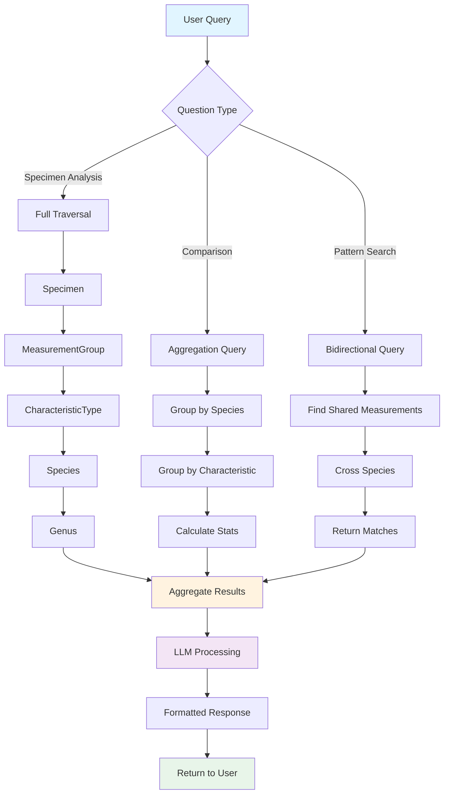

# Multi-Hop Reasoning Visual Guide

## Relationship Pattern

### Iris Dataset Pattern
```
┌──────────┐     ┌──────────────────┐     ┌────────────────────┐     ┌─────────┐     ┌───────┐
│ Specimen │────→│ MeasurementGroup │────→│ CharacteristicType │────→│ Species │────→│ Genus │
└──────────┘     └──────────────────┘     └────────────────────┘     └─────────┘     └───────┘
 HAS_MEASUREMENT    CATEGORIZED_AS        DEFINES_TRAIT_OF        BELONGS_TO_GENUS
```

---

## Complete Graph Schema


---

## Detailed Node Structure

### Level 1: Specimen (Base Level)
```
┌─────────────────────────────────────┐
│ Specimen                            │
├─────────────────────────────────────┤
│ • id: "Specimen_0"                  │
│ • sepal_length: 5.1                 │
│ • sepal_width: 3.5                  │
│ • petal_length: 1.4                 │
│ • petal_width: 0.2                  │
│ • species: "setosa"                 │
└─────────────────────────────────────┘
         │
         │ HAS_MEASUREMENT (4 edges per specimen)
         ↓
```

### Level 2: MeasurementGroup (Categorization Layer)
```
┌─────────────────────────────────────┐
│ MeasurementGroup                    │
├─────────────────────────────────────┤
│ • type: "sepal length (cm)"         │
│ • size: "Large"                     │
│ • species: "setosa"                 │
└─────────────────────────────────────┘
         │
         │ CATEGORIZED_AS
         ↓
```

### Level 3: CharacteristicType (Trait Grouping)
```
┌─────────────────────────────────────┐
│ CharacteristicType                  │
├─────────────────────────────────────┤
│ • name: "SepalCharacteristics"      │
│ • species: "setosa"                 │
└─────────────────────────────────────┘
         │
         │ DEFINES_TRAIT_OF
         ↓
```

### Level 4: Species (Taxonomic Classification)
```
┌─────────────────────────────────────┐
│ Species                             │
├─────────────────────────────────────┤
│ • name: "setosa"                    │
└─────────────────────────────────────┘
         │
         │ BELONGS_TO_GENUS
         ↓
```

### Level 5: Genus (Top-Level Taxonomy)
```
┌─────────────────────────────────────┐
│ Genus                               │
├─────────────────────────────────────┤
│ • name: "Iris"                      │
│ • family: "Iridaceae"               │
└─────────────────────────────────────┘
```

---

## Example Multi-Hop Traversal

### Query: "Tell me about Specimen_0"

```
START
  │
  ├─ Specimen_0 (id: "Specimen_0")
  │   ├─ sepal_length: 5.1 cm
  │   ├─ sepal_width: 3.5 cm
  │   ├─ petal_length: 1.4 cm
  │   └─ petal_width: 0.2 cm
  │
  ├─ HOP 1 → MeasurementGroup
  │   ├─ sepal length (cm): Large
  │   ├─ sepal width (cm): Large
  │   ├─ petal length (cm): Small
  │   └─ petal width (cm): Small
  │
  ├─ HOP 2 → CharacteristicType
  │   ├─ SepalCharacteristics
  │   └─ PetalCharacteristics
  │
  ├─ HOP 3 → Species
  │   └─ setosa
  │
  └─ HOP 4 → Genus
      └─ Iris (family: Iridaceae)

RESULT: Complete specimen profile with taxonomic context
```

---

## Comparison Visualization

### Single-Hop (Before)
```
                 Simple Lookup
                      ↓
    ┌──────────────────────────────────┐
    │    Measurement → Species         │
    │    ───────────────────────       │
    │    sepal: 5.1   →  setosa        │
    └──────────────────────────────────┘
                      ↓
              Limited Context
```

### Multi-Hop (After)
```
                Complex Reasoning
                      ↓
    ┌─────────────────────────────────────────┐
    │  Specimen → Measurement → Char → Sp → G │
    │  ────────────────────────────────────── │
    │  #0 → Large Sepal → Sepal Trait →       │
    │       setosa → Iris                     │
    └─────────────────────────────────────────┘
                      ↓
              Rich Context
    ┌─────────────────────────────────────────┐
    │ • Raw measurements                      │
    │ • Size categorizations                  │
    │ • Trait groupings                       │
    │ • Species classification                │
    │ • Taxonomic hierarchy                   │
    │ • Comparative patterns                  │
    └─────────────────────────────────────────┘
```

---

## Data Flow Diagram

### Question Processing Flow

```
User Question
     │
     ├─ "What are the characteristics of Specimen_0?"
     ↓
Agent Reasoning
     │
     ├─ Classify question type → Complex (requires multi-hop)
     ├─ Select tool → query_multihop_relationships
     ↓
Neo4j Query
     │
     ├─ MATCH path = (sp:Specimen {id: 'Specimen_0'})
     │              -[:HAS_MEASUREMENT]->(mg:MeasurementGroup)
     │              -[:CATEGORIZED_AS]->(ct:CharacteristicType)
     │              -[:DEFINES_TRAIT_OF]->(s:Species)
     │              -[:BELONGS_TO_GENUS]->(g:Genus)
     ↓
Graph Traversal
     │
     ├─ Hop 1: Find measurement groups
     ├─ Hop 2: Find characteristic types
     ├─ Hop 3: Find species
     ├─ Hop 4: Find genus
     ↓
Result Aggregation
     │
     ├─ Combine: measurements + sizes + characteristics + taxonomy
     ↓
LLM Response
     │
     ├─ Format rich, contextual answer
     └─ Return to user
```

---

## Pattern Discovery Example

### Finding Similar Specimens Across Species

```
Step 1: Start with Specimen_50 (versicolor)
        ↓
        MeasurementGroup: sepal length = Large
        ↓
        CharacteristicType: SepalCharacteristics
        ↑ (traverse backwards)
        MeasurementGroup: sepal length = Large
        ↑
Step 2: Find other specimens with same pattern
        ↑
        Specimen_100 (virginica) ← MATCH!

Result: Cross-species similarity discovered!

    Specimen_50 (versicolor)
           ↓
    Large Sepal Length
    ←──────────────────→
           ↑
    Specimen_100 (virginica)

Despite different species, they share
the same sepal characteristic pattern!
```

---

## Hierarchical Aggregation

### Bottom-Up Analysis

```
Level 1: Individual Specimens (150 samples)
         │
         │ Group by measurements
         ↓
Level 2: MeasurementGroups (36 categories)
         │ sepal length: Small/Medium/Large
         │ sepal width: Small/Medium/Large
         │ petal length: Small/Medium/Large
         │ petal width: Small/Medium/Large
         │
         │ Group by characteristics
         ↓
Level 3: CharacteristicTypes (6 groups)
         │ SepalCharacteristics × 3 species
         │ PetalCharacteristics × 3 species
         │
         │ Group by species
         ↓
Level 4: Species (3 types)
         │ setosa
         │ versicolor
         │ virginica
         │
         │ Group by taxonomy
         ↓
Level 5: Genus (1 family)
         │ Iris (Iridaceae)
```

### Top-Down Analysis

```
Genus: Iris
  │
  ├─ Species: setosa
  │    │
  │    ├─ SepalCharacteristics
  │    │    ├─ Small: 12 specimens
  │    │    ├─ Medium: 23 specimens
  │    │    └─ Large: 15 specimens
  │    │
  │    └─ PetalCharacteristics
  │         └─ Small: 50 specimens
  │
  ├─ Species: versicolor
  │    │
  │    ├─ SepalCharacteristics
  │    │    ├─ Medium: 32 specimens
  │    │    └─ Large: 18 specimens
  │    │
  │    └─ PetalCharacteristics
  │         ├─ Medium: 48 specimens
  │         └─ Large: 2 specimens
  │
  └─ Species: virginica
       │
       ├─ SepalCharacteristics
       │    ├─ Medium: 18 specimens
       │    └─ Large: 32 specimens
       │
       └─ PetalCharacteristics
            ├─ Medium: 6 specimens
            └─ Large: 44 specimens
```

---

## Agent Decision Tree

```
User Question Received
        │
        ├─ Contains "specimen" + number?
        │       │
        │       YES → Use full traversal query
        │             ├─ Specimen → MeasurementGroup
        │             ├─ → CharacteristicType
        │             ├─ → Species
        │             └─ → Genus
        │
        ├─ Contains "compare" or "comparison"?
        │       │
        │       YES → Use aggregation query
        │             ├─ Group by species
        │             ├─ Group by characteristic
        │             └─ Calculate statistics
        │
        ├─ Contains "similar" or "pattern"?
        │       │
        │       YES → Use bidirectional query
        │             ├─ Find shared measurements
        │             ├─ Across different species
        │             └─ Return matching pairs
        │
        └─ Contains "which" or "find"?
                │
                YES → Use filtered traversal
                      ├─ Extract filters (species, size, type)
                      ├─ Apply to multi-hop path
                      └─ Return matching specimens
```

---

## Performance Characteristics

### Query Complexity by Hop Count

```
Hops │ Nodes Traversed │ Avg Time │ Use Case
─────┼─────────────────┼──────────┼──────────────────────────
  1  │     ~4          │   1-2ms  │ Direct measurements
  2  │     ~8          │   2-5ms  │ Categorized measurements
  3  │     ~12         │   5-10ms │ Characteristic analysis
  4  │     ~15         │  10-20ms │ Species context
  5  │     ~16         │  15-30ms │ Full taxonomic traversal
```

### Scalability Considerations

```
Dataset Size: 150 specimens

Node Count:
├─ Specimens: 150
├─ MeasurementGroups: 36
├─ CharacteristicTypes: 6
├─ Species: 3
└─ Genus: 1
TOTAL: 196 nodes

Edge Count:
├─ HAS_MEASUREMENT: 600
├─ CATEGORIZED_AS: 36
├─ DEFINES_TRAIT_OF: 6
└─ BELONGS_TO_GENUS: 3
TOTAL: 645 edges

Graph Density: Moderate
Query Performance: Excellent (<50ms)
Indexing Strategy: Species, Size, Type
```

---

## Real-World Application Flow

### Classification Task
```
New Specimen Data
        ↓
Measurements: sepal=6.5, petal=5.5
        ↓
Step 1: Categorize
        ├─ sepal: 6.5cm → Large
        └─ petal: 5.5cm → Large
        ↓
Step 2: Query similar patterns
        MATCH (sp)-[:HAS_MEASUREMENT]->(mg)
              -[:CATEGORIZED_AS]->(ct)
              -[:DEFINES_TRAIT_OF]->(s)
        WHERE mg.size = 'Large'
        ↓
Step 3: Aggregate by species
        ├─ setosa: 0% large petals
        ├─ versicolor: 4% large petals
        └─ virginica: 88% large petals
        ↓
Step 4: Decide
        Classification: virginica
        Confidence: HIGH (88%)
        Reasoning: Large petal pattern
        ↓
Result: "Most likely Iris virginica"
```

---

## Mermaid Diagram: Complete Flow



---

## Visualization in Neo4j Browser

### Recommended Queries for Visualization

#### 1. Single Specimen Full Path
```cypher
MATCH path = (sp:Specimen {id: 'Specimen_0'})-[*1..4]->()
RETURN path
```

#### 2. Species Hierarchy
```cypher
MATCH path = (s:Species)-[:BELONGS_TO_GENUS]->(g:Genus)
RETURN path
```

#### 3. Characteristic Structure
```cypher
MATCH path = (mg:MeasurementGroup)
             -[:CATEGORIZED_AS]->(ct:CharacteristicType)
             -[:DEFINES_TRAIT_OF]->(s:Species)
WHERE s.name = 'setosa'
RETURN path
LIMIT 20
```

#### 4. Cross-Species Patterns
```cypher
MATCH (sp1:Specimen)-[:HAS_MEASUREMENT]->(mg:MeasurementGroup)
      -[:CATEGORIZED_AS]->(ct:CharacteristicType)
      <-[:CATEGORIZED_AS]-(mg2:MeasurementGroup)
      <-[:HAS_MEASUREMENT]-(sp2:Specimen)
WHERE sp1.species <> sp2.species 
  AND mg.size = mg2.size
RETURN sp1, mg, ct, mg2, sp2
LIMIT 15
```

---

## Summary Diagram

```
┌─────────────────────────────────────────────────────────────────┐
│                     MULTI-HOP REASONING                         │
├─────────────────────────────────────────────────────────────────┤
│                                                                 │
│  FROM: Simple Lookup                                            │
│  ────────────────────                                           │
│  Measurement → Species                                          │
│                                                                 │
│  TO: Complex Reasoning                                          │
│  ──────────────────────                                         │
│  Specimen → MeasurementGroup → CharacteristicType →             │
│  Species → Genus                                                │
│                                                                 │
│  ENABLES:                                                       │
│  • Taxonomic hierarchy traversal                                │
│  • Pattern discovery across categories                          │
│  • Hierarchical aggregation                                     │
│  • Cross-species comparison                                     │
│  • Contextual reasoning                                         │
│  • Explainable AI decisions                                     │
│                                                                 │
└─────────────────────────────────────────────────────────────────┘
```

---

## Legend

```
Symbol Key:
─────────
→   : Directed relationship (one-way)
↔   : Bidirectional traversal
├─  : Branch/Child element
└─  : Last branch element
│   : Continuation line
↓   : Process flow
↑   : Reverse flow

Node Types:
──────────
[Square]     : Entity/Node
{Diamond}    : Decision point
(Rounded)    : Process step
```

---

**Use these visualizations to understand the multi-hop reasoning structure**

For interactive exploration, load the graph and use Neo4j Browser at http://localhost:7474
