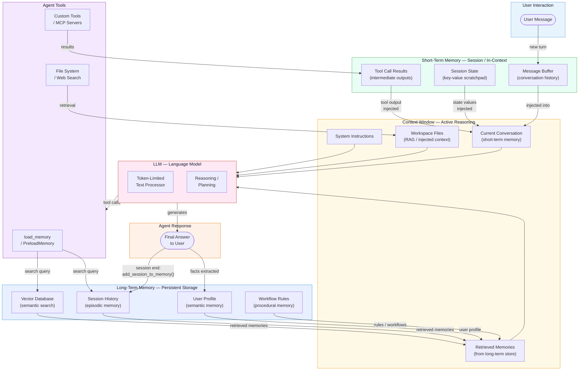

# Context, Memory, and Persistent Data

> A practical guide and code reference for understanding how AI agents use
> **context**, **short-term memory**, and **long-term persistent memory** —
> with runnable Python samples using Google ADK and Microsoft Foundry.

---

## Table of Contents

1. [Introduction](#1-introduction)
2. [Project Structure](#2-project-structure)
3. [What Is Agent Memory?](#3-what-is-agent-memory)
4. [Types of Agent Memory](#4-types-of-agent-memory)
5. [What Is a Context Window?](#5-what-is-a-context-window)
6. [Context Window vs. Agent Memory](#6-context-window-vs-agent-memory)
7. [How Agent Short-Term Memory Works](#7-how-agent-short-term-memory-works)
8. [How Agent Long-Term Memory Works](#8-how-agent-long-term-memory-works)
9. [Information Flow](#9-information-flow)
10. [Memory in VS Code Agents](#10-memory-in-vs-code-agents)
11. [Memory Fits Into the Agent Architecture](#11-memory-fits-into-the-agent-architecture)
12. [Google ADK — Agent Development Kit](#12-google-adk--agent-development-kit)
13. [Microsoft Foundry — Agent Memory](#13-microsoft-foundry--agent-memory)
14. [Memory and Context Frameworks](#14-memory-and-context-frameworks)
15. [What Makes the Best AI Agent Memory Framework?](#15-what-makes-the-best-ai-agent-memory-framework)
16. [How to Implement Memory for Agents](#16-how-to-implement-memory-for-agents)
17. [Use Cases of Agent Memory](#17-use-cases-of-agent-memory)
18. [Memory vs. Context — Comparison Table](#18-memory-vs-context--comparison-table)
19. [Setup — Virtual Environment](#19-setup--virtual-environment)
20. [Running the Samples](#20-running-the-samples)
21. [References](#21-references)

---

## 1. Introduction

AI agents use memory to carry context across sessions and platforms, enabling
them to be more effective and personalised. Without memory, every conversation
starts from a blank slate.

> "Agent memory is what and how your agent remembers information over time.
> What your agent 'remembers' is fundamentally determined by what exists in its
> context window at any given moment."

A production-ready agent memory system operates across three co-operating
layers:

1. **Context window** — active working memory for the current request.
2. **Retrieval layer (RAG)** — access to external knowledge via semantic search.
3. **Persistent memory store** — continuity of user facts and history across sessions.

---

## 2. Project Structure

```
memory/
 ▸ .env.example                       Environment variable template
 ▸ .gitignore                         Excludes binaries, venv, secrets
 ▸ requirements.txt                   Python dependencies
 ▸ README.md                          This file
 ▸ samples/
    ◈ adk/
    ▪ short_term_memory.py            ADK session state demo
    ▪ long_term_memory.py             ADK MemoryService demo
    ▪ README.md
    ◈ foundry/
    ▪ foundry_memory.py               Foundry Memory Store (long-term)
    ▪ foundry_short_term_context.py   Foundry Conversations (short-term)
    ▪ README.md
```

---

## 3. What Is Agent Memory?

Agent memory refers to an AI agent's ability to persist and recall information
from previous interactions.
([Azure Cosmos DB — Agentic Memories](https://learn.microsoft.com/en-us/azure/cosmos-db/gen-ai/agentic-memories))

Key characteristics:

- Agent memory enables AI to **store**, **retrieve**, and **update** information
  across interactions.
- Unlike LLM context windows, it provides **persistent knowledge** through
  short-term memory, long-term memory, and retrieval systems such as vector
  databases and graph databases.
- Memory is a system that remembers information about previous interactions, not
  just what is visible in the current prompt.

LLMs are fundamentally text-in, text-out systems. Their "memory" consists of
whatever exists in their context window at inference time. Agent memory
infrastructure extends this so that relevant facts can be brought *into* the
context window from external stores when needed.

**Recall memory** preserves the history of interactions that can be
searched and retrieved when needed, even when not in the active context window
(i.e., when not in the current message buffer).

Memory in AI agents falls into two categories:

- **Cognitive** — what the agent remembers (facts, events, skills).
- **Scope-based** — who the agent remembers for (user-level, session-level,
  application-level).

---

## 4. Types of Agent Memory

Agent memory is divided into **short-term (episodic or working) memory** and
**long-term memory**. Both can further be classified by the *nature* of the
stored content.

### Memory Types at a Glance

| Type | Lifespan | Where Stored | What It Contains | Example |
|------|----------|-------------|-----------------|----------|
| **Short-Term / Working** | Current session | Context window | Conversation turns, tool results, state variables | Active quiz score |
| **Episodic** | Long-term | Vector DB / session store | Specific past events and interactions | "User deployed on Monday, DB crashed" |
| **Semantic** | Long-term | Vector DB / knowledge base | General facts, rules, user preferences | "User prefers Python and single-quoted strings" |
| **Procedural** | Long-term | Rules store / few-shot examples | Workflows, decision steps, how-to patterns | "Always run tests before building Docker image" |
| **Recall / External** | Long-term | Any searchable archive | Full searchable interaction history | Complete past conversation logs |

### 4.1 Short-Term Memory (In-Context / Session State)

Short-term memory holds recent context that lives only for the duration of an
agent's current operation:

- Recent conversation turns (message buffer).
- State information — quiz progress, form data, intermediate calculation results.
- Results from tool or function calls.

An agent's short-term memory consists of whatever resides in the message buffer;
this content will eventually be discarded when the session ends or the context
window is full.

### 4.2 Long-Term Memory (Persistent Storage)

Long-term memory is more persistent and accumulates knowledge or patterns over
multiple threads or conversations. Long-term memory needs to be searchable by
*meaning*, not just by keyword.

#### 4.2.1 Episodic Memory

Specific past events, conversations, or interactions.

> "Episodic memory answers: what has happened with this client, this process,
> this relationship?"

An agent with strong episodic memory references prior interactions naturally.
In practice, episodic memories are often implemented through few-shot example
prompting, where agents learn from past sequences to perform tasks correctly.

**Example:** "Deployed on Monday, database crashed."

#### 4.2.2 Semantic Memory

General knowledge and domain-specific information — user preferences, rules,
and facts.

> "Semantic memory answers: what is generally true about this domain, this
> process, this policy?"

Note: "Semantic memory" (a psychology term for storing facts and knowledge) is
distinct from "semantic search" (a retrieval technique using embeddings to find
similar content by meaning).

**Example:** "User prefers Python and single-quoted strings."

#### 4.2.3 Procedural Memory

Routines, workflows, decision steps, and how-to knowledge. Procedural memory
manages **behavioral rules** and workflows that improve over time from failures.

**Example:** "When the user asks to deploy, always run tests first, then
build the Docker image, then push."

---

The practical formula:

> *Episodic memory* tells you "this happened before."
> *Semantic memory* tells you "this is generally true."
> Together, they enable predictive, adaptive behaviour.

([Weaviate — Context Engineering](https://weaviate.io/blog/context-engineering))

---

## 5. What Is a Context Window?

A context window in AI agents acts as their **active working memory** —
determining the maximum number of tokens (words or subwords) the model can
"see" and process at once. It includes the current prompt, conversation history,
tool outputs, and instructions.

> "The context window is the model's active workspace, where it holds
> instructions and information for a current task."

([Weaviate — Context Engineering](https://weaviate.io/blog/context-engineering))

When this limit is exceeded, older information is forgotten or truncated, causing
agents to lose track of tasks.

### Context Windows and Attention

Like humans who have limited working memory capacity, LLMs have an "attention
budget" drawn on when parsing large volumes of context. As context length
increases, a model's ability to capture pairwise relationships gets stretched
thin, creating a natural tension between context size and attention focus.

([Anthropic — Effective Context Engineering](https://www.anthropic.com/engineering/effective-context-engineering-for-ai-agents))

When using Anthropic's Claude with extended thinking, all input and output
tokens — including thinking tokens — count toward the context window limit.
([Anthropic — Context Windows](https://platform.claude.com/docs/en/build-with-claude/context-windows))

### Context Engineering

**Context engineering** is the practice of building dynamic systems that provide
the right information and tools, in the right format, so that an AI application
can accomplish a task.
([LangChain — Context Engineering](https://docs.langchain.com/oss/python/concepts/context))

All LLMs are constrained by finite context windows that force hard trade-offs
about what the model can "see" at once.

### Context in Google ADK

In the Google Agent Development Kit (ADK), the context window is managed as an
architectural primitive through:

- **Context Compaction** — condensing older conversation turns rather than
  discarding them.
- **Context Caching / Prefix Caching** — caching frequently reused segments
  (such as long system instructions) at the front of the context window to
  reduce token costs and latency.

([ADK Context Reference](https://adk.dev/context/))
([Google Developers Blog — Architecting Efficient Context-Aware Multi-Agent Frameworks](https://developers.googleblog.com/architecting-efficient-context-aware-multi-agent-framework-for-production/))

### Context in VS Code / GitHub Copilot

Context is everything the model can see when generating a response. It includes
the conversation history, file contents from your workspace, tool outputs,
custom instructions, and any references. By providing the right context, you
can get more relevant and accurate responses from the AI in VS Code.

([VS Code — Context](https://code.visualstudio.com/docs/copilot/concepts/context)) |
([VS Code — Chat Context](https://code.visualstudio.com/docs/copilot/chat/copilot-chat-context))

**Conclusion:** The context window is used for *active reasoning*, while
retrieval provides access to *external knowledge*.

---

## 6. Context Window vs. Agent Memory

The fundamental difference is **architectural**:

- The **context window** is the model's active, token-limited workspace for a single inference call.
  It lives inside the LLM and disappears when the response completes.
- **Agent memory** is an external system outside the model that stores information beyond the context
  limit, makes it searchable, and loads relevant facts selectively into future context windows.

Think of it this way: the context window is what the agent *currently sees*; agent memory is what the
system *stores for later*. Memory is retrieved *into* context — context is not saved as memory unless
the system explicitly extracts and persists it (for example, by calling `add_session_to_memory()` at
session end).

A key practical consequence: if a fact is not in the current context window, the LLM has no knowledge
of it — even if it was discussed in a previous session. Agent memory solves this by bridging sessions.

| Feature | Context Window | Agent Memory |
|---------|---------------|--------------|
| **Duration** | Ephemeral (current request) | Persistent (long-term) |
| **Storage** | Active prompt / context window | Databases, vector stores |
| **Function** | Guiding the current task | Storing knowledge and history |
| **Access** | Active / immediate | Searched / queried |
| **Scope** | One model call | Across sessions and users |
| **Lost when** | Request ends | Explicitly deleted |

A context window is the information the model can see *during* the current
interaction. Agent memory is information the system stores and can bring back
in *future* interactions.

---

## 7. How Agent Short-Term Memory Works

Short-term memory captures context in a **single conversation session** and is
the working buffer for the current task.

### Step-by-Step Lifecycle

1. **Turn received** — the user's message is appended to the message buffer.
2. **Context assembled** — the full buffer (system prompt + conversation history + tool outputs) is
   packed into the context window for the current LLM call.
3. **LLM responds** — the model processes the context and produces a response or issues tool calls.
4. **State updated** — agent tools write intermediate results and variables back to the session
   scratchpad (`ToolContext.state` in ADK, or `conversation` object in Foundry).
5. **Next turn** — the updated buffer (including the latest response and tool results) becomes the
   input for the next call, extending the shared context.
6. **Session ends** — the buffer is discarded, or optionally ingested into long-term memory before
   being cleared (via `add_session_to_memory()` in ADK).

### What It Contains

- The conversation history (human and AI messages).
- Intermediate results from tool calls.
- State variables — form data, progress counters, flags.

### Implementations

- **Message buffer** — the raw list of turns passed to the model.
- **Sliding window** — keep only the last *N* exchanges to control context size.
- **Summarisation** — condense older parts of the conversation into a summary
  injected at the top of the context, allowing the agent to remember key points
  without overwhelming the window.

### ADK Session State

In Google ADK, short-term memory is managed by `SessionService` and stored in
the `Session` object, which contains:

- **Session ID and User ID**
- **Event history** — the full conversation thread.
- **State** — a key-value scratchpad updated by agent tools via `ToolContext`.

State is ephemeral by default. ADK provides **magic key prefixes** (`user:`,
`app:`) to persist simple values across sessions for the same user or
application.

([ADK — Short-Term Memory](https://cloud.google.com/blog/topics/developers-practitioners/remember-this-agent-state-and-memory-with-adk))
([ADK Sessions](https://adk.dev/sessions/session/))

### Foundry Conversations (Short-Term)

In Microsoft Foundry, short-term context is maintained via **Conversation
objects** — durable containers that accumulate message items across turns. Pass
`previous_response_id` to chain responses without a conversation object.

([Microsoft Foundry — Runtime Components](https://learn.microsoft.com/en-us/azure/foundry/agents/concepts/runtime-components?tabs=python))

### LangGraph Short-Term Memory

LangGraph provides in-thread memory with configurable persistence — add
short-term memory as part of your agent's state to enable multi-turn
conversations.

([LangChain — Short-Term Memory](https://docs.langchain.com/oss/python/concepts/memory#short-term-memory))

---

## 8. How Agent Long-Term Memory Works

Long-term memory is **where persistence lives** — it stores what the agent
needs to recall across sessions, decisions, and user lifecycles.

### Step-by-Step Lifecycle

1. **Session completes** — conversation history and session state are available for extraction.
2. **Extract and encode** — key facts, summaries, and events are extracted from the session (by the
   framework or an explicit tool call) and encoded as vector embeddings.
3. **Store** — embeddings or structured facts are written to a persistent store (vector DB, SQL table,
   or managed memory service such as Vertex AI Memory Bank or Foundry Memory Store).
4. **Future session starts** — a new user message triggers a semantic search against the store.
5. **Retrieve and inject** — the most relevant memory entries are injected into the current context
   window as retrieved context, alongside the new conversation turn.
6. **Respond** — the LLM uses the retrieved memories together with the current conversation to
   generate a personalised, context-aware response.
7. **Update** — new facts from the current session are appended to the store, growing the agent's
   knowledge over time.

### Implementing Long-Term Memory

Implementing long-term memory requires solving two problems: **storage** and
**retrieval**.

**Storage options:**

- **Vector databases** — store episodic and semantic memories as embedding
  vectors, enabling semantic similarity search. Examples for production:
  ChromaDB, Pinecone, Weaviate, Qdrant, pgvector (PostgreSQL extension).
  ([Weaviate](https://github.com/weaviate/weaviate))
- **SQL databases** — store structured state, workflow results, and task
  history. ADK supports SQLite, MySQL, and PostgreSQL via
  `DatabaseSessionService`.
- **Managed memory services** — Google Vertex AI Memory Bank, Microsoft Foundry
  Memory Store, Amazon Bedrock AgentCore Memory.

**Retrieval options:**

- **Keyword search** — simple but limited.
- **Vector / semantic search** — find memories by meaning using embedding
  similarity.
- **Metadata filtering** — weight recent and highly relevant memories higher
  than old, generic ones.

### When to Use Long-Term Memory

You probably need long-term memory when:

- The same user comes back repeatedly.
- The agent needs to remember preferences or previous decisions.
- Tasks span multiple sessions.
- The system improves when it learns from earlier outcomes.

### ADK Long-Term Memory — MemoryService

ADK provides `MemoryService` to extract information from completed sessions and
store it in a searchable knowledge archive:

| Service | Persistence | Search | Use Case |
|---------|------------|--------|----------|
| `InMemoryMemoryService` | No (lost on restart) | Keyword | Local prototyping |
| `VertexAiMemoryBankService` | Yes (Cloud) | Semantic / vector | Production agents |
| `VertexAiRagMemoryService` | Yes (Cloud) | Vector similarity | RAG-backed retrieval |

([ADK — Memory: Long-Term Knowledge with MemoryService](https://adk.dev/sessions/memory/))
([ADK on GKE — Agents with Memory](https://colab.research.google.com/github/GoogleCloudPlatform/generative-ai/blob/main/agents/gke/agents_with_memory/get_started_with_memory_for_adk_in_gke.ipynb))

**Workflow:**

1. User interacts with agent → events accumulate in `Session`.
2. At session end, call `memory_service.add_session_to_memory(session)`.
3. In a later session, the agent calls the `load_memory` tool or
   `PreloadMemoryTool` with a search query.
4. `MemoryService.search_memory()` returns relevant `MemoryEntry` objects.
5. The agent uses the retrieved context to formulate a personalised answer.

### Foundry Long-Term Memory — Memory Store

Microsoft Foundry provides a managed **Memory Store** (preview) that enables
agent continuity across sessions, devices, and workflows. It supports:

- **User profile memories** — facts about who the user is and what they prefer.
- **Chat summary memories** — condensed summaries of past conversations.
- **Scope parameter** — isolates each user's memories for privacy.
- **update_delay** — debouncing mechanism that writes memories after a period
  of inactivity.

([Microsoft Foundry — Create and Use Memory](https://learn.microsoft.com/en-us/azure/foundry/agents/how-to/memory-usage?pivots=python))

### Amazon Bedrock AgentCore Memory

Amazon Bedrock AgentCore Memory (generally available as of late 2025) is a
managed service designed to give AI agents persistent memory and deep context
awareness.

([AWS — Building Smarter AI Agents](https://aws.amazon.com/blogs/machine-learning/building-smarter-ai-agents-agentcore-long-term-memory-deep-dive/))
([AWS — Add Memory to Agents](https://docs.aws.amazon.com/bedrock-agentcore/latest/devguide/memory.html))

---

## 9. Information Flow

The following diagram shows how information flows between **context**,
**short-term memory**, **long-term memory**, and the **LLM** during an agent
interaction.



### How to Read This Diagram

1. **User Message** arrives and is added to the **Message Buffer** (short-term
   memory).
2. The **Context Window** is assembled from system instructions, retrieved
   long-term memories, the current conversation, and any injected workspace
   files.
3. The **LLM** reasons over the context window and may issue **Tool Calls**.
4. The `load_memory` / `PreloadMemory` tool queries the **Long-Term Memory
   Store** (vector DB, session history, user profile) and injects results back
   into the context.
5. The **Agent Response** is returned to the user.
6. At session end, the session is ingested into long-term memory so future
   sessions can retrieve it.

---

## 10. Memory in VS Code Agents

> "Agents in Visual Studio Code use memory to retain context across
> conversations. Rather than starting from scratch each session, agents recall
> your preferences, apply lessons from previous tasks, and build up knowledge
> about your codebase over time."

([VS Code — Memory in Agents](https://code.visualstudio.com/docs/copilot/agents/memory))

VS Code supports two complementary memory systems for GitHub Copilot agents:

### 10.1 Memory Tool (Local)

A built-in tool that stores notes locally on your machine, organised in three
scopes:

| Scope | Path | Persistence | Cross-Workspace | Use For |
|-------|------|------------|----------------|---------|
| **User** | `/memories/` | Yes | Yes | Personal preferences, coding patterns |
| **Repository** | `/memories/repo/` | Yes | No (workspace-scoped) | Codebase conventions, build commands |
| **Session** | `/memories/session/` | No (cleared on chat end) | No | Task-specific context, in-progress plans |

**User memory** — the first 200 lines are automatically loaded into the agent's
context at the start of every session, effectively functioning as persistent
long-term memory for personal preferences.

**Repository memory** — stores facts about the specific codebase, such as
architecture decisions, naming conventions, or build commands. Created by
contributors with write access.

**Session memory** — scoped to the current conversation and cleared when it
ends. The built-in Plan agent uses session memory to persist its implementation
plans in a `plan.md` file.

### 10.2 Copilot Memory (GitHub-Hosted)

A GitHub-hosted memory system that lets Copilot agents learn and retain
repository-specific insights automatically:

- **Repository-scoped** — tied to a specific repository.
- **Cross-agent** — what one Copilot agent learns is available to other agents
  (code review, cloud agent, CLI).
- **Verified before use** — agents validate memories against the current
  codebase before applying them.
- **Automatically expired** — deleted after 28 days to avoid outdated
  information.

([GitHub — Enabling and Curating Copilot Memory](https://docs.github.com/copilot/how-tos/use-copilot-agents/copilot-memory))

---

## 11. Memory Fits Into the Agent Architecture

> "For background on how memory fits into the agent architecture, see
> [Agents concepts](https://code.visualstudio.com/docs/copilot/concepts/agents#_memory)."

In the VS Code agent architecture, the agent loop works as follows:

1. **Understand** — the agent reads files, searches the codebase, and looks up
   documentation.
2. **Act** — the agent modifies code, runs terminal commands, and calls
   external services through tools.
3. **Validate** — the agent runs tests and checks for errors, iterating until
   the task is complete.

Memory integrates into this loop at every step:

- **User memory** is loaded automatically into the context at the start of each
  session, providing the agent with personal preferences before any tool calls.
- **Session memory** is read and written during the loop to track in-progress
  work (e.g., the Plan agent's `plan.md`).
- **Repository memory** is queried when the agent needs to understand
  codebase-specific conventions.

**Subagents** are independent AI agents that perform focused subtasks in their
own context windows and return only a summary to the main agent, keeping the
primary context focused and reducing token usage.
([VS Code — Subagents](https://code.visualstudio.com/docs/copilot/agents/subagents))

---

## 12. Google ADK — Agent Development Kit

The [Google Agent Development Kit (ADK)](https://adk.dev/) is a toolkit to
manage agent state, allowing for short-term and long-term memory integration.
It is the primary framework used by the Python samples in this repository.

([ADK Agentic Pattern with Memory and MCP](https://codelabs.developers.google.com/adkcourse/instructions))
([ADK — Agent With Long-Term Memory](https://codelabs.developers.google.com/adkcourse/instructions#7))
([Google Cloud Blog — Remember This: Agent State and Memory with ADK](https://cloud.google.com/blog/topics/developers-practitioners/remember-this-agent-state-and-memory-with-adk))

### ADK Memory Architecture

```
ADK Agent
├── Short-Term (Session)
│   ├── InMemorySessionService      — local, volatile
│   ├── DatabaseSessionService      — SQL (SQLite / PostgreSQL)
│   └── VertexAiSessionService      — Agent Engine cloud service
└── Long-Term (Memory)
    ├── InMemoryMemoryService       — local, keyword search
    ├── VertexAiMemoryBankService   — Vertex AI Memory Bank (semantic)
    └── VertexAiRagMemoryService    — Knowledge Engine (RAG / vector)
```

### ADK Key Concepts

- **Session** — the container for a single conversation; holds event history
  and state.
- **State** — a key-value scratchpad per session; updated by tools via
  `ToolContext`. Use `user:` prefix for values that persist across all sessions
  for the same user.
- **MemoryService** — the interface for storing and searching long-term
  knowledge extracted from completed sessions.
- **`load_memory` tool** — agent-callable tool that issues `search_memory()`
  against the configured `MemoryService`.
- **`PreloadMemoryTool`** — automatically retrieves memories at the start of
  each turn, injecting them into the context without the agent needing to ask.
- **Callbacks** — used to automate memory ingestion (e.g.,
  `after_agent_callback` calls `add_session_to_memory()`).

---

## 13. Microsoft Foundry — Agent Memory

Microsoft Azure AI Foundry (the successor to Azure AI Studio) provides managed
memory for agents through its **Agent Service Memory Store** (preview).

([Microsoft Foundry — Runtime Components](https://learn.microsoft.com/en-us/azure/foundry/agents/concepts/runtime-components?tabs=python))
([Microsoft Foundry — Create and Use Memory](https://learn.microsoft.com/en-us/azure/foundry/agents/how-to/memory-usage?pivots=python))
([Foundry Toolkit in VS Code](https://code.visualstudio.com/docs/intelligentapps/overview#_install-and-setup))

### Foundry Memory Architecture

Microsoft's approach uses two complementary layers:

| Layer | Mechanism | Lifespan |
|-------|-----------|---------|
| **Short-term** | Conversation object + `previous_response_id` | Duration of conversation |
| **Long-term** | Memory Store (MemorySearchPreviewTool) | Persistent across sessions |

### Key Foundry Concepts

- **Agent** — a persisted orchestration definition (model + instructions + tools).
- **Conversation** — a durable object that accumulates message items across
  turns; reusable across sessions.
- **Response** — the agent's output for one interaction; can reference a
  conversation or `previous_response_id` for context chaining.
- **Memory Store** — a managed memory service that extracts and stores user
  preferences and chat summaries.
- **Scope** — the key used to partition memories per user (e.g., `user_123` or
  `{{$userId}}`).
- **update_delay** — seconds of conversation inactivity before memories are
  written to the store.
- **MCP (Model Context Protocol)** — standardises how agents connect to
  external data and tools ("connect once, integrate anywhere").

([Announcing MCP Support in Azure AI Foundry Agent Service](https://devblogs.microsoft.com/foundry/announcing-model-context-protocol-support-preview-in-azure-ai-foundry-agent-service/))

### Knowledge Sources

Connect agents to knowledge bases via:

- **Azure AI Search** — RAG over uploaded files or linked data sources
  (SharePoint, Fabric).
- **MCP servers** — integrate external tools such as Azure DevOps or custom
  APIs.
- **Built-in memory** — retain context across different chat sessions.

([Use Foundry Memory with LangChain and LangGraph](https://learn.microsoft.com/en-us/azure/foundry/how-to/develop/langchain-memory))
([Foundry Agent Framework Samples](https://github.com/microsoft-foundry/foundry-samples/tree/main/samples/python/hosted-agents/agent-framework))

---

## 14. Memory and Context Frameworks

### Dedicated Memory Layers

| Framework | Description | Memory Type |
|-----------|------------|------------|
| **Mem0** | Open-source dedicated memory layer; extracts facts, summarises conversations, and manages user-level or agent-level scope. Achieves 26% higher response accuracy vs. stateless approaches. | Long-term, cross-session |
| **Zep ([Graphiti](https://github.com/getzep/graphiti))** | Production-grade memory server; stores chat history and extracts facts with semantic and temporal search. | Long-term, episodic |
| **Letta (MemGPT)** | Tiered memory architecture (inspired by operating systems); intelligently moves information between immediate context and long-term storage. ([Letta](https://github.com/letta-ai/letta)) | Tiered, long-term |
| **Cognee** | Graph-based memory for vertical AI agents. ([Cognee](https://github.com/topoteretes/cognee)) | Graph-structured |
| **LangChain Memory** | Modular memory module with multiple strategies integrated into the LangChain ecosystem. ([LangChain Memory](https://docs.langchain.com/oss/python/concepts/memory)) | Configurable |
| **LlamaIndex Memory** | Memory capabilities integrated with the LlamaIndex data framework. ([LlamaIndex Memory](https://developers.llamaindex.ai/python/examples/memory/memory/)) | Retrieval-integrated |

### Agent Framework Memory Support

| Framework | Short-Term | Long-Term | Notes |
|-----------|-----------|-----------|-------|
| **Google ADK** | `SessionService` + `State` | `MemoryService` | Full support, Vertex AI integration |
| **Microsoft Foundry** | Conversations API | Memory Store (preview) | Managed cloud service |
| **LangGraph** | In-thread memory | Cross-thread with persistence | Configurable |
| **CrewAI** | ChromaDB (short-term) | SQLite + vector embeddings | Layered out of the box |
| **AutoGen** | Session context | No built-in persistence | Manual implementation required |
| **OpenAI Swarm** | Stateless by design | Not built-in | Stateless by design |

### Vector Databases for Production Memory

Vector databases store information as high-dimensional embeddings (numerical
representations of meaning), enabling agents to search based on semantic
similarity rather than exact keyword matches.

- [Weaviate](https://github.com/weaviate/weaviate) — open-source, cloud-native vector database
- Pinecone — managed vector database service
- ChromaDB — lightweight, embeddable
- Qdrant — high-performance vector search
- pgvector — PostgreSQL extension for vector similarity

---

## 15. What Makes the Best AI Agent Memory Framework?

The right framework depends on what kind of memory your agent actually needs.
There is no single answer — the best framework balances the following concerns:

| Concern | Question to Ask |
|---------|----------------|
| **Persistence** | Does memory survive restarts and redeployments? |
| **Retrieval quality** | Keyword search or semantic vector search by meaning? |
| **Scalability** | How many users and concurrent sessions must it handle? |
| **Latency** | How fast must memory retrieval be per turn? |
| **Privacy / scope** | Are memories fully isolated per user or agent? |
| **Integration** | Does it work with the chosen agent framework and LLM provider? |
| **Complexity** | How much infrastructure and operational burden is acceptable? |
| **Automatic extraction** | Does the framework extract facts automatically, or must you annotate each turn? |
| **Observability** | Can you inspect, edit, and delete individual memories? |
| **Compliance** | Does it support right-to-erasure and audit logging for GDPR or similar? |

### Core Qualities of a Strong Memory Framework

A production-grade agent memory framework should provide:

- **Semantic retrieval** — vector search so the agent can find memories by *meaning*, not just exact
  keywords. This is the single most important capability for useful long-term memory.
- **Automatic fact extraction** — the framework should extract and store key facts from conversations
  without requiring manual annotation for each turn.
- **Per-user scoping** — memories must be partitioned by user identity so one user's preferences
  never appear in another user's context.
- **Configurable TTL / expiry** — memories should have an expiry mechanism to prevent stale
  information from corrupting future responses. GitHub Copilot Memory expires entries after 28 days.
- **Memory CRUD** — the ability to read, update, and delete individual memories is essential for
  compliance (GDPR right to erasure) and for correcting factually incorrect entries.
- **Audit trail** — a tamper-evident log of all memory writes and deletions for regulatory compliance.
- **Graceful degradation** — the system must work correctly (just without personalisation) when the
  memory store is unavailable, rather than failing the entire agent interaction.

### Matching Use Cases to Frameworks

| Use Case | Recommended Approach |
|----------|---------------------|
| Prototype / local development | `InMemoryMemoryService` (ADK) or `ConversationBufferMemory` (LangChain) |
| Production with Google Cloud | `VertexAiMemoryBankService` (ADK) or `VertexAiRagMemoryService` |
| Production with Azure | Microsoft Foundry Memory Store or Azure AI Search + Semantic Kernel |
| Production with AWS | Amazon Bedrock AgentCore Memory |
| Multi-agent shared memory | Mem0 or Zep (Graphiti) — framework-agnostic memory servers |
| Large knowledge base (RAG) | Weaviate, Pinecone, Qdrant, or pgvector + LlamaIndex or LangChain |
| Tiered automatic memory management | Letta (MemGPT) — manages context and long-term tiers automatically |
| Graph-structured domain memory | Cognee — builds knowledge graphs from conversation content |

### Open-Source vs. Managed Services

| | Open-Source (self-hosted) | Managed Cloud Service |
|---|--------------------------|----------------------|
| **Cost** | Infrastructure cost only | Pay-per-use or subscription |
| **Data control** | Full ownership | Vendor-managed |
| **Scalability** | Manual provisioning | Auto-scaling |
| **Maintenance** | You manage upgrades | Vendor-managed |
| **Data residency** | You choose the region | Depends on provider SLA |
| **Examples** | ChromaDB, Weaviate, Letta, Mem0 OSS | Vertex AI Memory Bank, Foundry Memory Store, Bedrock AgentCore |

### Evaluation Benchmarks

- **Needle in a Haystack (NIAH)** — widely used to evaluate long-context
  capabilities of models.
- **[LongMemEval](https://arxiv.org/html/2410.10813v2)** — evaluates long-term
  memory in conversational AI.
- **[LoCoMo](https://arxiv.org/html/2402.17753v1)** — long-conversation memory
  evaluation.
- **[BEAM](https://arxiv.org/pdf/2510.27246)** — benchmarks for memory in
  agentic systems.

---

## 16. How to Implement Memory for Agents

### Choosing Your Memory Strategy

Before implementing, identify which type of memory your agent needs:

| If you need... | Use this approach |
|----------------|------------------|
| Context across turns in one session | Message buffer — built in to any LLM API call |
| Simple state tracking within a session | ADK `SessionService` + `State`, or LangGraph thread state |
| Cross-session recall for the same user | Long-term `MemoryService` + `load_memory` tool |
| RAG over a large document corpus | Vector database (Weaviate, Pinecone, pgvector) |
| Fully managed memory, no infrastructure | Foundry Memory Store / Vertex AI Memory Bank / Bedrock AgentCore |
| Multi-agent shared memory | Shared vector store or memory server (Mem0, Zep) |
| Memory with strict per-user privacy | Scoped memory store with `user_id` key partitioning |
| Tiered automatic memory management | Letta (MemGPT) |

### Short-Term Memory (In-Context Management)

1. **Message buffer** — pass the conversation history into the context on every
   call.
2. **Sliding window** — keep only the last *N* exchanges to respect context
   limits.
3. **Summarisation** — condense older turns into a summary injected at the top
   of the context.
4. **State key templating** (ADK) — use `{state_key}` in the agent prompt; ADK
   injects values from the session state automatically each turn.

### Long-Term Memory (Persistence)

1. **Vector database (RAG)** — store episodic and semantic memories as
   embeddings; retrieve by semantic similarity.
2. **SQL database** — store structured workflow state; suited for procedural
   memory.
3. **Dedicated memory frameworks** — use Mem0, Zep, or Letta to automatically
   extract facts, summarise conversations, and manage scope.
4. **Managed cloud services** — Google Vertex AI Memory Bank, Microsoft Foundry
   Memory Store, Amazon Bedrock AgentCore Memory.

### Best Practices

- **Structure every memory entry** — include `user_id`, `memory_type`
  (semantic vs. episodic), and `timestamp`.
- **Prioritise relevance** — use metadata filtering to weight recent and highly
  relevant memories higher than old, generic ones.
- **Scope memory per user** — never share memories across users without explicit
  design.
- **Implement access controls** — treat memory like sensitive application data.
- **Audit deletions** — record all memory deletions in a tamper-evident trail
  for compliance.

### Microsoft Semantic Kernel / Kernel Memory

Microsoft Semantic Kernel provides a memory abstraction layer that can be
combined with Azure AI Search or other vector stores.
([Semantic Kernel Overview](https://learn.microsoft.com/en-us/semantic-kernel/overview/))

---

## 17. Use Cases of Agent Memory

### Conversational Agents

A customer support chatbot remembers a user's previous issues and preferences,
enabling it to provide more relevant assistance in future interactions.

### Task-Oriented / Workflow Agents

An AI agent orchestrating a multi-step business process (such as invoice
approval) uses memory to track the status of each step and maintain workflow
progress.

### Multi-Agent Systems

A team of AI agents managing a supply chain shares memory to synchronise
inventory levels, anticipate demand, and optimise logistics.

([AWS — AgentCore How It Works](https://docs.aws.amazon.com/bedrock-agentcore/latest/devguide/how-it-works.html))

### The Problem Agents Face Without Memory

Consider an AI agent designed to automate legal contract review. Without
persistent memory, every document is a blank slate — the agent cannot recall:

- That your company uses specific non-standard clauses.
- That the counterparty had issues with similar terms last quarter.
- Your organisation's risk tolerance or negotiation patterns.

([Cognee — Vertical AI Agents](https://docs.cognee.ai/examples/vertical-ai-agents))

**Memory capabilities determine whether agents handle isolated tasks or
persistent, context-aware workflows.**

---

## 18. Memory vs. Context — Comparison Table

| Feature | Memory | Context |
|---------|--------|---------|
| **Duration** | Persistent (long-term) | Ephemeral (short-term) |
| **Storage** | Databases, vector stores | Active prompt / context window |
| **Function** | Storing knowledge and history | Guiding the current task |
| **Access** | Searched / queried | Active / immediate |
| **Scope** | Across sessions | Within one model call |
| **Implementation** | MemoryService, vector DB | Message buffer, token window |

---

## 19. Setup — Virtual Environment

### Prerequisites

- Python 3.10 or later
- `pip` (comes with Python)

### Step 1 — Clone or open the project

```bash
cd /path/to/memory
```

### Step 2 — Create a virtual environment

```bash
python3 -m venv .venv
```

### Step 3 — Activate the virtual environment

```bash
# Linux / macOS
source .venv/bin/activate

# Windows (PowerShell)
.venv\Scripts\Activate.ps1

# Windows (cmd)
.venv\Scripts\activate.bat
```

You should see `(.venv)` in your terminal prompt.

### Step 4 — Install dependencies

```bash
pip install -r requirements.txt
```

### Step 5 — Configure environment variables

Copy the example environment file and fill in your credentials:

```bash
cp .env.example .env
# Edit .env with your editor and fill in the values
```

The `.env` file is excluded from Git via `.gitignore`.

---

## 20. Running the Samples

All commands assume the virtual environment is **activated** (see step 3 above).

### ADK Samples

#### Short-Term Memory

Demonstrates session state (ephemeral, within one conversation):

```bash
export GOOGLE_API_KEY="your-gemini-api-key"
python samples/adk/short_term_memory.py
```

What this script shows:

- An agent tracks quiz progress across turns using ADK session `State`.
- State values are injected into the prompt via `{state_key}` templating.
- At the end, the final state is printed — illustrating the scratchpad.
- State is **not** persisted — a new session starts from zero.

#### Long-Term Memory

Demonstrates `MemoryService` (persistent, across sessions):

```bash
export GOOGLE_API_KEY="your-gemini-api-key"
python samples/adk/long_term_memory.py
```

What this script shows:

- Phase 1: Three facts are stated by the user in separate sessions.
  Each session is ingested into `InMemoryMemoryService`.
- Phase 2: A brand-new session uses the `load_memory` tool to retrieve
  stored facts and answer questions about them.
- Demonstrates the session-boundary crossing that characterises long-term
  memory.

To use Vertex AI Memory Bank instead of the in-process store:

```python
from google.adk.memory import VertexAiMemoryBankService
memory_service = VertexAiMemoryBankService(
    project    = os.getenv("GOOGLE_CLOUD_PROJECT"),
    location   = os.getenv("GOOGLE_CLOUD_LOCATION", "us-central1"),
    agent_engine_id = os.getenv("AGENT_ENGINE_ID"),
)
```

([ADK on GKE — Get Started with Memory](https://colab.research.google.com/github/GoogleCloudPlatform/generative-ai/blob/main/agents/gke/agents_with_memory/get_started_with_memory_for_adk_in_gke.ipynb))

### Foundry Samples

#### Long-Term Memory Store

Requires a configured Microsoft Foundry project. Without credentials, the
script runs in **dry-run mode** and prints the full code walkthrough:

```bash
# With credentials
export FOUNDRY_PROJECT_ENDPOINT="https://<resource>.services.ai.azure.com/api/projects/<project>"
export MEMORY_STORE_CHAT_MODEL_DEPLOYMENT_NAME="gpt-4o"
export MEMORY_STORE_EMBEDDING_MODEL_DEPLOYMENT_NAME="text-embedding-3-small"
python samples/foundry/foundry_memory.py

# Without credentials (dry-run mode)
python samples/foundry/foundry_memory.py
```

What this script shows:

1. Creates a `MemoryStore` with `chat_summary_enabled` and
   `user_profile_enabled`.
2. Creates a prompt agent with `MemorySearchPreviewTool` attached.
3. Session A: the user states a preference ("dark roast coffee in the
   mornings").
4. After `update_delay` seconds of inactivity, memories are extracted and
   stored.
5. Session B (new conversation): the agent recalls the preference and
   personalises its response.
6. Demonstrates a direct `search_memories()` API call.
7. Cleans up the memory store.

#### Short-Term Context (Conversations API)

```bash
export FOUNDRY_PROJECT_ENDPOINT="https://<resource>.services.ai.azure.com/api/projects/<project>"
export FOUNDRY_AGENT_MODEL="gpt-4o"
python samples/foundry/foundry_short_term_context.py
```

What this script shows:

- Session A: the user introduces themselves across three turns. The agent
  maintains context within the `Conversation` object.
- Session B: a fresh `Conversation` is created — the agent does not know the
  user's name, demonstrating that short-term context does not cross session
  boundaries without a memory store.

([Get Started with AI Chat — Azure Samples](https://github.com/Azure-Samples/get-started-with-ai-chat))

---

## 21. References

### VS Code / GitHub Copilot

- [Memory in VS Code Agents](https://code.visualstudio.com/docs/copilot/agents/memory)
- [Agents Concepts — Memory](https://code.visualstudio.com/docs/copilot/concepts/agents#_memory)
- [Context in VS Code](https://code.visualstudio.com/docs/copilot/concepts/context)
- [Copilot Chat Context](https://code.visualstudio.com/docs/copilot/chat/copilot-chat-context)
- [Foundry Toolkit in VS Code](https://code.visualstudio.com/docs/intelligentapps/overview#_install-and-setup)

### Google ADK

- [ADK Context](https://adk.dev/context/)
- [ADK Sessions](https://adk.dev/sessions/session/)
- [ADK State](https://adk.dev/sessions/state/)
- [ADK Memory — MemoryService](https://adk.dev/sessions/memory/)
- [ADK Codelab — Agentic Pattern with Memory and MCP](https://codelabs.developers.google.com/adkcourse/instructions)
- [ADK Codelab — Agent with Long-Term Memory](https://codelabs.developers.google.com/adkcourse/instructions#7)
- [Google Cloud Blog — Remember This: Agent State and Memory with ADK](https://cloud.google.com/blog/topics/developers-practitioners/remember-this-agent-state-and-memory-with-adk)
- [Agents with Memory on GKE (Colab)](https://colab.research.google.com/github/GoogleCloudPlatform/generative-ai/blob/main/agents/gke/agents_with_memory/get_started_with_memory_for_adk_in_gke.ipynb)
- [Google Developers Blog — Architecting Efficient Context-Aware Multi-Agent Frameworks](https://developers.googleblog.com/architecting-efficient-context-aware-multi-agent-framework-for-production/)

### Microsoft Foundry

- [Foundry — Build with Agents, Conversations, and Responses](https://learn.microsoft.com/en-us/azure/foundry/agents/concepts/runtime-components?tabs=python)
- [Foundry — Create and Use Memory (preview)](https://learn.microsoft.com/en-us/azure/foundry/agents/how-to/memory-usage?pivots=python)
- [Foundry — Agent Framework Samples](https://github.com/microsoft-foundry/foundry-samples/tree/main/samples/python/hosted-agents/agent-framework)
- [Foundry — Use Memory with LangChain and LangGraph](https://learn.microsoft.com/en-us/azure/foundry/how-to/develop/langchain-memory)
- [Announcing MCP Support in Azure AI Foundry Agent Service](https://devblogs.microsoft.com/foundry/announcing-model-context-protocol-support-preview-in-azure-ai-foundry-agent-service/)
- [Azure AI + Mem0 Integration](https://devblogs.microsoft.com/foundry/azure-ai-mem0-integration/)
- [Agent Framework Integrations](https://learn.microsoft.com/en-us/agent-framework/integrations/?pivots=programming-language-python)
- [Get Started with AI Chat (Azure Samples)](https://github.com/Azure-Samples/get-started-with-ai-chat)

### Amazon Bedrock

- [Bedrock AgentCore — Long-Term Memory Deep Dive](https://aws.amazon.com/blogs/machine-learning/building-smarter-ai-agents-agentcore-long-term-memory-deep-dive/)
- [Add Memory to Your Amazon Bedrock AgentCore Agent](https://docs.aws.amazon.com/bedrock-agentcore/latest/devguide/memory.html)
- [AgentCore — How It Works](https://docs.aws.amazon.com/bedrock-agentcore/latest/devguide/how-it-works.html)

### Context Engineering

- [Weaviate — Context Engineering: LLM Memory and Retrieval for AI Agents](https://weaviate.io/blog/context-engineering)
- [Anthropic — Effective Context Engineering for AI Agents](https://www.anthropic.com/engineering/effective-context-engineering-for-ai-agents)
- [Anthropic — Context Windows](https://platform.claude.com/docs/en/build-with-claude/context-windows)
- [LangChain — Context Engineering](https://docs.langchain.com/oss/python/concepts/context)

### Memory Frameworks

- [LangChain Memory Overview](https://docs.langchain.com/oss/python/concepts/memory#memory-overview)
- [LangChain — Short-Term Memory](https://docs.langchain.com/oss/python/concepts/memory#short-term-memory)
- [LangChain — Long-Term Memory](https://docs.langchain.com/oss/python/concepts/memory#long-term-memory)
- [LangChain — Add Memory (LangGraph)](https://docs.langchain.com/oss/python/langgraph/add-memory)
- [LlamaIndex Memory Examples](https://developers.llamaindex.ai/python/examples/memory/memory/)
- [Mem0 — Dedicated Memory Layer for AI](https://mem0.ai/)
- [Zep / Graphiti](https://github.com/getzep/graphiti)
- [Letta (MemGPT)](https://github.com/letta-ai/letta)
- [Letta Code Agent](https://github.com/letta-ai/letta-code)
- [Cognee](https://github.com/topoteretes/cognee)
- [Weaviate — Open-Source Vector Database](https://github.com/weaviate/weaviate)

### Azure and Database Resources

- [Azure Cosmos DB — Agentic Memories](https://learn.microsoft.com/en-us/azure/cosmos-db/gen-ai/agentic-memories)
- [Azure Databricks — Stateful Agents](https://learn.microsoft.com/en-us/azure/databricks/generative-ai/agent-framework/stateful-agents)
- [Microsoft Semantic Kernel Overview](https://learn.microsoft.com/en-us/semantic-kernel/overview/)

### Benchmarks

- [LongMemEval](https://arxiv.org/html/2410.10813v2)
- [LoCoMo](https://arxiv.org/html/2402.17753v1)
- [BEAM](https://arxiv.org/pdf/2510.27246)
