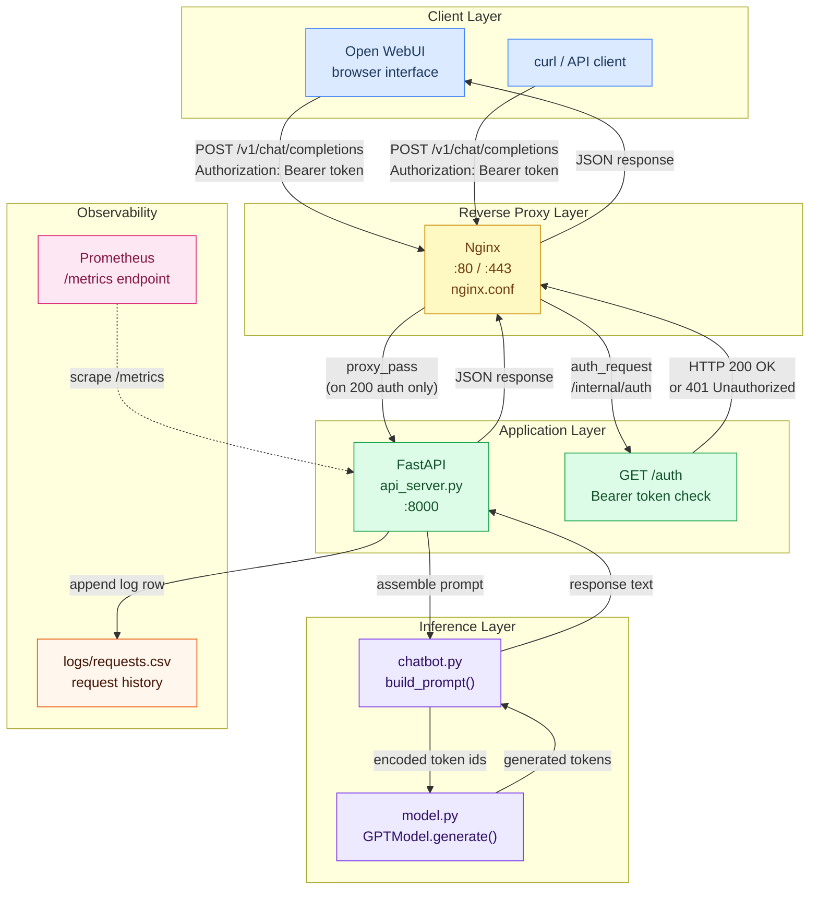
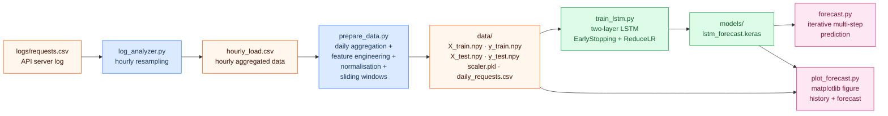
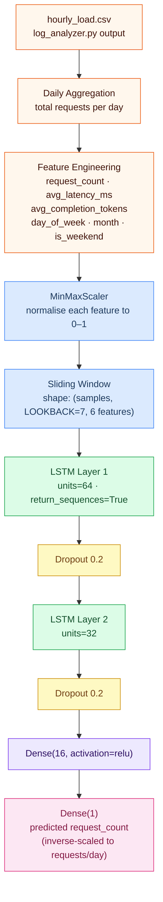

# Models

An Artificial Intelligence (AI) model is a mathematical program designed to recognize patterns, make decisions, or generate content based on the data it was trained on.

Different types of AI and machine learning models:

AI is the overarching concept of machines mimicking human intelligence.

This document covers two primary model types found in modern AI systems:

- **Large Language Models (LLMs)** such as GPT, which are a type of generative AI that are specifically trained on large textual datasets and are designed to produce textual content. LLMs use deep learning architectures, particularly the transformer, to understand and generate human language at scale. For more information, see [What are large language models (LLMs)?](https://azure.microsoft.com/en-us/resources/cloud-computing-dictionary/what-are-large-language-models-llms) and [Understanding Large Language Models](https://magazine.sebastianraschka.com/p/understanding-large-language-models).
- **Machine Learning Models** such as Recurrent Neural Networks (RNNs) and Long Short-Term Memory (LSTM) networks, which are designed to process sequential data and learn temporal patterns. Unlike transformers, RNNs process inputs one step at a time, maintaining a hidden state that acts as a form of memory. LSTMs extend RNNs with gating mechanisms that selectively retain or discard information over long sequences, making them well-suited for time-series forecasting tasks such as predicting service request volumes.

---

## Table of Contents

- [Machine Learning (ML) Models](#machine-learning-ml-models)
  - [The Development Lifecycle](#the-development-lifecycle)
  - [Coding Algorithms](#coding-algorithms)
- [Large Language Models (LLMs)](#large-language-models-llms)
  - [A Pipeline to Build a GPT-Style Model](#a-pipeline-to-build-a-gpt-style-model)
  - [Stage 1: Data Preparation](#stage-1-data-preparation)
  - [Stage 2: Model Architecture](#stage-2-model-architecture)
  - [Stage 3: Pre-training](#stage-3-pre-training)
  - [Stage 4: Fine-Tuning](#stage-4-fine-tuning)
- [Building a Large Language Model from Scratch](#building-a-large-language-model-from-scratch)
  - [Why Build from Scratch](#why-build-from-scratch)
  - [The Three Implementations](#the-three-implementations)
  - [Key Concepts Implemented](#key-concepts-implemented)
- [Project Structure](#project-structure)
- [Virtual Environment Setup on Linux](#virtual-environment-setup-on-linux)
  - [Create the Virtual Environment](#create-the-virtual-environment)
  - [Activate the Virtual Environment](#activate-the-virtual-environment)
  - [Install Dependencies](#install-dependencies)
  - [Deactivate the Virtual Environment](#deactivate-the-virtual-environment)
  - [Using the Setup Script](#using-the-setup-script)
- [Running the Scripts](#running-the-scripts)
  - [Step 1: Pre-train the Base Model](#step-1-pre-train-the-base-model)
  - [Step 2: Fine-tune the Text Classifier](#step-2-fine-tune-the-text-classifier)
  - [Step 3: Run the Chatbot](#step-3-run-the-chatbot)
- [FastAPI Inference Server](#fastapi-inference-server)
  - [Install API Server Dependencies](#install-api-server-dependencies)
  - [Configure the System Prompt](#configure-the-system-prompt)
  - [Run the API Server](#run-the-api-server)
  - [API Endpoints](#api-endpoints)
  - [Test the API with curl](#test-the-api-with-curl)
- [Nginx Reverse Proxy with Authorization](#nginx-reverse-proxy-with-authorization)
  - [How auth_request Works](#how-auth_request-works)
  - [Install and Configure Nginx](#install-and-configure-nginx)
  - [Verify the Proxy](#verify-the-proxy)
- [Open WebUI Chat Frontend](#open-webui-chat-frontend)
  - [Install Open WebUI with Docker](#install-open-webui-with-docker)
  - [Connect Open WebUI to the FastAPI Server](#connect-open-webui-to-the-fastapi-server)
  - [Prompt Format](#prompt-format)
- [Request Logging and Load Prediction](#request-logging-and-load-prediction)
  - [CSV Log Format](#csv-log-format)
  - [Analyzing the Log](#analyzing-the-log)
  - [Preparing Data for RNN and LSTM Training](#preparing-data-for-rnn-and-lstm-training)
- [System Architecture Diagram](#system-architecture-diagram)
- [Service Load Forecasting](#service-load-forecasting)
  - [What is Service Load Forecasting](#what-is-service-load-forecasting)
  - [Forecasting Pipeline](#forecasting-pipeline)
  - [LSTM Model Architecture](#lstm-model-architecture)
  - [Virtual Environment Setup for Forecasting](#virtual-environment-setup-for-forecasting)
  - [Step 1: Prepare the Data](#step-1-prepare-the-data)
  - [Step 2: Train the LSTM Model](#step-2-train-the-lstm-model)
  - [Step 3: Forecast Next Day Usage](#step-3-forecast-next-day-usage)
  - [Step 4: Plot the Forecast](#step-4-plot-the-forecast)
    - [How plot_forecast.py uses the historical CSV data from log_analyzer.py](#how-plot_forecastpy-uses-the-historical-csv-data-from-log_analyzerpy)
  - [Interpreting MAE and RMSE](#interpreting-mae-and-rmse)
- [References](#references)

---

## Machine Learning (ML) Models

Machine Learning is the method of teaching computers to learn from historical data to make predictions.

Machine learning is a subset of AI where systems learn from data and improve over time without being explicitly programmed for a specific task.

Instead of writing hard-coded rules, engineers feed the model data, and the model figures out the rules itself.

ML algorithms analyze massive datasets to identify underlying patterns, which they then use to make predictions or categorize new information.

Examples:

- Classification Models: Sort data into categories, such as an email filter detecting "Spam" vs. "Not Spam."
- Regression Models: Predict continuous values, such as a real estate algorithm estimating a house's price based on square footage and location.

Artificial intelligence (AI) versus machine learning (ML):

Artificial intelligence is a broad field, which refers to the use of technologies to build machines and computers that have the ability to mimic cognitive functions associated with human intelligence, such as being able to understand, and respond to spoken or written language, and more.

Machine learning is a subset of artificial intelligence that automatically enables a machine or system to learn and improve from experience.

For more information, explore the Google Cloud Machine Learning document: https://cloud.google.com/learn/artificial-intelligence-vs-machine-learning

Implementing a machine learning (ML) model from scratch generally follows two paths: building a systemic pipeline using standard libraries like scikit-learn or PyTorch, or coding the core algorithm itself using only basic math and numerical libraries like NumPy.

### The Development Lifecycle

Whether you are using libraries or coding from scratch, the development process follows these standard stages:

- Problem Definition: Identify your goal (e.g., classification, regression, or clustering) and choose your success metrics, such as accuracy or F1-score.
- Data Collection and Preparation: Gather high-quality data from sources like Kaggle or UCI Machine Learning Repository. Clean the data by handling missing values and removing duplicates.
- Exploratory Data Analysis (EDA): Visualize your data using Matplotlib or Seaborn to understand patterns and relationships between features.
- Feature Engineering: Select or create the most relevant features to improve your model's predictive power.
- Data Splitting: Divide your dataset into training and testing sets (typically an 80/20 split) so you can evaluate the model on unseen data.
- Training and Evaluation: Feed the training data into your algorithm and then test its performance against your metrics.
- Deployment and Monitoring: Once satisfied, deploy the model (using tools like FastAPI) and monitor its performance in a live environment.

### Coding Algorithms

To build from the "math up," you bypass high-level libraries and implement the following components yourself using NumPy:

- Weight Initialization: Set initial values for the model's parameters (weights and biases).
- Prediction Function: Create a function that calculates an output based on inputs and current weights (e.g., formula for linear regression).
- Loss Function: Implement a way to measure how far off predictions are from actual values, such as Mean Squared Error.
- Optimization Loop: Use an algorithm like Gradient Descent to calculate derivatives and update weights iteratively until the loss is minimized.

---

## Large Language Models (LLMs)

LLMs are a specific type of machine learning model trained explicitly to handle and generate human text.

An LLM is a highly advanced, specialized type of ML model known as deep learning. It is specifically designed to understand, process, and generate human language.

LLMs use neural networks (specifically "transformers") to analyze the statistical relationships between words.

By ingesting billions of pages of text from books, articles, and websites, they learn context and can predict what word should come next in a sentence.

Examples:

- Google's Gemini: A multimodal model that processes and generates both text and visual inputs.
- Anthropic's Claude: An AI assistant focused on complex reasoning and summarization.

Implementing a large language model from scratch requires building a transformer architecture, processing datasets into numerical vectors, and training the model using machine learning libraries like PyTorch.

### Generative Pre-trained Transformer (GPT)

A transformer model processes data by tokenizing the input and then simultaneously conducting mathematical equations to discover relationships between tokens. Transformer models work with self-attention mechanisms, which enable the models to learn more quickly than traditional models like long short-term memory models. Self-attention is what enables transformer models to capture relationships between words, even those far apart in a sentence, better than older models, primarily by allowing parallel processing of information.

The original GPT paper introduced the popular decoder-style architecture and pretraining via next-word prediction.

The GPT acronym stands for three core concepts:

- **Generative**: The AI's ability to create new, original content rather than just selecting from pre-written answers.
- **Pre-trained**: The model is initially trained on a massive, broad dataset of internet text before it is fine-tuned for specific tasks.
- **Transformer**: The underlying neural network architecture that allows the AI to parse context and relationships between words in a sentence.

### A Pipeline to Build a GPT-Style Model

- Text Tokenization: Map raw text to integers. Convert words or subwords into numerical IDs using a tokenizer (e.g., Byte-Pair Encoding) so the model can process the text.
- Embedding: Convert token IDs into continuous-valued vectors. Add positional embeddings so the model understands word order within a sentence.
- Attention Mechanisms: Implement multi-head self-attention. This allows the model to weigh the importance of different words in a sequence relative to the target word.
- Transformer Block: Stack self-attention layers with feed-forward neural networks. Add layer normalization and residual connections to stabilize training.
- Pre-training: Train the model on a massive corpus (e.g., using unsupervised learning). The model learns by predicting the next token in a sequence and updating its weights via backpropagation.

Implementing a Large Language Model (LLM) from scratch using Python and PyTorch involves four foundational stages: data preparation, model architecture construction (Transformer or GPT-style), pre-training on text corpora, and fine-tuning for specific tasks.

### Stage 1: Data Preparation

Raw text must be converted into numerical representations.

- Tokenization: Break your text corpus down into individual words or subwords. You can build a simple character-level tokenizer or use Byte-Pair Encoding (BPE).
- Integer Mapping: Assign a unique integer to each token in your vocabulary.
- Encoding and Batching: Convert text strings into lists of integers and organize them into sliding window batches (inputs and corresponding targets) to train the model to predict the next word.

### Stage 2: Model Architecture

At the core of an LLM is the decoder-only Transformer block.

- Embedding Layer: Convert the integer tokens into continuous vector representations. Add positional embeddings so the model understands the order of words.
- Self-Attention Mechanism: Compute "Query", "Key", and "Value" matrices to allow the model to weigh the importance of different words in a sequence relative to one another.
- Feed-Forward Neural Networks: Pass the attention outputs through multi-layer perceptrons utilizing layer normalization and dropout for stability.
- Causal Masking: Apply a mask in the attention block so the model can only look at preceding tokens, not future ones.

### Stage 3: Pre-training

This is where the model "learns" language structure.

- Next-Word Prediction: Feed batch sequences into the model and calculate the difference between its prediction and the actual next word using a loss function (e.g., Cross-Entropy Loss).
- Optimization: Use an optimizer like Adam or AdamW to update the neural network's weights to minimize the loss.

### Stage 4: Fine-Tuning

A pre-trained base model is essentially an autocomplete engine. To make it a conversational assistant, you need to fine-tune it:

- Instruction Fine-Tuning: Train the model on prompt-response pairs so it learns to follow human instructions.
- RLHF (Reinforcement Learning from Human Feedback): Align the model's responses to be helpful and safe by scoring its outputs.

---

## Building a Large Language Model from Scratch

This section describes how to implement a small but functional large language model entirely from scratch using Python and PyTorch, without relying on any existing LLM libraries. The approach mirrors the methodology described in "Build a Large Language Model (From Scratch)" by Sebastian Raschka (https://github.com/rasbt/LLMs-from-scratch).

The implementation progresses through three stages: a base language model that predicts the next token in a sequence, a text classifier that fine-tunes the base model to categorize input text, and an instruction-following chatbot that uses prompt templates to simulate conversational behavior.

### Why Build from Scratch

Building an LLM from scratch provides a deep understanding of:

- How tokenization converts raw text into integers the model can process
- How self-attention mechanisms allow the model to relate words to each other
- How the transformer architecture stacks attention and feed-forward layers
- How gradient descent and backpropagation update weights during training
- How fine-tuning repurposes a pretrained base model for a specific downstream task

### The Three Implementations

The source code in `scripts/llm_from_scratch/` provides three runnable Python programs:

**1. Base Language Model (`train.py`)**

The base model is a GPT-style decoder-only transformer. It learns by being trained to predict the next character in a sequence given all previous characters. The model is entirely coded from primitive PyTorch building blocks: `nn.Embedding`, `nn.Linear`, `nn.LayerNorm`, and manual matrix multiplications. No high-level LLM framework or pretrained weights are used.

Components implemented from scratch:

- `CharTokenizer` in `tokenizer.py`: maps every unique character in the training corpus to an integer index and back.
- `MultiHeadSelfAttention` in `model.py`: projects input vectors into query, key, and value spaces; computes scaled dot-product attention across all heads in parallel; applies a causal mask so position `t` can only attend to positions `0..t`.
- `FeedForward` in `model.py`: a two-layer MLP with GELU activation placed after each attention block.
- `TransformerBlock` in `model.py`: combines attention and feed-forward sub-layers with pre-norm layer normalization and residual connections.
- `GPTModel` in `model.py`: stacks multiple transformer blocks, adds token and positional embeddings, and produces logits over the vocabulary.
- Training loop in `train.py`: AdamW optimizer, cosine learning-rate decay, gradient clipping, and checkpoint saving.

**2. Text Classifier (`text_classifier.py`)**

The text classifier fine-tunes the frozen pretrained base model by attaching a small trainable classification head. The base model's weights are not updated; only the new head is trained. The input sequence is mean-pooled across the sequence dimension to produce a single vector, which is passed through a two-layer MLP to output class logits.

This demonstrates a fundamental pattern in modern NLP: pretrain a general language model on a large corpus, then fine-tune a lightweight head on a small labeled dataset for a specific task.

**3. Instruction-Following Chatbot (`chatbot.py`)**

The chatbot demonstrates instruction fine-tuning via a prompt template approach. The pretrained model is loaded and a structured prompt in the form `### Human: <input> ### Assistant:` is prepended to each user message. The model then generates continuation text, which is extracted as the response.

This is the same "transcript hack" technique described by Giles Thomas in his LLM-from-scratch series (https://www.gilesthomas.com/llm-from-scratch). It works because a well-trained language model learns to complete realistic-looking conversational transcripts.

### Key Concepts Implemented

**Causal (Masked) Self-Attention**

Each token position can only attend to tokens at equal or earlier positions. This is enforced by filling the upper triangle of the attention score matrix with negative infinity before the softmax, so those positions receive zero attention weight after normalization.

```
scores = Q @ K.T / sqrt(d_head)
scores[mask == 0] = -inf
attention_weights = softmax(scores)
context_vectors = attention_weights @ V
```

**Multi-Head Attention**

Instead of one large attention computation, the model splits the embedding dimension into `num_heads` smaller subspaces and runs attention independently in each. The outputs are concatenated and projected back to the original dimension. Multiple heads allow the model to attend to different aspects of context simultaneously.

**Residual Connections and Layer Normalization**

Each transformer block adds its output back to its input (`x = x + sublayer(x)`). This residual (shortcut) connection preserves gradient flow through deep networks. Layer normalization is applied before each sub-layer (pre-norm style) to stabilize training.

**Weight Tying**

The token embedding matrix and the final output projection matrix share the same weights. This reduces the parameter count and often improves training because the model uses the same representation space for both encoding and decoding tokens.

**Next-Token Generation**

At inference time the model autoregressively samples one token at a time. Temperature scaling controls the sharpness of the probability distribution. Top-k filtering retains only the `k` most probable tokens before sampling, preventing very low-probability completions.

---

## Project Structure

```
◈ scripts/
  ▸ llm_from_scratch/
      ▪ tokenizer.py          Character-level tokenizer
      ▪ model.py              GPT-style transformer model (all layers from scratch)
      ▪ train.py              Pre-training script (base language model)
      ▪ text_classifier.py    Fine-tuning script (sentiment classifier)
      ▪ chatbot.py            Instruction-following chatbot (CLI)
      ▪ api_server.py         FastAPI inference server (OpenAI-compatible REST API)
      ▪ requirements.txt      Core Python package dependencies (torch, numpy)
      ▪ requirements_api.txt  Additional dependencies for the API server
      ▪ setup_venv.sh         Virtual environment creation and activation script
      ▪ data/                 Training data directory (created automatically)
      ▪ checkpoints/          Saved model checkpoints (created during training)
      ▪ logs/                 Request CSV logs (created by the API server)
  ▸ nginx/
      ▪ nginx.conf            Nginx reverse-proxy site config with auth_request
  ▸ logging/
      ▪ log_analyzer.py       CSV log analyzer and hourly resampler for RNN/LSTM data
  ▸ forecasting/
      ▪ prepare_data.py       Aggregate hourly logs to daily, feature-engineer, normalise
      ▪ train_lstm.py         Build and train the two-layer LSTM forecasting model
      ▪ forecast.py           Load trained model, predict next N days of request counts
      ▪ plot_forecast.py      Render historical usage + forecast figure with matplotlib
      ▪ requirements_forecast.txt  Python dependencies (tensorflow, scikit-learn, etc.)
      ▪ setup_venv_forecast.sh     Virtual environment creation script
      ▪ data/                 Prepared arrays and scaler (created by prepare_data.py)
      ▪ models/               Saved Keras model files (created by train_lstm.py)
      ▪ figures/              Output plots (created by plot_forecast.py)
```

---

## Virtual Environment Setup on Linux

A Python virtual environment isolates the project's dependencies from the system Python installation. All scripts must be run inside the activated virtual environment.

### Create the Virtual Environment

Run the following commands from the `scripts/llm_from_scratch/` directory:

```bash
cd scripts/llm_from_scratch

python3 -m venv venv
```

This creates a `venv/` subdirectory containing an isolated Python interpreter and a private `site-packages` directory.

### Activate the Virtual Environment

```bash
source venv/bin/activate
```

After activation, the shell prompt changes to show `(venv)` at the start, confirming the virtual environment is active. All subsequent `python` and `pip` commands now use the isolated environment.

### Install Dependencies

With the virtual environment active, install the required packages:

```bash
pip install --upgrade pip
pip install -r requirements.txt
```

### Deactivate the Virtual Environment

When you are finished, deactivate the virtual environment to return to the system Python:

```bash
deactivate
```

### Using the Setup Script

A convenience script `setup_venv.sh` automates the creation, activation, and dependency installation steps:

```bash
cd scripts/llm_from_scratch
chmod +x setup_venv.sh
./setup_venv.sh
source venv/bin/activate
```

Note: `./setup_venv.sh` creates and populates the environment, but the `source venv/bin/activate` command must be run separately in the current shell because a subprocess cannot modify the parent shell's environment.

---

## Running the Scripts

All commands below assume the virtual environment is active and you are in the `scripts/llm_from_scratch/` directory.

### Step 1: Pre-train the Base Model

```bash
python train.py
```

This script creates sample training data in `data/train.txt` if none exists, builds and trains a GPT-style model, saves the best checkpoint to `checkpoints/best_model.pt`, and prints a short sample of generated text when training completes.

Training progress is printed every 500 iterations showing train and validation loss. On a CPU-only machine the default configuration (4 layers, 128-dimensional embeddings, 128-token context) completes in a few minutes.

To train on your own text data, replace the contents of `data/train.txt` with any plain-text corpus before running the script.

### Step 2: Fine-tune the Text Classifier

```bash
python text_classifier.py
```

This script loads the checkpoint saved by `train.py`, attaches a classification head, and fine-tunes it on a small sentiment dataset. After training it prints predictions for several example sentences showing "positive" or "negative" labels.

### Step 3: Run the Chatbot

```bash
python chatbot.py
```

This script loads the pretrained model and starts an interactive command-line chat session. Type a message and press Enter to receive a response. Type `exit` or `quit` to stop.

Because the base model is small and trained on limited data, the chatbot's responses will be grammatically plausible but may not be semantically coherent. Training on a larger and more diverse text corpus significantly improves response quality.

Optional arguments:

```bash
python chatbot.py --temperature 0.9 --top-k 50 --max-tokens 300
```

---

## FastAPI Inference Server

`api_server.py` wraps `chatbot.py` in a production-ready REST API using FastAPI and Uvicorn. It exposes an **OpenAI-compatible** `/v1/chat/completions` endpoint so that any client supporting the OpenAI API standard — including Open WebUI — can connect to the self-hosted model without modification.

Key features of the inference server:

- OpenAI-compatible `POST /v1/chat/completions` endpoint
- Bearer-token authentication enforced on every protected route
- Dedicated `GET /auth` endpoint consumed by Nginx's `auth_request` directive
- HTTP access-log middleware that records method, path, status code, and latency for every request
- Persistent CSV request log at `logs/requests.csv` for observability and training data collection
- Prometheus metrics auto-exposed at `/metrics` via `prometheus-fastapi-instrumentator`
- `asyncio.Lock` that serialises inference calls to protect the shared model instance from concurrent access

### Install API Server Dependencies

The API server requires additional packages beyond the core model dependencies. Activate the virtual environment before installing:

```bash
cd scripts/llm_from_scratch
source venv/bin/activate
pip install -r requirements_api.txt
```

The `requirements_api.txt` file adds:

| Package | Purpose |
|---------|---------|
| `fastapi` | Web framework and request routing |
| `uvicorn[standard]` | ASGI server with HTTP/1.1 and WebSocket support |
| `pydantic` | Request and response schema validation |
| `prometheus-fastapi-instrumentator` | Automatic Prometheus metrics at `/metrics` |

### Configure the System Prompt

The system prompt is the instruction given to the model at the start of every conversation. It shapes the assistant's persona and behavior.

You can configure it in three ways, listed from highest to lowest priority:

**1. Per-request system message (highest priority)**

Include a message with `"role": "system"` as the first entry in the `messages` array when calling `/v1/chat/completions`. This overrides the server default for that request only.

**2. Environment variable (server-wide default)**

Set the `SYSTEM_PROMPT` variable before starting the server:

```bash
export SYSTEM_PROMPT="You are a concise technical assistant. Answer in plain text only."
```

**3. Built-in default (fallback)**

If neither of the above is provided, the server uses `"You are a helpful AI assistant."`.

Additional configurable environment variables:

| Variable | Default | Description |
|----------|---------|-------------|
| `CHECKPOINT_PATH` | `checkpoints/best_model.pt` | Path to the trained model checkpoint |
| `API_KEY` | `changeme` | Bearer token that clients must supply |
| `LOG_CSV_PATH` | `logs/requests.csv` | Output path for the request log |
| `TRUSTED_IPS` | `127.0.0.1` | Comma-separated proxy IPs to trust for `X-Forwarded-For` |

Set variables before starting the server. For example:

```bash
export API_KEY="my-secret-token"
export SYSTEM_PROMPT="You are a Python programming expert."
export CHECKPOINT_PATH="checkpoints/best_model.pt"
```

### Run the API Server

All commands below must be run from `scripts/llm_from_scratch/` with the virtual environment active.

**Standalone (development)**

```bash
cd scripts/llm_from_scratch
source venv/bin/activate
uvicorn api_server:app --host 0.0.0.0 --port 8000 --reload
```

`--reload` enables hot-reloading during development; remove it in production.

**Behind Nginx (production)**

When Nginx sits in front of the server, bind only to localhost and enable proxy-header trust so that `X-Forwarded-For` client IPs are read correctly:

```bash
cd scripts/llm_from_scratch
source venv/bin/activate
uvicorn api_server:app --host 127.0.0.1 --port 8000 \
    --proxy-headers --forwarded-allow-ips=127.0.0.1
```

### API Endpoints

| Method | Path | Auth | Description |
|--------|------|------|-------------|
| `GET` | `/health` | None | Liveness probe — returns `{"status":"ok"}` |
| `GET` | `/auth` | Bearer | Internal auth check for Nginx `auth_request` |
| `GET` | `/v1/models` | Bearer | Lists available models |
| `POST` | `/v1/chat/completions` | Bearer | Chat completion (OpenAI-compatible) |
| `GET` | `/metrics` | None\* | Prometheus metrics scrape endpoint |
| `GET` | `/docs` | None | Interactive Swagger UI (FastAPI built-in) |

\* `/metrics` is blocked by Nginx for external clients; it is only accessible from localhost.

### Test the API with curl

Replace `changeme` with the value of `API_KEY`.

**Health check (no auth required):**

```bash
curl http://localhost:8000/health
```

**Chat completion:**

```bash
curl -s http://localhost:8000/v1/chat/completions \
  -H "Authorization: Bearer changeme" \
  -H "Content-Type: application/json" \
  -d '{
    "model": "gpt-local",
    "messages": [
      {"role": "system", "content": "You are a helpful AI assistant."},
      {"role": "user",   "content": "What is a transformer model?"}
    ],
    "max_tokens": 200,
    "temperature": 0.8
  }'
```

**Through Nginx on port 80:**

```bash
curl -s http://localhost/v1/chat/completions \
  -H "Authorization: Bearer changeme" \
  -H "Content-Type: application/json" \
  -d '{
    "model": "gpt-local",
    "messages": [{"role": "user", "content": "Hello!"}]
  }'
```

---

## Nginx Reverse Proxy with Authorization

Using Nginx as a reverse proxy in front of the FastAPI server is the standard production practice for deploying LLM applications. This architecture offloads security, SSL termination, and connection management to a dedicated layer while FastAPI handles only inference.

The configuration in `scripts/nginx/nginx.conf` implements:

- Forwarding of HTTP traffic from port 80 to the FastAPI server on `localhost:8000`
- Bearer-token authorization via the `auth_request` directive
- Long proxy timeouts to accommodate high-latency LLM inference requests
- A public `/health` endpoint that bypasses authentication for load-balancer probes
- A localhost-only `/metrics` endpoint for Prometheus scraping
- Structured access logging with upstream response time

### How auth_request Works

The `auth_request` module delegates authorization decisions to a sub-request:

1. A client sends `POST /v1/chat/completions` with `Authorization: Bearer <token>`.
2. Nginx intercepts the request and issues a lightweight internal sub-request to `/internal/auth`.
3. The sub-request forwards the `Authorization` header to `FastAPI GET /auth`. The real request body is **not** forwarded.
4. FastAPI compares the token against `API_KEY`:
   - Returns `HTTP 200` → Nginx forwards the real request to FastAPI.
   - Returns `HTTP 401` → Nginx returns `401 Unauthorized` to the client immediately.
5. If authorized, Nginx proxies the original request to `http://127.0.0.1:8000`.

This flow means authorization logic lives entirely in Python (FastAPI) while the enforcement gateway is Nginx.

### Install and Configure Nginx

**Install Nginx (Ubuntu / Debian):**

```bash
sudo apt update
sudo apt install nginx
```

**Apply the site configuration:**

```bash
sudo cp scripts/nginx/nginx.conf /etc/nginx/sites-available/llm-server
sudo ln -s /etc/nginx/sites-available/llm-server \
           /etc/nginx/sites-enabled/llm-server

# Disable the default site to avoid port conflicts
sudo rm -f /etc/nginx/sites-enabled/default

# Validate and reload
sudo nginx -t
sudo systemctl reload nginx
```

**Start the FastAPI server bound to localhost:**

```bash
cd scripts/llm_from_scratch
source venv/bin/activate
uvicorn api_server:app --host 127.0.0.1 --port 8000 \
    --proxy-headers --forwarded-allow-ips=127.0.0.1
```

**Enable Nginx to start on boot:**

```bash
sudo systemctl enable nginx
```

### Verify the Proxy

With both Nginx and the FastAPI server running, test the full stack:

```bash
# Should return {"status":"ok"} — no auth required
curl http://localhost/health

# Should return 401 — missing token
curl -s -o /dev/null -w "%{http_code}" http://localhost/v1/chat/completions \
  -H "Content-Type: application/json" \
  -d '{"model":"gpt-local","messages":[{"role":"user","content":"Hi"}]}'

# Should return 200 — correct token
curl -s http://localhost/v1/chat/completions \
  -H "Authorization: Bearer changeme" \
  -H "Content-Type: application/json" \
  -d '{"model":"gpt-local","messages":[{"role":"user","content":"Hi"}]}'
```

---

## Open WebUI Chat Frontend

Open WebUI is a self-hosted, open-source frontend that provides a ChatGPT-like browser interface for models running on your local hardware or a private server. It supports any backend that implements the OpenAI API standard, which the FastAPI inference server satisfies.

Open WebUI website: https://openwebui.com/

Getting started documentation: https://docs.openwebui.com/getting-started/

### Install Open WebUI with Docker

Docker is the recommended installation method. The container connects to the FastAPI server running on the host machine.

**Install Docker (Ubuntu / Debian):**

```bash
sudo apt update
sudo apt install docker.io
sudo systemctl enable --now docker
sudo usermod -aG docker $USER   # allow running docker without sudo (re-login required)
```

**Pull and run the Open WebUI container:**

```bash
docker run -d \
  --name open-webui \
  -p 3000:8080 \
  --add-host=host.docker.internal:host-gateway \
  -e OPENAI_API_BASE_URL="http://host.docker.internal:80/v1" \
  -e OPENAI_API_KEY="changeme" \
  -v open-webui:/app/backend/data \
  --restart always \
  ghcr.io/open-webui/open-webui:main
```

Key flags explained:

| Flag | Purpose |
|------|---------|
| `-p 3000:8080` | Exposes the Open WebUI interface on `http://localhost:3000` |
| `--add-host=host.docker.internal:host-gateway` | Resolves `host.docker.internal` to the host machine inside the container |
| `OPENAI_API_BASE_URL` | Base URL of the FastAPI server (through Nginx on port 80) |
| `OPENAI_API_KEY` | Must match the `API_KEY` environment variable set on the FastAPI server |
| `-v open-webui:/app/backend/data` | Persists chat history and settings in a named Docker volume |

Open the browser at `http://localhost:3000` to access the Open WebUI interface.

**Direct connection (bypassing Nginx, development only):**

If you want to connect directly to the FastAPI server without Nginx, use port 8000:

```bash
docker run -d \
  --name open-webui \
  -p 3000:8080 \
  --add-host=host.docker.internal:host-gateway \
  -e OPENAI_API_BASE_URL="http://host.docker.internal:8000/v1" \
  -e OPENAI_API_KEY="changeme" \
  -v open-webui:/app/backend/data \
  --restart always \
  ghcr.io/open-webui/open-webui:main
```

**Manage the container:**

```bash
docker stop open-webui       # stop
docker start open-webui      # start again
docker logs -f open-webui    # tail logs
docker rm open-webui         # remove container (data volume is preserved)
```

### Connect Open WebUI to the FastAPI Server

After opening `http://localhost:3000`:

1. Create an admin account on the first launch (local account only, not sent anywhere).
2. Navigate to **Settings → Connections → OpenAI API**.
3. Set **API Base URL** to `http://host.docker.internal:80/v1` (or `http://host.docker.internal:8000/v1` for direct).
4. Set **API Key** to the value of `API_KEY` (default: `changeme`).
5. Click **Save**, then click the refresh icon next to the model selector.
6. Select **gpt-local** from the model dropdown.
7. Start a new chat and type a question.

Open WebUI will send requests to the FastAPI inference server using the OpenAI chat completions protocol and display the responses in the browser.

### Prompt Format

The FastAPI server assembles a structured prompt internally from the `messages` array before passing it to the model. The template used is the same one implemented in `chatbot.py`:

```
### System: <system message content>

### Human: <first user message>
### Assistant: <first assistant reply>

### Human: <second user message>
### Assistant: <second assistant reply>

### Human: <current user message>
### Assistant:
```

When using Open WebUI or any OpenAI-compatible client, you do not need to write this template manually. Provide messages in standard OpenAI format:

```json
{
  "model": "gpt-local",
  "messages": [
    {"role": "system",    "content": "You are a concise Python expert."},
    {"role": "user",      "content": "What is a list comprehension?"},
    {"role": "assistant", "content": "A list comprehension is a compact syntax..."},
    {"role": "user",      "content": "Give me an example."}
  ],
  "max_tokens": 200,
  "temperature": 0.8,
  "top_k": 40
}
```

The server extracts the `system` role content and uses it as the system prompt, converts the alternating `user` / `assistant` pairs into conversation history, and appends the final `user` message as the current input.

**Configuring the system prompt in Open WebUI:**

In the Open WebUI interface, click the settings icon inside the chat window and set a **System Prompt**. This value is sent as the first `system` message in every request and overrides the server-side default for that conversation.

---

## Request Logging and Load Prediction

Every request handled by the FastAPI server is logged to a CSV file. This log serves two purposes: operational observability (monitoring latency and error rates) and as a historical dataset for training a time-series prediction model.

### CSV Log Format

The log file is written to `logs/requests.csv` inside `scripts/llm_from_scratch/`. The path can be changed with the `LOG_CSV_PATH` environment variable.

| Column | Type | Description |
|--------|------|-------------|
| `timestamp` | string | UTC timestamp in ISO 8601 format (`2025-06-01T14:32:10Z`) |
| `request_id` | string | Unique identifier for the request (`chatcmpl-abc123`) |
| `client_ip` | string | Client IP address (real IP from `X-Forwarded-For` when behind Nginx) |
| `model` | string | Model name supplied by the client (e.g., `gpt-local`) |
| `messages_json` | string | Full conversation messages as a JSON string |
| `response` | string | Generated assistant response text |
| `prompt_tokens` | int | Number of tokens in the assembled prompt |
| `completion_tokens` | int | Number of tokens in the generated response |
| `latency_ms` | float | End-to-end inference latency in milliseconds |
| `status_code` | int | HTTP response status code |

### Analyzing the Log

The `log_analyzer.py` script reads the raw request log and produces both a console summary and a resampled hourly CSV file.

**Run from the project root** (virtual environment must be active):

```bash
cd scripts/llm_from_scratch
source venv/bin/activate
cd ../..

python scripts/logging/log_analyzer.py \
    --csv  scripts/llm_from_scratch/logs/requests.csv \
    --output scripts/llm_from_scratch/logs/hourly_load.csv
```

Console output example:

```
======================================================
  LLM Inference Server — Request Log Summary
======================================================
  Total requests       : 1,248
  Error responses      : 3  (0.2 %)
  Avg latency          : 842.3 ms
  P95 latency          : 1,923.1 ms
  P99 latency          : 3,411.7 ms
  Total prompt tokens  : 62,400
  Total output tokens  : 24,960
======================================================

Hourly resampled CSV written to: scripts/llm_from_scratch/logs/hourly_load.csv
Rows: 52 hour(s) — load this file into pandas for RNN / LSTM training.
```

### Preparing Data for RNN and LSTM Training

The `hourly_load.csv` file produced by `log_analyzer.py` is formatted for direct use as training data for a time-series prediction model.

**Hourly CSV columns:**

| Column | Description |
|--------|-------------|
| `hour` | UTC hour bucket (`2025-06-01T14:00:00Z`) |
| `request_count` | Total requests in this hour — the **target variable** for prediction |
| `error_count` | Number of failed requests |
| `avg_latency_ms` | Mean end-to-end latency |
| `p95_latency_ms` | 95th-percentile latency |
| `avg_prompt_tokens` | Mean input token count — proxy for conversation complexity |
| `avg_completion_tokens` | Mean output token count — proxy for response length |
| `total_tokens` | Combined prompt + completion tokens — proxy for compute load |

**Loading with pandas:**

```python
import pandas as pd

df = pd.read_csv("logs/hourly_load.csv", parse_dates=["hour"])
df = df.set_index("hour").sort_index()
print(df.head())
```

**Preparing sliding-window sequences for LSTM:**

```python
import numpy as np
from sklearn.preprocessing import MinMaxScaler

features = ["request_count", "avg_latency_ms", "avg_completion_tokens"]
scaler = MinMaxScaler()
scaled = scaler.fit_transform(df[features])

WINDOW = 24  # predict next hour using the past 24 hours

X, y = [], []
for i in range(WINDOW, len(scaled)):
    X.append(scaled[i - WINDOW : i])            # shape: (24, num_features)
    y.append(scaled[i, 0])                       # target: normalized request_count

X = np.array(X)   # shape: (n_samples, 24, num_features)
y = np.array(y)   # shape: (n_samples,)
```

Feed `X` into an LSTM or RNN model (e.g., PyTorch `nn.LSTM`) to predict the next hour's `request_count`. This prediction can be used for capacity planning — for example, pre-warming additional inference workers before a predicted load spike.

**Prometheus metrics** exposed at `/metrics` (via Nginx on localhost) provide real-time request rates, error counts, and histogram percentiles for live monitoring in addition to the historical CSV data.

---

## System Architecture Diagram

The diagram below illustrates the information flow between all components in the deployed system.



---

## Service Load Forecasting

### What is Service Load Forecasting

Service load forecasting is the problem of predicting how many requests a web service will receive in the future based on its observed history.  For a self-hosted chat service this means answering the question: *"Given the last 7 days of request data, how many inference calls should I expect tomorrow?"*

Accurate load predictions let operators:

- **Right-size infrastructure** — scale GPU/CPU capacity up before a predicted surge rather than reacting after the fact.
- **Schedule maintenance windows** — choose low-traffic periods for model reloads or Nginx configuration changes.
- **Detect anomalies** — when observed traffic deviates significantly from the forecast, it signals an incident worth investigating.
- **Capacity planning** — estimate costs weeks in advance by integrating daily forecasts into monthly projections.

The approach used here is a **time-series regression** task.  Rather than classifying traffic as "high" or "low", the model outputs a continuous value (predicted request count) for each future day.

### Forecasting Pipeline

The end-to-end pipeline connects the request log produced by the API server to a trained LSTM model capable of predicting future load:



### LSTM Model Architecture

A **Long Short-Term Memory (LSTM)** network is a type of recurrent neural network designed to learn patterns in sequences.  Unlike a plain RNN, an LSTM cell maintains a separate *cell state* that can carry information over many time steps without suffering from the vanishing-gradient problem.  This makes LSTMs well-suited to weekly and monthly seasonality patterns in service load data.

The model built by `train_lstm.py` is a two-layer stacked LSTM followed by a dense regression head:



**Why two LSTM layers?**  The first layer processes the raw sequence and returns its full output at every time step (`return_sequences=True`).  The second layer refines that output and returns only the final hidden state.  Stacking layers allows the model to learn hierarchical temporal patterns — the first layer captures short-term fluctuations (day-to-day) while the second layer learns longer-range trends (weekly patterns).

**Why Dropout?**  Dropout randomly zeroes a fraction of the LSTM outputs during training.  This prevents the model from memorising specific sequences in the training data (overfitting) and forces it to learn more general patterns that generalise to unseen days.

### Virtual Environment Setup for Forecasting

The forecasting service uses a **separate virtual environment** from the LLM service to avoid dependency conflicts between TensorFlow and PyTorch.

```bash
cd scripts/forecasting
chmod +x setup_venv_forecast.sh
./setup_venv_forecast.sh
source venv/bin/activate
```

To install dependencies manually without the setup script:

```bash
cd scripts/forecasting
python3 -m venv venv
source venv/bin/activate
pip install --upgrade pip
pip install -r requirements_forecast.txt
```

**Always activate the virtual environment before running any forecasting command:**

```bash
source venv/bin/activate
```

### Step 1: Prepare the Data

`prepare_data.py` reads `hourly_load.csv` (written by `log_analyzer.py`) and converts it into training-ready numpy arrays.

```bash
cd scripts/forecasting
source venv/bin/activate

python prepare_data.py
```

If your hourly log is in a different location:

```bash
python prepare_data.py \
    --csv  /path/to/logs/hourly_load.csv \
    --lookback 14 \
    --out-dir  data/
```

| Option | Default | Description |
|---|---|---|
| `--csv` | `../llm_from_scratch/logs/hourly_load.csv` | Path to the hourly aggregated log |
| `--lookback` | `7` | Number of past days used as LSTM input |
| `--test-split` | `0.2` | Fraction of days held out for evaluation |
| `--out-dir` | `data/` | Output directory for arrays and scaler |

The script prints the date range covered and the shapes of the resulting arrays, then saves:

```
data/daily_requests.csv   — human-readable daily aggregation
data/X_train.npy          — training input windows
data/y_train.npy          — training targets
data/X_test.npy           — test input windows
data/y_test.npy           — test targets
data/scaler.pkl           — fitted MinMaxScaler
```

**Minimum data requirement:** at least `lookback + 5` days of request history.  Run the API server and accumulate log data before preparing the dataset.

### Step 2: Train the LSTM Model

`train_lstm.py` loads the prepared arrays, builds the LSTM model, and trains it.

```bash
cd scripts/forecasting
source venv/bin/activate

python train_lstm.py
```

Custom hyperparameters:

```bash
python train_lstm.py \
    --epochs     100 \
    --batch-size  16 \
    --units1      64 \
    --units2      32 \
    --dropout    0.2 \
    --lr         0.001
```

| Option | Default | Description |
|---|---|---|
| `--epochs` | `50` | Maximum training epochs (EarlyStopping may stop earlier) |
| `--batch-size` | `16` | Mini-batch size |
| `--units1` | `64` | Units in the first LSTM layer |
| `--units2` | `32` | Units in the second LSTM layer |
| `--dropout` | `0.2` | Dropout rate after each LSTM layer |
| `--lr` | `0.001` | Initial Adam learning rate |

Training output includes per-epoch loss, validation loss, and learning-rate reductions.  After training completes, the test-set evaluation is printed:

```
============================================
  Test Evaluation
============================================
  MAE  (requests / day) : 12.34
  RMSE (requests / day) : 18.50
============================================

Final model saved : models/lstm_forecast.keras
Training history  : data/train_history.npz
```

### Step 3: Forecast Next Day Usage

`forecast.py` loads the trained model and predicts the next N days of request counts using an iterative approach — each day's prediction becomes part of the input window for the following day.

```bash
cd scripts/forecasting
source venv/bin/activate

# Forecast tomorrow
python forecast.py

# Forecast the next 7 days
python forecast.py --days 7
```

Example output:

```
============================================
  Chat Service Load Forecast
============================================
  2025-07-15  (Tuesday  )  →    1 234 requests / day
  2025-07-16  (Wednesday)  →    1 189 requests / day
  2025-07-17  (Thursday )  →    1 310 requests / day
  2025-07-18  (Friday   )  →    1 402 requests / day
  2025-07-19  (Saturday )  →      876 requests / day
  2025-07-20  (Sunday   )  →      791 requests / day
  2025-07-21  (Monday   )  →    1 150 requests / day
============================================

Forecast saved : data/forecast.csv
```

Notice that weekend days typically show lower predicted load because the model has learned the `is_weekend` feature from historical patterns.

The forecast is also saved to `data/forecast.csv` for use in downstream capacity-planning scripts.

### Step 4: Plot the Forecast

`plot_forecast.py` renders a two-panel matplotlib figure and saves it to disk:

- **Top panel** — full historical daily request counts (blue, shaded) with the N-day forecast (red dashed line with markers).  A vertical dotted line marks the boundary between history and future.
- **Bottom panel** — test-set actual values versus LSTM predictions with error shading, annotated with MAE and RMSE.

```bash
cd scripts/forecasting
source venv/bin/activate

# Save to file only
python plot_forecast.py --days 7 --output figures/forecast.png

# Save and open an interactive window
python plot_forecast.py --days 7 --output figures/forecast.png --show
```

| Option | Default | Description |
|---|---|---|
| `--days` | `7` | Number of future days shown in the top panel |
| `--output` | `figures/forecast.png` | Path to save the PNG figure |
| `--show` | (flag) | Display the figure interactively after saving |

The `figures/` directory is created automatically if it does not exist.

#### How plot_forecast.py uses the historical CSV data from log_analyzer.py

`plot_forecast.py` does **not** read `hourly_load.csv` directly.  Instead it consumes the pre-processed outputs produced by `prepare_data.py`, which itself was fed the hourly CSV from `log_analyzer.py`.  The full data chain is:

```
logs/requests.csv            (written by api_server.py for every inference request)
        │
        ▼  log_analyzer.py
logs/hourly_load.csv         (hourly aggregated: request_count, avg_latency_ms, …)
        │
        ▼  prepare_data.py
data/daily_requests.csv      (daily aggregated totals + temporal features)
data/X_test.npy              (sliding-window test input arrays)
data/scaler.pkl              (fitted MinMaxScaler for inverse-transform)
        │
        ▼
plot_forecast.py             ← reads these three files directly
```

What each file provides to `plot_forecast.py`:

| File | Used for |
|---|---|
| `data/daily_requests.csv` | Historical `request_count` series drawn as the blue shaded line in the **top panel**; also the last `lookback` rows form the initial input window for the future forecast |
| `data/X_test.npy` / `data/y_test.npy` | True and predicted values overlaid in the **bottom panel** (test-set actual vs. LSTM prediction) |
| `data/scaler.pkl` | Inverse-transforms all scaled model outputs back to original request-count units before plotting |

If `prepare_data.py` has not been run yet — which requires `hourly_load.csv` from `log_analyzer.py` — `plot_forecast.py` raises a `FileNotFoundError` and exits.  The required execution order is:

1. Start the API server (`api_server.py`) and accumulate at least `lookback + 5` days of traffic in `logs/requests.csv`.
2. Run `log_analyzer.py` to produce `logs/hourly_load.csv`.
3. Run `prepare_data.py` to produce `data/daily_requests.csv`, the `.npy` arrays, and `data/scaler.pkl`.
4. Run `train_lstm.py` to produce `models/lstm_forecast.keras`.
5. Run `plot_forecast.py` — all prerequisites are now satisfied.

### Interpreting MAE and RMSE

Both metrics measure how far the model's predictions are from the actual values, expressed in the same units as the target (requests per day):

| Metric | Formula | Interpretation |
|---|---|---|
| **MAE** (Mean Absolute Error) | $\frac{1}{n}\sum\|y_i - \hat{y}_i\|$ | Average absolute error across all test days.  Easy to interpret: "on average, off by X requests per day." |
| **RMSE** (Root Mean Squared Error) | $\sqrt{\frac{1}{n}\sum(y_i - \hat{y}_i)^2}$ | Penalises large errors more than MAE.  A higher RMSE relative to MAE means the model makes occasional large mistakes. |

**Guidelines:**

- An MAE below 10 % of the average daily request count is generally considered good for a 1-day-ahead forecast.
- RMSE consistently much higher than MAE suggests a small number of large prediction errors.  Examine those dates for events (outages, spikes) that the model could not have predicted from load history alone.
- Multi-step forecasts (3–7 days) accumulate error.  Check the bottom panel of `plot_forecast.py` to see how accuracy degrades over the test set.

---

## References

Large language model (LLMs) Tutorials https://unsloth.ai/docs/models/tutorials

Lecture 10: inference https://cs336.stanford.edu/lectures/?trace=lecture_10

What data should we train on?
https://github.com/stanford-cs336/lectures/blob/main/lecture_15.pdf

How to train a model given data?
https://cs336.stanford.edu/lectures/?trace=lecture_14

Training a causal language model from scratch https://huggingface.co/learn/llm-course/chapter7/6

Data pipeline: transformation, filtering, deduplication, mixing https://cs336.stanford.edu/lectures/?trace=lecture_14

Fine-tuning: Train the pretrained model on instruction-based datasets so it functions as a conversational assistant.

Build a Large Language Model (From Scratch) https://sebastianraschka.com/llms-from-scratch/

Implement a ChatGPT-like LLM in PyTorch from scratch, step by step
https://github.com/rasbt/LLMs-from-scratch

Working with Text Data https://github.com/rasbt/LLMs-from-scratch/tree/main/ch02

Attention Mechanisms https://github.com/rasbt/LLMs-from-scratch/tree/main/ch03

Implementing a GPT Model https://github.com/rasbt/LLMs-from-scratch/tree/main/ch04

Pretraining on Unlabeled Data https://github.com/rasbt/LLMs-from-scratch/tree/main/ch05

Finetuning for Text Classification https://github.com/rasbt/LLMs-from-scratch/tree/main/ch06

Finetuning to Follow Instructions https://github.com/rasbt/LLMs-from-scratch/tree/main/ch07

LLM from scratch https://www.gilesthomas.com/llm-from-scratch

Lecture 12: evaluation https://cs336.stanford.edu/lectures/?trace=lecture_12

given a model, how "good" is it?

What is LLM & How to Build Your Own Large Language Models? https://www.signitysolutions.com/blog/how-to-build-large-language-models

FastAPI documentation https://fastapi.tiangolo.com/

FastAPI behind a proxy https://fastapi.tiangolo.com/advanced/behind-a-proxy/

FastAPI middleware https://fastapi.tiangolo.com/tutorial/middleware/

Prometheus FastAPI Instrumentator https://github.com/trallnag/prometheus-fastapi-instrumentator

Uvicorn ASGI server https://www.uvicorn.org/

Nginx documentation https://nginx.org/en/docs/

Nginx auth_request module http://nginx.org/en/docs/http/ngx_http_auth_request_module.html

Open WebUI — self-hosted ChatGPT-like interface https://openwebui.com/

Open WebUI getting started https://docs.openwebui.com/getting-started/

Open WebUI Docker quick-start https://docs.openwebui.com/getting-started/quick-start/

OpenAI API reference https://platform.openai.com/docs/api-reference/chat

TensorFlow time-series forecasting tutorial https://www.tensorflow.org/tutorials/structured_data/time_series

Keras Sequential model guide https://keras.io/guides/sequential_model/

Keras LSTM layer reference https://keras.io/api/layers/recurrent_layers/lstm/

scikit-learn MinMaxScaler https://scikit-learn.org/stable/modules/generated/sklearn.preprocessing.MinMaxScaler.html

Time series forecasting with LSTM — Keras examples https://keras.io/examples/timeseries/

Understanding LSTM networks (Colah's blog) https://colah.github.io/posts/2015-08-Understanding-LSTMs/

Matplotlib date formatting https://matplotlib.org/stable/gallery/text_labels_and_annotations/date.html

