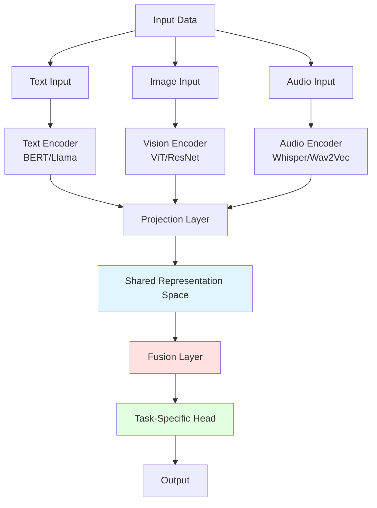
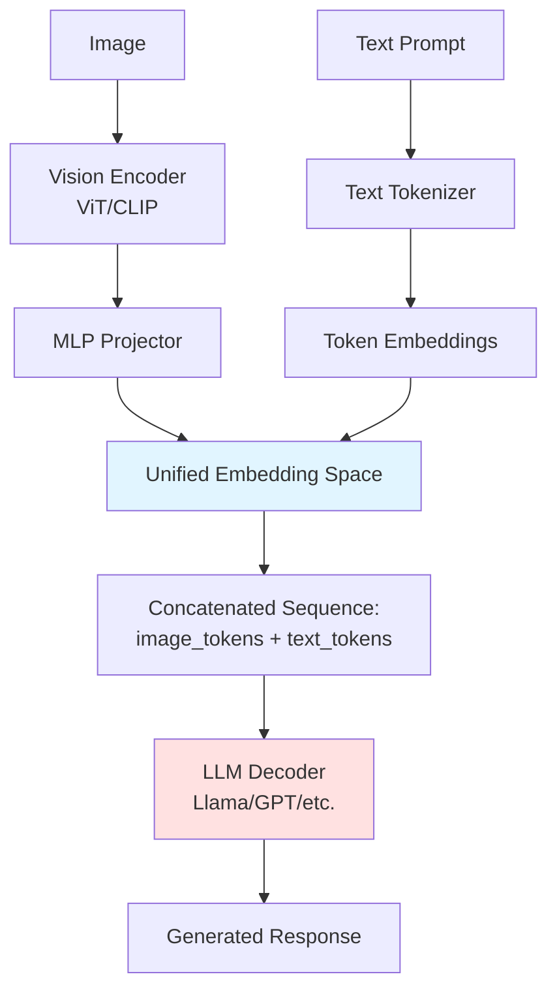
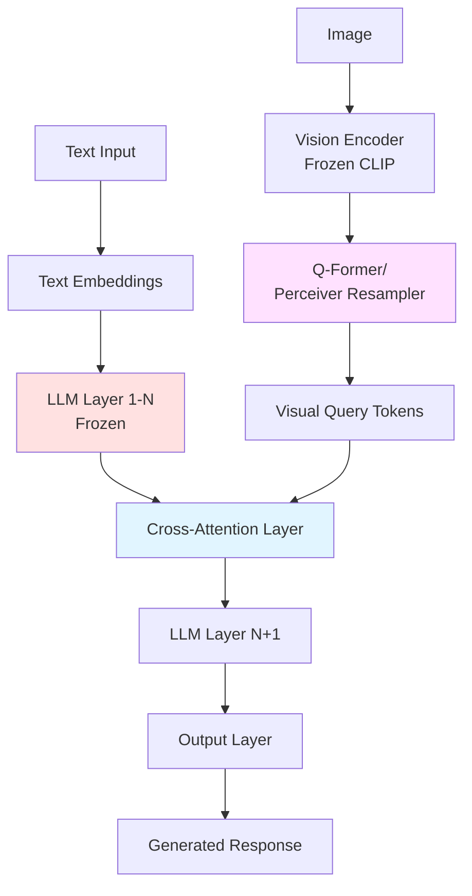
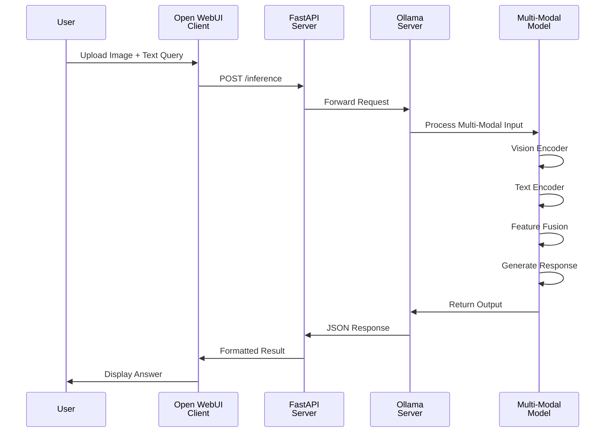
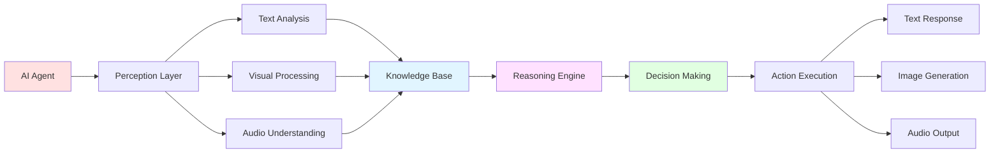
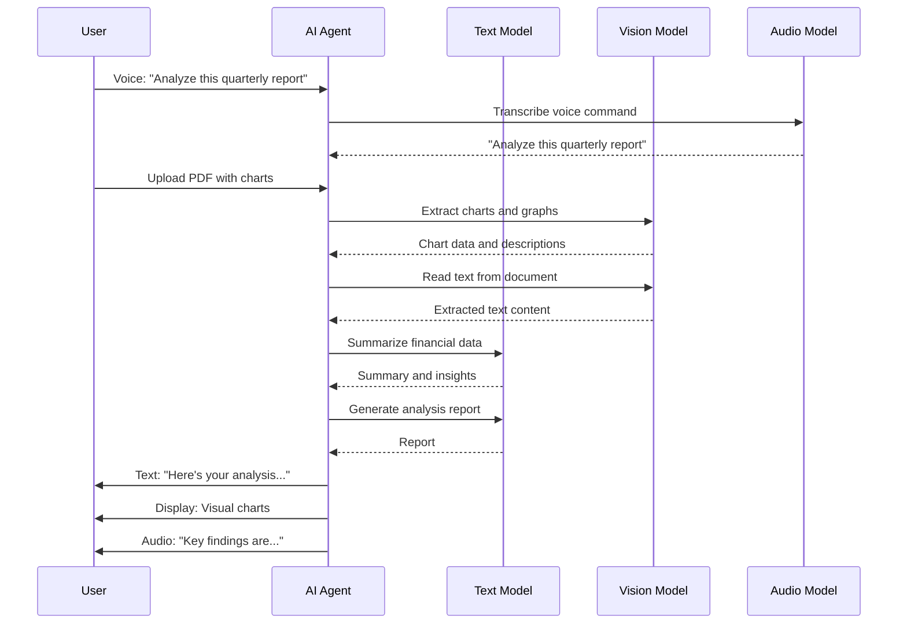

# Multi-Modal Large Language Models: Principles and Practice

This document presents the implementation of a multimodal artificial intelligence system capable of processing and synthesizing text, speech, and image data using lightweight open-source models. The system supports local deployment through Ollama for rapid prototyping and utilizes the vLLM inference engine for scalable, high-performance production environments.

## Table of Contents

- [Introduction](#introduction)
- [Understanding Multi-Modal Models](#understanding-multi-modal-models)
  - [Core Concepts](#core-concepts)
  - [State-of-the-Art Architectural Approaches](#state-of-the-art-architectural-approaches)
    - [Unified Embedding Decoder Architecture](#unified-embedding-decoder-architecture-early-fusion)
    - [Cross-Modality Attention Architecture](#cross-modality-attention-architecture-latehybrid-fusion)
    - [Modern Decoder-Only Structures](#modern-decoder-only-structures)
  - [Architecture Components](#architecture-components)
  - [Data Flow](#data-flow)
- [Project Structure](#project-structure)
- [Prerequisites](#prerequisites)
- [Installation](#installation)
  - [System Requirements](#system-requirements)
  - [Virtual Environment Setup](#virtual-environment-setup)
  - [Ollama Installation](#ollama-installation)
  - [Open WebUI Setup](#open-webui-setup)
- [Multi-Modal Models](#multi-modal-models)
  - [Text Models](#text-models)
  - [Voice Models](#voice-models)
  - [Image Models](#image-models)
- [Usage](#usage)
  - [Testing with Open WebUI](#testing-with-open-webui)
  - [Running Python Scripts](#running-python-scripts)
  - [FastAPI Server](#fastapi-server)
  - [vLLM Inference Engine](#vllm-inference-engine)
- [AI Agents with Multi-Modal Models](#ai-agents-with-multi-modal-models)
  - [How AI Agents Utilize Multi-Modal Data](#how-ai-agents-utilize-multi-modal-data)
  - [Sample Scenario](#sample-scenario)
  - [Running the AI Agent](#running-the-ai-agent)
- [References](#references)

## Introduction

Multi-modal models are AI systems designed to process and synthesize multiple types of data (text, images, audio, and tabular data) simultaneously. Unlike traditional single-modality (unimodal) models, they build a holistic understanding of a subject by extracting and combining complementary insights from diverse data sources.

This project demonstrates practical implementations of multi-modal AI using:
- **Local Ollama server** for model deployment
- **Open WebUI** as the interactive client interface
- **FastAPI** for REST API services
- **Lightweight open-source models** optimized for local execution

## Understanding Multi-Modal Models

### Core Concepts

Multi-modal LLMs extend traditional language models by integrating multiple data modalities into a unified framework. The key innovation lies in their ability to create shared representations across different data types.



### State-of-the-Art Architectural Approaches

Modern multi-modal LLMs employ two fundamental architectural paradigms for fusing visual and textual information. These approaches represent the current state-of-the-art in building production-ready multi-modal systems and are used in leading models like LLaVA, BLIP-2, Flamingo, and GPT-4 Vision.

Reference: [Understanding Multimodal LLMs](https://magazine.sebastianraschka.com/p/understanding-multimodal-llms)

#### Unified Embedding Decoder Architecture (Early Fusion)

**Concept**: Visual patches (or other modality tokens) are translated into the exact same embedding space as text tokens, allowing the model to process them uniformly through a single decoder.

**How It Works**:
1. **Vision Encoder**: Processes images through a Vision Transformer (ViT) or CNN to extract visual features
2. **Projection/Adapter**: An MLP projector maps visual embeddings to match the text embedding dimension
3. **Unified Processing**: Visual tokens are concatenated with text tokens in the same sequence
4. **Single Decoder**: A unified transformer decoder processes the combined token sequence

**Advantages**:
- Simple and elegant architecture
- Tight integration between modalities
- Efficient training and inference
- Natural for autoregressive generation

**Example Models**:
- **LLaVA** (Large Language and Vision Assistant)
- **MiniGPT-4**
- **InstructBLIP**

**Architecture Diagram**:


**Key Characteristic**: The LLM decoder is typically fine-tuned to understand visual tokens as if they were text tokens, enabling seamless multi-modal understanding.

#### Cross-Modality Attention Architecture (Late/Hybrid Fusion)

**Concept**: Keeps the original text-based LLM largely untouched and introduces image features via cross-attention mechanisms in deeper transformer layers.

**How It Works**:
1. **Separate Encoders**: Independent vision and text encoders process their respective inputs
2. **Querying Mechanism**: A learnable set of query tokens (Q-Former) extracts relevant visual features
3. **Cross-Attention Layers**: Inserted into the LLM to allow text representations to attend to visual features
4. **Frozen LLM**: The base language model remains frozen or minimally fine-tuned

**Advantages**:
- Preserves pre-trained LLM capabilities
- Modular design allows model updates independently
- Efficient parameter usage (only train connector components)
- Flexible integration of new modalities

**Example Models**:
- **BLIP-2** with Q-Former (Querying Transformer)
- **Flamingo** with Perceiver Resampler
- **CoCa** (Contrastive Captioners)

**Architecture Diagram**:


**Key Characteristic**: The Q-Former or Perceiver acts as an information bottleneck, compressing visual information into a fixed number of learnable query tokens that the LLM can efficiently process.

#### Modern Decoder-Only Structures

**Current State-of-the-Art**: Leading architectures rely on **decoder-only** transformer structures that have proven most effective for multi-modal tasks.

**Key Components**:

**1. MLP Projectors**:
- Simple multi-layer perceptron networks
- Map visual embeddings to text embedding space
- Used in LLaVA, MiniGPT-4
- Lightweight (2-3 layers typically)
- Example: `vision_embedding → Linear → GELU → Linear → text_embedding`

**2. Querying Transformers (Q-Former)**:
- Introduced in BLIP-2
- Learnable query tokens attend to visual features
- Compresses variable-length visual sequences to fixed-length representations
- Typical architecture: 32-96 learnable queries, 6-12 transformer layers
- More sophisticated than simple projection but highly effective

**3. Perceiver Resampler**:
- Used in Flamingo and other models
- Cross-attention based feature extraction
- Flexible handling of varying visual input sizes
- Enables efficient processing of video frames

**Comparison Table**:

| Approach | Fusion Type | LLM Modified | Visual Compression | Best For |
|----------|-------------|--------------|-------------------|----------|
| **Unified Embedding** (Early) | Early Fusion | Fine-tuned | MLP Projector | Simple deployment, tight integration |
| **Cross-Attention** (Late) | Late/Hybrid Fusion | Mostly Frozen | Q-Former/Perceiver | Preserving LLM capabilities, modularity |
| **Decoder-Only + MLP** | Early Fusion | Fine-tuned | MLP Projector | Resource efficiency, fast inference |
| **Decoder-Only + Q-Former** | Hybrid Fusion | Partially Frozen | Q-Former | SOTA performance, flexibility |

**Why Decoder-Only?**:
1. **Unified Generation**: Single autoregressive model for all modalities
2. **Scalability**: Proven to scale efficiently with model size
3. **Pre-training Benefits**: Leverage massive text-only pre-trained models
4. **Simplicity**: Simpler than encoder-decoder architectures
5. **Performance**: State-of-the-art results on benchmarks

**Modern Model Examples**:
- **LLaVA 1.5/1.6**: Decoder-only Llama + MLP projector
- **BLIP-2**: Frozen vision encoder + Q-Former + Frozen LLM
- **Qwen-VL**: Decoder-only Qwen + cross-attention adapter
- **GPT-4 Vision**: Decoder-only architecture (architecture details not public)

**Implementation Note**: Most production systems use frameworks like vLLM that support efficient multi-modal inference. Reference: [vLLM Multimodal Inputs](https://docs.vllm.ai/en/stable/features/multimodal_inputs/)

### Architecture Components

Implementing a multi-modal model in PyTorch involves three primary components:

**1. Modality Encoders**

Specialized networks for each data type that reduce inputs to fixed-size embedding vectors:
- **Vision**: Vision Transformers (ViT) or ResNets for images
- **Text**: BERT, Llama, or tokenizer-based encoders
- **Audio**: Whisper or Wav2Vec for speech and sound

**2. Feature Fusion**

The stage where separate vector embeddings are combined:
- **Concatenation**: Stacking vectors side-by-side
- **Cross-Attention**: One modality queries another
- **Projection Layers**: Transform encoder outputs into the same dimension

**3. Task-Specific Head**

A Multi-Layer Perceptron (MLP) or classifier layer that processes the fused vector to yield final predictions.

### Data Flow



## Project Structure

```
multi-modal/
├── 📄 README.md                    # This documentation file
├── 📄 requirements.txt             # Python dependencies
├── 📄 .gitignore                   # Git ignore rules
├── 📁 scripts/                     # Python implementation scripts
│   ├── 🐍 text_model.py           # Text processing with Ollama
│   ├── 🐍 voice_model.py          # Audio processing and transcription
│   ├── 🐍 image_model.py          # Image analysis and description
│   ├── 🐍 ai_agent.py             # Langchain-based AI Agent
│   └── 🐍 api_server.py           # FastAPI REST service
├── 📁 venv/                        # Virtual environment (excluded from Git)
└── 📁 models/                      # Downloaded models (excluded from Git)
```

## Prerequisites

### System Requirements

- **Operating System**: Linux (Ubuntu 20.04+ or similar)
- **Python**: 3.9 or higher
- **RAM**: Minimum 8GB (16GB recommended for larger models)
- **Storage**: 10GB+ free space for models
- **Docker**: For running Open WebUI (optional but recommended)

### Software Dependencies

- Ollama server
- Python 3.9+
- pip package manager
- Docker (for Open WebUI)

## Installation

### Virtual Environment Setup

Create and activate a Python virtual environment before executing any commands:

```bash
# Navigate to project directory
cd /home/laptop/EXERCISES/AUTONOMOUS/autonomous-artificial-intelligence/multi-modal

# Create virtual environment
python3 -m venv venv

# Activate virtual environment
source venv/bin/activate

# Upgrade pip
pip install --upgrade pip

# Install required packages
pip install -r requirements.txt
```

**Note**: Always ensure the virtual environment is activated before running scripts or installing packages. Your terminal prompt should show `(venv)` when activated.

### Ollama Installation

Install Ollama on Linux:

```bash
# Download and install Ollama
curl -fsSL https://ollama.com/install.sh | sh

# Verify installation
ollama --version

# Start Ollama service
ollama serve
```

Download lightweight multi-modal models:

```bash
# Text model (lightweight)
ollama pull llama3.2:3b

# Vision model (multi-modal)
ollama pull llava:7b

# Alternative lightweight vision model
ollama pull bakllava:latest

# Check available models
ollama list
```

Reference: [Ollama Library](https://ollama.com/library)

### Open WebUI Setup

Run Open WebUI using Docker to provide a web interface for testing:

```bash
# Pull and run Open WebUI container
docker run -d \
  --name open-webui \
  -p 3000:8080 \
  -v open-webui:/app/backend/data \
  --add-host=host.docker.internal:host-gateway \
  ghcr.io/open-webui/open-webui:main

# Verify container is running
docker ps

# View logs
docker logs open-webui
```

Access Open WebUI:
1. Open browser and navigate to: `http://localhost:3000`
2. Create local administrator account on first visit
3. All data remains on your local machine

Reference: [Open WebUI GitHub](https://github.com/open-webui/open-webui)

## Multi-Modal Models

### Popular State-of-the-Art Models

The following table lists current state-of-the-art multi-modal models available for deployment, showing which architectural approach they use:

| Model | Architecture | Size | Key Features | Availability |
|-------|--------------|------|--------------|--------------|
| **LLaVA 1.6** | Unified Embedding (Early Fusion) + MLP | 7B-34B | Strong VQA, reasoning, instruction following | [Hugging Face](https://huggingface.co/liuhaotian/llava-v1.6-34b) |
| **BLIP-2** | Cross-Attention (Q-Former) + Frozen LLM | 3B-11B | Efficient, zero-shot capabilities | [Hugging Face](https://huggingface.co/Salesforce/blip2-flan-t5-xxl) |
| **LLaVA (Ollama)** | Unified Embedding + Decoder-Only | 7B-13B | Optimized for local deployment | [Ollama Library](https://ollama.com/library/llava) |
| **BakLLaVA** | Unified Embedding + Decoder-Only | 7B | Mistral-based, excellent for local use | [Ollama Library](https://ollama.com/library/bakllava) |
| **Qwen-VL** | Decoder-Only + Cross-Attention | 7B-72B | Multilingual, strong OCR | [Hugging Face](https://huggingface.co/Qwen/Qwen-VL) |
| **Flamingo** | Cross-Attention (Perceiver) | 3B-80B | Few-shot learning, video support | Research Model |
| **InstructBLIP** | Unified Embedding + Instruction Tuning | 7B-13B | Instruction-following vision tasks | [Hugging Face](https://huggingface.co/Salesforce/instructblip-vicuna-7b) |
| **MiniGPT-4** | Unified Embedding + Decoder-Only | 7B-13B | GPT-4 like vision capabilities | [GitHub](https://github.com/Vision-CAIR/MiniGPT-4) |
| **GPT-4 Vision** | Decoder-Only (proprietary) | Unknown | Commercial SOTA | OpenAI API |

**For Local Deployment with Ollama**:

```bash
# Download models optimized for local use
ollama pull llava:7b          # LLaVA - 4.5GB
ollama pull llava:13b         # Larger variant - 8GB
ollama pull bakllava:latest   # BakLLaVA (Mistral-based) - 4.5GB
ollama pull llava:34b         # Most capable variant - 20GB

# Check available vision models
ollama list | grep llava
```

**Architecture Comparison for Local Deployment**:

- **Unified Embedding Models** (LLaVA, BakLLaVA): 
  - Pros: Single model, efficient inference, easy deployment
  - Cons: Requires fine-tuning entire model
  - Best for: Local deployment, resource-constrained environments

- **Cross-Attention Models** (BLIP-2):
  - Pros: Modular, can update components independently
  - Cons: More complex inference pipeline
  - Best for: When preserving base LLM is critical

**Selecting a Model**:

| Use Case | Recommended Model | Reason |
|----------|------------------|---------|
| Local experimentation | `llava:7b` | Good balance of capability and size |
| Best local performance | `llava:34b` | Highest quality (requires 32GB+ RAM) |
| Lightweight deployment | `bakllava:latest` | Mistral-based, efficient |
| OCR and document analysis | `Qwen-VL` | Strong text recognition |
| Production API | `GPT-4 Vision` or `vLLM + LLaVA` | Reliability and scalability |

Explore more models: [Hugging Face Models Hub](https://huggingface.co/models?pipeline_tag=image-text-to-text&sort=trending)

### Text Models

Text models process natural language queries and generate human-like responses. The implementation uses Ollama's API to interact with local language models.

**Supported Tasks**:
- Text generation and completion
- Question answering
- Summarization
- Translation

**Example Usage**:
```bash
# Activate virtual environment first
source venv/bin/activate

# Run text model script
python scripts/text_model.py
```

### Voice Models

Voice models handle audio input through speech-to-text transcription and can generate audio responses. The implementation combines audio processing libraries with language models.

**Supported Tasks**:
- Speech-to-text transcription
- Voice command processing
- Audio analysis
- Text-to-speech synthesis

**Example Usage**:
```bash
# Activate virtual environment
source venv/bin/activate

# Run voice model script
python scripts/voice_model.py --audio sample.wav
```

### Image Models

Image models analyze visual content and generate descriptions, answer questions about images, or extract information from graphics.

**Supported Tasks**:
- Image description and captioning
- Visual question answering
- Object detection and recognition
- Text extraction from images (OCR)

**Example Usage**:
```bash
# Activate virtual environment
source venv/bin/activate

# Run image model script
python scripts/image_model.py --image photo.jpg --prompt "Describe this image"
```

## Usage

### Testing with Open WebUI

Open WebUI provides an interactive interface for testing multi-modal models:

**Step 1: Access the Web Interface**
```bash
# Ensure Ollama is running
ollama serve

# Open browser to
http://localhost:3000
```

**Step 2: Select Multi-Modal Model**
- Locate the top-left dropdown menu
- Select your downloaded multi-modal model (e.g., `llava:7b` or `bakllava:latest`)

**Step 3: Test Text Processing**
- Type a text query in the chat box
- Press Enter to get a response
- The model processes text through the Ollama API

**Step 4: Test Image Processing**
- Click the paperclip/plus (+) icon in the chat box
- Attach a local image file
- Type a prompt such as:
  - "Describe this image in detail"
  - "Extract the text from this graphic"
  - "What objects do you see in this image?"
  - "Answer this question based on the image: [your question]"

**Step 5: Observe Results**
- The multi-modal model processes both text and image
- Responses demonstrate the model's vision capabilities
- All processing happens locally on your machine

Reference: [Ollama Multimodal Models](https://ollama.com/blog/multimodal-models)

### Running Python Scripts

Each script in the `scripts/` folder demonstrates different multi-modal capabilities:

**Text Processing**:
```bash
source venv/bin/activate
python scripts/text_model.py
```

**Voice Processing**:
```bash
source venv/bin/activate
python scripts/voice_model.py --audio path/to/audio.wav
```

**Image Processing**:
```bash
source venv/bin/activate
python scripts/image_model.py --image path/to/image.jpg --prompt "What is in this image?"
```

### FastAPI Server

The FastAPI server provides REST API endpoints for programmatic access to multi-modal models:

**Start the Server**:
```bash
# Activate virtual environment
source venv/bin/activate

# Run the FastAPI server
python scripts/api_server.py
```

**API Endpoints**:
- `POST /text`: Process text-only requests
- `POST /image`: Process image with text prompt
- `POST /audio`: Process audio input
- `GET /health`: Check server status

**Example API Call**:
```bash
# Test text endpoint
curl -X POST "http://localhost:8000/text" \
  -H "Content-Type: application/json" \
  -d '{"prompt": "Explain quantum computing"}'

# Test image endpoint
curl -X POST "http://localhost:8000/image" \
  -F "image=@photo.jpg" \
  -F "prompt=Describe this image"
```

Access API documentation at: `http://localhost:8000/docs`

### vLLM Inference Engine

vLLM is a high-performance inference engine optimized for large language models and multi-modal models. It provides state-of-the-art serving throughput with features like PagedAttention, continuous batching, and optimized CUDA kernels.

Reference: [Welcome to vLLM](https://docs.vllm.ai/en/stable/usage/)

#### Why Use vLLM for Multi-Modal Models?

**Performance Benefits**:
- **High Throughput**: Up to 24x higher throughput compared to standard inference
- **PagedAttention**: Efficient KV cache management reducing memory waste
- **Continuous Batching**: Dynamic batching for optimal GPU utilization
- **Optimized Kernels**: Custom CUDA kernels for faster attention computation
- **Tensor Parallelism**: Distribute large models across multiple GPUs

**Multi-Modal Support**:
- Native support for vision-language models (VLMs)
- Efficient image encoding and processing
- Seamless integration with popular models (LLaVA, BLIP-2, Qwen-VL)
- Support for multiple images per request
- Video frame processing capabilities

**Production-Ready Features**:
- OpenAI-compatible API server
- Streaming responses
- Concurrent request handling
- Quantization support (AWQ, GPTQ, SqueezeLLM)
- Speculative decoding for faster generation

#### Installation

Install vLLM in your virtual environment:

```bash
# Activate virtual environment
source venv/bin/activate

# Install vLLM (requires CUDA 11.8 or higher)
pip install vllm

# For specific CUDA version (example for CUDA 12.1)
pip install vllm --extra-index-url https://download.pytorch.org/whl/cu121

# Verify installation
python -c "import vllm; print(vllm.__version__)"
```

**System Requirements**:
- Linux operating system
- Python 3.9-3.12
- GPU: NVIDIA GPU with compute capability 7.0+ (V100, T4, A100, RTX series)
- CUDA 11.8 or higher
- Minimum 16GB GPU memory (for 7B models)

#### Local Deployment with vLLM

**1. Serving a Multi-Modal Model**

Start a vLLM server with a vision-language model:

```bash
# Activate virtual environment
source venv/bin/activate

# Serve LLaVA model (requires downloading model first)
python -m vllm.entrypoints.openai.api_server \
  --model llava-hf/llava-1.5-7b-hf \
  --port 8000 \
  --trust-remote-code

# Alternative: Serve with specific GPU and memory settings
python -m vllm.entrypoints.openai.api_server \
  --model llava-hf/llava-1.5-7b-hf \
  --port 8000 \
  --gpu-memory-utilization 0.9 \
  --max-model-len 2048 \
  --trust-remote-code
```

**Supported Multi-Modal Models**:
```bash
# LLaVA 1.5 (7B, 13B variants)
--model llava-hf/llava-1.5-7b-hf
--model llava-hf/llava-1.5-13b-hf

# LLaVA Next (LLaVA 1.6)
--model llava-hf/llava-v1.6-mistral-7b-hf
--model llava-hf/llava-v1.6-vicuna-7b-hf

# Qwen-VL (Vision Language)
--model Qwen/Qwen-VL-Chat
--model Qwen/Qwen2-VL-7B-Instruct

# BLIP-2
--model Salesforce/blip2-opt-2.7b

# InstructBLIP
--model Salesforce/instructblip-vicuna-7b
```

**2. Making API Requests**

Once the server is running, interact with it using OpenAI-compatible API:

**Python Client Example**:
```python
from openai import OpenAI
import base64

# Initialize client pointing to vLLM server
client = OpenAI(
    base_url="http://localhost:8000/v1",
    api_key="dummy-key"  # vLLM doesn't require authentication by default
)

# Text-only request
response = client.chat.completions.create(
    model="llava-hf/llava-1.5-7b-hf",
    messages=[
        {"role": "user", "content": "Explain the concept of neural networks"}
    ],
    max_tokens=512
)
print(response.choices[0].message.content)

# Multi-modal request with image
def encode_image(image_path):
    with open(image_path, "rb") as image_file:
        return base64.b64encode(image_file.read()).decode('utf-8')

image_base64 = encode_image("path/to/image.jpg")

response = client.chat.completions.create(
    model="llava-hf/llava-1.5-7b-hf",
    messages=[
        {
            "role": "user",
            "content": [
                {"type": "text", "text": "What's in this image?"},
                {
                    "type": "image_url",
                    "image_url": {
                        "url": f"data:image/jpeg;base64,{image_base64}"
                    }
                }
            ]
        }
    ],
    max_tokens=512
)
print(response.choices[0].message.content)
```

**cURL Example**:
```bash
# Text-only request
curl http://localhost:8000/v1/chat/completions \
  -H "Content-Type: application/json" \
  -d '{
    "model": "llava-hf/llava-1.5-7b-hf",
    "messages": [
      {"role": "user", "content": "Describe quantum computing"}
    ]
  }'

# Multi-modal request with image URL
curl http://localhost:8000/v1/chat/completions \
  -H "Content-Type: application/json" \
  -d '{
    "model": "llava-hf/llava-1.5-7b-hf",
    "messages": [
      {
        "role": "user",
        "content": [
          {"type": "text", "text": "What is in this image?"},
          {
            "type": "image_url",
            "image_url": {"url": "https://example.com/image.jpg"}
          }
        ]
      }
    ]
  }'
```

**3. Advanced Configuration**

**Quantization for Memory Efficiency**:
```bash
# Serve with AWQ quantization (reduces memory by ~50%)
python -m vllm.entrypoints.openai.api_server \
  --model llava-hf/llava-1.5-7b-hf \
  --quantization awq \
  --port 8000
```

**Multi-GPU Deployment**:
```bash
# Tensor parallelism across 2 GPUs
python -m vllm.entrypoints.openai.api_server \
  --model llava-hf/llava-1.5-13b-hf \
  --tensor-parallel-size 2 \
  --port 8000
```

**Custom Sampling Parameters**:
```python
response = client.chat.completions.create(
    model="llava-hf/llava-1.5-7b-hf",
    messages=[...],
    temperature=0.7,
    top_p=0.9,
    max_tokens=1024,
    stream=True  # Enable streaming
)

# Stream the response
for chunk in response:
    if chunk.choices[0].delta.content:
        print(chunk.choices[0].delta.content, end='', flush=True)
```

**4. Batch Processing with vLLM**

For processing multiple images efficiently:

```python
from vllm import LLM, SamplingParams
from vllm.multimodal import MultiModalInputs

# Initialize LLM
llm = LLM(
    model="llava-hf/llava-1.5-7b-hf",
    trust_remote_code=True,
    max_model_len=2048
)

# Prepare batch of prompts with images
prompts = [
    "Describe this image in detail.",
    "What objects are visible in this image?",
    "Extract any text from this image."
]

# Load images
from PIL import Image
images = [
    Image.open("image1.jpg"),
    Image.open("image2.jpg"),
    Image.open("image3.jpg")
]

# Sampling parameters
sampling_params = SamplingParams(
    temperature=0.7,
    top_p=0.9,
    max_tokens=512
)

# Generate responses for batch
outputs = llm.generate(
    prompts=[
        f"<image>\n{prompt}" for prompt in prompts
    ],
    sampling_params=sampling_params,
    multi_modal_data={"image": images}
)

# Print results
for output in outputs:
    print(f"Prompt: {output.prompt}")
    print(f"Generated: {output.outputs[0].text}")
    print("-" * 50)
```

#### Performance Optimization Tips

**1. Memory Management**:
```bash
# Adjust GPU memory utilization (default: 0.9)
--gpu-memory-utilization 0.85

# Set maximum model length to reduce memory
--max-model-len 2048
```

**2. Throughput Optimization**:
```bash
# Increase maximum batch size
--max-num-seqs 32

# Enable chunked prefill for better batching
--enable-chunked-prefill
```

**3. Latency Optimization**:
```bash
# Use speculative decoding (if supported by model)
--speculative-model small-draft-model

# Reduce number of GPU blocks for lower latency
--num-gpu-blocks-override 1000
```

#### Comparison: vLLM vs Ollama vs Standard Inference

| Feature | vLLM | Ollama | Standard (Transformers) |
|---------|------|--------|------------------------|
| **Throughput** | Very High (24x) | High (3-5x) | Baseline (1x) |
| **Memory Efficiency** | Excellent (PagedAttention) | Good | Standard |
| **Multi-GPU Support** | Native | Limited | Manual |
| **API Compatibility** | OpenAI-compatible | Custom | None (library) |
| **Setup Complexity** | Moderate | Very Easy | Complex |
| **Quantization** | AWQ, GPTQ, SqueezeLLM | Custom | Limited |
| **Streaming** | Native | Native | Manual |
| **Best For** | Production, High Load | Local Dev, Quick Start | Research, Fine-tuning |

#### Use Cases

**When to Use vLLM**:
- Production deployments requiring high throughput
- Serving multiple concurrent users
- Limited GPU memory with large models
- Need for OpenAI-compatible API
- Processing batches of images efficiently
- Video processing with multiple frames

**When to Use Ollama**:
- Local development and experimentation
- Quick prototyping
- Single-user interactive sessions
- Easy model switching
- No Python dependency requirements

**Integration Example: vLLM + FastAPI**

Create a custom FastAPI server with vLLM backend:

```python
from fastapi import FastAPI, File, UploadFile, Form
from vllm import LLM, SamplingParams
from PIL import Image
import io

app = FastAPI()

# Initialize vLLM model
llm = LLM(
    model="llava-hf/llava-1.5-7b-hf",
    trust_remote_code=True
)

@app.post("/analyze-image")
async def analyze_image(
    image: UploadFile = File(...),
    prompt: str = Form(...)
):
    # Load image
    image_data = await image.read()
    pil_image = Image.open(io.BytesIO(image_data))
    
    # Generate response
    sampling_params = SamplingParams(temperature=0.7, max_tokens=512)
    outputs = llm.generate(
        prompts=[f"<image>\n{prompt}"],
        sampling_params=sampling_params,
        multi_modal_data={"image": [pil_image]}
    )
    
    return {
        "response": outputs[0].outputs[0].text,
        "model": "llava-1.5-7b"
    }

# Run: uvicorn script_name:app --host 0.0.0.0 --port 8000
```

#### Monitoring and Debugging

**Enable Metrics**:
```bash
# Start server with Prometheus metrics
python -m vllm.entrypoints.openai.api_server \
  --model llava-hf/llava-1.5-7b-hf \
  --port 8000 \
  --enable-metrics
```

**Check Server Health**:
```bash
# Health check endpoint
curl http://localhost:8000/health

# Model information
curl http://localhost:8000/v1/models
```

**Logging**:
```bash
# Verbose logging
python -m vllm.entrypoints.openai.api_server \
  --model llava-hf/llava-1.5-7b-hf \
  --port 8000 \
  --log-level debug
```

For more information, visit:
- [vLLM Documentation](https://docs.vllm.ai/en/stable/)
- [vLLM Multimodal Support](https://docs.vllm.ai/en/stable/features/multimodal_inputs/)
- [vLLM GitHub](https://github.com/vllm-project/vllm)

## AI Agents with Multi-Modal Models

### How AI Agents Utilize Multi-Modal Data

AI Agents are autonomous systems that perceive their environment, make decisions, and take actions to achieve specific goals. When integrated with multi-modal models, agents gain enhanced capabilities:



**Text Utilization**:
- Understanding user instructions and queries
- Retrieving information from documents
- Generating natural language responses
- Maintaining conversation context

**Voice Utilization**:
- Processing spoken commands
- Transcribing audio conversations
- Detecting tone and sentiment
- Providing voice-based feedback

**Image Utilization**:
- Analyzing visual scenes and contexts
- Identifying objects and patterns
- Reading text from images (OCR)
- Making decisions based on visual input

### Sample Scenario

**Scenario: Intelligent Document Assistant**

An AI Agent helps a user analyze a business report by combining multiple modalities:



**Workflow**:
1. User provides voice command
2. Agent transcribes and understands intent
3. User uploads document with images
4. Vision model extracts charts and text
5. Text model analyzes content
6. Agent synthesizes multi-modal insights
7. Agent responds via text, visuals, and optional audio

### Running the AI Agent

The included AI Agent script demonstrates multi-modal interaction using Langchain/Langgraph:

**Setup**:
```bash
# Ensure virtual environment is activated
source venv/bin/activate

# Verify all dependencies are installed
pip install langchain langchain-community langgraph ollama

# Ensure Ollama server is running
ollama serve
```

**Run the Agent**:
```bash
# Basic text-only interaction
python scripts/ai_agent.py --mode text

# Multi-modal interaction with image
python scripts/ai_agent.py --mode multimodal --image sample.jpg

# Interactive agent with voice support
python scripts/ai_agent.py --mode interactive
```

**Agent Capabilities**:
- **Text Mode**: Processes text queries using language models
- **Multimodal Mode**: Handles text + image inputs
- **Interactive Mode**: Continuous conversation with memory
- **Tool Use**: Can execute functions based on user requests

**Configuration**:
Edit the agent configuration in `scripts/ai_agent.py`:
```python
# Model selection
TEXT_MODEL = "llama3.2:3b"
VISION_MODEL = "llava:7b"

# Agent parameters
TEMPERATURE = 0.7
MAX_TOKENS = 2000
```

**Use Cases**:
1. **Document Analysis**: Upload reports and get insights
2. **Visual Question Answering**: Ask questions about images
3. **Content Generation**: Create multi-modal content
4. **Data Extraction**: Extract information from various sources

## References

### Core Concepts and Theory

1. **Understanding Multimodal LLMs**
   Sebastian Raschka's guide to multi-modal language models
   [https://magazine.sebastianraschka.com/p/understanding-multimodal-llms](https://magazine.sebastianraschka.com/p/understanding-multimodal-llms)

2. **TorchMultimodal Introduction**
   Meta AI's PyTorch library for building multi-modal models
   [https://pytorch.org/blog/introducing-torchmultimodal/](https://pytorch.org/blog/introducing-torchmultimodal/)

### Tools and Platforms

3. **Ollama Library**
   Collection of available models for local deployment
   [https://ollama.com/library](https://ollama.com/library)

4. **Ollama Multimodal Models**
   New engine and capabilities for vision-language models
   [https://ollama.com/blog/multimodal-models](https://ollama.com/blog/multimodal-models)

5. **Open WebUI**
   Web interface for interacting with Ollama models
   [https://github.com/open-webui/open-webui](https://github.com/open-webui/open-webui)

### Implementation Libraries

6. **Hugging Face Transformers**
   Industry standard for loading pretrained multi-modal foundation models (CLIP, ViLT, LLaVA)
   [https://huggingface.co/docs/transformers](https://huggingface.co/docs/transformers)

7. **Hugging Face Models Hub**
   A collection of pre-trained multi-modal models including vision-language models
   [https://huggingface.co/models](https://huggingface.co/models)

8. **vLLM Multimodal Inputs**
   Efficient inference engine for multi-modal large language models with production-ready features
   [https://docs.vllm.ai/en/stable/features/multimodal_inputs/](https://docs.vllm.ai/en/stable/features/multimodal_inputs/)

9. **Langchain**
   Framework for developing applications with language models
   [https://python.langchain.com/](https://python.langchain.com/)

10. **Langgraph**
   Library for building stateful, multi-actor applications with LLMs
   [https://langchain-ai.github.io/langgraph/](https://langchain-ai.github.io/langgraph/)

---

**License**: MIT
**Author**: Juha Jylhäkoski
**Last Updated**: 2026
