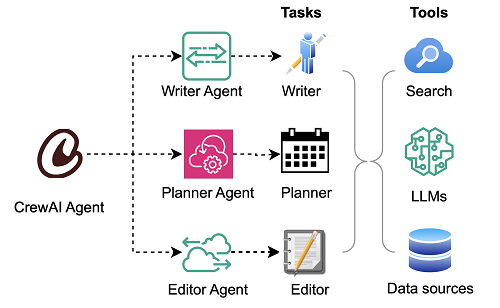

# AI Agent Orchestration

This project explores the orchestration of AI agents in autonomous artificial intelligence and software development, focusing on multi-agent systems, orchestration patterns, and practical implementations using modern frameworks.

## Table of Contents

- [What is Agent Orchestration?](#what-is-agent-orchestration)
- [Key Concepts](#key-concepts)
- [Orchestration Patterns](#orchestration-patterns)
- [Multi-Agent Pipelines](#multi-agent-pipelines)
- [Practical Example: Blog Writing with CrewAI](#practical-example-blog-writing-with-crewai)
- [Setup Instructions](#setup-instructions)
- [Testing Before Deployment](#testing-before-deployment)
  - [Local Testing Workflow](#local-testing-workflow)
  - [Code Quality and Security](#code-quality-and-security)
  - [Performance Testing](#performance-testing)
- [Amazon Bedrock Integration](#amazon-bedrock-integration)
  - [Enable Model Access](#enable-amazon-bedrock-model-access)
  - [Deployment Options](#deployment-options-for-aws)
  - [Deployment Checklist](#aws-deployment-checklist)
- [Tools and Platforms](#tools-and-platforms)
- [References](#references)

## What is Agent Orchestration?

Agent orchestration is the management of multiple AI agents to achieve goals more efficiently and intelligently. Rather than relying on a single solution to handle every task, agent orchestration brings together specialized agents with distinct capabilities to collaborate, adapt, and solve challenges in real time.

When you use multiple AI agents, you can break down complex problems into specialized units of work or knowledge. You assign each task to dedicated AI agents that have specific capabilities. The concept of agentic AI orchestration involves the collaboration of multiple AI agents to achieve a common goal. By working together, these agents can accomplish tasks that would be challenging or impossible for a single agent to complete.

## Key Concepts

### Decoupling the Brain from the Hands

As described in Anthropic's approach to [scaling managed agents](https://www.anthropic.com/engineering/managed-agents), the solution involves decoupling what is thought of as the "brain" (Claude and its harness) from both the "hands" (sandboxes and tools that perform actions) and the "session" (the log of session events).

The virtualized components of an agent include:
- **Session**: The append-only log of everything that happened
- **Harness**: The loop that calls Claude and routes Claude's tool calls to the relevant infrastructure
- **Sandbox**: An execution environment where Claude can run code and edit files

### Claude's Agent Orchestration Architecture

**Hierarchical Task Delegation**: A primary agent (e.g., using Claude Opus 4.6) creates, monitors, and integrates output from sub-agents, handling complex tasks.

**Agent Teams**: Specialized agents (researcher, strategist, writer) operate in parallel with unique prompts and roles, coordinated by a supervisor that prevents duplicated efforts.

**The Agentic Harness**: Acts as a wrapper that manages a reasoning loop, a tool layer (file system, terminal), and memory, allowing agents to act on data, not just converse.

**Managed Agents Architecture**: Uses a harness to call Claude, a session (log of events), and a sandbox (safe workspace).

**Deterministic Hooks**: Pre- and Post-ToolUse hooks act as guardrails, allowing Bash scripts to check code quality, blocking moves that break tests.

**Tool Usage & MCP**: Agents connect to external tools like databases, web search, or file systems via MCP for specialized actions.

## Orchestration Patterns

### Sequential Orchestration

The sequential orchestration pattern chains AI agents in a predefined, linear order. Each agent processes the output from the previous agent in the sequence, which creates a pipeline of specialized transformations.

**Pattern**: Outputs are passed sequentially from one agent to the next.

### Concurrent Orchestration

The concurrent orchestration pattern runs multiple AI agents simultaneously on the same task. This approach allows each agent to provide independent analysis or processing from its unique perspective or specialization.

### Group Chat Orchestration

The group chat orchestration pattern enables multiple agents to solve problems, make decisions, or validate work by participating in a shared conversation thread where they collaborate through discussion. A chat manager coordinates the flow by determining which agents can respond next and by managing different interaction modes, from collaborative brainstorming to structured quality gates.

### Handoff Orchestration

The handoff orchestration pattern enables dynamic delegation of tasks between specialized agents. Each agent can assess the task at hand and decide whether to handle it directly or transfer it to a more appropriate agent based on the context and requirements.

### Supervisor (Leader-Worker)

A central agent breaks down requests, delegates tasks, and aggregates results.

### Sub-agent Spawning

Inline creation of sub-agents for specialized tasks, returning results before continuing.

### Magentic Orchestration

The magentic orchestration pattern is designed for open-ended and complex problems that don't have a predetermined plan of approach. Agents in this pattern typically have tools that allow them to make direct changes in external systems. The focus is as much on building and documenting the approach to solve the problem as it is on implementing that approach. The task list is dynamically built and refined as part of the workflow through collaboration between specialized agents and a magentic manager agent. As the context evolves, the magentic manager agent builds a task ledger to develop the approach plan with goals and subgoals, which is eventually finalized, followed, and tracked to complete the desired outcome.

For more details on orchestration patterns, see [AI agent orchestration patterns on Microsoft Azure](https://learn.microsoft.com/en-us/azure/architecture/ai-ml/guide/ai-agent-design-patterns).

## Multi-Agent Pipelines

Multi-agent pipelines are orchestrated processes within AI systems that involve multiple specialized agents working together to accomplish complex tasks. Within pipelines, agents are organized in a sequential order structure, with different agents handling specific subtasks or roles within the overall workflow. Agents interact with each other, often through a shared "scratchpad" or messaging system, allowing them to exchange information and build upon each other's work.



*The diagram shows this multi-agent pipeline. Source: [AWS Machine Learning Blog](https://d2908q01vomqb2.cloudfront.net/f1f836cb4ea6efb2a0b1b99f41ad8b103eff4b59/2024/12/13/ML-17568-IMG2.png)*

## Practical Example: Blog Writing with CrewAI

As a practical example, consider a multi-agent pipeline for blog writing, implemented with the multi-agent framework CrewAI. To create a multi-agent pipeline with CrewAI, first define the individual agents that will participate in the pipeline. The agents in the following example are the Planner Agent, a Writer Agent, and an Editor Agent. Next, arrange these agents into a pipeline, specifying the order of task execution and how the data flows between them. CrewAI provides mechanisms for agents to pass information to each other and coordinate their actions. The modular and scalable design of CrewAI makes it well-suited for developing both simple and sophisticated multi-agent AI applications.

### Code Implementation

The complete implementation is available in [blog_agents.py](blog_agents.py) and includes:

**Three Specialized Agents:**
1. **Planner Agent**: Researches the topic and creates a content outline
2. **Writer Agent**: Transforms the plan into an engaging blog article
3. **Editor Agent**: Refines and polishes the content to publication quality

**Three Sequential Tasks:**
1. **Planning Task**: Research, audience analysis, and outline creation
2. **Writing Task**: Draft the complete article based on the plan
3. **Editing Task**: Review, refine, and finalize the article

**Key Implementation Features:**

```python
from crewai import Agent, Task, Crew, Process
from crewai_tools import SerperDevTool, ScrapeWebsiteTool

class BlogAgentOrchestrator:
    def __init__(self, topic, model_provider="openai"):
        self.topic = topic
        self.model_provider = model_provider
    
    def create_planner_agent(self):
        """Content planning agent with research capabilities."""
        return Agent(
            role="Content Planner",
            goal=f"Plan engaging and factually accurate content on {self.topic}",
            backstory="Expert content strategist with research capabilities",
            tools=[SerperDevTool(), ScrapeWebsiteTool()],
            verbose=True
        )
    
    def create_writer_agent(self):
        """Content writing agent for article creation."""
        return Agent(
            role="Content Writer",
            goal=f"Write an engaging blog article about {self.topic}",
            backstory="Skilled content writer specializing in compelling narratives",
            verbose=True
        )
    
    def create_editor_agent(self):
        """Editing and quality assurance agent."""
        return Agent(
            role="Content Editor",
            goal=f"Edit and refine the article to publication quality",
            backstory="Meticulous editor with keen eye for detail and quality",
            verbose=True
        )
    
    def run(self):
        """Execute the multi-agent pipeline."""
        # Create agents
        planner = self.create_planner_agent()
        writer = self.create_writer_agent()
        editor = self.create_editor_agent()
        
        # Create tasks with context dependencies
        planning_task = self.create_planning_task(planner)
        writing_task = self.create_writing_task(writer, [planning_task])
        editing_task = self.create_editing_task(editor, [writing_task])
        
        # Orchestrate with Crew
        crew = Crew(
            agents=[planner, writer, editor],
            tasks=[planning_task, writing_task, editing_task],
            verbose=True,
            memory=True,
            embedder={
                "provider": "huggingface",
                "config": {"model": "sentence-transformers/paraphrase-multilingual-MiniLM-L12-v2"}
            },
            process=Process.sequential
        )
        
        return crew.kickoff()
```

### Designing Agent Workflows

When it comes to identifying suitable use cases for multi-agent systems, it's essential to consider the complexity and scale of the problem you're trying to solve. A key aspect of designing efficient agent workflows is to create decision trees that enable agents to make contextual decisions based on real-time information. This involves identifying the inputs, processing, and outputs of each agent and mapping out the possible decision paths.

### Implementation Details

The [blog_agents.py](blog_agents.py) implementation demonstrates several key concepts:

**Agent Specialization**: Each agent has a distinct role with specific expertise:
- Planner focuses on research and strategic planning
- Writer focuses on content creation and narrative flow
- Editor focuses on refinement and quality assurance

**Task Context**: Tasks are linked through context dependencies, allowing agents to build upon previous work. The writing task receives the planning task as context, and the editing task receives the writing task.

**Tool Integration**: The Planner agent uses web search and scraping tools when API keys are configured, demonstrating how agents can leverage external capabilities.

**LLM Flexibility**: The implementation supports multiple LLM providers (OpenAI, Ollama, AWS Bedrock), showing how to decouple business logic from specific AI services.

**Sequential Processing**: The Crew uses sequential processing where each agent completes its task before the next begins, creating a clear pipeline.

**Memory and Caching**: The system uses memory to maintain context across tasks and caching to improve performance on repeated operations.

### Common Problems

Some common problems in agentic AI orchestration include:
- **Agent mismatches**: Where an agent is not suited for a particular task
- **Communication breakdowns**: Where agents fail to exchange necessary information

## Setup Instructions

### Project Structure

📁 **Folder Organization**
```
orchestration/
├── .gitignore                    # Git ignore configuration
├── README.md                     # This documentation file  
├── QUICKSTART.md                 # Quick reference guide
├── multi-agent-pipeline.png      # Architecture diagram
├── requirements.txt              # Python dependencies
├── blog_agents.py                # Complete multi-agent implementation
├── run_tests.py                  # Python unit test runner
├── test_suite.sh                 # Test suite with bash
├── blog_output.md                # Generated blog article (after running)
└── venv/                         # Python virtual environment (excluded from git)
```

### Step 1: Create a Virtual Environment

First, create a Python virtual environment in VS Code and terminal:

```bash
# Navigate to the project directory
cd /home/laptop/EXERCISES/AUTONOMOUS/autonomous-artificial-intelligence/orchestration

# Create a virtual environment named 'venv'
python3 -m venv venv
```

### Step 2: Activate the Virtual Environment

Activate the virtual environment:

```bash
# On Linux
source venv/bin/activate
```

You should see `(venv)` prefix in your terminal prompt, indicating the virtual environment is active.

### Step 3: Install Dependencies

With the virtual environment active, install the required dependencies:

```bash
# Ensure pip is up to date
pip install --upgrade pip

# Install CrewAI and dependencies
pip install crewai
pip install crewai-tools
pip install boto3  # For Amazon Bedrock integration
pip install langchain-aws  # For AWS LangChain integration
```

Create a `requirements.txt` file with the following content:

```txt
crewai>=0.28.0
crewai-tools>=0.2.0
boto3>=1.34.0
langchain-aws>=0.1.0
sentence-transformers>=2.2.0
```

Install from requirements file:

```bash
pip install -r requirements.txt
```

### Step 4: Verify Installation

Check that the virtual environment is active before executing commands:

```bash
# Verify Python location (should point to venv)
which python

# Verify installed packages
pip list
```

### Step 5: Configure LLM Provider

Choose one of the following LLM providers:

**Option A: OpenAI (Requires API Key)**
```bash
export OPENAI_API_KEY='your-openai-api-key'
```

**Option B: Ollama (Local, Free)**
```bash
# Install Ollama from https://ollama.ai
curl -fsSL https://ollama.ai/install.sh | sh

# Pull a model
ollama pull mistral

# No API key needed - the script detects Ollama automatically
```

**Option C: AWS Bedrock**
```bash
# Configure AWS credentials
aws configure

# Install additional dependencies
pip install boto3 langchain-aws
```

**Optional: Enable Web Search**
```bash
# Get free API key at https://serper.dev
export SERPER_API_KEY='your-serper-api-key'
```

### Step 6: Execute the Source Code

Run the multi-agent blog writing pipeline:

```bash
# Ensure virtual environment is active
source venv/bin/activate

# Run with default topic
python blog_agents.py

# Or specify a custom topic
python blog_agents.py "Kubernetes in Cloud Computing"
```

The pipeline will:
1. Execute the Planner Agent to research and create an outline
2. Execute the Writer Agent to draft the article
3. Execute the Editor Agent to refine and polish
4. Save the final article to `blog_output.md`

### Where to Find Libraries

- **CrewAI**: [https://github.com/joaomdmoura/crewAI](https://github.com/joaomdmoura/crewAI)
- **CrewAI Documentation**: [https://docs.crewai.com](https://docs.crewai.com)
- **Boto3 (AWS SDK for Python)**: [https://boto3.amazonaws.com/v1/documentation/api/latest/index.html](https://boto3.amazonaws.com/v1/documentation/api/latest/index.html)
- **LangChain AWS**: [https://python.langchain.com/docs/integrations/platforms/aws](https://python.langchain.com/docs/integrations/platforms/aws)

## Testing Before Deployment

Before deploying to production, it's critical to thoroughly test the application in your local development environment. This section outlines the complete testing workflow to ensure reliability and quality.

### Local Testing Workflow

This repository includes automated test utilities to simplify pre-deployment testing:

**Quick Unit Tests:**

```bash
# Run Python unit tests
python run_tests.py
```

**Test Suite:**

```bash
# Run full test suite (bash script)
./test_suite.sh
```

These automated tests verify environment setup, dependencies, code quality, and basic functionality before deployment.

**Test Coverage:**
- Environment verification (Python version, virtual environment)
- Dependency integrity checks
- LLM provider configuration validation
- Code syntax validation
- Security scanning (with bandit)
- Code quality checks (with flake8)
- Component instantiation tests
- Basic functional tests

**Expected Output:**
- `run_tests.py`: Reports pass/fail for 6 unit tests
- `test_suite.sh`: Test suite with ~9 test categories
- Both scripts exit with code 0 on success, 1 on failure

#### Step 1: Verify Environment Setup

Always start by confirming your virtual environment is properly configured:

```bash
# Activate virtual environment
source venv/bin/activate

# Verify you're in the correct environment
which python
# Should output: /path/to/orchestration/venv/bin/python

# Check Python version
python --version
# Should be Python 3.9 or later

# Verify all dependencies are installed
pip list | grep -E "(crewai|openai|boto3)"

# Check for any missing or outdated packages
pip check
```

#### Step 2: Basic Functionality Testing

Test the application with a simple topic to verify basic operation:

```bash
# Test with default configuration
python blog_agents.py "Test Topic for Development"

# Verify output file was created
ls -lh blog_output.md

# Check output file content
head -20 blog_output.md
```

**Expected Results:**
- Script runs without errors
- All three agents (Planner, Writer, Editor) execute sequentially
- Output file `blog_output.md` is created
- Content is coherent and follows the expected structure

#### Step 3: Test with Different LLM Providers

Test compatibility with various LLM providers before deciding on production configuration:

**Test with OpenAI (if API key available):**

```bash
export OPENAI_API_KEY='your-test-api-key'
python blog_agents.py "OpenAI Integration Test"
```

**Test with Ollama (local, free):**

```bash
# Install and start Ollama
curl -fsSL https://ollama.ai/install.sh | sh
ollama pull mistral

# Test with Ollama
unset OPENAI_API_KEY  # Ensure script uses Ollama
python blog_agents.py "Ollama Local Testing"
```

**Test with AWS Bedrock (if configured):**

```bash
# Set AWS credentials for testing
export AWS_REGION=us-east-1
export AWS_PROFILE=development  # Use non-production profile

# Verify Bedrock access
aws bedrock list-foundation-models --region us-east-1

# Test the application
python blog_agents.py "Bedrock Integration Test"
```

#### Step 4: Input Validation Testing

Test with various input scenarios to ensure robustness:

```bash
# Test with short topic
python blog_agents.py "AI"

# Test with long topic
python blog_agents.py "The Impact of Artificial Intelligence and Machine Learning on Modern Software Development Practices and Cloud Infrastructure"

# Test with special characters
python blog_agents.py "AI & ML: What's Next?"

# Test with numbers
python blog_agents.py "Top 10 DevOps Tools in 2026"
```

**Verify Error Handling:**

```bash
# Test without LLM provider configured
unset OPENAI_API_KEY
unset AWS_REGION
python blog_agents.py
# Should display helpful error message about missing configuration

# Test with invalid arguments
python blog_agents.py
# Should use default topic or show usage instructions
```

#### Step 5: Component Testing

Test individual agents in isolation to verify each component:

Create a test script `test_agents.py`:

```python
#!/usr/bin/env python3
"""Test individual agent components."""

from blog_agents import BlogAgentOrchestrator

def test_agent_creation():
    """Test that all agents can be created."""
    orchestrator = BlogAgentOrchestrator("Test Topic", "openai")
    
    planner = orchestrator.create_planner_agent()
    writer = orchestrator.create_writer_agent()
    editor = orchestrator.create_editor_agent()
    
    assert planner is not None, "Planner agent creation failed"
    assert writer is not None, "Writer agent creation failed"
    assert editor is not None, "Editor agent creation failed"
    
    print("✓ All agents created successfully")

def test_task_creation():
    """Test that all tasks can be created."""
    orchestrator = BlogAgentOrchestrator("Test Topic", "openai")
    
    planner = orchestrator.create_planner_agent()
    planning_task = orchestrator.create_planning_task(planner)
    
    assert planning_task is not None, "Planning task creation failed"
    assert hasattr(planning_task, 'description'), "Task missing description"
    
    print("✓ Tasks created successfully")

if __name__ == "__main__":
    test_agent_creation()
    test_task_creation()
    print("\n✓ All component tests passed")
```

Run component tests:

```bash
python test_agents.py
```

#### Step 6: Integration Testing

Test the complete pipeline with realistic scenarios:

```bash
# Create integration test script
cat > integration_test.sh << 'EOF'
#!/bin/bash

echo "Starting Integration Tests..."

# Test topics covering different domains
topics=(
    "Cloud Computing Security"
    "Machine Learning Operations"
    "Microservices Architecture"
)

for topic in "${topics[@]}"; do
    echo "Testing: $topic"
    python blog_agents.py "$topic" || exit 1
    
    # Verify output
    if [ ! -f blog_output.md ]; then
        echo "Error: Output file not created for topic: $topic"
        exit 1
    fi
    
    # Check file size (should be substantial)
    size=$(wc -c < blog_output.md)
    if [ $size -lt 1000 ]; then
        echo "Error: Output file too small for topic: $topic"
        exit 1
    fi
    
    # Backup result
    mv blog_output.md "test_output_${topic// /_}.md"
done

echo "✓ All integration tests passed"
EOF

chmod +x integration_test.sh
./integration_test.sh
```

### Code Quality and Security

#### Static Code Analysis

Use linting tools to ensure code quality:

```bash
# Install code quality tools
pip install pylint flake8 black mypy bandit

# Run pylint
pylint blog_agents.py

# Run flake8 for PEP8 compliance
flake8 blog_agents.py --max-line-length=100

# Format code with black (optional)
black --check blog_agents.py

# Type checking with mypy
mypy blog_agents.py --ignore-missing-imports
```

#### Security Scanning

Scan for security vulnerabilities before deployment:

```bash
# Install security scanning tools
pip install bandit safety

# Run Bandit security linter
bandit -r blog_agents.py

# Check dependencies for known vulnerabilities
safety check

# Scan for secrets in code
pip install detect-secrets
detect-secrets scan blog_agents.py
```

#### Dependency Audit

Ensure all dependencies are secure and up-to-date:

```bash
# Check for outdated packages
pip list --outdated

# Verify no conflicting dependencies
pip check

# Generate and review dependency tree
pip install pipdeptree
pipdeptree

# Check for security advisories
pip install pip-audit
pip-audit
```

### Performance Testing

#### Execution Time Measurement

Measure and benchmark execution time:

```bash
# Time the complete execution
time python blog_agents.py "Performance Test Topic"

# Create performance test script
cat > performance_test.py << 'EOF'
#!/usr/bin/env python3
"""Performance testing for blog agent orchestrator."""

import time
from blog_agents import BlogAgentOrchestrator

def test_execution_time():
    """Measure execution time for the pipeline."""
    topic = "Performance Testing in DevOps"
    
    start_time = time.time()
    orchestrator = BlogAgentOrchestrator(topic, "openai")
    result = orchestrator.run("performance_test_output.md")
    end_time = time.time()
    
    duration = end_time - start_time
    print(f"Execution time: {duration:.2f} seconds")
    print(f"Execution time: {duration/60:.2f} minutes")
    
    # Performance thresholds
    if duration > 600:  # 10 minutes
        print("⚠ Warning: Execution time exceeds threshold")
    else:
        print("✓ Performance within acceptable range")

if __name__ == "__main__":
    test_execution_time()
EOF

python performance_test.py
```

#### Resource Usage Monitoring

Monitor CPU, memory, and network usage:

```bash
# Install monitoring tools
pip install psutil

# Create resource monitoring script
cat > monitor_resources.py << 'EOF'
#!/usr/bin/env python3
"""Monitor resource usage during execution."""

import psutil
import subprocess
import time
import threading

class ResourceMonitor:
    def __init__(self):
        self.running = False
        self.max_memory = 0
        self.max_cpu = 0
    
    def monitor(self):
        """Monitor resource usage."""
        process = psutil.Process()
        while self.running:
            memory = process.memory_info().rss / 1024 / 1024  # MB
            cpu = process.cpu_percent(interval=1)
            
            self.max_memory = max(self.max_memory, memory)
            self.max_cpu = max(self.max_cpu, cpu)
            
            time.sleep(2)
    
    def start(self):
        """Start monitoring."""
        self.running = True
        self.thread = threading.Thread(target=self.monitor)
        self.thread.start()
    
    def stop(self):
        """Stop monitoring and report."""
        self.running = False
        self.thread.join()
        print(f"\nResource Usage Report:")
        print(f"Max Memory: {self.max_memory:.2f} MB")
        print(f"Max CPU: {self.max_cpu:.2f}%")

if __name__ == "__main__":
    monitor = ResourceMonitor()
    monitor.start()
    
    # Run the blog agent
    subprocess.run(["python", "blog_agents.py", "Resource Monitoring Test"])
    
    monitor.stop()
EOF

python monitor_resources.py
```

#### API Cost Estimation

Track API usage to estimate production costs:

```bash
# Enable verbose logging to see token counts
cat > test_with_logging.py << 'EOF'
#!/usr/bin/env python3
"""Test with detailed logging for cost estimation."""

import logging
from blog_agents import BlogAgentOrchestrator

# Enable debug logging
logging.basicConfig(level=logging.INFO)

orchestrator = BlogAgentOrchestrator("Cost Estimation Test", "openai")
result = orchestrator.run()

print("\nNote: Check logs above for token usage")
print("Calculate costs based on your LLM provider's pricing")
EOF

python test_with_logging.py
```

### Pre-Deployment Checklist

Before deploying to production, ensure all tests pass:

**Environment Tests:**
- Virtual environment activates correctly
- All dependencies install without errors
- Python version meets requirements (3.9+)
- No dependency conflicts (`pip check` passes)

**Functionality Tests:**
- Application runs with default topic
- Output file is generated correctly
- All three agents execute successfully
- Content quality meets expectations

**Provider Tests:**
- Tested with intended LLM provider (OpenAI/Ollama/Bedrock)
- API keys/credentials validated
- Error handling works for missing credentials
- Fallback behavior works as expected

**Input Validation Tests:**
- Handles various topic lengths
- Handles special characters
- Error messages are clear and helpful
- Edge cases handled gracefully

**Code Quality:**
- Code passes linting (pylint/flake8)
- No security issues (bandit scan clean)
- Dependencies have no known vulnerabilities (safety check)
- No hardcoded secrets or credentials

**Performance:**
- Execution time is acceptable (< 10 minutes)
- Memory usage is reasonable (< 2GB)
- No memory leaks detected
- API costs estimated and acceptable

**Integration:**
- Multiple consecutive runs succeed
- Different topics produce varied output
- No file permission issues
- Concurrent execution tested (if needed)

**Documentation:**
- README instructions work as documented
- All examples in documentation are accurate
- Requirements.txt is complete and accurate
- Error messages guide users to solutions

### Testing Best Practices

**Use a Test-Driven Workflow:**

1. **Test locally first** - Always run in virtual environment before deployment
2. **Test with non-production credentials** - Use separate API keys/AWS accounts for testing
3. **Automate testing** - Create scripts for repeatable test scenarios
4. **Monitor resource usage** - Track memory, CPU, and API costs
5. **Test error scenarios** - Verify graceful error handling
6. **Version control testing** - Commit test scripts alongside code
7. **Document test results** - Keep logs of test runs for comparison
8. **Test incrementally** - Test after each significant change

**Common Testing Pitfalls to Avoid:**

- Testing only with one topic or scenario
- Skipping security scans
- Not monitoring resource usage
- Using production API keys for testing
- Ignoring warning messages
- Testing only the "happy path"
- Not testing error conditions
- Forgetting to test in clean environment

### Troubleshooting Test Failures

**Import Errors:**

```bash
# Ensure virtual environment is active
source venv/bin/activate

# Reinstall dependencies
pip install -r requirements.txt --force-reinstall
```

**LLM Provider Errors:**

```bash
# Verify API key is set
echo $OPENAI_API_KEY

# Test API connectivity
curl https://api.openai.com/v1/models \
  -H "Authorization: Bearer $OPENAI_API_KEY"
```

**Memory Issues:**

```bash
# Run with memory profiling
python -m memory_profiler blog_agents.py
```

**Performance Issues:**

```bash
# Profile code execution
python -m cProfile -o profile.stats blog_agents.py
python -m pstats profile.stats
```

## Amazon Bedrock Integration

### Overview

Amazon Bedrock provides access to models from AI companies through a single API. This section covers how to run the blog_agents.py example using AWS Bedrock and deploy it to AWS infrastructure.

### Enable Amazon Bedrock Model Access

Before using Bedrock, you must enable model access in the AWS Console:

1. Sign in to the [AWS Console](https://console.aws.amazon.com/)
2. Navigate to Amazon Bedrock service
3. In the left sidebar, select "Model access"
4. Click "Enable specific models" or "Enable all models"
5. Enable access to:
   - Anthropic Claude 3 Sonnet (recommended)
   - Anthropic Claude 3 Haiku (cost-effective option)
6. Submit the access request (usually approved instantly)

**Documentation**: [Amazon Bedrock Model Access](https://docs.aws.amazon.com/bedrock/latest/userguide/model-access.html)

### Configure AWS Credentials for Local Development

Install and configure AWS CLI with appropriate credentials:

```bash
# Install AWS CLI
curl "https://awscli.amazonaws.com/awscli-exe-linux-x86_64.zip" -o "awscliv2.zip"
unzip awscliv2.zip
sudo ./aws/install

# Configure credentials
aws configure
```

Enter the following when prompted:
- AWS Access Key ID
- AWS Secret Access Key
- Default region (e.g., us-east-1)
- Default output format (json)

**Create IAM Policy for Bedrock Access:**

```json
{
  "Version": "2012-10-17",
  "Statement": [
    {
      "Effect": "Allow",
      "Action": [
        "bedrock:InvokeModel",
        "bedrock:InvokeModelWithResponseStream"
      ],
      "Resource": "arn:aws:bedrock:*::foundation-model/*"
    }
  ]
}
```

Attach this policy to your IAM user or role.

### Run blog_agents.py with AWS Bedrock

Update the requirements to include AWS dependencies:

```bash
source venv/bin/activate
pip install boto3 langchain-aws
```

Modify the model provider when running:

```python
# In blog_agents.py, the orchestrator supports Bedrock
orchestrator = BlogAgentOrchestrator(topic, model_provider="bedrock")
```

Or set environment variable:

```bash
export AWS_REGION=us-east-1
python blog_agents.py
```

The script automatically detects AWS credentials and uses Bedrock when configured.

### Deployment Options for AWS

#### Option 1: AWS Lambda (Serverless)

Deploy the blog agent as a serverless function:

**Prerequisites:**
- AWS CLI installed and configured
- AWS SAM CLI or CDK installed

**Create Lambda Deployment Package:**

```bash
# Create deployment directory
mkdir lambda_deployment
cd lambda_deployment

# Copy the blog agent code
cp ../blog_agents.py .

# Install dependencies in the deployment directory
pip install -r ../requirements.txt -t .

# Create deployment package
zip -r blog_agent_lambda.zip .
```

**Deploy using AWS CLI:**

```bash
# Create Lambda function
aws lambda create-function \
  --function-name BlogAgentOrchestrator \
  --runtime python3.12 \
  --role arn:aws:iam::YOUR_ACCOUNT_ID:role/LambdaBedrockRole \
  --handler blog_agents.lambda_handler \
  --zip-file fileb://blog_agent_lambda.zip \
  --timeout 900 \
  --memory-size 2048
```

**Note**: Lambda has a 15-minute timeout limit. For longer-running tasks, consider ECS or EC2.

#### Option 2: AWS ECS/Fargate (Container-based)

Deploy as a containerized service:

**Create Dockerfile:**

```dockerfile
FROM python:3.12-slim

WORKDIR /app

COPY requirements.txt .
RUN pip install --no-cache-dir -r requirements.txt

COPY blog_agents.py .

CMD ["python", "blog_agents.py"]
```

**Build and Push to ECR:**

```bash
# Authenticate Docker to ECR
aws ecr get-login-password --region us-east-1 | docker login --username AWS --password-stdin YOUR_ACCOUNT_ID.dkr.ecr.us-east-1.amazonaws.com

# Create ECR repository
aws ecr create-repository --repository-name blog-agent-orchestrator

# Build and tag image
docker build -t blog-agent-orchestrator .
docker tag blog-agent-orchestrator:latest YOUR_ACCOUNT_ID.dkr.ecr.us-east-1.amazonaws.com/blog-agent-orchestrator:latest

# Push to ECR
docker push YOUR_ACCOUNT_ID.dkr.ecr.us-east-1.amazonaws.com/blog-agent-orchestrator:latest
```

**Deploy to ECS:**

```bash
# Create ECS cluster
aws ecs create-cluster --cluster-name blog-agent-cluster

# Create task definition and service (use AWS Console or CloudFormation)
```

#### Option 3: AWS EC2 (Virtual Machine)

Deploy on a dedicated EC2 instance:

**Launch EC2 Instance:**

```bash
# Launch instance with appropriate IAM role
aws ec2 run-instances \
  --image-id ami-0c55b159cbfafe1f0 \
  --instance-type t3.medium \
  --key-name your-key-pair \
  --iam-instance-profile Name=EC2BedrockRole \
  --security-groups your-security-group
```

**Connect and Setup:**

```bash
# SSH into instance
ssh -i your-key.pem ec2-user@your-instance-ip

# Install dependencies
sudo yum update -y
sudo yum install python3 python3-pip git -y

# Clone repository or copy files
git clone YOUR_REPO_URL
cd orchestration

# Setup virtual environment
python3 -m venv venv
source venv/bin/activate
pip install -r requirements.txt

# Run the agent
python blog_agents.py
```

### AWS Infrastructure Requirements

#### IAM Roles and Permissions

**For Lambda/ECS/EC2:**

Create an IAM role with the following policies:
- AmazonBedrockFullAccess (or custom restricted policy)
- CloudWatchLogsFullAccess (for logging)
- AmazonS3ReadOnlyAccess (if reading/writing to S3)

**Trust Relationship for Lambda:**

```json
{
  "Version": "2012-10-17",
  "Statement": [
    {
      "Effect": "Allow",
      "Principal": {
        "Service": "lambda.amazonaws.com"
      },
      "Action": "sts:AssumeRole"
    }
  ]
}
```

#### Cost Considerations

**Amazon Bedrock Pricing (as of 2026):**
- Claude 3 Sonnet: ~$3 per 1M input tokens, ~$15 per 1M output tokens
- Claude 3 Haiku: ~$0.25 per 1M input tokens, ~$1.25 per 1M output tokens

**Infrastructure Costs:**
- Lambda: Pay per request + compute time
- ECS Fargate: Pay per vCPU and memory per hour
- EC2: Instance hourly rate

Estimate: A single blog generation run typically uses 10,000-50,000 tokens, costing $0.05-$0.50 with Claude Sonnet.

### Security Best Practices

1. **Use IAM Roles**: Never hardcode AWS credentials
2. **Restrict Permissions**: Use least-privilege access policies
3. **Enable CloudTrail**: Monitor Bedrock API calls
4. **Use VPC Endpoints**: Keep traffic within AWS network
5. **Encrypt Data**: Use encryption at rest and in transit
6. **Set Resource Limits**: Prevent runaway costs with Lambda concurrency limits

### Required Tools for Local Linux Environment

To deploy and manage AWS infrastructure, you need the following tools:

#### 1. AWS CLI

Install the AWS Command Line Interface:

```bash
# Download and install AWS CLI
curl "https://awscli.amazonaws.com/awscli-exe-linux-x86_64.zip" -o "awscliv2.zip"
unzip awscliv2.zip
sudo ./aws/install
```

Verify installation:
```bash
aws --version
```

**Documentation**: [Installing AWS CLI](https://docs.aws.amazon.com/cli/latest/userguide/getting-started-install.html)

#### 2. AWS CDK (Cloud Development Kit)

Install AWS CDK via npm:

```bash
npm install -g aws-cdk
```

Verify installation:
```bash
cdk --version
```

**Documentation**: [AWS CDK Getting Started](https://docs.aws.amazon.com/cdk/v2/guide/getting_started.html)

#### 3. Node.js and npm

Required for AWS CDK:

```bash
# Using NodeSource repository
curl -fsSL https://deb.nodesource.com/setup_lts.x | sudo -E bash -
sudo apt-get install -y nodejs
```

**Download**: [Node.js Official Website](https://nodejs.org/)

#### 4. Python 3.9 or later

```bash
sudo apt-get update
sudo apt-get install python3 python3-pip python3-venv
```

**Download**: [Python Official Website](https://www.python.org/downloads/)

#### 5. Docker (for local testing)

```bash
sudo apt-get install docker.io
sudo systemctl start docker
sudo systemctl enable docker
```

**Documentation**: [Docker Installation on Linux](https://docs.docker.com/engine/install/)

#### 6. Configure AWS Credentials

```bash
aws configure
```

Enter your AWS Access Key ID, Secret Access Key, default region, and output format.

**Documentation**: [AWS CLI Configuration](https://docs.aws.amazon.com/cli/latest/userguide/cli-configure-quickstart.html)

### Deployment Workflow Summary

**For Local Development with Bedrock:**

```bash
# 1. Install AWS tools
sudo apt-get update
curl "https://awscli.amazonaws.com/awscli-exe-linux-x86_64.zip" -o "awscliv2.zip"
unzip awscliv2.zip
sudo ./aws/install

# 2. Configure credentials
aws configure

# 3. Enable Bedrock model access (via AWS Console)

# 4. Install Python dependencies
source venv/bin/activate
pip install boto3 langchain-aws

# 5. Run the blog agent with Bedrock
export AWS_REGION=us-east-1
python blog_agents.py
```

**For Production Deployment on AWS:**

```bash
# 1. Choose deployment method (Lambda, ECS, or EC2)

# 2. Create IAM roles with Bedrock permissions

# 3. Package application (zip for Lambda, Docker for ECS)

# 4. Deploy using AWS CLI or Infrastructure as Code (CDK/CloudFormation)

# 5. Configure environment variables and monitoring

# 6. Test deployment

# 7. Set up logging and alerting via CloudWatch
```

### Monitoring and Troubleshooting

**View CloudWatch Logs:**

```bash
# For Lambda
aws logs tail /aws/lambda/BlogAgentOrchestrator --follow

# For ECS
aws logs tail /ecs/blog-agent-orchestrator --follow
```

**Check Bedrock Model Invocations:**

```bash
# View recent Bedrock API calls in CloudTrail
aws cloudtrail lookup-events \
  --lookup-attributes AttributeKey=EventName,AttributeValue=InvokeModel \
  --max-results 10
```

**Common Issues:**

1. **Model Access Denied**: Enable model access in Bedrock console
2. **Timeout Errors**: Increase Lambda timeout or use ECS/EC2
3. **Rate Limits**: Implement exponential backoff and request quotas
4. **High Costs**: Monitor usage with AWS Cost Explorer and set billing alerts

### External AWS Sample Deployment

To explore the AWS reference architecture for agentic orchestration:

**Clone and Deploy AWS Samples:**

1. Clone the repository:
```bash
git clone https://github.com/aws-samples/agentic-orchestration.git
cd agentic-orchestration
```

2. Install dependencies:
```bash
npm install
pip install -r requirements.txt
```

3. Bootstrap AWS CDK (first time only):
```bash
cdk bootstrap
```

4. Deploy the stack:
```bash
cdk deploy
```

**Note**: This deploys AWS's reference architecture, which is separate from the blog_agents.py example in this repository.

### Testing Your Deployment

After deploying to AWS, verify that the production deployment works correctly.

**Post-Deployment Verification with Bedrock:**

```bash
# Set AWS region
export AWS_REGION=us-east-1

# Verify AWS credentials
aws sts get-caller-identity

# Test Bedrock access
aws bedrock list-foundation-models --region us-east-1

# Run the blog agent
python blog_agents.py "Cloud Computing Trends"
```

**Lambda Testing:**

```bash
# Invoke Lambda function
aws lambda invoke \
  --function-name BlogAgentOrchestrator \
  --payload '{"topic": "AI in Healthcare"}' \
  response.json

# View response
cat response.json
```

**Load Testing:**

```bash
# Install testing tool
pip install locust

# Create test script to simulate multiple concurrent requests
# Monitor CloudWatch metrics for performance and errors
```

### AWS Deployment Checklist

Before deploying to AWS, ensure you have completed:

**Account Setup:**
- AWS account created and active
- Billing alerts configured
- Root account MFA enabled
- IAM users/roles created with appropriate permissions

**Bedrock Configuration:**
- Amazon Bedrock model access enabled in AWS Console
- Preferred foundation models activated (Claude 3 Sonnet/Haiku)
- IAM policies created with bedrock:InvokeModel permissions
- AWS region selected (us-east-1 recommended for Bedrock)

**Local Tools Installed:**
- AWS CLI v2 installed and configured
- Python 3.9+ installed
- Docker installed (for container deployments)
- AWS CDK installed (for infrastructure as code)
- Git installed

**Application Requirements:**
- Virtual environment created and activated
- All dependencies installed (requirements.txt)
- Code tested locally with selected LLM provider
- Environment variables configured

**Deployment Preparation:**
- Deployment method selected (Lambda/ECS/EC2)
- IAM roles created for chosen service
- Application packaged (zip/container)
- CloudWatch log groups created
- Security groups configured (if using EC2/ECS)

**Post-Deployment:**
- Deployment tested with sample requests
- CloudWatch logs verified
- Costs monitored in AWS Cost Explorer
- Alerts configured for errors and budget thresholds

### Additional Resources

- **AWS Workshop for Agentic Orchestration**: [AWS Workshop](https://catalog.workshops.aws/)
- **Agentic Orchestration GitHub Repository**: [https://github.com/aws-samples/agentic-orchestration](https://github.com/aws-samples/agentic-orchestration)
- **Amazon Bedrock Agent Samples**: [https://github.com/awslabs/amazon-bedrock-agent-samples](https://github.com/awslabs/amazon-bedrock-agent-samples)
- **Design Multi-Agent Orchestration with Amazon Bedrock**: [AWS Blog Post](https://aws.amazon.com/blogs/machine-learning/design-multi-agent-orchestration-with-reasoning-using-amazon-bedrock-and-open-source-frameworks/)

This blog post provides step-by-step instructions for creating a collaborative multi-agent framework with reasoning capabilities to decouple business applications from foundation models. It demonstrates how to combine Amazon Bedrock Agents with open source multi-agent frameworks, enabling collaborations and reasoning among agents to dynamically execute various tasks.

## Tools and Platforms

Some of the key tools and platforms available for AI orchestration include:

### Workflow Management

- **Apache Airflow**: [https://airflow.apache.org/](https://airflow.apache.org/)  
  Popular choice for workflow management and data pipeline orchestration

### Machine Learning Pipelines

- **Kubeflow**: [https://www.kubeflow.org/](https://www.kubeflow.org/)  
  Well-suited for machine learning pipelines on Kubernetes

- **MLflow**: [https://mlflow.org/](https://mlflow.org/)  
  Platform for managing the ML lifecycle, including experimentation, reproducibility, and deployment

### Cloud Providers

When it comes to infrastructure, you'll need to decide on a cloud provider and configure your resources accordingly:

- **AWS (Amazon Web Services)**: [https://aws.amazon.com/](https://aws.amazon.com/)
- **Google Cloud Platform**: [https://cloud.google.com/](https://cloud.google.com/)
- **Microsoft Azure**: [https://azure.microsoft.com/](https://azure.microsoft.com/)

### Example: Workflow with Apache Airflow and Kubernetes

You can use Apache Airflow to define a workflow that includes tasks such as data ingestion, model training, and prediction. You can then use Kubernetes to deploy and manage your workflow on a cloud provider like AWS.

## References

### Key Articles and Documentation

1. **Scaling Managed Agents: Decoupling the brain from the hands** - Anthropic Engineering  
   [https://www.anthropic.com/engineering/managed-agents](https://www.anthropic.com/engineering/managed-agents)

2. **AI Agent Orchestration Patterns** - Microsoft Azure Architecture  
   [https://learn.microsoft.com/en-us/azure/architecture/ai-ml/guide/ai-agent-design-patterns](https://learn.microsoft.com/en-us/azure/architecture/ai-ml/guide/ai-agent-design-patterns)

3. **Design Multi-Agent Orchestration with Reasoning using Amazon Bedrock** - AWS Blog  
   [https://aws.amazon.com/blogs/machine-learning/design-multi-agent-orchestration-with-reasoning-using-amazon-bedrock-and-open-source-frameworks/](https://aws.amazon.com/blogs/machine-learning/design-multi-agent-orchestration-with-reasoning-using-amazon-bedrock-and-open-source-frameworks/)

4. **Multi-agent Orchestration with Claude Code**  
   [https://mintlify.wiki/saurav-shakya/Claude_Code-_Source_Code/advanced/multi-agent](https://mintlify.wiki/saurav-shakya/Claude_Code-_Source_Code/advanced/multi-agent)

### GitHub Repositories

- **Agentic Orchestration Samples**: [https://github.com/aws-samples/agentic-orchestration](https://github.com/aws-samples/agentic-orchestration)
- **Amazon Bedrock Agent Samples**: [https://github.com/awslabs/amazon-bedrock-agent-samples](https://github.com/awslabs/amazon-bedrock-agent-samples)
- **CrewAI Framework**: [https://github.com/joaomdmoura/crewAI](https://github.com/joaomdmoura/crewAI)

---

*This project demonstrates multi-agent orchestration in solving complex AI tasks through collaboration, specialization, and intelligent coordination.*

