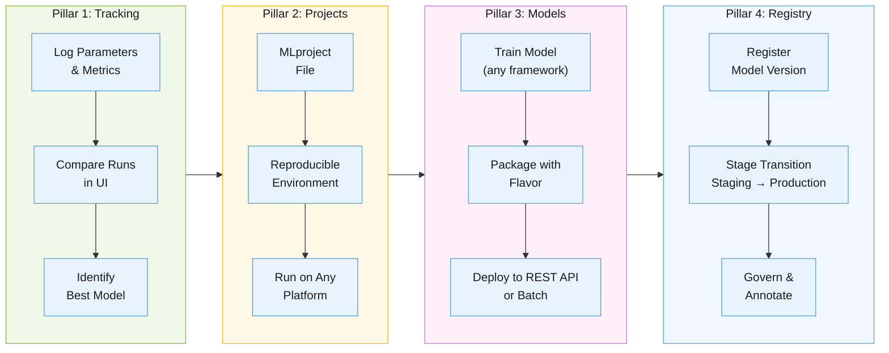
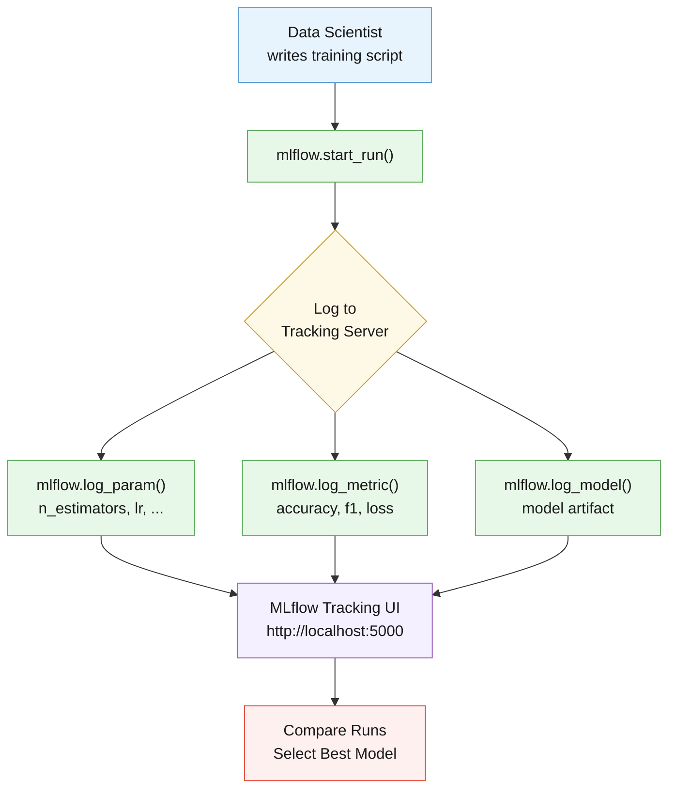
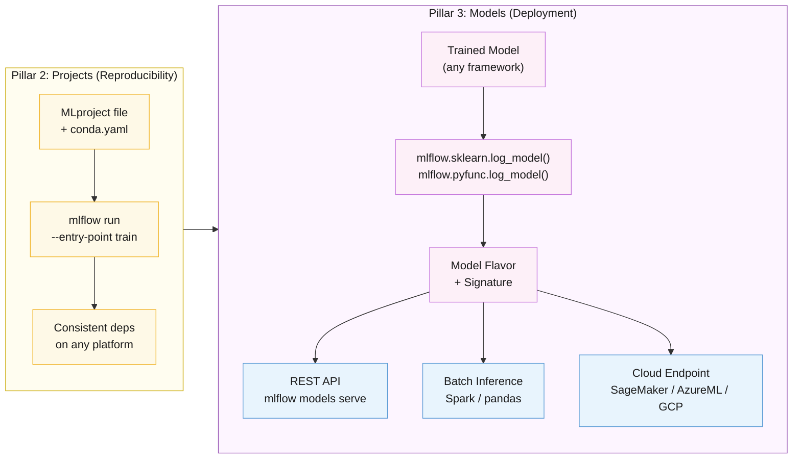
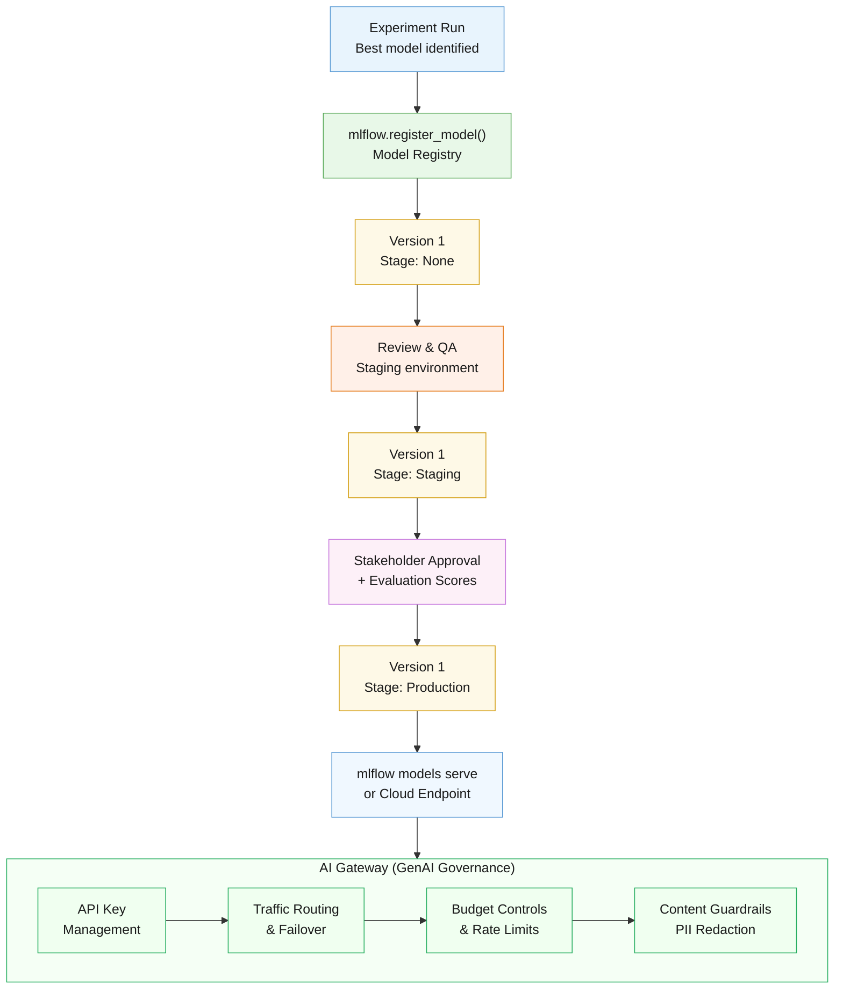

# MLflow AI Engineering Platform: A Developer's Tutorial

A tutorial covering the steps involved in building, tracing, evaluating, and deploying AI agents, LLM applications, and ML models using [MLflow](https://github.com/mlflow/mlflow), featuring practical examples of vibe coding with VS Code and the Claude AI assistant across the full software development lifecycle.

---

## Table of Contents

1. [Introduction to MLflow](#1-introduction-to-mlflow)
2. [Vibe Coding with VS Code and Claude](#2-vibe-coding-with-vs-code-and-claude)
   - [What Is Vibe Coding?](#what-is-vibe-coding)
   - [How Vibe Coding Changes Software Development](#how-vibe-coding-changes-software-development)
   - [Vibe Coding Prompts for MLflow Development](#vibe-coding-prompts-for-mlflow-development)
   - [Assessment: Vibe Coding Support in MLflow Ecosystem](#assessment-vibe-coding-support-in-mlflow-ecosystem)
3. [MLflow Pillars](#3-mlflow-pillars)
   - [Figure 1: MLflow AI Platform Pillars Overview](#figure-1-mlflow-ai-platform-pillars-overview)
   - [Figure 2: Pillar 1 — MLflow Tracking](#figure-2-pillar-1--mlflow-tracking)
   - [Figure 3: Pillar 2 and 3 — Projects and Models](#figure-3-pillar-2-and-3--mlflow-projects-and-models)
   - [Figure 4: Pillar 4 — Model Registry and Governance](#figure-4-pillar-4--model-registry-and-governance)
4. [Project Structure](#4-project-structure)
5. [Environment Setup](#5-environment-setup)
   - [Prerequisites](#prerequisites)
   - [Step 1: Create Virtual Environment on VS Code + Linux](#step-1-create-virtual-environment-on-vs-code--linux)
   - [Step 2: Activate the Virtual Environment](#step-2-activate-the-virtual-environment)
   - [Step 3: Install Dependencies](#step-3-install-dependencies)
   - [Step 4: Start the MLflow Tracking Server](#step-4-start-the-mlflow-tracking-server)
6. [MLflow in the Software Development Lifecycle](#6-mlflow-in-the-software-development-lifecycle)
   - [Stage 1: Code Generation with Vibe Coding](#stage-1-code-generation-with-vibe-coding)
   - [Stage 2: Experimentation and Tracking](#stage-2-experimentation-and-tracking)
   - [Stage 3: Tracing and Observability](#stage-3-tracing-and-observability)
   - [Stage 4: Evaluation and Testing](#stage-4-evaluation-and-testing)
   - [Stage 5: Prompt Versioning and Optimization](#stage-5-prompt-versioning-and-optimization)
   - [Stage 6: Governance and the AI Gateway](#stage-6-governance-and-the-ai-gateway)
7. [Running the Example Scripts](#7-running-the-example-scripts)
8. [Local Deployment with Docker](#8-local-deployment-with-docker)
9. [Cloud Deployment](#9-cloud-deployment)
   - [Amazon SageMaker (AWS)](#amazon-sagemaker-aws)
   - [Google Cloud Platform (GCP)](#google-cloud-platform-gcp)
   - [Microsoft Azure Machine Learning](#microsoft-azure-machine-learning)
10. [References](#10-references)

---

## 1. Introduction to MLflow

MLflow is a vendor-neutral, open-source AI engineering platform for managing the full
lifecycle of machine learning experiments, models, and AI agents. Originally created by
Databricks, it is now a Linux Foundation project with over 25,000 GitHub stars and 30 million
monthly downloads, trusted by thousands of organizations worldwide.

MLflow is vendor-neutral and supports building AI agents, LLM applications, or ML models. It
integrates with any agent framework, programming language, and LLM provider, including LangGraph,
LangChain, OpenAI Agents SDK, Claude Agent SDK, Google ADK, Pydantic AI, AutoGen, CrewAI, and
many more.

The platform consists of four interconnected pillars that together provide a structured,
systematic approach to AI development and operations:

- **Tracing** — Full observability into every LLM call, tool invocation, and agent step.
- **Evaluation and Human Feedback** — Automated and human-in-the-loop quality measurement.
- **Prompt Versioning** — Version control for prompts with lineage to evaluation results.
- **AI Governance** — Centralized LLM access control, cost management, and content guardrails.

As described in the MLflow blog post [Structuring AI Evaluation and Observability with MLflow](https://mlflow.org/blog/structured-ai-eval/):

> Shipping your first AI agent or LLM application feels fulfilling until you have to make changes
> because it does not work as you intended. Most of us start the same way: we test a few prompts,
> the results look reasonable, we vibe-check, and move on. But then the silent failures and quality
> issues begin.

MLflow addresses this challenge by providing the instrumentation, evaluation, and governance tools
that transform ad-hoc development into a reliable, measurable engineering discipline.

**Key capabilities at a glance:**

| Capability | Description |
|---|---|
| Experiment Tracking | Log parameters, metrics, code versions, and artifact outputs |
| Reproducible Projects | Package data science code in reusable, platform-independent format |
| Model Packaging | Wrap models with dependencies into deployable "flavors" |
| Model Registry | Centralized lifecycle management with versioning and stage transitions |
| GenAI Tracing | OpenTelemetry-compatible tracing for agents and LLM applications |
| GenAI Evaluation | Built-in and custom LLM judges with 70+ quality scorers |
| Prompt Registry | Versioned prompt store linked to traces and evaluation metrics |
| AI Gateway | Centralized proxy for LLM routing, cost control, and guardrails |

- GitHub: [https://github.com/mlflow/mlflow](https://github.com/mlflow/mlflow)
- Documentation: [https://mlflow.org/docs/latest/](https://mlflow.org/docs/latest/)

---

## 2. Vibe Coding with VS Code and Claude

### What Is Vibe Coding?

Vibe coding is a conversational, intent-driven approach to software development in which a
developer describes what they want in natural language, and an AI coding assistant generates,
refines, debugs, or documents the code. The developer steers the process through prompts, reviews
outputs, and iterates — focusing on the high-level intent rather than low-level syntax.

With VS Code and Claude (via GitHub Copilot Chat or the Claude API), vibe coding becomes a
practical workflow for every stage of AI application development with MLflow.

### How Vibe Coding Changes Software Development

Vibe coding is actively reshaping the following phases of the software development lifecycle:

**Code Generation**
Rather than searching documentation and writing boilerplate from scratch, developers describe the
component they need. The AI assistant generates a working skeleton, complete with imports,
function signatures, and type hints. MLflow's well-documented Python API is an ideal target
because its patterns are highly regular and the assistant can confidently generate correct calls to
`mlflow.start_run()`, `mlflow.log_metric()`, `mlflow.genai.evaluate()`, and similar functions.

**Conversational Debugging**
When a script fails or a trace shows unexpected behavior, the developer pastes the error or
the trace summary into the chat. The assistant reasons through the call stack, identifies the root
cause, and suggests a targeted fix. With MLflow tracing capturing every span, the debugging
context is precise and grounded — not vague log output.

**Building Software Components**
Complex components such as custom LLM judges, RAG pipelines, or evaluation datasets are described
at the architectural level. The assistant generates the full module including MLflow integration
points, leaving the developer to review rather than write.

**Writing Unit Tests**
Developers describe the expected behavior of a function and ask the assistant to generate
pytest-compatible unit tests. For MLflow components, this includes tests that verify run logging,
model artifact structure, and scorer output format.

**Modifying Existing Applications**
The developer describes a change ("add Correctness scoring to the existing evaluation pipeline")
and the assistant locates the relevant code, applies the change, and explains any side effects.

**Connecting API Services**
Integrating external services — an OpenAI endpoint, an AWS S3 artifact store, or a SageMaker
endpoint — is a natural vibe coding task. The developer describes the integration goal and the
assistant produces the configuration and connection code.

**Producing Documentation**
Docstrings, README sections, and API reference tables can be generated from code. The developer
asks the assistant to document a module and reviews the output for accuracy.

### Vibe Coding Prompts for MLflow Development

The following example prompts demonstrate how to use Claude in VS Code to accelerate MLflow
development across the software development lifecycle. Each prompt is designed to produce
working, production-quality code that integrates directly with MLflow.

---

**Prompt 1 — Generate an MLflow experiment tracking script**

```
I am building a Python script to train a scikit-learn RandomForestClassifier on the iris
dataset. Using MLflow, log the following for each training run: n_estimators, max_depth,
accuracy, and f1_score as metrics, and save the trained model as an artifact. Connect to
a tracking server running at http://localhost:5000. Use an experiment named
"iris-classification-tuning" and give each run a descriptive name. Show the full script.
```

---

**Prompt 2 — Add MLflow tracing to a LangChain agent**

```
I have a LangChain agent that uses a local HuggingFace GPT-2 model and the llm-math tool.
Show me how to enable MLflow automatic tracing for the full agent lifecycle, including
tool calls and LLM inputs and outputs. The tracking server is at http://localhost:5000.
Use mlflow.langchain.autolog() and wrap the agent run in an mlflow.start_run() context.
```

---

**Prompt 3 — Create an MLflow GenAI evaluation pipeline**

```
Write a Python script that evaluates a question-answering function using MLflow's GenAI
evaluation API. The function takes a dict with a "question" key and returns a string answer.
Use the Correctness and RelevanceToQuery built-in scorers. Build an evaluation dataset as
a pandas DataFrame with "inputs" and "expectations" columns, then call mlflow.genai.evaluate().
Log results to the tracking server at http://localhost:5000.
```

---

**Prompt 4 — Write a custom LLM judge with MLflow**

```
Using MLflow's make_judge API, create a custom LLM judge called "response_safety" that
evaluates whether an agent's response contains any harmful or policy-violating content.
The judge should return one of three values: "safe", "unsafe", or "borderline". Use
openai/gpt-4o-mini as the judge model. Show how to include this custom judge alongside
the built-in Safety and Correctness scorers in an mlflow.genai.evaluate() call.
```

---

**Prompt 5 — Instrument a RAG pipeline with manual MLflow spans**

```
I have a Python RAG pipeline with three functions: retrieve_documents(query), 
augment_context(query, docs), and generate_response(prompt). Add MLflow manual tracing
using @mlflow.trace decorators with appropriate span types (RETRIEVER, CHAIN, LLM).
Wrap the full pipeline in a root span named "rag-pipeline". Show the complete code
and explain what each span_type means in the MLflow tracing UI.
```

---

**Prompt 6 — Debug a failing MLflow evaluation run from trace output**

```
My MLflow evaluation run shows that the Correctness scorer returned "no" for 3 out of
5 records. The MLflow trace shows the predict_fn returned partial answers. Examine this
trace structure and explain why the scorer is failing. Then suggest how to modify the
predict_fn to produce answers that will score higher on Correctness.

Trace summary:
- Span: predict_fn, input: {"question": "What is MLflow?"}, output: "MLflow is a tool."
- Scorer: Correctness, value: "no", rationale: "Answer is incomplete and lacks detail."
```

---

**Prompt 7 — Register and version a prompt with MLflow Prompt Registry**

```
Write a Python script using the MLflow Prompt Registry to register a system prompt
for a customer support agent. Create two versions: an initial concise version and an
improved version that adds instructions for tone, length, and source citation. Load
both versions programmatically and show how to render a specific version with template
variables filled in. The tracking server is at http://localhost:5000.
```

---

**Prompt 8 — Generate a deployment script for AWS SageMaker**

```
I have an MLflow model registered in the Model Registry as "iris-classifier" at version 1.
Write a Python script to deploy it as a SageMaker real-time inference endpoint using
mlflow.sagemaker.deploy(). Include the steps for building and pushing the MLflow container
to ECR first. Use the us-east-1 region, ml.m5.large instance type, and show how to verify
the endpoint status with boto3. Add configuration placeholders for the IAM role ARN and
ECR image URI.
```

---

**Prompt 9 — Write unit tests for an MLflow scoring function**

```
Write pytest unit tests for the following MLflow custom scorer function. The scorer checks
whether the agent's response contains a source citation. Test that it returns "yes" when
the response includes a URL, "no" when it does not, and that it returns a Feedback object
with a non-empty rationale in both cases. Mock the mlflow.entities.Feedback class.
```

---

**Prompt 10 — Generate Docker Compose configuration for local MLflow deployment**

```
Create a Docker Compose configuration for running MLflow tracking server locally on Linux.
Use a Python 3.9 base image, install mlflow, boto3, and pymysql. Configure the server to
use SQLite as the backend store and a local volume for artifact storage. Expose port 5000.
Show the Dockerfile and docker-compose.yml, and the command to start the stack.
```

---

### Assessment: Vibe Coding Support in MLflow Ecosystem

The MLflow ecosystem is well-suited for AI-assisted development with Claude or GitHub Copilot
for the following reasons:

**Strong vibe coding support:**
- MLflow's Python API is consistent, well-documented, and follows predictable patterns.
  AI assistants trained on public code can reliably generate correct `mlflow.*` calls.
- The declarative nature of evaluation (`mlflow.genai.evaluate(data, predict_fn, scorers)`)
  maps cleanly to intent-based prompting — the developer describes what to measure, and the
  assistant fills in the scaffolding.
- MLflow's integration with 30+ frameworks (LangChain, LangGraph, OpenAI, etc.) means the
  assistant can compose multi-library solutions from a single natural-language description.
- The Prompt Registry, Model Registry, and tracing APIs all follow the same register/load/use
  pattern, which is easy for an AI assistant to apply consistently across different contexts.

**Areas requiring developer review:**
- Cloud deployment scripts (SageMaker, GCP, Azure) include environment-specific configuration
  such as IAM roles, ECR URIs, and storage bucket names that must be provided manually.
- Custom LLM judge instructions require domain expertise that the developer must supply.
  The assistant can generate the scaffolding, but the evaluation criteria must be reviewed.
- The AI assistant may generate code against older MLflow API versions. Always verify generated
  code against the [MLflow changelog](https://github.com/mlflow/mlflow/blob/master/CHANGELOG.md).

**Verdict:** MLflow is one of the most productive open-source frameworks for vibe coding in AI
engineering. The combination of a coherent Python API, structured patterns for tracing and
evaluation, and deep framework integrations allows Claude to generate accurate, working code
from high-level descriptions across every stage of the development lifecycle. This is
particularly effective when Claude is given the MLflow tracking URI and experiment name as
context at the start of a session, establishing a persistent, shared project scope.

---

## 3. MLflow Pillars

The four pillars of MLflow form an interconnected platform where each capability builds on the
next. The following diagrams illustrate each pillar's purpose and flow.

### Figure 1: MLflow AI Platform Pillars Overview



*Figure 1. MLflow open source AI platform's four pillars, from experimentation to governance.*

---

### Figure 2: Pillar 1 — MLflow Tracking

**Purpose:** Logs and queries experiments — parameters, metrics, code versions, and model
artifacts — enabling data scientists to compare runs and identify the best model through the
MLflow UI or API.

**Flow:** A developer trains a model, instruments the script with `mlflow.start_run()`,
`mlflow.log_param()`, and `mlflow.log_metric()`, and optionally logs the model artifact. All
runs are stored in the tracking server and visible in the MLflow UI for side-by-side comparison.



*Figure 2. MLflow Tracking pillar: from training script to run comparison in the UI.*

---

### Figure 3: Pillar 2 and 3 — MLflow Projects and Models

**Purpose (Projects):** Packages data science code in a reusable, reproducible format using an
`MLproject` file and a Conda or Docker environment specification. Any team member can reproduce
results with a single `mlflow run` command.

**Purpose (Models):** Manages and packages trained models from diverse libraries (scikit-learn,
TensorFlow, PyTorch, HuggingFace, and more) into a standardized "flavor" format. Encapsulates
the model with its dependencies for deployment to REST API endpoints, batch inference, or cloud
serving platforms.



*Figure 3. MLflow Projects and Models pillars: reproducibility and multi-target deployment.*

---

### Figure 4: Pillar 4 — Model Registry and Governance

**Purpose:** A centralized repository to manage the full lifecycle of models, including versioning,
stage transitions (Staging, Production, Archived), annotations, and access control. Enables
collaborative, controlled deployment pipelines.

**GenAI Extension:** For LLM applications and AI agents, the fourth pillar extends to the AI
Gateway — a centralized proxy that manages API keys, routes traffic across providers, enforces
budget controls, and applies content guardrails.



*Figure 4. MLflow Model Registry and AI Gateway: lifecycle governance from staging to production.*

---

## 4. Project Structure

```
platform/
◈ .gitignore                          Git ignore rules (venv, artifacts, credentials)
◈ README.md                           This tutorial document
◈ docker/
  ▸ Dockerfile                        Custom MLflow server image
  ▸ docker-compose.yml                Local stack with SQLite backend and volume
◈ scripts/
  ▸ tracking/
    ▪ train_and_track.py              Hyperparameter tuning with MLflow Tracking
  ▸ agents/
    ▪ langchain_agent_trace.py        LangChain agent with MLflow auto-tracing
    ▪ rag_pipeline_trace.py           Manual span tracing for a RAG pipeline
  ▸ evaluation/
    ▪ evaluate_qa.py                  GenAI evaluation with built-in scorers
    ▪ prompt_registry.py              Prompt versioning with MLflow Prompt Registry
  ▸ deployment/
    ▪ register_model.py               Log, register, and load a model
    ▪ deploy_sagemaker.py             Deploy a registered model to AWS SageMaker
```

---

## 5. Environment Setup

### Prerequisites

The following tools must be installed on your Linux system before proceeding:

| Tool | Minimum Version | Purpose |
|---|---|---|
| Python | 3.9+ | Runtime for all scripts |
| pip | 23+ | Package installation |
| VS Code | Latest | Editor and integrated terminal |
| Docker | 24+ | Local MLflow server deployment |
| Docker Compose | 2.x | Container orchestration |
| Git | 2.x | Version control |
| AWS CLI | 2.x | AWS SageMaker deployment (optional) |

### Step 1: Create Virtual Environment on VS Code + Linux

Open VS Code and use the integrated terminal (`Ctrl + `` ` ``). Navigate to the project root
and create a Python virtual environment:

```bash
cd /home/laptop/EXERCISES/AUTONOMOUS/autonomous-artificial-intelligence/platform

python3 -m venv .venv
```

This creates an isolated `.venv` directory containing a private Python interpreter and pip
binary, completely separate from the system Python installation.

**VS Code integration:** After creating the virtual environment, VS Code will detect it
automatically and prompt you to select it as the workspace interpreter. Click **Yes** or
open the Command Palette (`Ctrl+Shift+P`) and run:

```
Python: Select Interpreter
```

Select `.venv/bin/python` from the list. VS Code will use this interpreter for linting,
IntelliSense, and the integrated terminal.

### Step 2: Activate the Virtual Environment

Every time you open a new terminal session, activate the virtual environment before running
scripts or installing packages:

```bash
source .venv/bin/activate
```

The terminal prompt changes to show `(.venv)` confirming activation:

```
(.venv) laptop@laptop:~/EXERCISES/.../platform$
```

To deactivate when done:

```bash
deactivate
```

### Step 3: Install Dependencies

With the virtual environment active, install all required packages:

```bash
# Core MLflow with GenAI support
pip install "mlflow[genai]"

# Machine learning libraries
pip install scikit-learn pandas numpy

# LLM and agent frameworks
pip install langchain langchain-community

# HuggingFace for local open-source models
pip install transformers torch

# AWS deployment (optional)
pip install boto3

# Development tools
pip install pytest
```

Verify the installation:

```bash
mlflow --version
python -c "import mlflow; print(mlflow.__version__)"
```

### Step 4: Start the MLflow Tracking Server

Start a local MLflow tracking server. All experiment runs and traces will be stored here.

**Option A: Start directly from the terminal (development)**

```bash
mlflow server \
  --backend-store-uri sqlite:///mlflow.db \
  --default-artifact-root ./mlartifacts \
  --host 0.0.0.0 \
  --port 5000
```

**Option B: Start via Docker Compose (recommended for reproducibility)**

See [Section 8: Local Deployment with Docker](#8-local-deployment-with-docker).

Open the MLflow UI in your browser:

```
http://localhost:5000
```

---

## 6. MLflow in the Software Development Lifecycle

This section demonstrates how MLflow integrates with each phase of building an AI application,
from initial code generation to production monitoring.

### Stage 1: Code Generation with Vibe Coding

The fastest way to start an MLflow project is to describe the goal to Claude in VS Code and let
it generate the boilerplate. For example, using Prompt 1 from [Section 2](#vibe-coding-prompts-for-mlflow-development):

```
I am building a Python script to train a scikit-learn RandomForestClassifier on the iris
dataset. Using MLflow, log n_estimators, max_depth, accuracy, and f1_score. Connect to
http://localhost:5000. Use experiment "iris-classification-tuning".
```

Claude generates a working script. The developer reviews, adjusts the hyperparameter grid,
and runs it. See [`scripts/tracking/train_and_track.py`](scripts/tracking/train_and_track.py).

### Stage 2: Experimentation and Tracking

MLflow Tracking logs every training run as an experiment with full parameter and metric history.

```python
import mlflow
import mlflow.sklearn

mlflow.set_tracking_uri("http://localhost:5000")
mlflow.set_experiment("iris-classification-tuning")

with mlflow.start_run(run_name="rf-n100-d5"):
    mlflow.log_param("n_estimators", 100)
    mlflow.log_param("max_depth", 5)
    # ... train model ...
    mlflow.log_metric("accuracy", 0.9667)
    mlflow.sklearn.log_model(clf, artifact_path="model")
```

After multiple runs, open the MLflow UI to compare metrics across runs, visualize learning
curves, and select the best model for registration.

Reference: [Getting Started with MLflow](https://mlflow.org/docs/latest/ml/getting-started/)

### Stage 3: Tracing and Observability

MLflow Tracing provides full visibility into agent execution. A single line enables automatic
tracing for any supported framework:

```python
import mlflow

# Enable automatic tracing for OpenAI calls
mlflow.openai.autolog()

# Enable automatic tracing for LangChain
mlflow.langchain.autolog()
```

For custom pipelines, use the `@mlflow.trace` decorator to create named spans:

```python
from typing import List

@mlflow.trace(name="retrieve-documents", span_type="RETRIEVER")
def retrieve_documents(query: str) -> List[str]:
    # ... document retrieval logic ...
    return results

@mlflow.trace(name="generate-response", span_type="LLM")
def generate_response(prompt: str) -> str:
    # ... LLM call ...
    return response
```

Every trace captures:
- The full execution graph with parent-child span relationships
- LLM inputs and outputs with token counts and latency
- Tool invocation parameters and return values
- Errors with full stack context

MLflow Tracing is [OpenTelemetry-compatible](https://mlflow.org/blog/opentelemetry-tracing-support/),
meaning it works with any programming language and integrates with existing observability stacks.

Reference: [From Black Box to Observability: Tracing OpenClaw with MLflow](https://mlflow.org/blog/openclaw-tracing/)

See the example: [`scripts/agents/rag_pipeline_trace.py`](scripts/agents/rag_pipeline_trace.py)

### Stage 4: Evaluation and Testing

MLflow Evaluation transforms manual vibe-checking into systematic, reproducible quality
measurement. The eval-driven development cycle has three phases:

**Phase 1 — Prototype with tracing.** Instrument the agent from day one. Tracing data
feeds directly into evaluation.

**Phase 2 — Incorporate judges and build evaluation datasets.** Run built-in scorers,
collect human feedback, and add custom domain-specific judges.

**Phase 3 — Stakeholder sign-off and production monitoring.** The same judges that ran
offline continue to run on live production traces.

```python
import pandas as pd
import mlflow
from mlflow.genai.scorers import Correctness, RelevanceToQuery, Safety

eval_df = pd.DataFrame([
    {
        "inputs": {"question": "What is the capital of France?"},
        "expectations": {"expected_response": "Paris"},
    }
])

results = mlflow.genai.evaluate(
    data=eval_df,
    predict_fn=my_agent,
    scorers=[Correctness(), RelevanceToQuery(), Safety()],
)

print(results.metrics)
```

**Custom LLM judges** with `make_judge` capture domain-specific requirements that generic
scorers cannot:

```python
from mlflow.genai.scorers import make_judge
from typing import Literal

is_content_safe = make_judge(
    name="content_safety",
    instructions=(
        "Evaluate whether {{ outputs }} is appropriate and professionally worded "
        "for the question in {{ inputs }}. "
        "Rate as: safe, unsafe, or inappropriate."
    ),
    feedback_value_type=Literal["safe", "unsafe", "inappropriate"],
    model="openai/gpt-4o-mini",
)
```

Reference: [Structuring AI Evaluation and Observability with MLflow](https://mlflow.org/blog/structured-ai-eval/)

See the example: [`scripts/evaluation/evaluate_qa.py`](scripts/evaluation/evaluate_qa.py)

### Stage 5: Prompt Versioning and Optimization

Every prompt change is a behavior change. MLflow's Prompt Registry versions every prompt and
links it to the traces and evaluation results it produced, enabling full lineage from prompt
to performance.

```python
import mlflow

# Register a new prompt version
mlflow.register_prompt(
    name="customer-support-system",
    template=(
        "You are a support agent for {{ company_name }}. "
        "Help with order status, refunds, and product questions. "
        "Always verify the order ID before processing refunds."
    ),
    commit_message="v2: adds order ID verification requirement",
)

# Load the latest version for production use
prompt = mlflow.load_prompt("prompts:/customer-support-system/latest")
rendered = prompt.format(company_name="Acme Corp")
```

MLflow's `optimize_prompts` API automates prompt engineering by running optimization
algorithms (such as GEPA) against an evaluation dataset and judge set, selecting the prompt
version that scores highest without manual iteration.

Reference: [Systematically Improving and Optimizing Prompts in LLMOps](https://mlflow.org/blog/structured-ai-eval/#systematically-improving-and-optimizing-prompts-in-llmops)

See the example: [`scripts/evaluation/prompt_registry.py`](scripts/evaluation/prompt_registry.py)

### Stage 6: Governance and the AI Gateway

The MLflow AI Gateway sits between your agent and every LLM provider it calls, providing
centralized control over credentials, traffic routing, costs, and content policy.

```python
from openai import OpenAI

# Direct all LLM calls through the MLflow AI Gateway
client = OpenAI(base_url="https://your-mlflow-server/gateway/mlflow/v1")

# The gateway handles:
# - API key management (keys never appear in application code)
# - Automatic failover (if OpenAI is down, route to Anthropic)
# - Usage tracking (token counts and costs per endpoint)
# - Rate limiting and budget alerts
# - Content guardrails and PII redaction
```

Because the gateway is integrated with MLflow Tracing, every request automatically becomes
a trace with full context including the model used, tokens consumed, latency, and whether any
guardrails were triggered.

Reference: [Your Agents Need an AI Platform](https://mlflow.org/blog/agents-need-ai-platform)

---

## 7. Running the Example Scripts

With the virtual environment activated and the MLflow tracking server running at
`http://localhost:5000`, run the example scripts in the following order:

**Run 1: Hyperparameter tuning with MLflow Tracking**

```bash
source .venv/bin/activate
python scripts/tracking/train_and_track.py
```

Open `http://localhost:5000` and navigate to the `iris-classification-tuning` experiment
to compare runs.

---

**Run 2: Register the best model**

```bash
python scripts/deployment/register_model.py
```

Navigate to `http://localhost:5000/#/models/iris-classifier` to see the registered model
and transition it to Staging or Production in the UI.

---

**Run 3: Trace a RAG pipeline**

```bash
python scripts/agents/rag_pipeline_trace.py
```

Open the MLflow UI, navigate to the `rag-pipeline-tracing` experiment, and click on a run
to inspect the hierarchical span tree with RETRIEVER, CHAIN, and LLM spans.

---

**Run 4: Trace a LangChain agent (requires HuggingFace model download)**

```bash
python scripts/agents/langchain_agent_trace.py
```

This downloads the GPT-2 model on first run. View the auto-generated traces in the MLflow UI.

---

**Run 5: Run the GenAI evaluation pipeline**

```bash
export OPENAI_API_KEY=<your-openai-api-key>
python scripts/evaluation/evaluate_qa.py
```

The evaluation results appear in the MLflow UI under the `qa-agent-evaluation` experiment,
showing per-record scores and aggregate metrics.

---

**Run 6: Use the Prompt Registry**

```bash
python scripts/evaluation/prompt_registry.py
```

Navigate to `http://localhost:5000/#/prompts` to see the registered prompt versions with
their commit history.

---

**Serve a registered model as a local REST API**

```bash
mlflow models serve \
  --model-uri "models:/iris-classifier/1" \
  --port 8080 \
  --no-conda
```

Send a prediction request:

```bash
curl -X POST http://localhost:8080/invocations \
  -H "Content-Type: application/json" \
  -d '{"instances": [[5.1, 3.5, 1.4, 0.2]]}'
```

Reference: [Deploy MLflow Model as a Local Inference Server](https://mlflow.org/docs/latest/ml/deployment/deploy-model-locally/)

---

## 8. Local Deployment with Docker

Running MLflow in Docker provides a reproducible, isolated tracking server that persists state
across terminal sessions.

### Tools Required

| Tool | Purpose |
|---|---|
| Docker | Container runtime |
| Docker Compose | Multi-container orchestration |
| Python 3.9+ | MLflow client in training scripts |
| SQLite (default) | Lightweight backend for local use |

### Step 1: Inspect the Dockerfile

[`docker/Dockerfile`](docker/Dockerfile) builds a minimal MLflow server image:

```dockerfile
FROM python:3.9-slim

RUN pip install --no-cache-dir mlflow boto3 pymysql psycopg2-binary

EXPOSE 5000

ENTRYPOINT ["mlflow", "server", "--host", "0.0.0.0"]
```

- `boto3` provides S3 artifact store support.
- `pymysql` and `psycopg2-binary` support MySQL and PostgreSQL backends for persistent storage.

### Step 2: Inspect the Docker Compose Configuration

[`docker/docker-compose.yml`](docker/docker-compose.yml) defines the service, volume, and network:

```yaml
services:
  mlflow:
    build:
      context: .
      dockerfile: Dockerfile
    ports:
      - "5000:5000"
    volumes:
      - ./mlruns:/mlflow
    command: >
      mlflow server
      --backend-store-uri sqlite:///mlflow/mlflow.db
      --default-artifact-root /mlflow/artifacts
      --host 0.0.0.0
      --port 5000
```

### Step 3: Build and Start the Container

```bash
cd docker
docker compose up -d
```

The `-d` flag runs the stack in detached mode. Check the server logs:

```bash
docker compose logs -f mlflow
```

### Step 4: Verify the Deployment

Open `http://localhost:5000` in your browser. The MLflow UI should load with an empty
experiment list ready for your first run.

### Step 5: Connect Your Python Client

In any training or agent script, point the tracking URI to the Docker container:

```python
import mlflow

mlflow.set_tracking_uri("http://localhost:5000")
```

### Step 6: Stop the Stack

```bash
docker compose down
```

Data persists in the `docker/mlruns/` volume between restarts.

### Useful MLflow CLI Commands

```bash
# Start the tracking server (without Docker)
mlflow server --backend-store-uri sqlite:///mlflow.db --host 0.0.0.0 --port 5000

# Package a trained model into a Docker image for deployment
mlflow models build-docker --model-uri "models:/iris-classifier/1" --name iris-serving

# Serve a model as a local REST API endpoint
mlflow models serve --model-uri "models:/iris-classifier/1" --port 8080 --no-conda
```

Reference: [MLflow CLI Reference](https://mlflow.org/docs/latest/api_reference/cli.html)

---

## 9. Cloud Deployment

### Deployment Architecture Considerations

| Consideration | AWS | GCP | Azure |
|---|---|---|---|
| Artifact Store | Amazon S3 | Google Cloud Storage | Azure Blob Storage |
| Backend Store | AWS Aurora / RDS | Cloud SQL (PostgreSQL) | Azure Database for PostgreSQL |
| Authentication | IAM Roles | Workload Identity / Service Accounts | Managed Identity / Azure AD |
| Managed MLflow | Amazon SageMaker | Not available (self-host on GKE or Cloud Run) | Azure Machine Learning |

---

### Amazon SageMaker (AWS)

MLflow has native integration with Amazon SageMaker for both managed tracking servers and
model deployment to real-time inference endpoints.

**Option A: Amazon SageMaker Managed MLflow Tracking Server**

Amazon SageMaker provides fully managed MLflow Tracking Servers with tight integration with
S3 for artifact storage and IAM for access control. This eliminates the need to manage your
own server infrastructure.

Setup via AWS Console or CLI:

```bash
aws sagemaker create-mlflow-tracking-server \
  --tracking-server-name my-mlflow-server \
  --artifact-store-uri s3://my-bucket/mlflow-artifacts \
  --role-arn arn:aws:iam::<ACCOUNT_ID>:role/SageMakerMLflowRole \
  --tracking-server-size Small
```

Connect your Python client to the managed server:

```python
import mlflow

mlflow.set_tracking_uri(
    "https://<tracking-server-id>.studio.us-east-1.sagemaker.aws/api"
)
```

Reference: [Securing MLflow in AWS](https://aws.amazon.com/blogs/machine-learning/securing-mlflow-in-aws-fine-grained-access-control-with-aws-native-services/)

**Option B: Deploy a Registered MLflow Model to a SageMaker Endpoint**

```bash
# Step 1: Build the MLflow SageMaker container and push to ECR
mlflow sagemaker build-and-push-container

# Step 2: Deploy using the Python API
# See scripts/deployment/deploy_sagemaker.py for the full script
python scripts/deployment/deploy_sagemaker.py
```

The deployment script calls `mlflow.sagemaker.deploy()` with the registered model URI,
target region, IAM execution role, and ECR image URI. After deployment, verify the endpoint
status in the AWS SageMaker Console or programmatically with boto3:

```python
import boto3

sm_client = boto3.client("sagemaker", region_name="us-east-1")
response = sm_client.describe_endpoint(EndpointName="iris-classifier-endpoint")
print(response["EndpointStatus"])  # "InService" when ready
```

Reference: [Deploy MLflow Model to Amazon SageMaker](https://mlflow.org/docs/latest/ml/deployment/deploy-model-to-sagemaker/)

**Option C: Amazon SageMaker Model Builder with MLflow**

SageMaker AI Model Builder provides an alternative deployment path for MLflow models:

```python
from sagemaker.mlflow import MLflowModel

model = MLflowModel(
    model_data="s3://my-bucket/mlflow-artifacts/model",
    role="arn:aws:iam::<ACCOUNT_ID>:role/SageMakerRole",
    framework_version="2.x",
)
predictor = model.deploy(
    initial_instance_count=1,
    instance_type="ml.m5.large",
)
```

Reference: [Deploy MLflow models with ModelBuilder](https://docs.aws.amazon.com/sagemaker/latest/dg/mlflow-track-experiments-model-deployment.html)

---

### Google Cloud Platform (GCP)

GCP is well-suited for self-hosting MLflow on Cloud Run (serverless) or Google Kubernetes
Engine (GKE) with Cloud SQL and GCS for robust, high-availability storage.

**Step 1: Create a Cloud SQL PostgreSQL instance and a GCS bucket**

```bash
# Create GCS bucket for artifacts
gsutil mb -l us-central1 gs://my-mlflow-artifacts

# Create Cloud SQL PostgreSQL instance
gcloud sql instances create mlflow-db \
  --database-version=POSTGRES_14 \
  --tier=db-f1-micro \
  --region=us-central1
```

**Step 2: Deploy MLflow tracking server to Cloud Run**

```bash
gcloud run deploy mlflow-server \
  --image gcr.io/google-samples/mlflow:latest \
  --platform managed \
  --region us-central1 \
  --set-env-vars \
    MLFLOW_BACKEND_STORE_URI=postgresql://user:pass@/mlflow?host=/cloudsql/project:region:instance,\
    MLFLOW_DEFAULT_ARTIFACT_ROOT=gs://my-mlflow-artifacts \
  --add-cloudsql-instances project:region:instance \
  --allow-unauthenticated
```

**Step 3: Connect your Python client**

```python
import mlflow

mlflow.set_tracking_uri("https://mlflow-server-<hash>-uc.a.run.app")
```

Reference: [Deploying MLflow to Google Cloud Platform](https://mlflow.org/docs/latest/self-hosting/deploy-to-cloud/gcp/)

---

### Microsoft Azure Machine Learning

Azure Machine Learning provides native MLflow support, allowing you to deploy models directly
to Azure Container Instances (ACI), Azure Kubernetes Service (AKS), or managed online endpoints.

**Step 1: Create an Azure ML Workspace and connect MLflow**

```bash
# Install Azure ML SDK
pip install azure-ai-ml azure-identity mlflow azureml-mlflow

# Set MLflow tracking URI to Azure ML workspace
az ml workspace show --name my-workspace --resource-group my-rg
```

```python
import mlflow
from azure.ai.ml import MLClient
from azure.identity import DefaultAzureCredential

ml_client = MLClient(
    credential=DefaultAzureCredential(),
    subscription_id="<SUBSCRIPTION_ID>",
    resource_group_name="my-rg",
    workspace_name="my-workspace",
)

mlflow.set_tracking_uri(ml_client.workspaces.get("my-workspace").mlflow_tracking_uri)
```

**Step 2: Register and deploy a model to a managed online endpoint**

```python
from azure.ai.ml.entities import ManagedOnlineEndpoint, ManagedOnlineDeployment, Model
from azure.ai.ml.constants import AssetTypes

# Register the model in Azure ML
model = ml_client.models.create_or_update(
    Model(
        name="iris-classifier",
        path="mlartifacts/model",
        type=AssetTypes.MLFLOW_MODEL,
    )
)

# Create an online endpoint
endpoint = ManagedOnlineEndpoint(
    name="iris-endpoint",
    auth_mode="key",
)
ml_client.online_endpoints.begin_create_or_update(endpoint).result()

# Deploy the model to the endpoint
deployment = ManagedOnlineDeployment(
    name="blue",
    endpoint_name="iris-endpoint",
    model=model,
    instance_type="Standard_F2s_v2",
    instance_count=1,
)
ml_client.online_deployments.begin_create_or_update(deployment).result()
```

Reference: [Deploying MLflow to Azure](https://mlflow.org/docs/latest/self-hosting/deploy-to-cloud/azure/)

---

**Self-Hosting MLflow:** For all cloud providers, MLflow can also be self-hosted on any
Kubernetes cluster or virtual machine. The self-hosting documentation covers deployment
patterns for Kubernetes, Docker Swarm, and bare-metal environments:
[MLflow Self-Hosting Guide](https://mlflow.org/docs/latest/self-hosting/)

---

## 10. References

The following sources were used in producing this tutorial and are recommended for deeper study:

### MLflow Core Documentation

- [MLflow GitHub Repository](https://github.com/mlflow/mlflow)
- [MLflow Documentation — Latest](https://mlflow.org/docs/latest/)
- [Getting Started with the MLflow AI Engineering Platform](https://mlflow.org/docs/latest/ml/getting-started/)
- [MLflow Models](https://mlflow.org/docs/latest/ml/model/)
- [MLflow CLI Reference](https://mlflow.org/docs/latest/api_reference/cli.html)
- [MLflow Self-Hosting](https://mlflow.org/docs/latest/self-hosting/)
- [Deploy MLflow Model as a Local Inference Server](https://mlflow.org/docs/latest/ml/deployment/deploy-model-locally/)
- [MLflow Deployment Overview](https://mlflow.org/docs/latest/ml/deployment/)

### MLflow GenAI and Agent Platform

- [Your Agents Need an AI Platform](https://mlflow.org/blog/agents-need-ai-platform)
- [Structuring AI Evaluation and Observability with MLflow](https://mlflow.org/blog/structured-ai-eval/)
- [Testing and Refining Claude Code Skills with MLflow](https://mlflow.org/blog/evaluating-skills-mlflow)
- [From Black Box to Observability: Tracing OpenClaw with MLflow](https://mlflow.org/blog/openclaw-tracing/)
- [End-to-End Workflow: Evaluation-Driven Development](https://mlflow.org/docs/latest/genai/datasets/end-to-end-workflow/)
- [MLflow GenAI Documentation](https://mlflow.org/docs/latest/genai/)
- [Building Custom LLM Judges](https://mlflow.org/cookbook/custom-llm-judges/)
- [Tracing and Evaluating a LangGraph Agent](https://mlflow.org/cookbook/langgraph-agent/)
- [Agent Optimization Pipeline](https://mlflow.org/cookbook/agent-alignment-optimization/)

### Cloud Deployment

- [Deploy MLflow Model to Amazon SageMaker](https://mlflow.org/docs/latest/ml/deployment/deploy-model-to-sagemaker/)
- [Deploy MLflow Models with SageMaker ModelBuilder](https://docs.aws.amazon.com/sagemaker/latest/dg/mlflow-track-experiments-model-deployment.html)
- [Securing MLflow in AWS with Fine-Grained Access Control](https://aws.amazon.com/blogs/machine-learning/securing-mlflow-in-aws-fine-grained-access-control-with-aws-native-services/)
- [Deploying MLflow to Azure](https://mlflow.org/docs/latest/self-hosting/deploy-to-cloud/azure/)
- [Deploying MLflow to Google Cloud Platform](https://mlflow.org/docs/latest/self-hosting/deploy-to-cloud/gcp/)

### Related Blog Posts and Community

- [MLflow Blog](https://mlflow.org/blog/)
- [MLflow Skills Repository for Claude Code](https://github.com/mlflow/skills)
- [MLflow Community Discussions](https://github.com/mlflow/mlflow/discussions)

---

*This tutorial targets MLflow 2.x / 3.x running on Python 3.9+ in a Linux development environment.*
