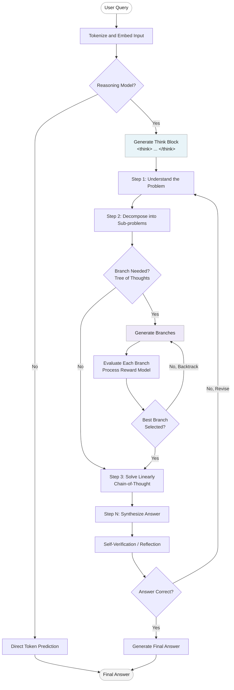
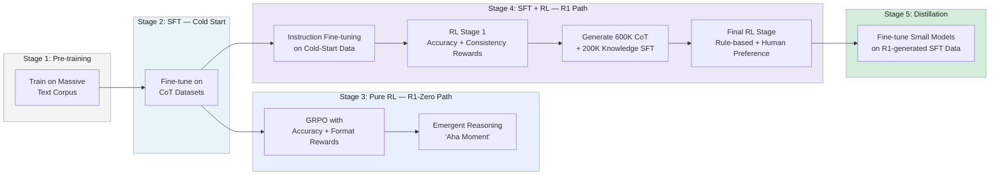
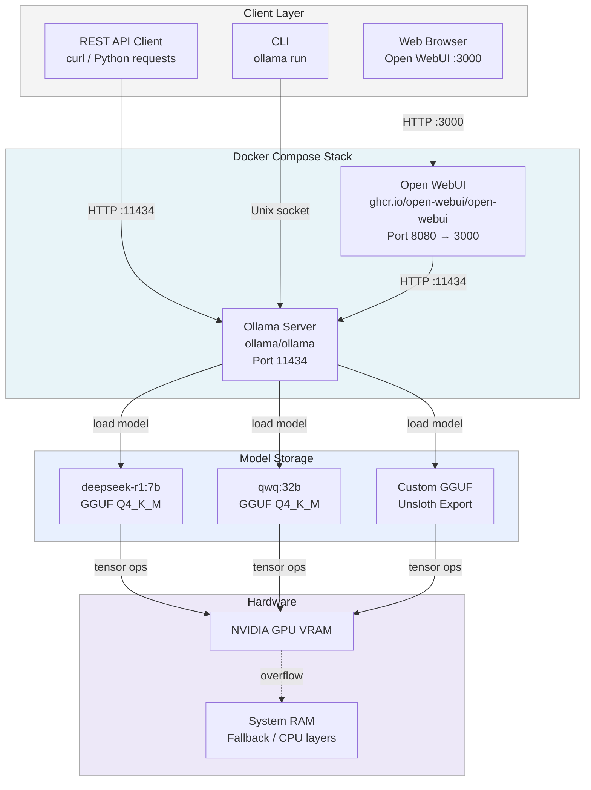
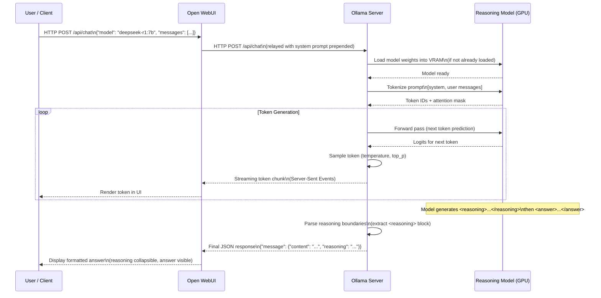
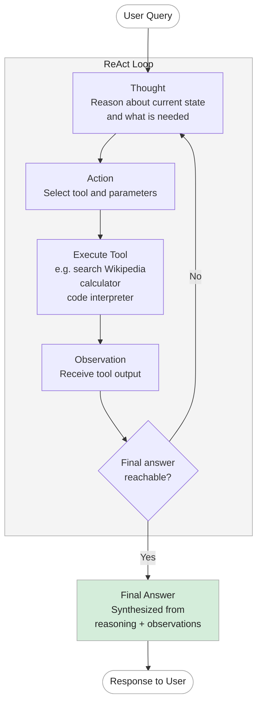

# Reasoning with Large Language Models

Large Language Models (LLMs) implement **reasoning** by breaking down complex problems into intermediate,
sequential steps — often termed *Chain-of-Thought* (CoT) — rather than predicting an immediate answer.
This approach transforms the query-response process from *retrieving* the answer to *calculating* the answer.

---

## Table of Contents

1. [Overview](#1-overview)
2. [Core Concepts](#2-core-concepts)
   - [2.1 Chain-of-Thought (CoT) Prompting](#21-chain-of-thought-cot-prompting)
   - [2.2 Reinforcement Learning for Reasoning](#22-reinforcement-learning-for-reasoning)
   - [2.3 Test-Time Computation and Scaling](#23-test-time-computation-and-scaling)
   - [2.4 Tree of Thoughts](#24-tree-of-thoughts)
   - [2.5 Self-Correction and Reflection](#25-self-correction-and-reflection)
   - [2.6 Large Reasoning Models (LRM)](#26-large-reasoning-models-lrm)
3. [Reasoning Flow Diagram](#3-reasoning-flow-diagram)
4. [Training Approaches](#4-training-approaches)
   - [4.1 Inference-Time Scaling](#41-inference-time-scaling)
   - [4.2 Pure Reinforcement Learning](#42-pure-reinforcement-learning)
   - [4.3 Supervised Fine-Tuning and RL (SFT + RL)](#43-supervised-fine-tuning-and-rl-sft--rl)
   - [4.4 Distillation](#44-distillation)
   - [4.5 Training Pipeline Diagram](#45-training-pipeline-diagram)
5. [Architectural Approaches](#5-architectural-approaches)
6. [Metrics](#6-metrics)
7. [Benchmarks](#7-benchmarks)
8. [Libraries and Tools](#8-libraries-and-tools)
9. [Datasets](#9-datasets)
10. [Project Structure](#10-project-structure)
11. [Environment Setup](#11-environment-setup)
12. [Train Your Own Reasoning Model with Unsloth (GRPO)](#12-train-your-own-reasoning-model-with-unsloth-grpo)
    - [12.1 Install Dependencies](#121-install-dependencies)
    - [12.2 Load Model with Unsloth](#122-load-model-with-unsloth)
    - [12.3 Prepare Dataset](#123-prepare-dataset)
    - [12.4 Define Reward Functions](#124-define-reward-functions)
    - [12.5 Configure and Run Training](#125-configure-and-run-training)
    - [12.6 Save and Export](#126-save-and-export)
13. [Local Deployment with Ollama and Open WebUI](#13-local-deployment-with-ollama-and-open-webui)
    - [13.1 Install and Configure Ollama](#131-install-and-configure-ollama)
    - [13.2 Deploy Open WebUI with Docker](#132-deploy-open-webui-with-docker)
    - [13.3 Deployment Architecture Diagram](#133-deployment-architecture-diagram)
    - [13.4 Configure Reasoning Parser (Ollama Backend)](#134-configure-reasoning-parser-ollama-backend)
14. [Prompt Configuration](#14-prompt-configuration)
    - [14.1 System Prompt for Reasoning](#141-system-prompt-for-reasoning)
    - [14.2 Prompt Strategy Guide](#142-prompt-strategy-guide)
    - [14.3 Configure Prompts in Open WebUI](#143-configure-prompts-in-open-webui)
    - [14.4 Configure Reasoning Display (Open WebUI Frontend)](#144-configure-reasoning-display-open-webui-frontend)
15. [Information Flow and Message Exchange](#15-information-flow-and-message-exchange)
    - [15.1 Client-Server Interaction Diagram](#151-client-server-interaction-diagram)
    - [15.2 ReAct Loop (Reason + Act)](#152-react-loop-reason--act)
16. [Agentic Reasoning with Tool Use](#16-agentic-reasoning-with-tool-use)
17. [References](#17-references)

---

## 1. Overview

Reasoning in large language models (LLMs) refers to the capability to solve complex, multi-step problems
by breaking them down through logical deduction and generating a structured *thought* process before
providing a final answer. Unlike standard LLMs, specialized reasoning models use reinforced training to
self-correct, explore alternative solutions, and utilize *test-time computation* to improve accuracy.
These capabilities are commonly applied to mathematics, coding, and complex logic tasks.

Key terminology:

- **Large Reasoning Model (LRM)** — A model specifically trained and capable of complex reasoning.
- **Chain-of-Thought (CoT)** — A technique inducing the model to generate intermediate steps.
- **Thinking Process** — A thought trace or hidden intermediate steps used by the model to reach a conclusion.
- **Test-Time Compute (TTC)** — Using more processing time at inference to improve answer quality.
- **Self-Correction / Reflection** — The ability of the model to revise its own earlier reasoning steps.
- **GRPO** — Group Relative Policy Optimization, an RL algorithm used to train reasoning behavior.
- **Process Reward Model (PRM)** — A form of feedback that rewards each step of a reasoning chain.

---

## 2. Core Concepts

### 2.1 Chain-of-Thought (CoT) Prompting

Chain-of-Thought prompting is a technique in which models break down complex problems into a sequence of
step-by-step reasoning steps before arriving at a final answer. This allows for a *reasoning-through-text*
process, which is more accurate for arithmetic and logical tasks than immediate semantic retrieval.

Models output their intermediate reasoning between `<think>` and `</think>` tags (or similar structured
markers), making the reasoning trace both inspectable and verifiable.

**Zero-Shot CoT**: Instead of providing worked examples, the prompt simply instructs the model to
*"think step by step"*. This produces reasoning chains, making models inherently better at managing
multi-step problems without needing a database lookup.

**Few-Shot CoT**: Provide several worked examples in the prompt so the model can pattern-match
against them before solving the new problem.

> Note from DeepSeek-R1 research: Zero-shot prompting consistently outperforms few-shot prompting for
> reasoning models. The model performs best when users state the problem directly and specify the output
> format, without complex prompting patterns.

### 2.2 Reinforcement Learning for Reasoning

Models are trained using feedback mechanisms that reward logically coherent steps, not just the final
result. This improves logical consistency and encourages emergent *self-verification* behavior.

- **RLHF (Reinforcement Learning from Human Feedback)** — Reward correct, high-quality reasoning traces
  using human-preference labels.
- **GRPO (Group Relative Policy Optimization)** — Optimizes responses efficiently without a value
  function (unlike PPO). The model generates groups of responses, each scored by a reward function.
  Scores are compared to the group average, reinforcing higher-scoring responses.
- **PPO (Proximal Policy Optimization)** — An RL algorithm that relies on a value function; heavier
  than GRPO but widely used in RLHF pipelines.
- **Process Reward Models (PRM)** — Reward each intermediate step of a reasoning chain rather than
  just the final answer, improving step-level quality.

**The GRPO update cycle:**

1. The model generates a group of responses for the same prompt.
2. Each response is scored by a deterministic reward function (e.g., correct answer = 1, format error = -0.1).
3. The average score for the group is computed.
4. Each response's score is compared to the group average.
5. The model parameters are updated to favor higher-scoring responses.

### 2.3 Test-Time Computation and Scaling

Test-time compute scaling refers to increasing computational resources *during inference* to improve
output quality — without retraining the model. Techniques include:

- **Chain-of-thought generation** — More output tokens = more reasoning = better answers.
- **Majority voting** — Generate multiple answers; return the most common one.
- **Beam search** — Explore multiple candidate continuations in parallel.
- **Monte Carlo Tree Search (MCTS)** — Explore and backtrack across reasoning paths.

Libraries such as Unsloth allow models to *spend more time thinking* to improve accuracy on difficult
queries, similar to OpenAI's o-series models.

### 2.4 Tree of Thoughts

Structure-Based Reasoning via *Tree of Thoughts* (ToT) allows models to:

1. Generate multiple reasoning *branches* from the same starting point.
2. Evaluate each branch independently.
3. Backtrack and prune branches that are deemed incorrect.
4. Arrive at a final answer through the highest-quality path.

This contrasts with linear CoT (a single chain) by enabling exploration of the full solution space.

### 2.5 Self-Correction and Reflection

Advanced reasoning models can revise their own earlier reasoning steps. This is observed as:

- The model pauses mid-generation, recognizes an error, and explicitly rewrites the step.
- In pure RL training (e.g., DeepSeek-R1-Zero), self-verification emerges autonomously from reward
  signals — the **"Aha moment"** described in the DeepSeek-R1 technical report.

Journey learning (O1 Replication Journey paper, 2024) extends this by including *incorrect* solution
paths in SFT data, so the model learns both from right and wrong answers.

### 2.6 Large Reasoning Models (LRM)

Representative models in 2024-2025:

| Model              | Organization  | Training Method           | Notable Feature                     |
|--------------------|---------------|---------------------------|--------------------------------------|
| DeepSeek-R1        | DeepSeek      | SFT + RL (GRPO)           | Open-weight, MIT license             |
| DeepSeek-R1-Zero   | DeepSeek      | Pure RL                   | Reasoning emerges without SFT        |
| OpenAI o1 / o3     | OpenAI        | SFT + RL + inference TTC  | Closed-source                        |
| QwQ-32B-Preview    | Alibaba Qwen  | RL on Qwen 2.5            | Open-weight reasoning specialist     |
| Llama 3.1 (8B/70B) | Meta          | Base + distillation       | Widely used for local deployment     |

---

## 3. Reasoning Flow Diagram

The diagram below illustrates how a reasoning-capable LLM processes a complex query through
Chain-of-Thought before producing a final answer.



**Explanation of steps:**

| Step | Description |
|------|-------------|
| Tokenize and Embed Input | The raw query is tokenized and converted to contextual embeddings. |
| Reasoning Model Check | The system checks whether the model supports structured thought generation. |
| Generate Think Block | The model enters a `<think>...</think>` block and begins generating reasoning traces. |
| Decompose into Sub-problems | Complex tasks are split into smaller, solvable sub-tasks. |
| Branch / Tree of Thoughts | If multiple solution paths exist, branches are generated and evaluated. |
| Process Reward Model | Each intermediate step or branch is scored for logical validity and relevance. |
| Self-Verification | The model reviews its own steps and revises if an inconsistency is detected. |
| Final Answer | The synthesized answer is produced outside the think block and returned to the user. |

---

## 4. Training Approaches

### 4.1 Inference-Time Scaling

Reasoning capabilities are enhanced *without retraining*, purely by increasing compute at inference time.
Techniques include CoT prompting, voting, beam search, and MCTS. This is the most budget-friendly
approach but cannot add fundamentally new reasoning skills.

### 4.2 Pure Reinforcement Learning

Demonstrated by DeepSeek-R1-Zero: a pre-trained base model is trained exclusively with RL rewards
(accuracy and format rewards). No supervised fine-tuning is applied beforehand. The "aha moment" occurs
when the model begins generating reasoning traces unprompted — an emergent behavior from reward signals.

Reward types used:
- **Accuracy reward** — Compiler verification for code; deterministic check for math answers.
- **Format reward** — LLM judge ensures `<think>` tags and structure are present.

### 4.3 Supervised Fine-Tuning and RL (SFT + RL)

The most effective approach for high-performance reasoning models (e.g., DeepSeek-R1, OpenAI o1):

1. Train a base model on a large text corpus (pre-training).
2. Fine-tune on high-quality Chain-of-Thought datasets (SFT stage).
3. Apply RL (GRPO/PPO) to reward logically correct reasoning chains.
4. Optionally, run a second SFT round on data generated by the RL-trained model.
5. Final RL pass with human-preference labels for broader alignment.

### 4.4 Distillation

Smaller models (Llama 8B/70B, Qwen 1.5B–32B) are fine-tuned on SFT data generated by a larger
reasoning model (e.g., DeepSeek-R1 671B). This approach is more compute-efficient than full RL+SFT
and allows consumer-grade hardware to run reasoning-capable models. It cannot, however, produce a
reasoning model stronger than the teacher.

Sky-T1 (2024) demonstrated that only 17K SFT samples with a cost of ~$450 can produce a 32B
distilled model competitive with o1 on several benchmarks.

### 4.5 Training Pipeline Diagram



---

## 5. Architectural Approaches

While a standard Transformer learns some reasoning through scale, specialized architectural choices
enhance this capability further.

**Recurrent Transformers**: A hierarchical or recurrent approach where data passes through the same
layers multiple times before output. This allows deeper *thinking* in the latent space without
increasing parameter count — analogous to a human re-reading a problem.

**Mixture-of-Experts (MoE)**: Feed-forward layers are replaced with multiple independent *experts*.
The router selects the most relevant experts for each token, allowing the model to specialize in
logical domains (e.g., math vs. code) more efficiently. DeepSeek-V3 uses this architecture.

**LoRA / QLoRA (Parameter-Efficient Fine-Tuning)**: Low-Rank Adaptation attaches small trainable
matrices to frozen pre-trained weights. This drastically reduces VRAM requirements and enables
GRPO training on consumer GPUs (7GB VRAM for a 1.5B parameter model with Unsloth).

---

## 6. Metrics

Evaluating reasoning models requires metrics beyond simple accuracy:

| Metric | Description |
|--------|-------------|
| **Stepwise Validity** | Whether a reasoning step follows logically from the previous one. |
| **Stepwise Relevance** | Whether a step moves the problem toward a solution (CaSE framework). |
| **Accuracy** | Final answer correctness. Often insufficient on its own for reasoning evaluation. |
| **F1 Score** | Balance between precision and recall. Useful for reasoning accuracy on community benchmarks (e.g., Brainly.com). |
| **Pass@k** | Whether the correct answer appears in the top *k* generated candidates. |
| **Process Reward Score** | Average reward assigned by a Process Reward Model across all reasoning steps. |
| **Token Efficiency** | Reasoning quality per output token, comparing accuracy vs. verbosity tradeoff. |
| **Self-Consistency Rate** | Proportion of runs producing the same final answer across multiple samples. |

**CaSE (Causal Stepwise Evaluation)** is a dedicated framework for analyzing step-by-step reasoning
relevance and coherence, measuring whether each intermediate step causally contributes to the final answer.

---

## 7. Benchmarks

Standard benchmarks used to evaluate reasoning capabilities:

| Benchmark | Domain | Description |
|-----------|--------|-------------|
| **GSM8K** | Math | Grade-school math word problems requiring multi-step arithmetic. |
| **MATH** | Advanced Math | Competition-level mathematics problems (AMC, AIME, etc.). |
| **ARC (Challenge)** | Science / Logic | Advanced science questions requiring reasoning over facts. |
| **LogiQA** | Logical Reasoning | Logical reading comprehension questions (translated from civil exams). |
| **HumanEval** | Code | Function synthesis from docstrings, testing code reasoning. |
| **MBPP** | Code | Mostly basic Python programming problems. |
| **BIG-Bench Hard** | Mixed | Tasks where standard LLMs perform below human level. |
| **CaSE** | Stepwise Reasoning | Causal Stepwise Evaluation — step-level relevance and coherence. |

AlphaGo-style RL has influenced training strategies, using reward mechanisms to train models to
refine reasoning paths iteratively, similar to how AlphaGo refined its game strategy through
self-play.

**DeepSeek-R1 vs. OpenAI o1 on Key Benchmarks** (from DeepSeek-R1 technical report, Jan 2025):

| Benchmark | DeepSeek-R1 | OpenAI o1 |
|-----------|-------------|-----------|
| AIME 2024 | 79.8% | 79.2% |
| MATH-500  | 97.3% | 96.4% |
| Codeforces | 96.3% | 96.6% |
| MMLU      | 90.8% | 91.8% |

---

## 8. Libraries and Tools

### Inference

| Library | Core Reasoning Feature | Best For |
|---------|------------------------|----------|
| **vLLM** | High-throughput MoE / Long Context, Reasoning Parsers | Production / Cloud Serving |
| **Ollama** | Local R1 / QwQ execution, GGUF support | Local Dev / Edge |
| **llama.cpp** | Quantization (GGUF), speculative decoding | Consumer GPUs / CPU |
| **LM Studio** | GUI-based local inference | Desktop prototyping |

**vLLM reasoning details** (v0.7.1+):
- Uses model-specific parsers (e.g., `qwen3_reasoning_parser.py`) to detect reasoning boundaries
  marked by `<think>` / `</think>` tags.
- Extracts reasoning into a separate `reasoning` field in OpenAI-compatible API responses.
- Continuous batching and PagedAttention manage KV-cache for long reasoning chains.

**llama.cpp reasoning details**:
- Speculative decoding pairs a large reasoning model with a smaller draft model (e.g., LLaMA 8B
  with a 1B draft), sometimes doubling throughput for long sequences.
- K-quants compress models to 1.5-bit or 4-bit, allowing 70B+ models to fit in consumer RAM/VRAM.

### Training

| Library | Purpose |
|---------|---------|
| **Unsloth** | Accelerated LoRA/QLoRA fine-tuning + GRPO; 80% less VRAM than HuggingFace baseline |
| **TRL (HuggingFace)** | GRPOTrainer, PPOTrainer, DPOTrainer |
| **DeepSpeed** | ZeRO optimization for multi-GPU training |

### Agent Frameworks

| Framework | Description |
|-----------|-------------|
| **LangGraph** | Graph-based agent workflow, state management, tool execution |
| **CrewAI** | Multi-agent collaboration framework |
| **AutoGen** | Conversational multi-agent framework (Microsoft) |
| **Agno** | Lightweight agent framework with structured reasoning support |

### Knowledge Bases

| Library | Description |
|---------|-------------|
| **ChromaDB** | Local vector database for semantic retrieval |
| **Faiss** | Facebook AI Similarity Search — high-performance vector index |

---

## 9. Datasets

### Recommended for Reasoning Training

| Dataset | Source | Description | Link |
|---------|--------|-------------|------|
| **GSM8K** | OpenAI | Grade-school math word problems with step-by-step solutions | [openai/gsm8k](https://huggingface.co/datasets/openai/gsm8k) |
| **OpenMathReasoning-mini** | NVIDIA / Unsloth | Math problems paired with `generated_solution` reasoning traces. Top choice for Unsloth GRPO. | [nvidia/OpenMathReasoning-mini](https://huggingface.co/datasets/nvidia/OpenMathReasoning-mini) |
| **Multilingual-Thinking** | HuggingFaceH4 | Reasoning examples translated into multiple languages. Recommended for initial Unsloth experiments. | [HuggingFaceH4/multilingual-thinking](https://huggingface.co/datasets/HuggingFaceH4/multilingual-thinking) |
| **MATH** | Hendrycks et al. | Competition-level math with full solution steps | [hendrycks/math](https://huggingface.co/datasets/hendrycks/math) |
| **ARC Challenge** | Allen AI | Advanced science reasoning questions | [allenai/ai2_arc](https://huggingface.co/datasets/allenai/ai2_arc) |
| **LogiQA** | Liu et al. | Logical reasoning from Chinese civil service exams | [lucasmccabe/logiqa](https://huggingface.co/datasets/lucasmccabe/logiqa) |

### Selecting the Right Dataset

When using Unsloth for reasoning, two main paths exist:

- **SFT path**: Use a dataset that already contains reasoning/CoT steps in the answer column
  (e.g., OpenMathReasoning-mini with `generated_solution` field).
- **GRPO path**: Use a dataset with just question and answer pairs. The model *discovers* reasoning
  patterns through reward functions. This is the method used by DeepSeek-R1.

For LLMs, datasets are collections of data used to train models. See the
[Applying Chat Templates with Unsloth](https://unsloth.ai/docs/get-started/fine-tuning-llms-guide/datasets-guide#applying-chat-templates-with-unsloth)
guide for how to format dataset entries with chat templates.

---

## 10. Project Structure

```
reasoning/
 ◈ README.md                      Main documentation and step-by-step guide
 ◈ .gitignore                     Git ignore rules (excludes venv, cache, artifacts)
 ◈ requirements.txt               Python dependencies
 ▸ venv/                          Virtual environment (excluded from Git)
 ▸ scripts/
   ▪ train_grpo.py                GRPO training script with Unsloth
   ▪ inference_ollama.py          Inference via Ollama REST API
   ▪ react_agent.py               ReAct agent loop implementation
 ▸ prompts/
   ▪ system_reasoning.txt         System prompt for reasoning mode
   ▪ system_react.txt             System prompt for ReAct agent loop
 ▸ docker/
   ▪ docker-compose.yml           Ollama + Open WebUI stack
 ▸ outputs/
   ▪ grpo_saved_lora/             LoRA adapter weights after GRPO training
```

---

## 11. Environment Setup

### Create and Activate Virtual Environment

```bash
# Navigate to the project directory
cd /path/to/reasoning

# Create virtual environment
python3 -m venv venv

# Activate on Linux / macOS
source venv/bin/activate

# Activate on Windows
# venv\Scripts\activate

# Verify activation (prompt should show (venv))
which python
```

### Install Dependencies

```bash
pip install --upgrade pip

# Core training libraries
pip install unsloth vllm

# Additional dependencies
pip install --upgrade pillow
pip install torch torchvision torchaudio --index-url https://download.pytorch.org/whl/cu121

# Dataset and training utilities
pip install datasets transformers trl accelerate

# Agent frameworks
pip install langchain langgraph

# Inference utilities
pip install requests httpx

# Save dependencies
pip freeze > requirements.txt
```

### Verify GPU Availability

```python
import torch
print(f"CUDA available: {torch.cuda.is_available()}")
print(f"GPU: {torch.cuda.get_device_name(0) if torch.cuda.is_available() else 'CPU only'}")
print(f"VRAM: {torch.cuda.get_device_properties(0).total_memory / 1e9:.1f} GB" if torch.cuda.is_available() else "")
```

Minimum VRAM requirements with Unsloth:
- 7 GB VRAM — Train a 1.5B parameter reasoning model (e.g., Qwen2.5 1.5B) via QLoRA + GRPO.
- 15 GB VRAM — Train models up to 15B parameters (e.g., Llama 3.1 8B, Phi-4 14B).
- 48 GB VRAM — Train Llama 3.3 70B with Unsloth + vLLM integration.

---

## 12. Train Your Own Reasoning Model with Unsloth (GRPO)

This section walks through training a reasoning model using
[Group Relative Policy Optimization (GRPO)](https://unsloth.ai/blog/r1-reasoning) with the
[Unsloth](https://github.com/unslothai/unsloth) library. The approach mirrors DeepSeek-R1-Zero's
methodology scaled to consumer hardware.

Reference: [Train your own R1 reasoning model with Unsloth (GRPO)](https://unsloth.ai/blog/r1-reasoning)
Reference: [Practical Exercise: GRPO with Unsloth — HuggingFace LLM Course](https://huggingface.co/learn/llm-course/en/chapter12/6)
Reference: [Reinforcement Learning (RL) Guide — Unsloth Docs](https://unsloth.ai/docs/get-started/reinforcement-learning-rl-guide)

### 12.1 Install Dependencies

```bash
pip install unsloth vllm
pip install --upgrade pillow
pip install trl datasets
```

### 12.2 Load Model with Unsloth

Create `scripts/train_grpo.py`:

```python
import torch
from unsloth import FastLanguageModel

# --- Configuration ---
MODEL_NAME = "google/gemma-3-1b-it"   # or "unsloth/Llama-3.1-8B-Instruct"
MAX_SEQ_LENGTH = 1024                  # Increase for longer reasoning traces
LORA_RANK = 32                         # Larger rank = more expressive, but slower

# --- Load base model with 4-bit quantization ---
model, tokenizer = FastLanguageModel.from_pretrained(
    model_name=MODEL_NAME,
    max_seq_length=MAX_SEQ_LENGTH,
    load_in_4bit=True,       # Use 4-bit for VRAM savings
    fast_inference=True,     # Enable vLLM fast inference
    max_lora_rank=LORA_RANK,
    gpu_memory_utilization=0.6,
)

# --- Apply LoRA adapters ---
model = FastLanguageModel.get_peft_model(
    model,
    r=LORA_RANK,
    target_modules=[
        "q_proj", "k_proj", "v_proj", "o_proj",
        "gate_proj", "up_proj", "down_proj",
    ],
    lora_alpha=LORA_RANK,
    use_gradient_checkpointing="unsloth",  # Enables long-context training
    random_state=3407,
)
```

### 12.3 Prepare Dataset

The example below uses GSM8K (grade-school math) to fine-tune for arithmetic reasoning.
The system prompt enforces a structured output format with explicit reasoning and answer tags.

```python
import re
from datasets import load_dataset, Dataset

# --- System prompt enforcing structured reasoning output ---
SYSTEM_PROMPT = """
Respond in the following format:
<reasoning>
...
</reasoning>
<answer>
...
</answer>
"""

XML_COT_FORMAT = """\
<reasoning>
{reasoning}
</reasoning>
<answer>
{answer}
</answer>
"""

# --- Helper functions ---
def extract_xml_answer(text: str) -> str:
    """Extract the content inside <answer>...</answer> tags."""
    answer = text.split("<answer>")[-1]
    answer = answer.split("</answer>")[0]
    return answer.strip()

def extract_hash_answer(text: str) -> str | None:
    """Extract the final answer after '####' in GSM8K format."""
    if "####" not in text:
        return None
    return text.split("####")[1].strip()

# --- Load and format dataset ---
def get_gsm8k_questions(split: str = "train") -> Dataset:
    data = load_dataset("openai/gsm8k", "main")[split]
    data = data.map(
        lambda x: {
            "prompt": [
                {"role": "system", "content": SYSTEM_PROMPT},
                {"role": "user", "content": x["question"]},
            ],
            "answer": extract_hash_answer(x["answer"]),
        }
    )
    return data

dataset = get_gsm8k_questions()
print(f"Dataset size: {len(dataset)} examples")
print(f"Sample prompt: {dataset[0]['prompt'][1]['content']}")
print(f"Sample answer: {dataset[0]['answer']}")
```

To use the **OpenMathReasoning-mini** dataset instead (better for reasoning quality):

```python
from datasets import load_dataset

dataset = load_dataset("nvidia/OpenMathReasoning-mini", split="train")
# The 'generated_solution' column contains reasoning traces
# Map to the prompt/answer format expected by GRPOTrainer
```

### 12.4 Define Reward Functions

Reward functions are the core of GRPO. They score each generated completion and guide the model
toward desired behavior. Multiple reward functions are composed additively.

```python
# --- Correctness: reward when model's answer matches ground truth ---
def correctness_reward_func(prompts, completions, answer, **kwargs) -> list[float]:
    responses = [completion[0]["content"] for completion in completions]
    extracted_responses = [extract_xml_answer(r) for r in responses]
    return [2.0 if r == a else 0.0 for r, a in zip(extracted_responses, answer)]

# --- Integer check: reward when answer is a number (useful for math) ---
def int_reward_func(completions, **kwargs) -> list[float]:
    responses = [completion[0]["content"] for completion in completions]
    extracted_responses = [extract_xml_answer(r) for r in responses]
    return [0.5 if r.isdigit() else 0.0 for r in extracted_responses]

# --- Strict format: enforce exact XML structure ---
def strict_format_reward_func(completions, **kwargs) -> list[float]:
    pattern = r"^<reasoning>\n.*?\n</reasoning>\n<answer>\n.*?\n</answer>\n$"
    responses = [completion[0]["content"] for completion in completions]
    matches = [re.match(pattern, r, re.DOTALL) for r in responses]
    return [0.5 if match else 0.0 for match in matches]

# --- Soft format: more lenient XML structure check ---
def soft_format_reward_func(completions, **kwargs) -> list[float]:
    pattern = r"<reasoning>.*?</reasoning>\s*<answer>.*?</answer>"
    responses = [completion[0]["content"] for completion in completions]
    matches = [re.match(pattern, r, re.DOTALL) for r in responses]
    return [0.5 if match else 0.0 for match in matches]

# --- XML tag count: reward correct tag usage, penalize trailing content ---
def count_xml(text: str) -> float:
    count = 0.0
    if text.count("<reasoning>\n") == 1:
        count += 0.125
    if text.count("\n</reasoning>\n") == 1:
        count += 0.125
    if text.count("\n<answer>\n") == 1:
        count += 0.125
        count -= len(text.split("\n</answer>\n")[-1]) * 0.001
    if text.count("\n</answer>") == 1:
        count += 0.125
        count -= (len(text.split("\n</answer>")[-1]) - 1) * 0.001
    return count

def xmlcount_reward_func(completions, **kwargs) -> list[float]:
    contents = [completion[0]["content"] for completion in completions]
    return [count_xml(c) for c in contents]
```

Reward function summary:

| Reward Function | Weight | Purpose |
|-----------------|--------|---------|
| `correctness_reward_func` | 2.0 | Ground-truth answer correctness |
| `int_reward_func` | 0.5 | Numeric answer format |
| `strict_format_reward_func` | 0.5 | Exact XML structure |
| `soft_format_reward_func` | 0.5 | Relaxed XML structure |
| `xmlcount_reward_func` | 0.5 | Proper tag usage without trailing content |

### 12.5 Configure and Run Training

```python
from trl import GRPOConfig, GRPOTrainer

MAX_PROMPT_LENGTH = 256

training_args = GRPOConfig(
    learning_rate=5e-6,
    adam_beta1=0.9,
    adam_beta2=0.99,
    weight_decay=0.1,
    warmup_ratio=0.1,
    lr_scheduler_type="cosine",
    optim="paged_adamw_8bit",
    logging_steps=1,
    per_device_train_batch_size=1,
    gradient_accumulation_steps=1,   # Increase to 4 for smoother training
    num_generations=6,               # Decrease if out of memory
    max_prompt_length=MAX_PROMPT_LENGTH,
    max_completion_length=MAX_SEQ_LENGTH - MAX_PROMPT_LENGTH,
    max_steps=250,                   # Increase to 1000+ for production quality
    save_steps=250,
    max_grad_norm=0.1,
    report_to="none",                # Set to "wandb" for experiment tracking
    output_dir="outputs",
)

trainer = GRPOTrainer(
    model=model,
    processing_class=tokenizer,
    reward_funcs=[
        xmlcount_reward_func,
        soft_format_reward_func,
        strict_format_reward_func,
        int_reward_func,
        correctness_reward_func,
    ],
    args=training_args,
    train_dataset=dataset,
)

# Start training — wait at least 150-200 steps before expecting reward increases
trainer.train()
```

> Training guidance: Wait at least 300 steps for the reward to increase consistently.
> For production-quality results, train for at least 12 hours. Models below 1.5B parameters
> may not correctly generate thinking tokens. Apply GRPO to a model of at least 1.5B parameters.

### 12.6 Save and Export

```python
# Save LoRA adapter weights
model.save_lora("outputs/grpo_saved_lora")

# Save full merged model at 16-bit precision
model.save_pretrained_merged("outputs/model_merged", tokenizer, save_method="merged_16bit")

# Export to GGUF format for Ollama / llama.cpp
model.push_to_hub_gguf(
    "your-username/model-name",
    tokenizer,
    quantization_method=["q4_k_m", "q8_0", "q5_k_m"],
    token="your-huggingface-token",
)
```

To test the trained model locally before export:

```python
from vllm import SamplingParams

text = tokenizer.apply_chat_template(
    [
        {"role": "system", "content": SYSTEM_PROMPT},
        {"role": "user", "content": "A train travels at 60 mph for 3 hours. How far does it travel?"},
    ],
    tokenize=False,
    add_generation_prompt=True,
)

sampling_params = SamplingParams(temperature=0.8, top_p=0.95, max_tokens=1024)
output = (
    model.fast_generate(
        text,
        sampling_params=sampling_params,
        lora_request=model.load_lora("outputs/grpo_saved_lora"),
    )[0].outputs[0].text
)

print(output)
# Expected output contains <reasoning>...</reasoning><answer>180 miles</answer>
```

---

## 13. Local Deployment with Ollama and Open WebUI

This section describes how to set up a fully local, open-source reasoning stack using
[Ollama](https://ollama.com/) for model serving and
[Open WebUI](https://github.com/open-webui/open-webui) as the chat interface, both running
via Docker.

### 13.1 Install and Configure Ollama

**Option A — Native install:**

```bash
# Install Ollama on Linux
curl -fsSL https://ollama.com/install.sh | sh

# Start the Ollama server
ollama serve
```

**Pull a reasoning-capable model:**

```bash
# QwQ — Alibaba's reasoning specialist (32B, requires ~20 GB VRAM)
ollama pull qwq

# DeepSeek-R1 distilled (7B, ~8 GB VRAM — recommended for consumer GPUs)
ollama pull deepseek-r1:7b

# Llama 3.1 8B Instruct (general-purpose with reasoning)
ollama pull llama3.1:8b

# List downloaded models
ollama list
```

**Test via CLI:**

```bash
ollama run qwq "A train travels at 60 mph for 3 hours. How far does it travel? Think step by step."
```

**Test via REST API:**

```bash
curl http://localhost:11434/api/chat -d '{
  "model": "deepseek-r1:7b",
  "messages": [
    {
      "role": "system",
      "content": "You are a reasoning assistant. Think step by step before answering."
    },
    {
      "role": "user",
      "content": "What is 17 multiplied by 24?"
    }
  ],
  "stream": false
}'
```

**Load a custom GGUF model (e.g., your Unsloth-exported model):**

Create a `Modelfile`:

```
FROM ./outputs/model_merged.gguf
SYSTEM "You are a reasoning assistant. Always think step by step inside <reasoning> tags before providing your final <answer>."
PARAMETER temperature 0.7
PARAMETER top_p 0.9
```

```bash
ollama create my-reasoning-model -f Modelfile
ollama run my-reasoning-model
```

### 13.2 Deploy Open WebUI with Docker

Create `docker/docker-compose.yml`:

```yaml
services:
  ollama:
    image: ollama/ollama:latest
    container_name: ollama
    volumes:
      - ollama_data:/root/.ollama
    ports:
      - "11434:11434"
    deploy:
      resources:
        reservations:
          devices:
            - driver: nvidia
              count: all
              capabilities: [gpu]
    restart: unless-stopped

  open-webui:
    image: ghcr.io/open-webui/open-webui:main
    container_name: open-webui
    depends_on:
      - ollama
    ports:
      - "3000:8080"
    environment:
      - OLLAMA_BASE_URL=http://ollama:11434
      - WEBUI_SECRET_KEY=change-this-to-a-secure-random-string
    volumes:
      - open_webui_data:/app/backend/data
    restart: unless-stopped

volumes:
  ollama_data:
  open_webui_data:
```

**Start the stack:**

```bash
cd docker
docker compose up -d

# Check containers are running
docker compose ps

# Pull a model into the running Ollama container
docker exec ollama ollama pull deepseek-r1:7b

# View logs
docker compose logs -f open-webui
```

**Access Open WebUI** at `http://localhost:3000` in your browser.

> For CPU-only setups, remove the `deploy.resources` block from the `ollama` service definition
> and use smaller quantized models (e.g., `deepseek-r1:1.5b`).

### 13.3 Deployment Architecture Diagram



### 13.4 Configure Reasoning Parser (Ollama Backend)

To enable Ollama to correctly identify and separate reasoning content from the final response,
you must start the service with a `--reasoning-parser` flag. Without this flag, the raw
`<think>...</think>` tags appear as plain text instead of being parsed into a structured
`reasoning` field in the API response.

> **Reference:** [Thinking — Ollama Blog](https://ollama.com/blog/thinking)

**Step 1 — Stop any running Ollama instance:**

```bash
# If running as a systemd service
sudo systemctl stop ollama

# Or kill the process directly
pkill ollama
```

**Step 2 — Start Ollama with the reasoning parser:**

```bash
# DeepSeek-R1 style (<think>...</think> tags)
ollama serve --reasoning-parser deepseek_r1

# Alternative: Qwen3 style
ollama serve --reasoning-parser qwen3
```

> When the parser is active, Ollama strips the `<think>...</think>` block from the visible
> response and returns it separately in `message.thinking` within the API response JSON.
> Open WebUI reads this field to render a collapsible "Thinking" section.

**Step 3 — Verify the parser is active:**

```bash
curl http://localhost:11434/api/chat -d '{
  "model": "deepseek-r1:7b",
  "messages": [{"role": "user", "content": "What is 12 * 8?"}],
  "stream": false
}'
# Look for a "thinking" key alongside "content" in the response.
```

**CLI reasoning toggle (interactive sessions):**

When chatting via `ollama run`, you can toggle thinking on or off mid-session:

```
>>> /set think
Set 'think' mode.

>>> /set nothink
Unset 'think' mode.
```

**Supported reasoning parsers:**

| Parser | Models | Tag format |
|--------|--------|------------|
| `deepseek_r1` | DeepSeek-R1, DeepSeek-R1-Distill-* | `<think>...</think>` |
| `qwen3` | Qwen3 series | `<think>...</think>` |

---

## 14. Prompt Configuration

### 14.1 System Prompt for Reasoning

A well-crafted system prompt is essential for activating the reasoning behavior of the model.
The two prompt files in the `prompts/` directory serve distinct purposes:

| File | Purpose | Tag format |
|------|---------|------------|
| `prompts/system_reasoning.txt` | Structured CoT for math / logic tasks | `<reasoning>` / `<answer>` |
| `prompts/system_react.txt` | ReAct agent loop with tool calls | Thought / Action / Observation |

> **Note on tag format:** The prompt files use `<reasoning>` and `<answer>` tags, which work
> well for GRPO-trained models. For models served via Ollama with the reasoning parser enabled
> (section 13.4), use `<think>` tags instead so Ollama can automatically separate the thinking
> trace from the visible answer. See section 14.4 for configuring custom tag mapping in Open WebUI.

**`prompts/system_reasoning.txt`** — structured CoT prompt:

```
You are a precise mathematical reasoning assistant.

When presented with a problem, think carefully step by step before giving a final answer.
Always structure your response in the following format:

<reasoning>
[Write your full chain-of-thought here. Break the problem into smaller sub-problems.
Show all arithmetic, unit conversions, and intermediate steps explicitly.
Re-read the question before writing the answer to avoid off-by-one or misread errors.]
</reasoning>
<answer>
[Write only the final answer here, as a concise value or statement. No explanation.]
</answer>

Rules:
- Never skip reasoning steps, even for simple problems.
- If the problem is ambiguous, state your assumptions in <reasoning>.
- The <answer> block must contain only the final result, not your working.
- Do not add any text outside the two XML blocks.
```

**`prompts/system_react.txt`** — ReAct agent loop:

```
You are a reasoning agent that solves problems by alternating between Thought, Action,
and Observation steps.

Always follow this loop:

Thought: [Reason about the current state. What do you know? What do you need to find out?]
Action: [Call one of the available tools, or write "FINISH: <answer>" to terminate.]
Observation: [The result of the action will be provided here by the environment.]

... (repeat Thought / Action / Observation as many times as needed) ...

Thought: I now have enough information to answer.
Action: FINISH: [final answer]

Available tools:
- calculator(expression: str) -> float
    Evaluates a safe arithmetic expression. Supports +, -, *, /, **, parentheses.
    Example: calculator("(60 * 3) / 2")

Rules:
- Do not guess answers — use a tool if you are uncertain about a computation.
- Write exactly one action per turn.
- Never write two Thought/Action pairs without an Observation in between.
- Terminate with "FINISH: <answer>" as soon as you have the final answer.
- Do not make up Observation results; they will be provided by the environment.
```


### 14.2 Prompt Strategy Guide

Based on findings from the DeepSeek-R1 technical report and Unsloth documentation:

| Strategy | Recommendation | Reason |
|----------|---------------|--------|
| Zero-shot vs Few-shot | Prefer zero-shot | Few-shot consistently degrades reasoning model performance |
| Problem statement | State the problem directly and specify output format | Complex meta-instructions reduce performance |
| Language consistency | Use a single language throughout | Models mix languages in reasoning chains when prompts contain multiple languages |
| Chain-of-Thought trigger | Include "think step by step" or use `<think>` tag instructions | Activates explicit reasoning mode |
| Temperature | 0.6 – 0.8 for reasoning tasks | Lower temp = more deterministic reasoning; higher = more exploration |
| Max tokens | Set to at least 2048 for complex problems | Reasoning traces can be long; truncation breaks reasoning |

### 14.3 Configure Prompts in Open WebUI

**Attach a system prompt to a specific model:**

1. Open `http://localhost:3000` and log in.
2. Navigate to **Settings** > **Models**.
3. Select your reasoning model (e.g., `deepseek-r1:7b`).
4. Under **System Prompt**, paste the contents of `prompts/system_reasoning.txt`.
5. Set **Temperature** to `0.7` and **Max Tokens** to `4096`.
6. Save and start a new conversation.

**Create a reusable prompt shortcut:**

1. Navigate to **Workspace** > **Prompts**.
2. Click **New Prompt**.
3. Set a title (e.g., "Step-by-Step Reasoning") and paste your system prompt.
4. Assign a shortcut (e.g., `/reason`) so users can activate it with `/reason` in the chat input.

### 14.4 Configure Reasoning Display (Open WebUI Frontend)

Open WebUI can render reasoning traces in a collapsible **Thinking** section rather than
displaying raw XML tags in the chat. This requires the Ollama reasoning parser to be active
(see section 13.4) and the correct reasoning tags to be configured in Open WebUI.

> **Reference:** [Reasoning & Thinking Models — Open WebUI Docs](https://docs.openwebui.com/features/chat-conversations/chat-features/reasoning-models/)

**Step 1 — Open the Admin settings:**

1. Log in to Open WebUI at `http://localhost:3000`.
2. Click your avatar (top-right) > **Admin Panel** > **Settings** > **Interface**.

**Step 2 — Configure Reasoning Tags:**

Locate the **Reasoning Tags** setting (under the *General* or *Chat* group):

| Mode | When to use | Tags |
|------|------------|------|
| **Enabled (default)** | DeepSeek-R1, Qwen3, or any model using `<think>` | `<think>` / `</think>` |
| **Custom** | GRPO-trained models or any model using non-standard markers | e.g. `<reasoning>` / `</reasoning>` |

For models fine-tuned with the prompts in this project (`prompts/system_reasoning.txt`),
set **Custom** reasoning tags:

- **Start tag:** `<reasoning>`
- **End tag:** `</reasoning>`

Open WebUI will wrap the content between these tags in a collapsible *Thinking* block and
display only the `<answer>` content as the visible reply.

**Step 3 — Verify the display:**

1. Start a new chat with your reasoning model.
2. Ask a multi-step question (e.g., *"If a car travels at 60 mph for 2.5 hours, how far does it go?"*).
3. The response should show a collapsed **Thinking** section above the final answer.
4. Click the section to expand and inspect the full reasoning trace.

**Tag reference by model family:**

| Model | Tag format | Ollama parser |
|-------|-----------|---------------|
| DeepSeek-R1 / R1-Distill-* | `<think>...</think>` | `deepseek_r1` |
| Qwen3 | `<think>...</think>` | `qwen3` |
| Custom GRPO (this project) | `<reasoning>...</reasoning>` | *(no parser; use custom tags in Open WebUI)* |
| ReAct agent | Thought / Action / Observation | *(plain text; no collapsible section)* |

---

## 15. Information Flow and Message Exchange

### 15.1 Client-Server Interaction Diagram

The diagram below shows all messages exchanged between the client and the reasoning model server
for a single reasoning request.



**Message structure in OpenAI-compatible format:**

```json
{
  "model": "deepseek-r1:7b",
  "messages": [
    {
      "role": "system",
      "content": "You are a reasoning assistant. Think step by step..."
    },
    {
      "role": "user",
      "content": "A train travels at 60 mph for 3 hours. How far?"
    }
  ],
  "stream": true,
  "temperature": 0.7,
  "max_tokens": 2048
}
```

**Response structure:**

```json
{
  "id": "chatcmpl-abc123",
  "model": "deepseek-r1:7b",
  "choices": [
    {
      "message": {
        "role": "assistant",
        "content": "<reasoning>\nDistance = speed × time\n= 60 mph × 3 hours\n= 180 miles\n</reasoning>\n<answer>\n180 miles\n</answer>",
        "reasoning": "Distance = speed × time\n= 60 mph × 3 hours\n= 180 miles"
      }
    }
  ]
}
```

### 15.2 ReAct Loop (Reason + Act)

The ReAct pattern interleaves reasoning and tool execution in a structured cycle. This allows the
model to retrieve external information before finalizing its answer.



**Python implementation of the ReAct loop:**

```python
import re
import json
import requests

OLLAMA_URL = "http://localhost:11434/api/chat"
MODEL = "deepseek-r1:7b"

def call_model(messages: list[dict]) -> str:
    """Send messages to Ollama and return the assistant's reply."""
    response = requests.post(
        OLLAMA_URL,
        json={"model": MODEL, "messages": messages, "stream": False},
        timeout=120,
    )
    response.raise_for_status()
    return response.json()["message"]["content"]

def calculator(expression: str) -> float:
    """Safely evaluate a mathematical expression."""
    allowed = set("0123456789+-*/()., ")
    if not all(c in allowed for c in expression):
        raise ValueError(f"Unsafe expression: {expression}")
    return eval(expression)  # noqa: S307 — validated above

TOOLS = {"calculator": calculator}

def react_loop(user_query: str, max_steps: int = 10) -> str:
    """Run the ReAct (Reason + Act) loop."""
    with open("prompts/system_react.txt") as f:
        system_prompt = f.read()

    messages = [
        {"role": "system", "content": system_prompt},
        {"role": "user", "content": user_query},
    ]

    for step in range(max_steps):
        reply = call_model(messages)
        messages.append({"role": "assistant", "content": reply})
        print(f"[Step {step + 1}] Model: {reply}\n")

        # Check for final answer
        if "Final Answer:" in reply:
            final = reply.split("Final Answer:")[-1].strip()
            return final

        # Parse Action / Action Input
        action_match = re.search(r"Action:\s*(\w+)", reply)
        input_match = re.search(r"Action Input:\s*(.+)", reply, re.DOTALL)

        if action_match and input_match:
            tool_name = action_match.group(1).strip()
            tool_input = input_match.group(1).strip()

            if tool_name in TOOLS:
                try:
                    result = TOOLS[tool_name](tool_input)
                    observation = f"Observation: {result}"
                except Exception as exc:
                    observation = f"Observation: Error — {exc}"
            else:
                observation = f"Observation: Tool '{tool_name}' not found."

            print(f"[Tool: {tool_name}] Input: {tool_input} -> {observation}\n")
            messages.append({"role": "user", "content": observation})

    return "Max steps reached without a final answer."

if __name__ == "__main__":
    answer = react_loop("What is 17 multiplied by 24, and then divided by 6?")
    print(f"\nFinal Answer: {answer}")
```

---

## 16. Agentic Reasoning with Tool Use

A full agentic reasoning system combines a local reasoning model with:

1. **Local Inference** — Ollama serving a reasoning-capable model (QwQ, DeepSeek-R1, Llama 3.1).
2. **Agent Framework** — LangGraph for stateful workflows; CrewAI for multi-agent collaboration.
3. **ReAct Loop** — Thought → Action → Observation cycle managed by the framework.
4. **Tools** — Python functions the agent can invoke: search, code execution, calculator.
5. **Memory** — Temporary message storage (in-memory or Redis) for conversation state.
6. **Reflection** — A step where the model reviews its previous actions to improve accuracy.

**Setup with LangGraph (outline):**

```bash
pip install langgraph langchain-community
```

```python
from langgraph.graph import StateGraph, END
from langchain_community.llms import Ollama

# Define state
from typing import TypedDict, Annotated
import operator

class AgentState(TypedDict):
    messages: Annotated[list, operator.add]
    reasoning_trace: str

# Build graph
graph = StateGraph(AgentState)
graph.add_node("reason", reasoning_node)
graph.add_node("act", action_node)
graph.add_node("reflect", reflection_node)
graph.set_entry_point("reason")
graph.add_conditional_edges("reason", should_act, {"act": "act", "end": END})
graph.add_edge("act", "reflect")
graph.add_edge("reflect", "reason")

app = graph.compile()
result = app.invoke({"messages": [{"role": "user", "content": "Solve: 3x + 7 = 22"}]})
```

**Open Source components reference:**

| Layer | Tool | Purpose |
|-------|------|---------|
| Inference | Ollama, vLLM, LM Studio | Serve the reasoning model locally |
| Agent | LangGraph, CrewAI, Autogen, Agno | Manage workflow, state, tool execution |
| Knowledge | ChromaDB, Faiss | Vector store for semantic retrieval |
| Memory | Redis, in-memory dict | Track conversation and reasoning state |

---

## 17. References

### Research Papers

- Sun et al. (2023) — [A Survey of Reasoning with Foundation Models](https://arxiv.org/abs/2312.11562)
- DeepSeek Team (2025) — [DeepSeek-R1: Incentivizing Reasoning Capability in LLMs via Reinforcement Learning](https://arxiv.org/abs/2501.12948)
- Wei et al. (2022) — [Chain-of-Thought Prompting Elicits Reasoning in Large Language Models](https://arxiv.org/abs/2201.11903)
- Kojima et al. (2022) — [Large Language Models are Zero-Shot Reasoners](https://arxiv.org/abs/2205.11916)
- Yao et al. (2023) — [Tree of Thoughts: Deliberate Problem Solving with Large Language Models](https://arxiv.org/abs/2305.10601)
- Snell et al. (2024) — [Scaling LLM Test-Time Compute Optimally Can be More Effective than Scaling Model Parameters](https://arxiv.org/abs/2408.03314)
- O1 Replication Journey (2024) — [A Strategic Progress Report Part 1](https://arxiv.org/abs/2410.18982)

### Articles and Guides

- Sebastian Raschka (2025) — [Understanding Reasoning LLMs](https://magazine.sebastianraschka.com/p/understanding-reasoning-llms)
- Sebastian Raschka (2025) — [The State of Reinforcement Learning for LLM Reasoning](https://magazine.sebastianraschka.com/p/the-state-of-llm-reasoning-model-training)
- Unsloth (2025) — [Train your own R1 reasoning model with Unsloth (GRPO)](https://unsloth.ai/blog/r1-reasoning)
- Unsloth (2025) — [Long-context GRPO](https://unsloth.ai/blog/grpo)
- Unsloth Docs — [Reinforcement Learning (RL) Guide](https://unsloth.ai/docs/get-started/reinforcement-learning-rl-guide)
- HuggingFace LLM Course — [Practical Exercise: GRPO with Unsloth](https://huggingface.co/learn/llm-course/en/chapter12/6)
- Unsloth Docs — [Applying Chat Templates with Unsloth](https://unsloth.ai/docs/get-started/fine-tuning-llms-guide/datasets-guide#applying-chat-templates-with-unsloth)

### Datasets

- [openai/gsm8k](https://huggingface.co/datasets/openai/gsm8k) — Grade-school math word problems
- [nvidia/OpenMathReasoning-mini](https://huggingface.co/datasets/nvidia/OpenMathReasoning-mini) — Math problems with reasoning traces
- [HuggingFaceH4/multilingual-thinking](https://huggingface.co/datasets/HuggingFaceH4/multilingual-thinking) — Multilingual reasoning examples
- [hendrycks/math](https://huggingface.co/datasets/hendrycks/math) — Competition-level math
- [allenai/ai2_arc](https://huggingface.co/datasets/allenai/ai2_arc) — Science reasoning

### Tools and Repositories

- [Unsloth](https://github.com/unslothai/unsloth) — Accelerated LLM fine-tuning
- [vLLM](https://github.com/vllm-project/vllm) — High-throughput LLM inference
- [Ollama](https://ollama.com/) — Local model serving
- [Open WebUI](https://github.com/open-webui/open-webui) — Chat interface for local models
- [TinyZero](https://github.com/Jiayi-Pan/TinyZero) — 3B parameter R1-Zero replication
- [LangGraph](https://github.com/langchain-ai/langgraph) — Agent workflow framework
- [TRL (HuggingFace)](https://github.com/huggingface/trl) — RL-based LLM training

---

*Last updated: May 2026*
