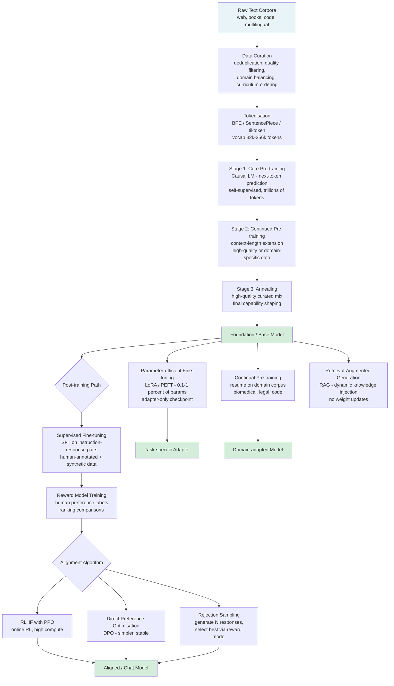
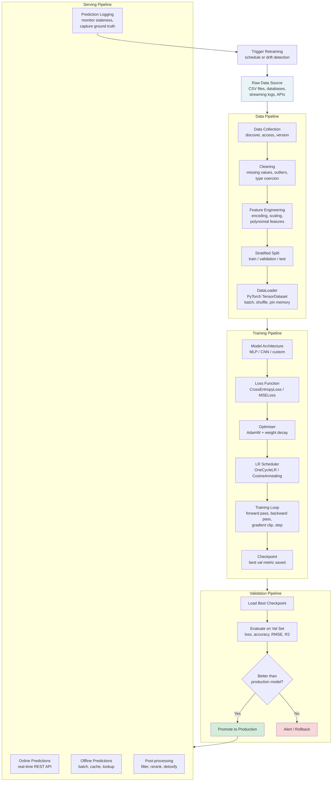
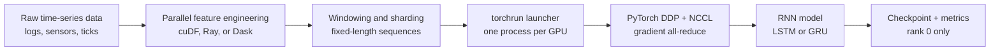

# Training: Large Language Models and Machine Learning Models

A collection of training scripts covering the full development lifecycle of both large language models (LLMs) and classical machine learning models. The `llm/` folder provides pre-training and instruction fine-tuning scripts for decoder-only transformers. The `ml/` folder provides a reusable data pipeline together with classifier and regression training scripts built on PyTorch and scikit-learn.

---

## Table of Contents

- [Project Structure](#project-structure)
- [Large Language Model Training](#large-language-model-training)
  - [LLM Training Pipeline Diagram](#llm-training-pipeline-diagram)
  - [Pre-training](#pre-training)
    - [Distributed Training](#distributed-training)
      - [Distributed Pre-training of Large Language Models](#distributed-pre-training-of-large-language-models)
    - [Choosing a Pre-training Dataset](#choosing-a-pre-training-dataset)
  - [Post-training](#post-training)
    - [Alignment?](#alignment)
      - [What is Large Language Model Alignment?](#what-is-large-language-model-alignment)
      - [How Does Large Language Model Alignment Work?](#how-does-large-language-model-alignment-work)
      - [How Do You Train?](#how-do-you-train)
  - [Adaptation Methods](#adaptation-methods)
  - [llm/ Scripts Reference](#llm-scripts-reference)
  - [LLM Quick Start](#llm-quick-start)
  - [Training Large Language Models with LLaMA-Factory](#training-large-language-models-with-llama-factory)
    - [scripts/ Scripts Reference](#scripts-scripts-reference)
- [Machine Learning Model Training](#machine-learning-model-training)
  - [ML Training Pipeline Diagram](#ml-training-pipeline-diagram)
  - [Data Pipeline](#data-pipeline)
  - [Parallel GPU Processing for ML Pipelines](#parallel-gpu-processing-for-ml-pipelines)
  - [Multi-GPU Pre-training Pipeline for RNNs](#multi-gpu-pre-training-pipeline-for-rnns)
  - [Training and Validation](#training-and-validation)
  - [Serving and Monitoring](#serving-and-monitoring)
  - [ml/ Scripts Reference](#ml-scripts-reference)
  - [ML Quick Start](#ml-quick-start)
- [Git Repository Exclusions](#git-repository-exclusions)
- [References](#references)

---

## Project Structure

```
training/
├── .gitignore               Excludes virtual environments, model outputs, and build artefacts
├── README.md                This document
├── llm/
│   ├── requirements.txt     Python dependencies for LLM pre-training and fine-tuning
│   ├── setup_venv.sh        Creates and activates a virtual environment
│   ├── pretrain.py          GPT-style causal language model pre-training from scratch
│   └── finetune.py          Instruction fine-tuning with LoRA / PEFT adapters
├── ml/
│   ├── requirements.txt     Python dependencies for ML training
│   ├── setup_venv.sh        Creates and activates a virtual environment
│   ├── data_pipeline.py     Load, clean, split, scale, and wrap data as PyTorch DataLoaders
│   ├── train_classifier.py  MLP / CNN classifier training with TensorBoard logging
│   ├── train_regression.py  MLP regressor training (RMSE, MAE, R2)
│   └── train_rnn_ddp.py     Multi-GPU LSTM / GRU pre-training with torchrun and PyTorch DDP
└── scripts/
    ├── setup.sh                             Install LLaMA-Factory, DeepSpeed, and venv
    ├── run_ddp.sh                           NativeDDP pre-training on 2 GPUs (GPT-2 124 M)
    ├── run_deepspeed_z2.sh                  DeepSpeed ZeRO-2 pre-training (GPT-2 XL 1.5 B)
    ├── run_deepspeed_z2_offload.sh          DeepSpeed ZeRO-2 + CPU offload pre-training
    ├── run_deepspeed_z3_offload.sh          DeepSpeed ZeRO-3 + full CPU offload pre-training
    ├── run_fsdp.sh                          FSDP FULL_SHARD pre-training via accelerate
    └── configs/
        ├── pretrain_gpt2_ddp.yaml           Training config: DDP, GPT-2 (124 M), fp16
        ├── pretrain_gpt2xl_ds_z2.yaml       Training config: ZeRO-2, GPT-2 XL (1.5 B), bf16
        ├── pretrain_gpt2xl_ds_z2_offload.yaml  Training config: ZeRO-2 + CPU offload
        ├── pretrain_gpt2xl_ds_z3_offload.yaml  Training config: ZeRO-3 + CPU offload
        ├── pretrain_gpt2xl_fsdp.yaml        Training config: FSDP, fp16
        ├── accelerate_ddp_2gpu.yaml         Accelerate: MULTI_GPU, 2 processes, fp16
        ├── accelerate_fsdp_2gpu.yaml        Accelerate: FSDP FULL_SHARD + CPU param offload
        ├── ds_z2_config.json                DeepSpeed ZeRO-2
        ├── ds_z2_offload_config.json        DeepSpeed ZeRO-2 + optimizer CPU offload
        └── ds_z3_offload_config.json        DeepSpeed ZeRO-3 + full CPU offload
```

### Script Reference

| File | Description |
|---|---|
| `llm/requirements.txt` | Pins all LLM dependencies: `torch>=2.3`, `transformers`, `datasets`, `peft`, `accelerate`, `wandb`, `tensorboard`, `sentencepiece`, `tiktoken` |
| `llm/setup_venv.sh` | Creates `.venv/` under `llm/`, upgrades pip, and installs `requirements.txt`; supports a configurable PyTorch index URL for CUDA builds |
| `llm/pretrain.py` | Trains a decoder-only transformer from scratch with causal language modelling on wikitext-103 (or any HuggingFace dataset); supports multi-GPU via `torchrun` and `accelerate`; saves checkpoints with `save_pretrained` |
| `llm/finetune.py` | Applies supervised instruction fine-tuning using LoRA adapters (`peft`); formats data in the Alpaca prompt template; masks prompt tokens from the loss; saves adapter-only checkpoints |
| `ml/requirements.txt` | Pins all ML dependencies: `torch>=2.3`, `torchvision`, `scikit-learn>=1.5`, `pandas>=2.2`, `numpy`, `datasets`, `wandb`, `tensorboard`, `matplotlib`, `seaborn`, `joblib` |
| `ml/setup_venv.sh` | Creates `.venv/` under `ml/`, upgrades pip, and installs `requirements.txt`; installs PyTorch from the CPU index by default |
| `ml/data_pipeline.py` | Reusable data preparation module; loads scikit-learn toy datasets or CSV files; handles missing values, encodes categoricals, applies `StandardScaler` on train only, performs stratified splits, and returns `DataLoader` objects |
| `ml/train_classifier.py` | Trains an MLP (tabular) or CNN (image) classifier; uses `OneCycleLR` scheduling and `CrossEntropyLoss`; saves the best-validation-accuracy checkpoint as `checkpoints/classifier/best_model.pt` |
| `ml/train_regression.py` | Trains an MLP regressor; uses `CosineAnnealingLR` and `MSELoss`; evaluates with RMSE, MAE, and R2; saves the best-validation-RMSE checkpoint as `checkpoints/regressor/best_model.pt` |
| `ml/train_rnn_ddp.py` | Pre-trains an LSTM or GRU for multivariate time-series forecasting across multiple Linux GPUs; uses `torchrun`, NCCL, `DistributedSampler`, and `DistributedDataParallel`; saves rank-0 checkpoints under `checkpoints/rnn_ddp/` |
| `scripts/setup.sh` | Creates `scripts/.venv/`, clones LLaMA-Factory, installs DeepSpeed and optional Flash Attention 2; verifies Python 3.11+, GPU count, and CUDA before installing |
| `scripts/run_ddp.sh` | Launches `stage: pt` pre-training of GPT-2 (124 M) on 2 GPUs via `FORCE_TORCHRUN=1`; auto-activates `scripts/.venv` if present; DDP all-reduces gradients through NCCL |
| `scripts/run_deepspeed_z2.sh` | Launches GPT-2 XL (1.5 B) pre-training with DeepSpeed ZeRO-2; shards optimizer states and gradients across 2 GPUs |
| `scripts/run_deepspeed_z2_offload.sh` | Same as ZeRO-2 but additionally offloads optimizer states to CPU RAM; frees ~6 GB VRAM at a 20-40% throughput cost; requires >= 32 GB system RAM |
| `scripts/run_deepspeed_z3_offload.sh` | Launches pre-training with DeepSpeed ZeRO-3 and full CPU offload (params + optimizer); maximises model size at significant throughput cost; requires >= 64 GB system RAM |
| `scripts/run_fsdp.sh` | Launches pre-training via `accelerate launch` with FSDP FULL_SHARD and parameter CPU offload; equivalent to ZeRO-3 but uses PyTorch-native sharding; requires `LLAMA_FACTORY_DIR` or editable install |
| `scripts/configs/` | Ten YAML and JSON config files covering all five training strategies; DeepSpeed JSON configs use `"auto"` for batch and accumulation fields so they inherit values from the training YAML |

---

## Large Language Model Training

Modern LLM development is organised into two broad phases: **pre-training**, which builds general language capabilities from massive unlabeled corpora, and **post-training**, which refines and aligns those capabilities for specific tasks and human preferences.

This two-phase view has become the standard since InstructGPT (2022) formalised a three-step pipeline — pretraining, supervised fine-tuning (SFT), and reinforcement learning from human feedback (RLHF) — that underpins most contemporary models including Llama 3, Gemma 2, Qwen 2, and Apple's AFM series.

### LLM Training Pipeline Diagram



### Pre-training

Pre-training is the most resource-intensive stage of LLM development. The model is exposed to the overwhelming majority of data it will ever see, and acquires most of its factual knowledge, language patterns, and commonsense reasoning during this phase.

**Objective.** Large generative models are trained with causal language modelling (CLM): predict the next token given all preceding tokens. Because the correct next token is already in the sequence, no human-provided labels are required — this is called self-supervised learning. Masked language modelling (MLM) is used for encoder models such as BERT but is not standard for autoregressive text generators.

**Scale.** Modern LLMs are trained on datasets ranging from hundreds of billions to over 15 trillion tokens (Llama 3.1). Data sources include web crawls, books, code repositories, scientific papers, and multilingual text. Data quality — achieved through deduplication, heuristic filtering, and model-based classification — is now considered more important than raw volume.

**Multi-stage pre-training.** State-of-the-art models such as Llama 3.1, Apple's AFM, and Qwen 2 all use a multi-stage pre-training pipeline:

1. **Core pre-training** — standard next-token prediction on a broad, diverse corpus with a short context window (4 k–8 k tokens).
2. **Continued pre-training** — the context length is extended (to 32 k–128 k tokens) using long-document data and synthetic long-context Q&A pairs.
3. **Annealing** — a short final phase on a small, high-quality curated mix (e.g. math, code, structured Q&A) that sharpens benchmark performance.

**Knowledge distillation.** Smaller models can be trained with a distillation loss that uses the predictions of a larger teacher model as a soft training signal. Google's Gemma 2 and Apple's AFM-on-device model both use this technique to punch above their parameter count.

**Continual pre-training** extends an already-trained foundation model on new or domain-specific data without training from scratch. It reduces compute by approximately 2x compared with full retraining. Common risks include catastrophic forgetting, which is mitigated by mixing new data with a replay of the original corpus.

**Reinforcement pre-training (RPT)**, introduced by Microsoft in 2025, reformulates next-token prediction as a sequential decision-making problem. The model generates a chain-of-thought rationale before predicting each token, receiving reward signals based on prediction accuracy. This eliminates the need for labelled data while promoting more systematic internal reasoning.

#### Distributed Training

Pre-training at scale requires distributing work across hundreds or thousands of GPUs. Training Large Language Models involves processing vast amounts of data and running complex computations that demand powerful hardware and efficient communication protocols. Single-GPU setups are often insufficient for handling the scale and complexity of modern LLMs. Distributed training across GPU clusters, such as NVIDIA H100 clusters, becomes essential to enable faster training and manage larger datasets effectively.

**Hardware Requirements**

To successfully pre-train an LLM, a cluster must be designed for low-latency, high-bandwidth communication:

| Component | Recommended Specification | Purpose |
|---|---|---|
| Accelerators | NVIDIA H100 or A100 ($\ge 80\text{GB}$ VRAM) or Google Cloud TPUs | High-throughput matrix computation |
| Interconnect | InfiniBand ($\ge 200\text{Gbps}$ per node) or RDMA over Converged Ethernet (RoCE) | Low-latency inter-node gradient synchronisation |
| Storage | Parallel file systems (NFS, Ceph, or NVMe-based distributed storage) | High-throughput streaming of massive training datasets |
| Host Nodes | Server-grade CPUs with ample system RAM | Prevent data-loading bottlenecks |

**Software Stack**

| Layer | Technology | Role |
|---|---|---|
| OS and Drivers | Ubuntu Linux, NVIDIA Driver, CUDA Toolkit | Base platform and hardware acceleration |
| Deep Learning Framework | PyTorch or JAX | Core computation engine |
| Distributed Communication | NCCL (NVIDIA Collective Communications Library) | Inter-GPU and inter-node collective operations |
| Distributed Training Libraries | DeepSpeed, Megatron-LM, PyTorch FSDP | Memory scaling and parallelism strategies |
| Job Scheduling | SLURM | Node allocation, job queues, and fault tolerance |
| Containerisation | Docker | Identical software environment across all nodes |
| Monitoring | Weights and Biases, Prometheus + Grafana | Training loss, hardware utilisation, network throughput |

**Communication Protocols**

Two libraries dominate distributed LLM training communication:

- **UCX (Unified Communication X):** An open-source, community-driven project that provides flexibility and support for various communication protocols including InfiniBand, RDMA over Converged Ethernet (RoCE), and shared memory. UCX serves as the underlying transport layer in multi-node training environments, offering portability across heterogeneous hardware configurations.
- **NCCL (NVIDIA Collective Communications Library):** Optimised specifically for NVIDIA GPUs and interconnects. NCCL delivers exceptional performance in homogeneous GPU environments by leveraging NVLink, NVSwitch, and InfiniBand topology-aware routing. It implements collective operations — `AllReduce`, `AllGather`, `ReduceScatter`, `Broadcast`, `Reduce` — that underpin gradient synchronisation in DDP, FSDP, and ZeRO-based training.

**Parallelism Strategies**

Modern LLMs exceed the memory capacity of a single GPU. A single server cannot hold the weights and gradients of large LLMs; hybrid parallelism distributes both data and model parameters across the cluster:

| Strategy | Description | Typical Use |
|---|---|---|
| Data Parallelism (DDP / FSDP) | Each GPU holds the full model; gradients are synchronised across replicas using AllReduce. | Standard multi-GPU baseline |
| ZeRO (Zero Redundancy Optimizer) | Partitions optimizer states, gradients, and parameters across data-parallel ranks. Three stages: ZeRO-1 (optimizer states), ZeRO-2 (+ gradients), ZeRO-3 (+ parameters). | Memory-constrained multi-node training |
| Tensor Parallelism | Individual weight matrices (attention heads, feed-forward layers) are sharded horizontally across GPUs within a layer. | Very large individual transformer layers |
| Pipeline Parallelism | Sequential model layers are assigned to different nodes; micro-batches flow through the pipeline, reducing idle time. | Models spanning many nodes |
| 3D Parallelism | Combines Data, Tensor, and Pipeline Parallelism. Scales to models with trillions of parameters. | Ultra-large-scale pre-training |

**How FSDP2 Works**

In DistributedDataParallel (DDP) training, each rank owns a model replica and processes a batch of data; it then uses all-reduce to sync gradients across ranks. FSDP (Fully Sharded Data Parallel) reduces GPU memory footprint by sharding model parameters, gradients, and optimizer states across data-parallel workers:

- Outside of forward and backward computation, parameters are fully sharded across ranks.
- Before forward and backward passes, sharded parameters are all-gathered into unsharded parameters.
- Inside backward, local unsharded gradients are reduce-scattered into sharded gradients.
- The optimizer updates sharded parameters with sharded gradients, producing sharded optimizer states.

FSDP can be considered a decomposition of DDP's all-reduce operation into reduce-scatter and all-gather operations. FSDP2 (the current generation) represents sharded parameters as `DTensor` objects sharded on dimension 0, enabling communication-free sharded state dicts and a simpler meta-device initialisation flow. See the [PyTorch FSDP2 tutorial](https://docs.pytorch.org/tutorials/intermediate/FSDP_tutorial.html) for a complete walkthrough.

**Distributed Training Frameworks**

| Framework | Developer | Key Feature | Parallelism Support |
|---|---|---|---|
| [DeepSpeed](https://github.com/microsoft/DeepSpeed) | Microsoft | ZeRO optimizer stages 1–3; pipeline engine | DP, PP, TP |
| [Megatron-LM](https://github.com/NVIDIA/Megatron-LM) | NVIDIA | 3D parallelism; highly optimised for H100/A100 | DP, TP, PP |
| [PyTorch FSDP](https://docs.pytorch.org/tutorials/intermediate/FSDP_tutorial.html) | Meta / PyTorch | Native PyTorch sharding with DTensor | FSDP (DP) |
| [GPT-NeoX](https://github.com/EleutherAI/gpt-neox) | EleutherAI | Megatron-DeepSpeed combined stack | DP, TP, PP |

> **Further reading:** HuggingFace Transformers — [Parallelism Methods](https://huggingface.co/docs/transformers/en/perf_train_gpu_many) | Intel Developer Zone — [Set Up Cloud-Based Distributed Training](https://www.intel.com/content/www/us/en/developer/articles/technical/set-up-cloud-based-distributed-training.html)

##### Distributed Pre-training of Large Language Models

Distributed pre-training of Large Language Models on cloud platforms requires specialised multi-node GPU/TPU clusters connected by ultra-high-speed networks. Open source tools for decentralised LLM pre-training allow users to harness geographically distributed GPUs or volunteer nodes across the internet. You must configure hybrid parallelism (Tensor, Pipeline, and Fully Sharded Data Parallelism) using frameworks like DeepSpeed or PyTorch FSDP, set up data streaming, and manage fault-tolerant checkpointing across instances.

**Provisioning Infrastructure**

Choose specialised ML instance families optimised for high-bandwidth, inter-node communication required for LLMs:

| Cloud Platform | Recommended Instances | Key Technology |
|---|---|---|
| Google Cloud | Cloud TPU v5e / v5p or A3 VMs with NVIDIA H100s | Ultra-fast Inter-Chip Interconnect (ICI) and NVLink |
| AWS | EC2 P5 instances (H100) or Amazon SageMaker HyperPod | Managed distributed training at scale |

> **Further reading:** AWS Machine Learning Blog — [Training Large Language Models on Amazon SageMaker: Best Practices](https://aws.amazon.com/blogs/machine-learning/training-large-language-models-on-amazon-sagemaker-best-practices/)

**Configuring Training Software and Parallelism**

Apply hybrid parallelism using the following strategies:

- **Fully Sharded Data Parallelism (FSDP):** Shards model states (parameters, gradients, and optimizer states) across data-parallel ranks.
- **Tensor Parallelism (TP):** Splits individual transformer layers (attention heads, feed-forward networks) across multiple GPUs.
- **Pipeline Parallelism (PP):** Divides sequential model layers across different nodes so different batches can be processed simultaneously.

Use [DeepSpeed](https://github.com/microsoft/DeepSpeed) or [PyTorch FSDP](https://docs.pytorch.org/tutorials/intermediate/FSDP_tutorial.html) to apply these sharding strategies transparently.

**Pre-training a GPT-2 Style Model from Scratch**

Pre-training a GPT-2 style language model from scratch involves training on raw text data starting from randomly initialised weights, rather than fine-tuning or adapting a pre-trained model. The key steps are:

1. **Distributed training:** Split the model across multiple GPUs using FSDP (Fully Sharded Data Parallel).
2. **Data streaming:** Pull training data on-demand instead of downloading terabytes upfront.
3. **Checkpointing:** Save progress regularly so a failure does not wipe out days of compute.
4. **Observability:** Monitor what is happening inside a multi-day training run.

**Implementing Data Streaming**

Pre-training datasets typically span terabytes. Do not download them to local instance storage before training:

- **Cloud Storage:** Host raw datasets on highly scalable object storage such as Amazon S3 or Google Cloud Storage.
- **Streaming Loaders:** Use the [Hugging Face `datasets` library](https://huggingface.co/docs/datasets) with `streaming=True` to stream tokenised data on-demand during training. This prevents disk space bottlenecks and significantly reduces initialisation times.

**Managing Fault-Tolerant Checkpoints**

Because pre-training runs can take weeks, intermittent hardware failures are inevitable:

| Strategy | Description |
|---|---|
| Async Checkpointing | Save model checkpoints asynchronously to cloud object storage to avoid blocking the training loop. |
| Hierarchical Strategy | Save state locally to a node first, then asynchronously sync to Amazon S3 or Google Cloud Storage to prevent IO blocking. |
| Orchestration | Use tools like Kubeflow or Flyte to automatically resume and re-initialise training jobs if a node drops out. |

**Data Parallelism in Depth**

Data parallelism evenly distributes data across multiple GPUs. Each GPU holds a copy of the model and concurrently processes its portion of the data; at the end the results are synchronised and combined. Data parallelism significantly reduces training time and is scalable to the number of GPUs available, but synchronising results from each GPU adds communication overhead.

There are two primary types of data parallelism:

- **DataParallel (DP):** The default GPU reads a batch, sends mini-batches to other GPUs, replicates the model, collects forward outputs, distributes the loss, collects gradients, and averages them. Simple but creates a communication bottleneck on GPU 0.
- **DistributedDataParallel (DDP):** Each GPU directly processes a mini-batch; local gradients are averaged across all GPUs during the backward pass using NCCL AllReduce. Recommended for multi-machine training because it reduces communication overhead and scales efficiently.

**Open Source Tools for Distributed LLM Pre-training**

The table below compares the main open source frameworks used for distributed pre-training of large language models:

| Tool | Developer | Parallelism | Key Feature | License |
|---|---|---|---|---|
| [Megatron-LM](https://github.com/NVIDIA/Megatron-LM) | NVIDIA | DP, TP, PP (3D) | State-of-the-art 3D parallelism; highly optimised CUDA kernels for H100/A100 | Custom |
| [DeepSpeed](https://github.com/microsoft/DeepSpeed) | Microsoft | DP, PP, TP | ZeRO stages 1–3; pipeline engine; scales to trillion-parameter models | Apache 2.0 |
| [torchtitan](https://github.com/pytorch/torchtitan) | Meta / PyTorch | FSDP, TP, PP | Reference production implementation; DTensor-based; Flash Attention integration | BSD |
| [GPT-NeoX](https://github.com/EleutherAI/gpt-neox) | EleutherAI | DP, TP, PP | Megatron-DeepSpeed combined; trained GPT-NeoX-20B and the Pythia series | Apache 2.0 |
| [Nanotron](https://github.com/huggingface/nanotron) | Hugging Face | DP, TP, PP | Minimal, readable codebase; 3D parallelism for research and production | Apache 2.0 |
| [LLaMA-Factory](https://github.com/hiyouga/LlamaFactory) | hiyouga | DP, FSDP, DeepSpeed | Zero-code CLI and Web UI; supports 100+ models; pre-training via stage `pt` | Apache 2.0 |
| [FedML](https://github.com/FedML-AI/FedML) | FedML-AI | Federated, Distributed | Unified ML library for training anywhere at any scale; supports decentralised volunteer-node training | Apache 2.0 |
| [Axolotl](https://github.com/axolotl-ai-cloud/axolotl) | Axolotl | DP, FSDP, DeepSpeed | Config-driven pre-training and fine-tuning; multi-GPU support via FSDP and DeepSpeed | Apache 2.0 |

**FedML: Unified Scalable Machine Learning**

[FedML Open Source](https://github.com/FedML-AI/FedML) is a unified and scalable machine learning library for running training and deployment anywhere at any scale. It supports decentralised pre-training across geographically distributed GPUs or volunteer nodes across the internet, making it suitable for scenarios where centralised GPU clusters are unavailable or where privacy-preserving distributed training is required.

#### Choosing a Pre-training Dataset

Selecting the right dataset is one of the most impactful decisions you will make before writing a single line of training code. The quality and relevance of your corpus determines the factual knowledge, linguistic register, and reasoning patterns your model can acquire. As scaling-law research has shown, a smaller model trained on a high-quality, well-curated corpus often outperforms a larger model trained on noisy, poorly filtered data.

**Key factors to consider**

| Factor | Questions to ask |
|---|---|
| **Compute capacity** | How many GPUs do you have? What model size are you targeting? Larger corpora are only beneficial if you have sufficient compute to train over them for enough tokens. A 1–7 B parameter model typically needs 20–100 B tokens of quality data; scaling the corpus beyond what your budget can cover adds diminishing returns. |
| **Primary domain or target language** | Are you building a general English model, a multilingual model, or a domain-specific model (e.g. biomedical, legal, financial, code)? Domain concentration improves task-specific performance but may reduce general capability, so consider mixing rather than replacing. |
| **Generic corpus vs. curated mixture** | Do you need a single all-in-one corpus, or a carefully weighted mixture of specialised datasets? State-of-the-art models such as Llama 3 and Qwen 2 use curated mixtures combining web data, code, books, and scientific papers, with explicit token-budget allocation per source. |
| **General domain vs. specialised domain** | If your target application is coding, legal reasoning, or scientific summarisation, use a domain-specific corpus for pre-training or continual pre-training rather than relying solely on general web data. |
| **Licensing and provenance** | Does the dataset have a licence compatible with your deployment use case? Can you audit provenance and reproduce the filtering pipeline? Reproducibility is essential for compliance and debugging. |

**Lightweight datasets for rapid experimentation**

The default configuration in `pretrain.py` uses `wikitext-103-raw-v1`, a clean English Wikipedia extract small enough to download in seconds and iterate on with a single GPU. Use the alternatives below to validate architecture changes or debug training code before committing to larger corpora:

| Dataset | HuggingFace id | Approx. size | Best for |
|---|---|---|---|
| `wikitext-2-raw-v1` | `wikitext` / `wikitext-2-raw-v1` | ~2 MB | Minimal smoke tests on a laptop CPU |
| `wikitext-103-raw-v1` *(default)* | `wikitext` / `wikitext-103-raw-v1` | ~500 MB | Single-GPU debugging and small-scale ablations |
| `roneneldan/TinyStories` | `roneneldan/TinyStories` | ~475 MB | Tiny decoder models; simple narrative language |
| `wikimedia/wikipedia` (EN 20231101) | `wikimedia/wikipedia` | ~20 GB | Clean encyclopaedic text; reliable general-purpose baseline |
| `EleutherAI/pile` (streaming) | `EleutherAI/pile` | 800 GB total | Mix of academic and professional text; use `streaming=True` |
| `togethercomputer/RedPajama-Data-1T` | `togethercomputer/RedPajama-Data-1T` | 1.2 T tokens | Documented LLaMA-replica mixture; streaming recommended |
| `tiiuae/falcon-refinedweb` | `tiiuae/falcon-refinedweb` | 600 B tokens (public) | High-quality deduplicated web text; trained Falcon-40B |
| `bigcode/starcoderdata` | `bigcode/starcoderdata` | 783 GB, 86 languages | Code-focused pre-training |

To switch the dataset in `pretrain.py`, update `dataset_name` and `dataset_config` in your JSON config:

```json
{
    "dataset_name": "roneneldan/TinyStories",
    "dataset_config": null
}
```

**Data preprocessing pipeline**

Raw corpora must pass through a preprocessing pipeline before they can be used as training signal. Never assume open-source datasets are production-ready without preprocessing — they contain redundant, missing, or improperly formatted data that language models will learn and reproduce.

*Data cleaning* removes noisy data and outliers from raw text. ML teams use techniques like statistical filtering and clustering to identify and remove content that doesn't belong.

*Normalization* ensures features in datasets are uniformly structured. When normalizing text data, engineers apply techniques like Unicode normalization, whitespace standardization, and encoding fixes.

*Tokenization* segments text into discrete units — tokens — organized as n-grams that NLP models can process. An n-gram is a contiguous sequence of n items from text, enabling models to group words together and process them as units. This reduces the vocabulary complexity while preserving semantic relationships.

*Vectorization* assigns each token a unique numerical representation. Common techniques include bag-of-words, Term Frequency–Inverse Document Frequency (TF-IDF), and learned embeddings like Word2Vec.

**Fine-tuning and domain adaptation**

*Instruction fine-tuning* enables models to learn domain-specific knowledge and follow particular instruction patterns while maintaining linguistic capabilities. For code-focused models, the [`iamtarun/code_instructions_120k_alpaca`](https://huggingface.co/datasets/iamtarun/code_instructions_120k_alpaca) dataset provides 120 k coding instruction–response pairs in the Alpaca format and can be passed directly to `finetune.py`:

```bash
python finetune.py --dataset_name iamtarun/code_instructions_120k_alpaca
```

*Beyond instruction following*, preference tuning aligns models with human values and quality expectations — see the [Alignment?](#alignment) section for the full post-training pipeline.

> **Further reading:** Kili Technology — [Open-Sourced Training Datasets for Large Language Models](https://kili-technology.com/blog/9-open-sourced-datasets-for-training-large-language-models)

### Post-training

The output of pre-training is a base model that can complete sequences but has not been aligned to follow instructions or match human preferences. Post-training addresses this through supervised instruction fine-tuning followed by one or more alignment steps.

**Supervised Fine-tuning (SFT).** The model is trained on instruction-response pairs (e.g. in the Alpaca prompt format) using standard cross-entropy loss, but only on the response tokens. The training set typically combines human-annotated examples with synthetically generated pairs from stronger models.

**Direct Preference Optimisation (DPO).** DPO has become the most widely adopted preference-tuning strategy because it is more stable and easier to scale than PPO-based RLHF. Given pairs of preferred and rejected responses, DPO directly optimises the model policy without training a separate reward model. Qwen 2, Llama 3.1, and many other models use SFT followed by iterative DPO rounds.

**RLHF with PPO.** The classical approach trains a reward model on human-ranked response pairs, then optimises the policy using proximal policy optimisation. Apple's AFM uses a committee of models together with rejection sampling and RLHF with mirror descent, achieving strong results at small model sizes.

**Rejection sampling.** The model generates multiple candidate responses; a reward model selects the highest-quality response for the next training round. This "online" refinement step is used by Qwen 2, Llama 3.1, and Apple's AFM as an intermediate between offline DPO and full PPO.

### Alignment?

Post-training is sometimes referred to as **"alignment"** — and for good reason. It is the key component of modern LLM development that teaches a model *how to answer in a way that humans like*, how to reason through problems, and how to refuse dangerous or unhelpful requests. Without alignment, even the most capable base model is an unreliable, unguided sequence completer.

> For a deep dive into the full post-training and alignment landscape, see:
> - PyTorch Blog — [A Primer on LLM Post-Training](https://pytorch.org/blog/a-primer-on-llm-post-training/)
> - Sebastian Raschka — [New LLM Pre-training and Post-training Paradigms](https://magazine.sebastianraschka.com/p/new-llm-pre-training-and-post-training)
> - Snorkel AI — [LLM Alignment Techniques: 4 Post-Training Approaches](https://snorkel.ai/blog/llm-alignment-techniques-4-post-training-approaches/)

#### What is Large Language Model Alignment?

LLM alignment in the post-training phase bridges the gap between a base model's broad language knowledge and the **useful, safe, and context-appropriate behaviour** that real-world deployments require.

Upon deployment, a model's architecture, pre-training, and fine-tuning may enable it to mimic an organisation's style and preferred format, but it needs explicit guidance to reliably achieve that goal. The three canonical alignment objectives are:

| Goal | Description |
|---|---|
| **Helpfulness** | The model accurately and completely fulfils the user's requested task. |
| **Honesty / Factuality** | Hallucinations are minimised; the model reliably cites accurate information and acknowledges uncertainty. |
| **Harmlessness** | The model refuses to generate dangerous, illegal, hateful, or toxic content. |

These three goals — often abbreviated **HHH** — define the target behaviour that alignment techniques work to instil.

#### How Does Large Language Model Alignment Work?

Alignment is achieved through a three-stage pipeline that progressively shapes the model's behaviour:

**1. Supervised Fine-Tuning (SFT)**

SFT takes the pre-trained base model and trains it on highly curated, high-quality datasets of instructions paired with desired responses (e.g. chat transcripts, coding question-answer pairs, tool-use demonstrations). Training uses standard cross-entropy loss, predicting the next token, but **only on the response tokens** — the prompt is masked from the loss.

This teaches the LLM the basic format of a helpful assistant: how to open and close a conversation, how to actually answer a prompt rather than simply continuing it, and how to follow instruction templates. SFT data combines human-annotated examples with synthetically generated pairs produced by stronger, already-aligned models.

**2. Reward Modelling (RM)**

To align the model with human preferences beyond basic conversational structure, a **Reward Model** is trained as a proxy for human judgement:

1. Human annotators (or an AI acting as a proxy) are shown multiple responses to the same prompt and rank them from best to worst.
2. These labelled preference pairs are used to train a secondary model — the Reward Model — to output a **scalar score** representing how much a human would prefer a given response.

The Reward Model captures nuanced human preferences that are difficult to specify with rules: appropriate tone, correct level of detail, safe handling of sensitive topics, and so on.

**3. Policy Optimisation (Alignment Tuning)**

The goal is to update the LLM's **policy** (its strategy for generating text) so it consistently produces outputs that receive high scores from the Reward Model. Several approaches exist:

| Method | Description |
|---|---|
| **RLHF with PPO** | The classical approach. The LLM generates responses, the Reward Model scores them, and the LLM's weights are updated using Proximal Policy Optimisation (PPO) to maximise that reward. A **KL-divergence penalty** prevents the model from drifting too far from its original linguistic capabilities, preserving the fluency gained during pre-training. |
| **Direct Preference Optimisation (DPO)** | A simpler, widely adopted alternative. Instead of training a separate Reward Model, DPO treats the LLM itself as an implicit reward function. It mathematically optimises the policy directly on human preference pairs (chosen vs. rejected), saving substantial compute and avoiding the training instability inherent in online RL. Llama 3.1, Qwen 2, and most recent open models use SFT + iterative DPO. |
| **ORPO** (Odds Ratio Preference Optimisation) | Combines SFT and preference optimisation into a single training step using an odds-ratio penalty on rejected responses. Eliminates the need for a separate SFT phase, reducing pipeline complexity and compute cost. |
| **KTO** (Kahneman-Tversky Optimisation) | Inspired by prospect theory in behavioural economics. Optimises the model directly from binary *good / bad* labels rather than preference pairs, making data collection cheaper and the method applicable when paired comparisons are unavailable. |

#### How Do You Train?

Backpropagation does occur during RL-based alignment (e.g. PPO), but with a critical difference from the clean forward–backward loops used in supervised learning:

- In supervised learning, the loss function (cross-entropy, MSE) is **differentiable** — gradients flow smoothly from the loss back through every parameter.
- In RL-based alignment, the **reward signal is not differentiable**. Rewards come from a Reward Model or external tools (browsers, code interpreters, search engines), none of which can be backpropagated through directly.

Instead, RL algorithms such as PPO use **policy gradient methods**: the model samples actions (generated tokens), receives a scalar reward, and estimates the gradient of the expected reward using the REINFORCE trick or advantage estimation. This makes RL-based training noisier, more compute-intensive, and harder to stabilise than supervised fine-tuning — which is a primary motivation for the popularity of DPO, ORPO, and KTO, all of which reframe preference optimisation as a supervised-style problem with differentiable objectives.

### Adaptation Methods

Once a foundation model exists, several techniques allow it to be adapted to specific tasks or domains:

| Method | Parameters Updated | Data Required | Compute Cost |
|---|---|---|---|
| Full fine-tuning | All | Thousands to millions of labelled examples | High |
| PEFT / LoRA | ~0.1–6 % (adapters only) | Smaller labelled datasets | Low to medium |
| Continued pre-training | All | Large unlabelled domain corpus | Medium to high |
| Retrieval-Augmented Generation (RAG) | None (inference-time only) | Vector-indexed knowledge base | Inference overhead only |
| In-context learning (ICL) | None | A few labelled examples in prompt | None |

**LoRA (Low-Rank Adaptation)** decomposes weight update matrices into low-rank products, training only those instead of the full weight matrix. This reduces trainable parameters by 100x or more while preserving most of the benefit of full fine-tuning. The adapters can be saved separately and merged into the base model at inference time.

### llm/ Scripts Reference

#### `pretrain.py`

Trains a decoder-only transformer from scratch using causal language modelling.

Key features:
- Configures a GPT-2-compatible architecture via a JSON config file (vocabulary size, layers, attention heads, hidden dimensions, context length).
- Loads and tokenises a HuggingFace `datasets` corpus (default: `wikitext-103`).
- Supports single-GPU training and multi-GPU DDP via `torchrun`.
- Implements linear warm-up followed by cosine learning rate decay.
- Gradient accumulation and optional BF16/FP16 mixed-precision.
- Periodic checkpointing with `save_pretrained`, and resumption from a checkpoint directory.
- Logs training loss, perplexity, and learning rate to TensorBoard or WandB.

Usage:
```bash
# Single GPU
python pretrain.py

# Multi-GPU (2 GPUs)
torchrun --nproc_per_node=2 pretrain.py
```

#### `finetune.py`

Applies supervised instruction fine-tuning to a pre-trained causal language model using LoRA adapters via the `peft` library.

Key features:
- Loads any HuggingFace causal LM (default: `gpt2`). Compatible with Llama, Mistral, and other architectures.
- Formats instruction-response data in the Alpaca prompt template.
- Masks prompt tokens from the loss so the model learns only to generate the response.
- Attaches LoRA adapters to configurable target modules (`q_proj`, `v_proj`, etc.) with tunable rank, alpha, and dropout.
- Uses HuggingFace `accelerate` for device placement and optional BF16 mixed-precision.
- Saves adapter-only checkpoints at configurable intervals and a final merged checkpoint.

Usage:
```bash
# Single GPU
python finetune.py

# Multi-GPU (2 GPUs)
accelerate launch --num_processes 2 finetune.py
```

Key arguments:

| Argument | Default | Description |
|---|---|---|
| `--model_name_or_path` | `gpt2` | HuggingFace model id or local path |
| `--dataset_name` | `tatsu-lab/alpaca` | Instruction dataset on HuggingFace Hub |
| `--lora_r` | `8` | LoRA rank |
| `--lora_alpha` | `16` | LoRA scaling factor |
| `--num_train_epochs` | `3` | Number of training epochs |
| `--learning_rate` | `2e-4` | Peak learning rate |
| `--max_seq_length` | `512` | Maximum token sequence length |

#### `requirements.txt`

Pins all Python dependencies for the `llm/` environment:

- `torch>=2.3.0`, `torchvision>=0.18.0`
- HuggingFace: `transformers`, `datasets`, `tokenizers`, `accelerate`, `peft`, `evaluate`, `huggingface_hub`
- Tokenisation utilities: `sentencepiece`, `tiktoken`
- Monitoring: `wandb`, `tensorboard`
- Utilities: `numpy`, `tqdm`, `scipy`

#### `setup_venv.sh`

Creates a Python virtual environment at `.venv/`, upgrades pip, and installs all requirements. Handles PyTorch CPU and CUDA builds via an index URL.

```bash
bash setup_venv.sh
source .venv/bin/activate
```

### LLM Quick Start

```bash
cd training/llm

# 1. Create virtual environment and install dependencies
bash setup_venv.sh
source .venv/bin/activate

# 2. Pre-train a small GPT-2 model on wikitext-103 (single GPU)
python pretrain.py

# 3. Fine-tune with LoRA on the Alpaca instruction dataset
python finetune.py --model_name_or_path gpt2 --num_train_epochs 3

# 4. Fine-tune a larger model with 2 GPUs
accelerate launch --num_processes 2 finetune.py \
    --model_name_or_path meta-llama/Llama-3.2-1B \
    --dataset_name tatsu-lab/alpaca \
    --lora_r 16 \
    --num_train_epochs 2
```

Checkpoints are written to `./checkpoints/pretrain/` and `./checkpoints/finetune/` respectively. TensorBoard logs are saved alongside each checkpoint directory.

---

### Training Large Language Models with LLaMA-Factory

[LLaMA-Factory](https://llamafactory.readthedocs.io/en/latest/index.html) is an open-source, unified framework for efficiently pre-training and fine-tuning 100+ large language models through a zero-code CLI and Web UI (`LlamaBoard`). It covers the full training lifecycle — pre-training (`stage: pt`), supervised fine-tuning (SFT), reward modelling, and preference alignment (DPO, PPO, KTO, ORPO) — and integrates natively with DeepSpeed ZeRO (stages 1–3), PyTorch FSDP, and Flash Attention 2 for distributed multi-GPU and multi-node workloads. LLaMA-Factory is used in production by Amazon, NVIDIA, and Alibaba Cloud.

One practical application of distributed training is training large language models using the [LLaMA-Factory](https://github.com/hiyouga/LlamaFactory) framework. By distributing training across multiple GPUs and nodes, SLURM and LLaMA-Factory together help reduce training time while ensuring stable and efficient execution.

**Prerequisites**

Before starting, ensure your system meets the following requirements:

| Requirement | Minimum | Recommended |
|---|---|---|
| Python | 3.11 | 3.11+ |
| PyTorch | 2.0.0 | 2.6.0 |
| CUDA | 11.6 | 12.2 |
| GPU Memory | 16 GB (LoRA / freeze tuning) | 80 GB (full pre-training) |
| transformers | 4.49.0 | 4.50.0+ |
| accelerate | 0.34.0 | 1.2.1+ |

**Installation**

Clone the LLaMA-Factory repository and install its dependencies:

```bash
git clone https://github.com/hiyouga/LlamaFactory.git
cd LlamaFactory
pip install -e ".[torch,metrics]"
```

Optional: install DeepSpeed support alongside the core package:

```bash
pip install -e ".[torch,metrics]" && pip install -r requirements/deepspeed.txt
```

**Pre-training with LLaMA-Factory**

Setting up large language model pre-training in LLaMA-Factory involves configuring foundational data, defining pre-training arguments, and initiating the run. Because pre-training trains models from scratch on raw corpora, the training stage must be set to `pt`.

**Step 1: Prepare Pre-training Data**

Pre-training requires massive amounts of raw text (unsupervised data). Place your corpus in LLaMA-Factory's designated data directory and register it:

1. **Format your data:** Pre-training data in LLaMA-Factory should be formatted as plain text or JSON/JSONL depending on how it is parsed.
2. **Register the dataset:** Update `data/dataset_info.json` to include your dataset:

```json
"my_pretrain_data": {
  "file_name": "your_corpus_file.txt",
  "file_format": "text"
}
```

**Step 2: Configure the Training Run**

Option A: Using LlamaBoard (Web UI)

```bash
FORCE_TORCHRUN=1 llamafactory-cli webui
```

In the UI, navigate to the **Train** tab, set **Stage** to `pt` (Pre-training), choose your base model, select the registered dataset, configure hyperparameters, and click **Start**.

Option B: Using YAML Configuration (CLI)

Create a YAML file (e.g., `pretrain_config.yaml`) with the following structure:

```yaml
### model parameters
model_name_or_path: path_to_your_base_model_or_empty

### method parameters
stage: pt
do_train: true
finetuning_type: full

### dataset parameters
dataset: my_pretrain_data
cutoff_len: 2048

### training parameters
output_dir: saves/my_pretrain_model/pt
overwrite_output_dir: true
per_device_train_batch_size: 4
gradient_accumulation_steps: 4
learning_rate: 1.0e-4
num_train_epochs: 1
lr_scheduler_type: cosine
warmup_ratio: 0.03
fp16: true
```

Then launch training:

```bash
llamafactory-cli train pretrain_config.yaml
```

**Distributed Training with FSDP and DeepSpeed**

LLaMA-Factory supports distributed training via both PyTorch FSDP and DeepSpeed. Add the following to your YAML configuration to enable FSDP:

```yaml
fsdp: full_shard auto_wrap
fsdp_config: examples/accelerate/fsdp_config.yaml
```

For DeepSpeed ZeRO-3:

```yaml
deepspeed: examples/deepspeed/ds_z3_config.json
```

**Running with SLURM on a Metal Cloud Cluster**

SLURM is a widely used open-source workload manager designed for high-performance computing (HPC) environments. It provides efficient job scheduling, resource allocation, and scalability, making it an excellent choice for AI training on Metal Cloud. By distributing training across multiple GPUs and nodes, SLURM helps reduce training time while ensuring stable and efficient execution.

The workflow includes:

1. Preparing the infrastructure with SLURM, CUDA, and NCCL for efficient multi-GPU communication.
2. Installing LLaMA-Factory and configuring the system to enable seamless model training.
3. Running a pre-training or fine-tuning task using the desired model and dataset.
4. Leveraging SLURM's job scheduling capabilities to allocate resources and monitor performance efficiently.

A sample SLURM batch script for distributed LLaMA-Factory training across 4 nodes with 8 GPUs each:

```bash
#!/bin/bash
#SBATCH --job-name=llama-pretrain
#SBATCH --nodes=4
#SBATCH --ntasks-per-node=8
#SBATCH --gres=gpu:8
#SBATCH --partition=gpu

module load cuda/12.2 nccl/2.18

torchrun \
  --nproc_per_node=8 \
  --nnodes=4 \
  --rdzv_backend=c10d \
  --rdzv_endpoint=$SLURM_NODELIST \
  $(which llamafactory-cli) train pretrain_config.yaml
```

**Communication: UCX and NCCL in Practice**

Efficient multi-node training depends on the correct pairing of hardware and communication library:

| Scenario | Recommended Protocol | Notes |
|---|---|---|
| Homogeneous NVIDIA GPU cluster | NCCL | Leverages NVLink and InfiniBand topology awareness for maximum bandwidth |
| Heterogeneous hardware | UCX | Portable across InfiniBand, RoCE, and shared memory; configurable via environment variables |
| Single-node multi-GPU | NCCL (NVLink) | Highest bandwidth path within a single node |

Set the communication backend when launching training:

```bash
export NCCL_IB_DISABLE=0        # Enable InfiniBand
export NCCL_DEBUG=INFO           # Verbose logging for debugging
torchrun --nproc_per_node=8 llamafactory-cli train pretrain_config.yaml
```

> **Further reading:** LLaMA-Factory Documentation — [Trainers](https://llamafactory.readthedocs.io/en/latest/advanced/trainers.html) | LLaMA-Factory — [Distributed Training](https://llamafactory.readthedocs.io/en/latest/advanced/distributed.html) | LLaMA-Factory GitHub — [hiyouga/LlamaFactory](https://github.com/hiyouga/LlamaFactory)

#### scripts/ Scripts Reference

The `scripts/` folder provides ready-to-run distributed pre-training scripts for a single Ubuntu node with 2x 12 GB GPU VRAM. All scripts call `llamafactory-cli train` with `stage: pt` and the `c4_demo` dataset bundled with LLaMA-Factory. Run `setup.sh` once to create the virtual environment and install all dependencies; every run script automatically activates `scripts/.venv` if it exists.

**Quick start**

```bash
# Install once
bash scripts/setup.sh

# Run from anywhere -- venv is activated automatically
bash scripts/run_ddp.sh                   # NativeDDP,    GPT-2 (124 M),  ~3 GB/GPU
bash scripts/run_deepspeed_z2.sh          # ZeRO-2,       GPT-2 XL (1.5 B), ~11 GB/GPU
bash scripts/run_deepspeed_z2_offload.sh  # ZeRO-2 + CPU offload
bash scripts/run_deepspeed_z3_offload.sh  # ZeRO-3 + CPU offload
bash scripts/run_fsdp.sh                  # FSDP FULL_SHARD
```

| Script | Engine | Model | VRAM strategy | Approx per-GPU VRAM |
|---|---|---|---|---|
| `run_ddp.sh` | NativeDDP | GPT-2 (124 M) | Full replica on each GPU | ~3 GB |
| `run_deepspeed_z2.sh` | DeepSpeed ZeRO-2 | GPT-2 XL (1.5 B) | Shards optimizer + gradients | ~11 GB |
| `run_deepspeed_z2_offload.sh` | DeepSpeed ZeRO-2 + CPU | GPT-2 XL (1.5 B) | Optimizer offloaded to RAM | ~6 GB + RAM |
| `run_deepspeed_z3_offload.sh` | DeepSpeed ZeRO-3 + CPU | GPT-2 XL (1.5 B) | All states offloaded to RAM | ~3 GB + RAM |
| `run_fsdp.sh` | FSDP FULL_SHARD | GPT-2 XL (1.5 B) | Shards params + grads + optimizer + CPU | ~5 GB + RAM |

To adapt any script to a different model or corpus, edit `model_name_or_path` and `dataset` in the corresponding YAML under `scripts/configs/`, then register any custom dataset in LLaMA-Factory's `data/dataset_info.json`.

---

## Machine Learning Model Training

In production machine learning the goal is not to build a single model but to build automated pipelines that continuously develop, validate, and deploy models as data evolves. A typical ML system consists of four coordinated pipelines: a data pipeline, a training pipeline, a validation pipeline, and a serving pipeline.

### ML Training Pipeline Diagram



### Data Pipeline

The data pipeline is responsible for transforming raw application data into clean, split, and scaled datasets ready for model training.

**Data collection.** In experimentation, data is typically read from saved files. In production, data collection requires accessing streaming logs and, for supervised tasks, obtaining or maintaining human-labelled ground truth. Version-controlled dataset repositories provide reproducibility, compliance, and auditability.

**Cleaning.** Real-world datasets almost always contain missing values, incorrect types, and outliers. The data pipeline in `data_pipeline.py` handles missing values with a configurable strategy (mean imputation, median imputation, or row dropping) and applies label encoding to categorical features.

**Feature engineering.** Numerical features are standardised with a `StandardScaler` fitted exclusively on the training split and then applied without refitting to the validation and test splits. This prevents data leakage.

**Splitting.** Data is divided into training, validation, and test sets using stratified splits to preserve class proportions. The default ratios are 70 % / 15 % / 15 %. For regression tasks, stratification is omitted.

**DataLoader wrapping.** Cleaned and scaled arrays are converted to `torch.Tensor` objects and wrapped in `TensorDataset` / `DataLoader` instances with configurable batch sizes, shuffling, and worker counts.

**Model staleness.** As the Google ML pipelines guide notes, almost all models go stale after deployment because the world changes and data distributions shift. Automated data pipelines ensure that fresh training and test datasets are continuously generated, enabling regular retraining without manual intervention.

### Parallel GPU Processing for ML Pipelines

When the bottleneck moves from experimentation to throughput, the most effective production design is to split the pipeline into two layers: a distributed data-processing layer for feature engineering and a distributed training layer for gradient computation. On Linux GPU systems, that usually means using a DataFrame or task engine such as [RAPIDS cuDF](https://github.com/rapidsai/cudf), [Ray](https://github.com/ray-project/ray), or [Dask](https://github.com/dask/dask) for parallel tabular or time-series preparation, then handing contiguous batches to PyTorch for model training.

**Why this split matters.** GPU training only stays efficient if the data pipeline can feed devices fast enough. cuDF accelerates DataFrame transforms directly on CUDA devices, while Ray and Dask distribute feature engineering, window generation, and dataset partitioning across CPU or GPU workers before the training loop begins. This is especially useful for large time-series corpora where sliding-window generation, resampling, and aggregation can dominate end-to-end runtime.

**Distributed training libraries.** Once features are materialised into batches, the deep learning layer should use a library that coordinates gradient synchronisation and launcher semantics:

| Tool | Best use in this repository | Notes |
|---|---|---|
| [PyTorch DistributedDataParallel](https://docs.pytorch.org/tutorials/intermediate/ddp_tutorial.html) | Native multi-GPU baseline for RNNs and feed-forward models | Most direct choice when the full model fits on each GPU |
| [Hugging Face Accelerate](https://huggingface.co/docs/accelerate/index) | Lightweight wrapper around DDP, FSDP, and DeepSpeed launches | Useful when you want the same script to scale from 1 GPU to many GPUs |
| [PyTorch Lightning](https://github.com/lightning-ai/pytorch-lightning) | Higher-level training orchestration | Reduces boilerplate by scaling from `Trainer(devices=4, accelerator="gpu")` |
| [DeepSpeed](https://github.com/microsoft/DeepSpeed) | Large recurrent stacks or hybrid RNN-transformer models | ZeRO shards optimizer state, gradients, and optionally parameters |
| [NVIDIA DALI](https://developer.nvidia.com/dali) | GPU-resident preprocessing when transforms are tensor-friendly | Useful for decode, augmentation, and input-pipeline acceleration |

PyTorch DDP is the default recommendation for recurrent models because it launches one Python process per GPU and avoids the coordinator bottlenecks and skewed memory usage of `nn.DataParallel`. For an overview of multi-GPU training strategies and trade-offs, see the Hugging Face Transformers guide on [Parallelism Methods](https://huggingface.co/docs/transformers/en/perf_train_gpu_many).

### Multi-GPU Pre-training Pipeline for RNNs

For pre-training a recurrent neural network such as an LSTM or GRU across multiple GPUs on Linux, PyTorch DDP launched with `torchrun` is the most practical native pipeline. Recurrent models are sequential in time, so the hidden state at step $t$ depends on the state at step $t-1$; that dependency makes time-axis parallelism inside a single sequence hard to scale. In practice, the industry-standard solution is data parallelism: each GPU keeps a full copy of the RNN while `DistributedSampler` partitions different sequence batches across ranks.

**Recommended architecture.** An end-to-end pipeline typically looks like this:

1. Parallelise feature engineering and sliding-window generation with cuDF, Ray, or Dask.
2. Materialise fixed-length sequences and targets into shard-friendly datasets.
3. Launch one process per GPU with `torchrun` and initialise the NCCL backend.
4. Wrap the model with `DistributedDataParallel` so gradients are averaged during backpropagation.
5. Save checkpoints only on rank 0 to avoid redundant writes.



**Why DDP over pipeline parallelism.** Pipeline parallelism splits model layers across GPUs, which is useful only when the recurrent stack is too large to fit on one device. For standard RNN pre-training, DDP is simpler and faster because it preserves the full recurrent layer on each GPU and only synchronises gradients. Choose your scaling strategy by memory fit:

| Strategy | When to use it | Trade-off |
|---|---|---|
| Distributed Data Parallel (DDP) | The full RNN fits on one GPU | Best throughput and simplest implementation |
| DeepSpeed ZeRO | Optimizer or gradient state becomes the memory bottleneck | Lower memory footprint with additional orchestration |
| Pipeline Parallelism | The stacked recurrent model no longer fits on one GPU | More complex scheduling and micro-batch tuning |

**Operational guidance for Linux multi-GPU runs.** Use the `nccl` backend on NVIDIA systems, keep `pin_memory=True` in the `DataLoader`, and shard datasets with `DistributedSampler` so that batches do not overlap across ranks. If you use packed sequences with `pack_padded_sequence`, keep the sort order valid inside each GPU-local batch to avoid padding and collation bugs.

**Repository example.** The new `ml/train_rnn_ddp.py` script provides a ready-to-run DDP pre-training example for synthetic multivariate time-series forecasting. It builds sliding windows, supports both LSTM and GRU cells, launches with `torchrun`, and writes a single checkpoint from rank 0.

Usage:

```bash
cd training/ml

# 2 GPUs, standalone launch
torchrun --standalone --nproc_per_node=2 train_rnn_ddp.py

# 4 GPUs, GRU variant
torchrun --standalone --nproc_per_node=4 train_rnn_ddp.py --cell_type gru --epochs 10
```

The script is intentionally native PyTorch so it can serve as the lowest-level reference pipeline before you move to [PyTorch Lightning](https://github.com/lightning-ai/pytorch-lightning), [Accelerate](https://huggingface.co/docs/accelerate/index), or [DeepSpeed](https://github.com/microsoft/DeepSpeed) for larger orchestration needs.

### Training and Validation

**Training pipeline.** The training loop follows a standard pattern: forward pass, loss computation, backward pass, gradient clipping, optimiser step, and learning rate scheduler step. Both training scripts use the AdamW optimiser with weight decay and gradient norm clipping to stabilise training.

**Validation.** At the end of each epoch, the model is evaluated on the held-out validation set. The best checkpoint (lowest validation RMSE for regression, highest validation accuracy for classification) is saved to disk. This ensures that the final model is selected by generalisation performance, not training performance.

**Metrics.**

| Task | Primary Metric | Additional Metrics |
|---|---|---|
| Classification | Accuracy | Per-class precision, recall, F1 (from `classification_report`) |
| Regression | RMSE | MAE, R2 score |

**TensorBoard.** Both training scripts write scalar summaries (loss, accuracy or RMSE, learning rate) at every epoch. Launch TensorBoard with:

```bash
tensorboard --logdir checkpoints/
```

### Serving and Monitoring

The serving pipeline delivers predictions to end users in one of two modes:

- **Online predictions** — a real-time request is sent to an inference server that runs the model and returns a result immediately.
- **Offline predictions** — predictions are precomputed in batch and cached; the application looks up the stored result at query time.

Regardless of serving mode, prediction logging is essential. By monitoring the distribution of model outputs over time and comparing against ground truth labels when they become available, teams can detect when a model starts to degrade and trigger retraining.

### ml/ Scripts Reference

The `ml/` folder contains three training entry points aimed at different model families and execution environments. If you only need a fast rule of thumb: use `train_classifier.py` for supervised classification, `train_regression.py` for supervised numeric prediction, and `train_rnn_ddp.py` when you need multi-GPU recurrent training for sequential or time-series data.

| Script | Use it when | Model / execution style |
|---|---|---|
| `train_classifier.py` | Your target is a discrete label such as class, category, or diagnosis | Single-process MLP for tabular data or CNN for image data |
| `train_regression.py` | Your target is a continuous numeric value such as price, demand, or score | Single-process MLP regressor for tabular data |
| `train_rnn_ddp.py` | Your data is ordered by timestep and you want to scale recurrent training across multiple CUDA GPUs | Multi-process LSTM or GRU training with `torchrun` and PyTorch DDP |

#### `data_pipeline.py`

Implements the full data preparation pipeline and exposes a single top-level function `build_pipeline(cfg: DataConfig)` that returns three `DataLoader` objects (train, val, test) and a `DataMeta` object describing the dataset.

Supported data sources:
- Any of the six scikit-learn toy datasets: `iris`, `wine`, `breast_cancer`, `digits`, `diabetes`, `boston`.
- Arbitrary CSV files with a configurable target column.

Configurable via `DataConfig` dataclass:

| Field | Default | Description |
|---|---|---|
| `dataset_name` | `iris` | scikit-learn dataset name or HuggingFace dataset id |
| `csv_path` | `None` | Path to a CSV file (overrides `dataset_name`) |
| `target_column` | `target` | Label column name for CSV inputs |
| `train_ratio` | `0.70` | Fraction of data used for training |
| `val_ratio` | `0.15` | Fraction of data used for validation |
| `test_ratio` | `0.15` | Fraction of data used for testing |
| `scale_features` | `True` | Apply StandardScaler |
| `handle_missing` | `mean` | Missing value strategy: `mean`, `median`, or `drop` |
| `batch_size` | `64` | DataLoader batch size |

Run as a standalone smoke test:
```bash
python data_pipeline.py
```

#### `train_classifier.py`

Trains a configurable neural network classifier. For tabular data a multi-layer perceptron (MLP) with batch normalisation and dropout is used. For image data (e.g. MNIST) a three-block convolutional neural network is used.

Choose this script when the output is a class label rather than a numeric forecast. Typical use cases include tabular classification problems such as churn prediction or fraud flags, and image classification tasks such as MNIST digit recognition.

Key features:
- Plugs directly into `data_pipeline.build_pipeline` for tabular tasks.
- Downloads torchvision datasets for image tasks.
- Uses `OneCycleLR` scheduling for fast convergence.
- Saves the best-validation-accuracy checkpoint to `checkpoints/classifier/best_model.pt`.
- Prints a full `sklearn.metrics.classification_report` on the test set.

Usage:
```bash
# Tabular classification (iris dataset)
python train_classifier.py

# Tabular with a custom CSV
python train_classifier.py --csv_path data.csv --target_column label --num_epochs 50

# Image classification (MNIST)
python train_classifier.py --task image --dataset_name MNIST
```

Key arguments:

| Argument | Default | Description |
|---|---|---|
| `--task` | `tabular` | `tabular` or `image` |
| `--dataset_name` | `iris` | sklearn dataset or torchvision class name |
| `--batch_size` | `64` | Training batch size |
| `--num_epochs` | `30` | Number of epochs |
| `--learning_rate` | `1e-3` | Peak learning rate |
| `--dropout` | `0.3` | Dropout probability |

#### `train_regression.py`

Trains a fully connected MLP regressor on tabular data. Uses `CosineAnnealingLR` scheduling and MSE loss. Evaluates with RMSE, MAE, and R2 on both validation and test sets.

Choose this script when the target is a continuous value. Typical use cases include house-price prediction, demand forecasting from tabular features, or any supervised problem where the output is a scalar number instead of a category.

Usage:
```bash
# Default: scikit-learn diabetes dataset
python train_regression.py

# Custom CSV
python train_regression.py --csv_path house_prices.csv --target_column price --num_epochs 100
```

Key arguments:

| Argument | Default | Description |
|---|---|---|
| `--dataset_name` | `diabetes` | sklearn regression dataset name |
| `--csv_path` | `None` | Path to a CSV file |
| `--num_epochs` | `50` | Number of training epochs |
| `--learning_rate` | `1e-3` | Initial learning rate |
| `--dropout` | `0.2` | Dropout probability |

#### `train_rnn_ddp.py`

Pre-trains an LSTM or GRU on multivariate time-series windows with native PyTorch Distributed Data Parallel. The script is designed for Linux systems with CUDA-enabled GPUs and uses the NCCL backend for gradient synchronisation.

Choose this script when the order of observations matters and the model must learn from sequences rather than independent rows. It is intended for recurrent workloads such as sensor streams, telemetry, financial series, or other timestep-driven data where you want to distribute batches across multiple GPUs while keeping a full recurrent model replica on each device.

Key features:
- Launches with `torchrun`, which injects `LOCAL_RANK`, `RANK`, and `WORLD_SIZE` automatically.
- Uses `DistributedSampler` so every GPU processes a unique shard of the sequence dataset.
- Supports both `lstm` and `gru` recurrent cells.
- Applies gradient clipping and saves checkpoints only from rank 0.
- Uses `pin_memory=True` and non-blocking CUDA transfers for efficient host-to-device copies.

Usage:
```bash
# 2 GPUs
torchrun --standalone --nproc_per_node=2 train_rnn_ddp.py

# 4 GPUs, custom shape
torchrun --standalone --nproc_per_node=4 train_rnn_ddp.py \
  --cell_type gru \
  --window_size 256 \
  --input_dim 16 \
  --hidden_dim 256 \
  --epochs 10
```

Key arguments:

| Argument | Default | Description |
|---|---|---|
| `--cell_type` | `lstm` | Recurrent cell type: `lstm` or `gru` |
| `--num_samples` | `20000` | Number of synthetic timesteps used to build windows |
| `--window_size` | `168` | Input sequence length per training sample |
| `--input_dim` | `8` | Number of parallel features per timestep |
| `--hidden_dim` | `128` | Hidden state size |
| `--num_layers` | `2` | Number of stacked recurrent layers |
| `--batch_size` | `256` | Per-process batch size |
| `--epochs` | `5` | Number of training epochs |
| `--output_dir` | `./checkpoints/rnn_ddp` | Rank-0 checkpoint directory |

#### `requirements.txt`

Pins all Python dependencies for the `ml/` environment:

- `torch>=2.3.0`, `torchvision>=0.18.0`
- `scikit-learn>=1.5.0`, `imbalanced-learn>=0.12.0`
- `pandas>=2.2.0`, `numpy>=1.26.0`, `scipy>=1.13.0`
- `datasets>=2.19.0`
- Monitoring: `wandb`, `tensorboard`
- Visualisation: `matplotlib`, `seaborn`
- Utilities: `tqdm`, `joblib`

#### `setup_venv.sh`

Creates a Python virtual environment at `.venv/`, upgrades pip, and installs all requirements. Installs PyTorch from the CPU index by default; edit the script to select a CUDA index URL for GPU training.

```bash
bash setup_venv.sh
source .venv/bin/activate
```

### ML Quick Start

The quick start below is ordered from simplest to most specialised: first verify the shared data pipeline, then run single-process classification or regression, and finally launch the distributed recurrent example when a Linux machine has multiple CUDA GPUs available.

```bash
cd training/ml

# 1. Create virtual environment and install dependencies
bash setup_venv.sh
source .venv/bin/activate

# 2. Verify the data pipeline (smoke test on iris)
python data_pipeline.py

# 3. Train a tabular classifier (iris, MLP, 30 epochs)
python train_classifier.py

# 4. Train a classifier on a custom CSV
python train_classifier.py \
    --csv_path my_data.csv \
    --target_column label \
    --num_epochs 50 \
    --batch_size 128

# 5. Train a regressor (diabetes dataset, MLP, 50 epochs)
python train_regression.py

# 6. Pre-train an LSTM across 2 GPUs with native DDP
torchrun --standalone --nproc_per_node=2 train_rnn_ddp.py

# 7. View training curves in TensorBoard
tensorboard --logdir checkpoints/
```

---

## Git Repository Exclusions

The `.gitignore` file at the `training/` root prevents generated artefacts, binary weights, and platform-specific files from being tracked by Git. The table below summarises each exclusion category.

| Category | Patterns Excluded | Reason |
|---|---|---|
| Virtual environments | `.venv/`, `venv/`, `env/`, `ENV/` | Recreated by `setup_venv.sh`; contains platform-specific compiled binaries |
| Python bytecode | `__pycache__/`, `*.pyc`, `*.pyo`, `*.pyd` | Generated automatically by the Python interpreter on first import |
| Python packaging | `*.egg-info/`, `dist/`, `build/`, `*.whl` | Build artefacts produced by setuptools and pip; not source files |
| ML model outputs | `*.pt`, `*.pth`, `*.ckpt` | PyTorch state dicts written by `train_classifier.py` and `train_regression.py` via `torch.save` |
| LLM model outputs | `*.bin`, `*.safetensors` | HuggingFace `save_pretrained` outputs from `pretrain.py` and `finetune.py`; covers `pytorch_model.bin`, `model.safetensors`, `adapter_model.safetensors` |
| Checkpoint / log dirs | `checkpoints/`, `runs/`, `outputs/`, `logs/` | Training output directories written by all four training scripts; can be gigabytes in size |
| TensorBoard event files | `events.out.tfevents.*` | Binary event logs written automatically during every training run |
| WandB artefacts | `wandb/` | Run metadata and artefact cache created by Weights and Biases |
| Large binary data | `*.h5`, `*.npy`, `*.npz`, `*.parquet`, `*.arrow` | Numerical array and columnar data files; should be stored in a versioned data registry |
| OS / IDE artefacts | `.DS_Store`, `.vscode/`, `.idea/`, `Thumbs.db` | Operating system and editor-generated metadata; not relevant to the project |

---

## References

- Raschka, S. (2024). *New LLM Pre-training and Post-training Paradigms*. Ahead of AI. https://magazine.sebastianraschka.com/p/new-llm-pre-training-and-post-training
- Morgan, A. (2025). *Pretraining: Breaking Down the Modern LLM Training Pipeline*. MLOps Community. https://mlops.community/blog/pretraining-breaking-down-the-modern-llm-training-pipeline
- Jain, A., Maleki, A., and Saade, N. (2024). *Methods for Adapting Large Language Models*. Meta AI Blog. https://ai.meta.com/blog/adapting-large-language-models-llms/
- Howard, J. and Ruder, S. (2018). *Universal Language Model Fine-tuning for Text Classification* (ULMFiT). arXiv:1801.06146.
- Ouyang, L. et al. (2022). *Training Language Models to Follow Instructions with Human Feedback* (InstructGPT). arXiv:2203.02155.
- Hoffmann, J. et al. (2022). *Training Compute-Optimal Large Language Models* (Chinchilla). arXiv:2203.15556.
- Google Developers. (2025). *ML Pipelines*. Machine Learning — Managing ML Projects. https://developers.google.com/machine-learning/managing-ml-projects/pipelines
- Hu, E. et al. (2021). *LoRA: Low-Rank Adaptation of Large Language Models*. arXiv:2106.09685.
- NVIDIA. *Megatron-LM: Training Multi-Billion Parameter Language Models Using Model Parallelism*. https://github.com/NVIDIA/Megatron-LM
- EleutherAI. *GPT-NeoX: Large Scale Autoregressive Language Modeling in PyTorch*. https://github.com/EleutherAI/gpt-neox
- PyTorch Blog. (2024). *A Primer on LLM Post-Training*. https://pytorch.org/blog/a-primer-on-llm-post-training/
- Snorkel AI. (2024). *LLM Alignment Techniques: 4 Post-Training Approaches*. https://snorkel.ai/blog/llm-alignment-techniques-4-post-training-approaches/
- Hong, J. et al. (2024). *ORPO: Monolithic Preference Optimization without Reference Model*. arXiv:2403.07691.
- Ethayarajh, K. et al. (2024). *KTO: Model Alignment as Prospect Theoretic Optimization*. arXiv:2402.01306.
- Kili Technology. (2024). *Open-Sourced Training Datasets for Large Language Models*. https://kili-technology.com/blog/9-open-sourced-datasets-for-training-large-language-models
- iamtarun. (2023). *code_instructions_120k_alpaca — 120 k coding instruction–response pairs in Alpaca format*. HuggingFace Datasets. https://huggingface.co/datasets/iamtarun/code_instructions_120k_alpaca
- HuggingFace Transformers. (2025). *Parallelism Methods: Multi-GPU Training*. https://huggingface.co/docs/transformers/en/perf_train_gpu_many
- PyTorch. (2025). *Getting Started with Distributed Data Parallel*. https://docs.pytorch.org/tutorials/intermediate/ddp_tutorial.html
- PyTorch. (2025). *Optional Data Parallel Tutorial*. https://docs.pytorch.org/tutorials/beginner/blitz/data_parallel_tutorial.html
- PyTorch. (2025). *Getting Started with Fully Sharded Data Parallel (FSDP2)*. https://docs.pytorch.org/tutorials/intermediate/FSDP_tutorial.html
- Dive into Deep Learning. (2025). *Multiple GPUs*. https://d2l.ai/chapter_computational-performance/multiple-gpus.html
- Intel Developer Zone. (2024). *Set Up Cloud-Based Distributed Training*. https://www.intel.com/content/www/us/en/developer/articles/technical/set-up-cloud-based-distributed-training.html
- AWS Machine Learning Blog. (2024). *Training Large Language Models on Amazon SageMaker: Best Practices*. https://aws.amazon.com/blogs/machine-learning/training-large-language-models-on-amazon-sagemaker-best-practices/
- hiyouga. (2024). *LLaMA-Factory: Unified Efficient Fine-Tuning of 100+ Language Models*. GitHub. https://github.com/hiyouga/LlamaFactory
- LLaMA-Factory Documentation. (2025). *Trainers*. https://llamafactory.readthedocs.io/en/latest/advanced/trainers.html
- LLaMA-Factory Documentation. (2025). *Distributed Training*. https://llamafactory.readthedocs.io/en/latest/advanced/distributed.html
- FedML-AI. (2024). *FedML: A Unified and Scalable Machine Learning Library for Running Training and Deployment Anywhere at Any Scale*. https://github.com/FedML-AI/FedML
- Zheng, Y. et al. (2024). *LlamaFactory: Unified Efficient Fine-Tuning of 100+ Language Models*. Proceedings of the 62nd Annual Meeting of the Association for Computational Linguistics (ACL 2024). arXiv:2403.13372.
- PyTorch. (2025). *torchtitan: Reference Implementation for Distributed LLM Pre-training*. https://github.com/pytorch/torchtitan
- Hugging Face. (2025). *Nanotron: Minimal 3D Parallelism for LLM Pre-training*. https://github.com/huggingface/nanotron
- RAPIDS AI. (2025). *cuDF: GPU DataFrame Library*. https://github.com/rapidsai/cudf
- Ray Project. (2025). *Ray*. https://github.com/ray-project/ray
- Dask. (2025). *Dask*. https://github.com/dask/dask
- Lightning AI. (2025). *PyTorch Lightning*. https://github.com/lightning-ai/pytorch-lightning
- NVIDIA. (2025). *DALI: Data Loading Library*. https://developer.nvidia.com/dali
