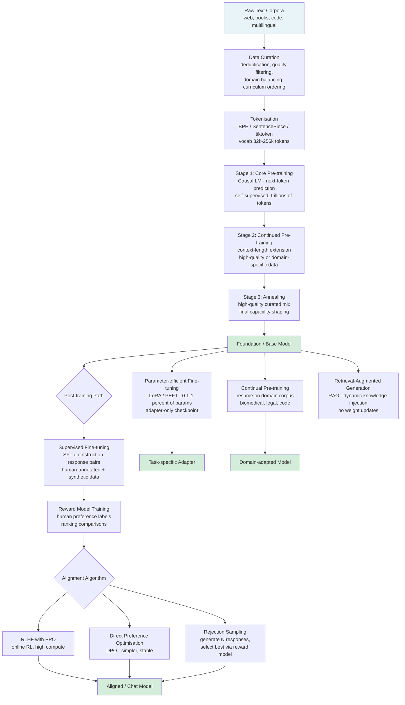
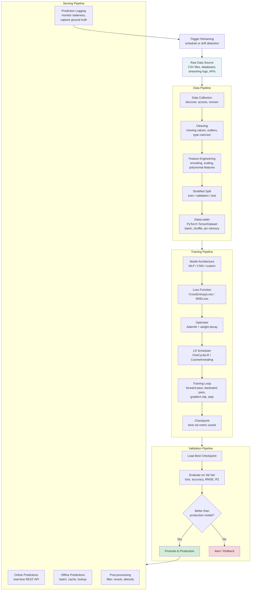

# Training: Large Language Models and Machine Learning Models

A collection of training scripts covering the full development lifecycle of both large language models (LLMs) and classical machine learning models. The `llm/` folder provides pre-training and instruction fine-tuning scripts for decoder-only transformers. The `ml/` folder provides a reusable data pipeline together with classifier and regression training scripts built on PyTorch and scikit-learn.

---

## Table of Contents

- [Project Structure](#project-structure)
- [Large Language Model Training](#large-language-model-training)
  - [LLM Training Pipeline Diagram](#llm-training-pipeline-diagram)
  - [Pre-training](#pre-training)
  - [Post-training](#post-training)
  - [Adaptation Methods](#adaptation-methods)
  - [llm/ Scripts Reference](#llm-scripts-reference)
  - [LLM Quick Start](#llm-quick-start)
- [Machine Learning Model Training](#machine-learning-model-training)
  - [ML Training Pipeline Diagram](#ml-training-pipeline-diagram)
  - [Data Pipeline](#data-pipeline)
  - [Training and Validation](#training-and-validation)
  - [Serving and Monitoring](#serving-and-monitoring)
  - [ml/ Scripts Reference](#ml-scripts-reference)
  - [ML Quick Start](#ml-quick-start)
- [Git Repository Exclusions](#git-repository-exclusions)
- [References](#references)

---

## Project Structure

```
training/
├── .gitignore               Excludes virtual environments, model outputs, and build artefacts
├── README.md                This document
├── llm/
│   ├── requirements.txt     Python dependencies for LLM pre-training and fine-tuning
│   ├── setup_venv.sh        Creates and activates a virtual environment
│   ├── pretrain.py          GPT-style causal language model pre-training from scratch
│   └── finetune.py          Instruction fine-tuning with LoRA / PEFT adapters
└── ml/
    ├── requirements.txt     Python dependencies for ML training
    ├── setup_venv.sh        Creates and activates a virtual environment
    ├── data_pipeline.py     Load, clean, split, scale, and wrap data as PyTorch DataLoaders
    ├── train_classifier.py  MLP / CNN classifier training with TensorBoard logging
    └── train_regression.py  MLP regressor training (RMSE, MAE, R2)
```

### Script Reference

| File | Description |
|---|---|
| `llm/requirements.txt` | Pins all LLM dependencies: `torch>=2.3`, `transformers`, `datasets`, `peft`, `accelerate`, `wandb`, `tensorboard`, `sentencepiece`, `tiktoken` |
| `llm/setup_venv.sh` | Creates `.venv/` under `llm/`, upgrades pip, and installs `requirements.txt`; supports a configurable PyTorch index URL for CUDA builds |
| `llm/pretrain.py` | Trains a decoder-only transformer from scratch with causal language modelling on wikitext-103 (or any HuggingFace dataset); supports multi-GPU via `torchrun` and `accelerate`; saves checkpoints with `save_pretrained` |
| `llm/finetune.py` | Applies supervised instruction fine-tuning using LoRA adapters (`peft`); formats data in the Alpaca prompt template; masks prompt tokens from the loss; saves adapter-only checkpoints |
| `ml/requirements.txt` | Pins all ML dependencies: `torch>=2.3`, `torchvision`, `scikit-learn>=1.5`, `pandas>=2.2`, `numpy`, `datasets`, `wandb`, `tensorboard`, `matplotlib`, `seaborn`, `joblib` |
| `ml/setup_venv.sh` | Creates `.venv/` under `ml/`, upgrades pip, and installs `requirements.txt`; installs PyTorch from the CPU index by default |
| `ml/data_pipeline.py` | Reusable data preparation module; loads scikit-learn toy datasets or CSV files; handles missing values, encodes categoricals, applies `StandardScaler` on train only, performs stratified splits, and returns `DataLoader` objects |
| `ml/train_classifier.py` | Trains an MLP (tabular) or CNN (image) classifier; uses `OneCycleLR` scheduling and `CrossEntropyLoss`; saves the best-validation-accuracy checkpoint as `checkpoints/classifier/best_model.pt` |
| `ml/train_regression.py` | Trains an MLP regressor; uses `CosineAnnealingLR` and `MSELoss`; evaluates with RMSE, MAE, and R2; saves the best-validation-RMSE checkpoint as `checkpoints/regressor/best_model.pt` |

---

## Large Language Model Training

Modern LLM development is organised into two broad phases: **pre-training**, which builds general language capabilities from massive unlabeled corpora, and **post-training**, which refines and aligns those capabilities for specific tasks and human preferences.

This two-phase view has become the standard since InstructGPT (2022) formalised a three-step pipeline — pretraining, supervised fine-tuning (SFT), and reinforcement learning from human feedback (RLHF) — that underpins most contemporary models including Llama 3, Gemma 2, Qwen 2, and Apple's AFM series.

### LLM Training Pipeline Diagram



### Pre-training

Pre-training is the most resource-intensive stage of LLM development. The model is exposed to the overwhelming majority of data it will ever see, and acquires most of its factual knowledge, language patterns, and commonsense reasoning during this phase.

**Objective.** Large generative models are trained with causal language modelling (CLM): predict the next token given all preceding tokens. Because the correct next token is already in the sequence, no human-provided labels are required — this is called self-supervised learning. Masked language modelling (MLM) is used for encoder models such as BERT but is not standard for autoregressive text generators.

**Scale.** Modern LLMs are trained on datasets ranging from hundreds of billions to over 15 trillion tokens (Llama 3.1). Data sources include web crawls, books, code repositories, scientific papers, and multilingual text. Data quality — achieved through deduplication, heuristic filtering, and model-based classification — is now considered more important than raw volume.

**Multi-stage pre-training.** State-of-the-art models such as Llama 3.1, Apple's AFM, and Qwen 2 all use a multi-stage pre-training pipeline:

1. **Core pre-training** — standard next-token prediction on a broad, diverse corpus with a short context window (4 k–8 k tokens).
2. **Continued pre-training** — the context length is extended (to 32 k–128 k tokens) using long-document data and synthetic long-context Q&A pairs.
3. **Annealing** — a short final phase on a small, high-quality curated mix (e.g. math, code, structured Q&A) that sharpens benchmark performance.

**Knowledge distillation.** Smaller models can be trained with a distillation loss that uses the predictions of a larger teacher model as a soft training signal. Google's Gemma 2 and Apple's AFM-on-device model both use this technique to punch above their parameter count.

**Continual pre-training** extends an already-trained foundation model on new or domain-specific data without training from scratch. It reduces compute by approximately 2x compared with full retraining. Common risks include catastrophic forgetting, which is mitigated by mixing new data with a replay of the original corpus.

**Reinforcement pre-training (RPT)**, introduced by Microsoft in 2025, reformulates next-token prediction as a sequential decision-making problem. The model generates a chain-of-thought rationale before predicting each token, receiving reward signals based on prediction accuracy. This eliminates the need for labelled data while promoting more systematic internal reasoning.

**Distributed training.** Pre-training at scale requires distributing work across hundreds or thousands of GPUs. The principal strategies are:

| Strategy | Description |
|---|---|
| Data Parallelism (DDP / FSDP) | Each GPU holds the full model; gradients are synchronised across replicas. |
| Tensor Parallelism | Individual weight matrices are sharded across GPUs within a layer. |
| Pipeline Parallelism | Different model layers reside on different GPUs; micro-batches flow through the pipeline. |
| 3D Parallelism | Combines all three strategies, used by Megatron-LM and GPT-NeoX. |

### Post-training

The output of pre-training is a base model that can complete sequences but has not been aligned to follow instructions or match human preferences. Post-training addresses this through supervised instruction fine-tuning followed by one or more alignment steps.

**Supervised Fine-tuning (SFT).** The model is trained on instruction-response pairs (e.g. in the Alpaca prompt format) using standard cross-entropy loss, but only on the response tokens. The training set typically combines human-annotated examples with synthetically generated pairs from stronger models.

**Direct Preference Optimisation (DPO).** DPO has become the most widely adopted preference-tuning strategy because it is more stable and easier to scale than PPO-based RLHF. Given pairs of preferred and rejected responses, DPO directly optimises the model policy without training a separate reward model. Qwen 2, Llama 3.1, and many other models use SFT followed by iterative DPO rounds.

**RLHF with PPO.** The classical approach trains a reward model on human-ranked response pairs, then optimises the policy using proximal policy optimisation. Apple's AFM uses a committee of models together with rejection sampling and RLHF with mirror descent, achieving strong results at small model sizes.

**Rejection sampling.** The model generates multiple candidate responses; a reward model selects the highest-quality response for the next training round. This "online" refinement step is used by Qwen 2, Llama 3.1, and Apple's AFM as an intermediate between offline DPO and full PPO.

### Adaptation Methods

Once a foundation model exists, several techniques allow it to be adapted to specific tasks or domains:

| Method | Parameters Updated | Data Required | Compute Cost |
|---|---|---|---|
| Full fine-tuning | All | Thousands to millions of labelled examples | High |
| PEFT / LoRA | ~0.1–6 % (adapters only) | Smaller labelled datasets | Low to medium |
| Continued pre-training | All | Large unlabelled domain corpus | Medium to high |
| Retrieval-Augmented Generation (RAG) | None (inference-time only) | Vector-indexed knowledge base | Inference overhead only |
| In-context learning (ICL) | None | A few labelled examples in prompt | None |

**LoRA (Low-Rank Adaptation)** decomposes weight update matrices into low-rank products, training only those instead of the full weight matrix. This reduces trainable parameters by 100x or more while preserving most of the benefit of full fine-tuning. The adapters can be saved separately and merged into the base model at inference time.

### llm/ Scripts Reference

#### `pretrain.py`

Trains a decoder-only transformer from scratch using causal language modelling.

Key features:
- Configures a GPT-2-compatible architecture via a JSON config file (vocabulary size, layers, attention heads, hidden dimensions, context length).
- Loads and tokenises a HuggingFace `datasets` corpus (default: `wikitext-103`).
- Supports single-GPU training and multi-GPU DDP via `torchrun`.
- Implements linear warm-up followed by cosine learning rate decay.
- Gradient accumulation and optional BF16/FP16 mixed-precision.
- Periodic checkpointing with `save_pretrained`, and resumption from a checkpoint directory.
- Logs training loss, perplexity, and learning rate to TensorBoard or WandB.

Usage:
```bash
# Single GPU
python pretrain.py

# Multi-GPU (2 GPUs)
torchrun --nproc_per_node=2 pretrain.py
```

#### `finetune.py`

Applies supervised instruction fine-tuning to a pre-trained causal language model using LoRA adapters via the `peft` library.

Key features:
- Loads any HuggingFace causal LM (default: `gpt2`). Compatible with Llama, Mistral, and other architectures.
- Formats instruction-response data in the Alpaca prompt template.
- Masks prompt tokens from the loss so the model learns only to generate the response.
- Attaches LoRA adapters to configurable target modules (`q_proj`, `v_proj`, etc.) with tunable rank, alpha, and dropout.
- Uses HuggingFace `accelerate` for device placement and optional BF16 mixed-precision.
- Saves adapter-only checkpoints at configurable intervals and a final merged checkpoint.

Usage:
```bash
# Single GPU
python finetune.py

# Multi-GPU (2 GPUs)
accelerate launch --num_processes 2 finetune.py
```

Key arguments:

| Argument | Default | Description |
|---|---|---|
| `--model_name_or_path` | `gpt2` | HuggingFace model id or local path |
| `--dataset_name` | `tatsu-lab/alpaca` | Instruction dataset on HuggingFace Hub |
| `--lora_r` | `8` | LoRA rank |
| `--lora_alpha` | `16` | LoRA scaling factor |
| `--num_train_epochs` | `3` | Number of training epochs |
| `--learning_rate` | `2e-4` | Peak learning rate |
| `--max_seq_length` | `512` | Maximum token sequence length |

#### `requirements.txt`

Pins all Python dependencies for the `llm/` environment:

- `torch>=2.3.0`, `torchvision>=0.18.0`
- HuggingFace: `transformers`, `datasets`, `tokenizers`, `accelerate`, `peft`, `evaluate`, `huggingface_hub`
- Tokenisation utilities: `sentencepiece`, `tiktoken`
- Monitoring: `wandb`, `tensorboard`
- Utilities: `numpy`, `tqdm`, `scipy`

#### `setup_venv.sh`

Creates a Python virtual environment at `.venv/`, upgrades pip, and installs all requirements. Handles PyTorch CPU and CUDA builds via an index URL.

```bash
bash setup_venv.sh
source .venv/bin/activate
```

### LLM Quick Start

```bash
cd training/llm

# 1. Create virtual environment and install dependencies
bash setup_venv.sh
source .venv/bin/activate

# 2. Pre-train a small GPT-2 model on wikitext-103 (single GPU)
python pretrain.py

# 3. Fine-tune with LoRA on the Alpaca instruction dataset
python finetune.py --model_name_or_path gpt2 --num_train_epochs 3

# 4. Fine-tune a larger model with 2 GPUs
accelerate launch --num_processes 2 finetune.py \
    --model_name_or_path meta-llama/Llama-3.2-1B \
    --dataset_name tatsu-lab/alpaca \
    --lora_r 16 \
    --num_train_epochs 2
```

Checkpoints are written to `./checkpoints/pretrain/` and `./checkpoints/finetune/` respectively. TensorBoard logs are saved alongside each checkpoint directory.

---

## Machine Learning Model Training

In production machine learning the goal is not to build a single model but to build automated pipelines that continuously develop, validate, and deploy models as data evolves. A typical ML system consists of four coordinated pipelines: a data pipeline, a training pipeline, a validation pipeline, and a serving pipeline.

### ML Training Pipeline Diagram



### Data Pipeline

The data pipeline is responsible for transforming raw application data into clean, split, and scaled datasets ready for model training.

**Data collection.** In experimentation, data is typically read from saved files. In production, data collection requires accessing streaming logs and, for supervised tasks, obtaining or maintaining human-labelled ground truth. Version-controlled dataset repositories provide reproducibility, compliance, and auditability.

**Cleaning.** Real-world datasets almost always contain missing values, incorrect types, and outliers. The data pipeline in `data_pipeline.py` handles missing values with a configurable strategy (mean imputation, median imputation, or row dropping) and applies label encoding to categorical features.

**Feature engineering.** Numerical features are standardised with a `StandardScaler` fitted exclusively on the training split and then applied without refitting to the validation and test splits. This prevents data leakage.

**Splitting.** Data is divided into training, validation, and test sets using stratified splits to preserve class proportions. The default ratios are 70 % / 15 % / 15 %. For regression tasks, stratification is omitted.

**DataLoader wrapping.** Cleaned and scaled arrays are converted to `torch.Tensor` objects and wrapped in `TensorDataset` / `DataLoader` instances with configurable batch sizes, shuffling, and worker counts.

**Model staleness.** As the Google ML pipelines guide notes, almost all models go stale after deployment because the world changes and data distributions shift. Automated data pipelines ensure that fresh training and test datasets are continuously generated, enabling regular retraining without manual intervention.

### Training and Validation

**Training pipeline.** The training loop follows a standard pattern: forward pass, loss computation, backward pass, gradient clipping, optimiser step, and learning rate scheduler step. Both training scripts use the AdamW optimiser with weight decay and gradient norm clipping to stabilise training.

**Validation.** At the end of each epoch, the model is evaluated on the held-out validation set. The best checkpoint (lowest validation RMSE for regression, highest validation accuracy for classification) is saved to disk. This ensures that the final model is selected by generalisation performance, not training performance.

**Metrics.**

| Task | Primary Metric | Additional Metrics |
|---|---|---|
| Classification | Accuracy | Per-class precision, recall, F1 (from `classification_report`) |
| Regression | RMSE | MAE, R2 score |

**TensorBoard.** Both training scripts write scalar summaries (loss, accuracy or RMSE, learning rate) at every epoch. Launch TensorBoard with:

```bash
tensorboard --logdir checkpoints/
```

### Serving and Monitoring

The serving pipeline delivers predictions to end users in one of two modes:

- **Online predictions** — a real-time request is sent to an inference server that runs the model and returns a result immediately.
- **Offline predictions** — predictions are precomputed in batch and cached; the application looks up the stored result at query time.

Regardless of serving mode, prediction logging is essential. By monitoring the distribution of model outputs over time and comparing against ground truth labels when they become available, teams can detect when a model starts to degrade and trigger retraining.

### ml/ Scripts Reference

#### `data_pipeline.py`

Implements the full data preparation pipeline and exposes a single top-level function `build_pipeline(cfg: DataConfig)` that returns three `DataLoader` objects (train, val, test) and a `DataMeta` object describing the dataset.

Supported data sources:
- Any of the six scikit-learn toy datasets: `iris`, `wine`, `breast_cancer`, `digits`, `diabetes`, `boston`.
- Arbitrary CSV files with a configurable target column.

Configurable via `DataConfig` dataclass:

| Field | Default | Description |
|---|---|---|
| `dataset_name` | `iris` | scikit-learn dataset name or HuggingFace dataset id |
| `csv_path` | `None` | Path to a CSV file (overrides `dataset_name`) |
| `target_column` | `target` | Label column name for CSV inputs |
| `train_ratio` | `0.70` | Fraction of data used for training |
| `val_ratio` | `0.15` | Fraction of data used for validation |
| `test_ratio` | `0.15` | Fraction of data used for testing |
| `scale_features` | `True` | Apply StandardScaler |
| `handle_missing` | `mean` | Missing value strategy: `mean`, `median`, or `drop` |
| `batch_size` | `64` | DataLoader batch size |

Run as a standalone smoke test:
```bash
python data_pipeline.py
```

#### `train_classifier.py`

Trains a configurable neural network classifier. For tabular data a multi-layer perceptron (MLP) with batch normalisation and dropout is used. For image data (e.g. MNIST) a three-block convolutional neural network is used.

Key features:
- Plugs directly into `data_pipeline.build_pipeline` for tabular tasks.
- Downloads torchvision datasets for image tasks.
- Uses `OneCycleLR` scheduling for fast convergence.
- Saves the best-validation-accuracy checkpoint to `checkpoints/classifier/best_model.pt`.
- Prints a full `sklearn.metrics.classification_report` on the test set.

Usage:
```bash
# Tabular classification (iris dataset)
python train_classifier.py

# Tabular with a custom CSV
python train_classifier.py --csv_path data.csv --target_column label --num_epochs 50

# Image classification (MNIST)
python train_classifier.py --task image --dataset_name MNIST
```

Key arguments:

| Argument | Default | Description |
|---|---|---|
| `--task` | `tabular` | `tabular` or `image` |
| `--dataset_name` | `iris` | sklearn dataset or torchvision class name |
| `--batch_size` | `64` | Training batch size |
| `--num_epochs` | `30` | Number of epochs |
| `--learning_rate` | `1e-3` | Peak learning rate |
| `--dropout` | `0.3` | Dropout probability |

#### `train_regression.py`

Trains a fully connected MLP regressor on tabular data. Uses `CosineAnnealingLR` scheduling and MSE loss. Evaluates with RMSE, MAE, and R2 on both validation and test sets.

Usage:
```bash
# Default: scikit-learn diabetes dataset
python train_regression.py

# Custom CSV
python train_regression.py --csv_path house_prices.csv --target_column price --num_epochs 100
```

Key arguments:

| Argument | Default | Description |
|---|---|---|
| `--dataset_name` | `diabetes` | sklearn regression dataset name |
| `--csv_path` | `None` | Path to a CSV file |
| `--num_epochs` | `50` | Number of training epochs |
| `--learning_rate` | `1e-3` | Initial learning rate |
| `--dropout` | `0.2` | Dropout probability |

#### `requirements.txt`

Pins all Python dependencies for the `ml/` environment:

- `torch>=2.3.0`, `torchvision>=0.18.0`
- `scikit-learn>=1.5.0`, `imbalanced-learn>=0.12.0`
- `pandas>=2.2.0`, `numpy>=1.26.0`, `scipy>=1.13.0`
- `datasets>=2.19.0`
- Monitoring: `wandb`, `tensorboard`
- Visualisation: `matplotlib`, `seaborn`
- Utilities: `tqdm`, `joblib`

#### `setup_venv.sh`

Creates a Python virtual environment at `.venv/`, upgrades pip, and installs all requirements. Installs PyTorch from the CPU index by default; edit the script to select a CUDA index URL for GPU training.

```bash
bash setup_venv.sh
source .venv/bin/activate
```

### ML Quick Start

```bash
cd training/ml

# 1. Create virtual environment and install dependencies
bash setup_venv.sh
source .venv/bin/activate

# 2. Verify the data pipeline (smoke test on iris)
python data_pipeline.py

# 3. Train a tabular classifier (iris, MLP, 30 epochs)
python train_classifier.py

# 4. Train a classifier on a custom CSV
python train_classifier.py \
    --csv_path my_data.csv \
    --target_column label \
    --num_epochs 50 \
    --batch_size 128

# 5. Train a regressor (diabetes dataset, MLP, 50 epochs)
python train_regression.py

# 6. View training curves in TensorBoard
tensorboard --logdir checkpoints/
```

---

## Git Repository Exclusions

The `.gitignore` file at the `training/` root prevents generated artefacts, binary weights, and platform-specific files from being tracked by Git. The table below summarises each exclusion category.

| Category | Patterns Excluded | Reason |
|---|---|---|
| Virtual environments | `.venv/`, `venv/`, `env/`, `ENV/` | Recreated by `setup_venv.sh`; contains platform-specific compiled binaries |
| Python bytecode | `__pycache__/`, `*.pyc`, `*.pyo`, `*.pyd` | Generated automatically by the Python interpreter on first import |
| Python packaging | `*.egg-info/`, `dist/`, `build/`, `*.whl` | Build artefacts produced by setuptools and pip; not source files |
| ML model outputs | `*.pt`, `*.pth`, `*.ckpt` | PyTorch state dicts written by `train_classifier.py` and `train_regression.py` via `torch.save` |
| LLM model outputs | `*.bin`, `*.safetensors` | HuggingFace `save_pretrained` outputs from `pretrain.py` and `finetune.py`; covers `pytorch_model.bin`, `model.safetensors`, `adapter_model.safetensors` |
| Checkpoint / log dirs | `checkpoints/`, `runs/`, `outputs/`, `logs/` | Training output directories written by all four training scripts; can be gigabytes in size |
| TensorBoard event files | `events.out.tfevents.*` | Binary event logs written automatically during every training run |
| WandB artefacts | `wandb/` | Run metadata and artefact cache created by Weights and Biases |
| Large binary data | `*.h5`, `*.npy`, `*.npz`, `*.parquet`, `*.arrow` | Numerical array and columnar data files; should be stored in a versioned data registry |
| OS / IDE artefacts | `.DS_Store`, `.vscode/`, `.idea/`, `Thumbs.db` | Operating system and editor-generated metadata; not relevant to the project |

---

## References

- Raschka, S. (2024). *New LLM Pre-training and Post-training Paradigms*. Ahead of AI. https://magazine.sebastianraschka.com/p/new-llm-pre-training-and-post-training
- Morgan, A. (2025). *Pretraining: Breaking Down the Modern LLM Training Pipeline*. MLOps Community. https://mlops.community/blog/pretraining-breaking-down-the-modern-llm-training-pipeline
- Jain, A., Maleki, A., and Saade, N. (2024). *Methods for Adapting Large Language Models*. Meta AI Blog. https://ai.meta.com/blog/adapting-large-language-models-llms/
- Howard, J. and Ruder, S. (2018). *Universal Language Model Fine-tuning for Text Classification* (ULMFiT). arXiv:1801.06146.
- Ouyang, L. et al. (2022). *Training Language Models to Follow Instructions with Human Feedback* (InstructGPT). arXiv:2203.02155.
- Hoffmann, J. et al. (2022). *Training Compute-Optimal Large Language Models* (Chinchilla). arXiv:2203.15556.
- Google Developers. (2025). *ML Pipelines*. Machine Learning — Managing ML Projects. https://developers.google.com/machine-learning/managing-ml-projects/pipelines
- Hu, E. et al. (2021). *LoRA: Low-Rank Adaptation of Large Language Models*. arXiv:2106.09685.
- NVIDIA. *Megatron-LM: Training Multi-Billion Parameter Language Models Using Model Parallelism*. https://github.com/NVIDIA/Megatron-LM
- EleutherAI. *GPT-NeoX: Large Scale Autoregressive Language Modeling in PyTorch*. https://github.com/EleutherAI/gpt-neox
